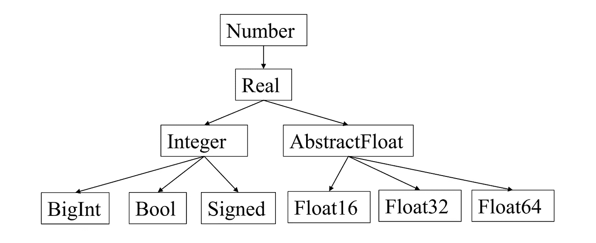
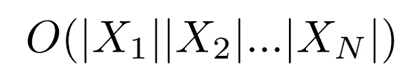

# 多重分派:一个强大的编程范例

> 原文：<https://towardsdatascience.com/multiple-dispatch-a-powerful-programming-paradigm-8bc8fcd2c73a?source=collection_archive---------25----------------------->

美国宇航局在 [Unsplash](https://unsplash.com/s/photos/data?utm_source=unsplash&utm_medium=referral&utm_content=creditCopyText) 拍摄的照片

## 通过朱莉娅的镜头讲述

[Julia](https://julialang.org/) 是我一直最喜欢的编程语言之一。不仅像 Python 一样容易接，还拥有 c 的速度，不过据说 Julia 用户是为了性能而来，为了多次调度而留下来的。但是这个奇怪的特征是什么，是什么让它对新手和老手都有吸引力呢？

# 多重调度是如何工作的？

我们从回忆 Julia 的动态类型系统的样子开始。Julia 类型可以分为具体类型和抽象类型(也有复合类型和参数类型，但让我们暂时忽略它们)。抽象类型构成了具体类型可能适合的类型层次结构的主干。

图片作者。

在 Julia 中有许多表示数字的方法:一个给定的数字可能是实数或复数，有理数或无理数，有符号或无符号。它们被组织在一个层次结构中，上面的树中列出了其中的一个子集。叶节点是具体类型，而中间节点是抽象类型。事实上，在 Julia 中，具体类型可能不是子类型；它们的超类型总是抽象类型。这反映了行为的遗传而不是结构的遗传。关于 Julia 类型系统的更详细的概述，我们参考了用户手册。

我们还注意到了*函数*和*方法*之间的区别。一个函数可以有多种行为。根据定义，函数的一种可能的行为称为方法。关于 Julia 方法的深入讨论，请参见[这里的](https://docs.julialang.org/en/v1/manual/methods/)。

现在，多重分派是一个执行规则，通过它，函数的行为由参数类型的组合和计数决定(根据它们的最高级别的特性)。换句话说，多分派根据函数输入类型的组合来决定执行哪种方法。

例如，我们可以定义以下内容:

函数*遭遇*是重载的，对于给定的输入组合，将根据输入类型选择期望的行为。在上面的代码中，游客是人的子类型，但是鹿对游客的反应与普通人不同。我们可以通过添加额外的输入参数，例如 foo，来轻松定义额外的和更复杂的函数行为。

基于所有输入类型的匹配在许多设置中是合理的，包括在数学中:

> 多重分派对于数学代码特别有用，在这种情况下，人为地认为运算“属于”某个参数比“属于”其他任何参数都没有什么意义:在`x + y`中的加法运算属于`x`比属于`y`多吗？(朱莉娅手册)

我们在下面强调多重分派的两个具体好处。

# 表达性

实现多重分派的语言比不实现多重分派的语言具有更强的表达能力。在零分派下，对于任何允许的输入组合，一个函数只有一种行为。在单个分派下(函数在单个输入上分派)，可能的行为或方法的数量与输入空间的大小成线性关系。在多重分派下，可能行为的数量取决于所有输入空间大小的乘积！换句话说，可以表达的行为数量大约为

这当然是一个很大的空间，并允许用户有足够的空间通过更高阶的特异性来控制功能行为。

# **代码重用**

在我的最佳编程实践指南中，Kent Beck 和 Cynthia Andres 解释了极限编程，代码重用在软件设计中至关重要。通过尽可能地消除代码重复，它为我们程序员节省了宝贵的时间和精力。

多重分派如何促进从未见过面或说过话的作者编写的 Julia 包的共享、再利用和最终重用？在 Julia 中，人们可以简单地通过定义一个新的函数来构建一个预定义的类型和它的一系列行为，该函数对输入类型的不同组合或顺序进行操作。例如，如果我想扩展上面的 demo.jl 代码，我可以导入这个包并在现有类型的基础上构建，或者为相遇函数定义新的行为，如下所示。

保存和添加预定义的类型和功能很简单，比如 Person、Tourist 和 encounter。

> 提示:要从另一个包中扩展一个函数，必须显式地导入它。例如，要从线性代数模块中扩展行列式函数，必须首先在脚本的顶部添加下面一行

我们注意到，由于微妙的原因，静态类型语言中的结构继承和函数重载等熟悉的概念对于代码重用来说并不是最佳的。例如，在像 C++这样的静态类型系统中，重载函数的参数的静态类型用于确定函数行为，而不是编译器直到运行时才知道的更具体的类型。这使得很难有效地实施正确的行为。事实上，多重分派是 Julia 生态系统中不寻常的大量代码重用的主要原因。

# 摘要

多重分派通过对函数输入类型的组合进行分派来实现更高阶的表达能力。多重分派也提升了代码重用的两个属性:

*   *我们可以定义现有操作可以应用的新类型*
*   *我们可以定义可应用于现有类型的新操作*

这些使得用户可以很容易地在现有的包以及它们带来的功能和预定义类型上进行构建。事实证明，它还通过促进针对各种数据类型的编译代码的专门化和优化，提高了 Julia 的速度和性能。多重分派无疑是一个有价值的特性，它将 Julia 与其他科学计算语言(如 Matlab)区分开来，并且是 Julia 社区成员的福音。

# 参考

*   茱莉亚手册:[https://docs.julialang.org/en/v1/manual/methods/](https://docs.julialang.org/en/v1/manual/methods/)
*   JuliaCon 2019: [多次派遣的不合理效力](https://www.youtube.com/watch?v=kc9HwsxE1OY)作者 Stefan Karpinski