# 多元线性回归变得简单

> 原文：<https://towardsdatascience.com/multiple-linear-regression-made-simple-d073e55e7d0c?source=collection_archive---------41----------------------->

## 学习如何在 R 中运行多元和简单的线性回归，如何解释结果以及如何验证应用条件


照片由[王欣](https://unsplash.com/@wangxin96?utm_source=medium&utm_medium=referral)拍摄

# 介绍

R 记住[描述性统计](https://statsandr.com/blog/descriptive-statistics-in-r/)是统计学的一个分支，它可以描述你手头的数据。推断统计学(具有流行的[假设检验](https://statsandr.com/blog/hypothesis-test-by-hand/)和置信区间)是统计学的另一个分支，它允许进行推断，即基于[样本](https://statsandr.com/blog/what-is-the-difference-between-population-and-sample/)得出关于总体的结论。统计学的最后一个分支是关于**模拟两个或多个变量**之间的关系。 [1](https://statsandr.com/blog/multiple-linear-regression-made-simple/#fn1) 描述和评估变量间联系最常用的统计工具是线性回归。

有两种类型的线性回归:

1.  **简单线性回归**是一种统计方法，允许评估两个[定量变量](https://statsandr.com/blog/variable-types-and-examples/#quantitative)之间的线性关系。更准确地说，它使这种关系能够被量化，并对其重要性进行评估。
2.  **多元线性回归**是简单线性回归的推广，这种方法可以评估一个响应变量(定量)和几个解释变量(定量或[定性](https://statsandr.com/blog/variable-types-and-examples/#qualitative))之间的线性关系。

在现实世界中，多元线性回归比简单线性回归使用得更频繁。这主要是因为:

*   多元线性回归允许评估两个变量之间的关系，同时**控制其他变量**的效果(即去除效果)**。**
*   随着数据收集变得更加容易，在分析数据时可以包括和考虑更多的变量。

多元线性回归是一个如此强大的统计工具，我想把它展示出来，让每个人都理解它，甚至在必要的时候使用它。然而，如果不先介绍简单线性回归，我就不能写多元线性回归。

因此，在提醒了简单线性回归的原理和解释之后，我将说明如何在 r 中执行多元线性回归。我还将在多元线性回归的上下文中展示如何解释输出，并讨论其应用条件。然后，我将通过介绍与线性回归直接相关的更高级的主题来结束本文。

# 简单线性回归:提醒

简单线性回归是一种不对称程序，其中:

*   其中一个变量被认为是要解释的响应或变量。也称为**因变量**，在 y 轴上表示
*   另一个变量是解释变量，也称为**自变量**，表示在 x 轴上

简单的线性回归允许**评估两个变量**之间存在的*线性*关系，并量化这种联系。请注意，线性是线性回归中一个强有力的假设，因为它测试并量化了两个变量是否*线性*相关。

线性回归之所以成为强大的统计工具，是因为它允许**量化当解释变量/自变量增加一个单位时，响应变量/因变量的变化量**。这个概念是线性回归的关键，有助于回答以下问题:

*   在广告上花费的金额和一定时期内的销售额有联系吗？
*   在第一份工作中，学校教育的年数在经济上有价值吗？
*   烟草税的增加会减少它的消费吗？
*   根据面积不同，一套公寓最可能的价格是多少？
*   一个人对刺激的反应时间取决于性别吗？

简单线性回归可以被看作是对[方差分析](https://statsandr.com/blog/anova-in-r/)和[学生 t 检验](https://statsandr.com/blog/student-s-t-test-in-r-and-by-hand-how-to-compare-two-groups-under-different-scenarios/)的扩展。方差分析和 t-检验允许根据定量变量对各组进行比较，2 组用于 t-检验，3 组或更多组用于方差分析。 [2](https://statsandr.com/blog/multiple-linear-regression-made-simple/#fn2) 对于这些测试，独立变量，即构成不同组进行比较的分组变量，必须是定性变量。线性回归是一种扩展，因为除了用于比较组外，它还用于定量自变量(这是 t 检验和 ANOVA 所不能做到的)。

在本文中，我们感兴趣的是评估一加仑燃料行驶的距离与汽车重量之间是否存在线性关系。对于这个例子，我们使用`mtcars`数据集(预加载在 R 中)。

该数据集包括 32 辆汽车的燃料消耗以及汽车设计和性能的 10 个方面: [3](https://statsandr.com/blog/multiple-linear-regression-made-simple/#fn3)

1.  `mpg`英里/(美国)加仑(一加仑≈ 3.79 升)
2.  `cyl`汽缸数量
3.  `disp`排水量(立方英寸)
4.  `hp`总马力
5.  `drat`后桥传动比
6.  `wt`重量(1000 磅，1000 磅≈ 453.59 千克)
7.  `qsec` 1/4 英里时间(其中 1/4 英里≈ 402.34 米)
8.  `vs`发动机(0 = V 型，1 =直型)
9.  `am`变速器(0 =自动，1 =手动)
10.  `gear`前进档数量
11.  `carb`化油器数量

```
dat <- mtcarslibrary(ggplot2)
ggplot(dat, aes(x = wt, y = mpg)) +
  geom_point() +
  labs(
    y = "Miles per gallon",
    x = "Car's weight (1000 lbs)"
  ) +
  theme_minimal()
```

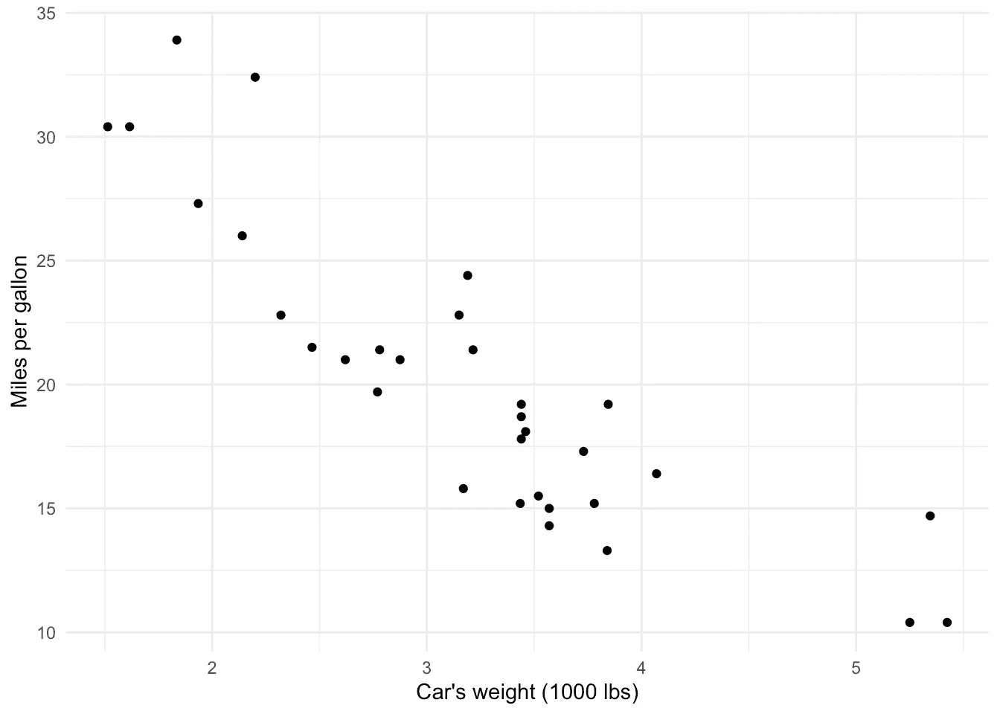

作者的情节

上面的[散点图](https://statsandr.com/blog/graphics-in-r-with-ggplot2/#scatter-plot)显示，一加仑燃料行驶的距离和一辆汽车的重量之间似乎有一种**的负相关关系。这是有道理的，因为汽车越重，它消耗的燃料就越多，因此一加仑汽油能行驶的里程就越少。**

这已经很好地概述了这两个变量之间的关系，但以每加仑英里数为因变量、汽车重量为自变量的简单线性回归走得更远。当重量变化一个单位(本例中为 1000 磅)时，它会通过**告诉我们平均距离变化了多少英里。由于回归线，这是可能的。**

# 原则

简单线性回归的原理是，**找到与观测值**尽可能接近地通过的直线(即确定其方程)**，即成对(，易)形成的点集。**

第一步，有很多潜在的线。其中三个被绘制出来:

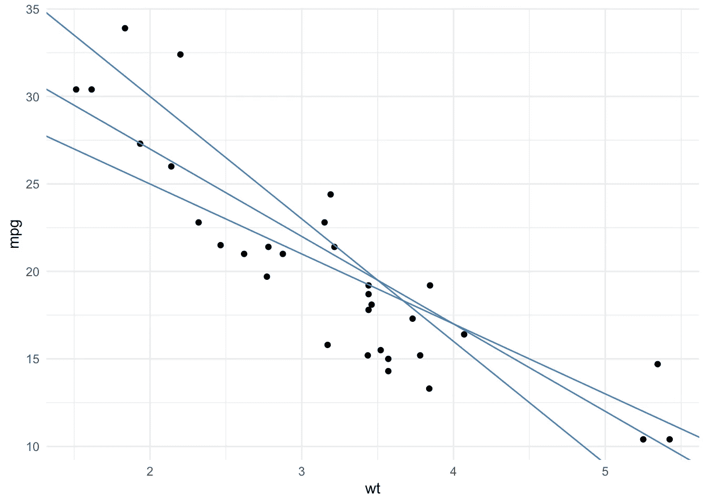

作者的情节

为了找到尽可能靠近所有点的直线，我们取每个点和每条势线之间垂直距离的平方。注意，我们采用距离的平方来确保负间隙(即线下的点)不会被正间隙(即线上的点)补偿。最接近这组点的线是使这些平方距离之和最小化的线。

生成的回归线在下图中以蓝色显示，灰色虚线表示点和拟合线之间的垂直距离。每个观测点和由最小二乘法确定的拟合线之间的这些垂直距离被称为线性回归模型的**残差**并表示为ϵ.

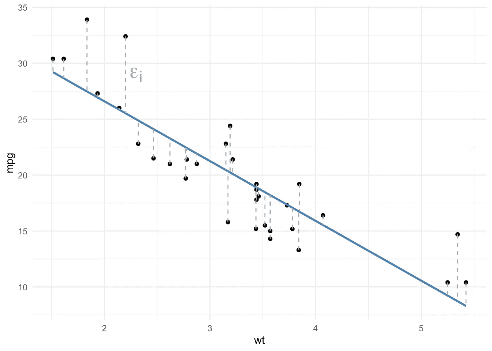

作者的情节

根据定义，没有其他直线的点和直线之间的总距离更小。这种方法称为最小二乘法，或称 **OLS** 为**普通最小二乘法**。

# 等式

回归模型可以写成以下方程的形式:

Y=β0+β1X+ϵ

使用:

*   因变量 y
*   x 独立变量
*   β0 截距(x=0 时 Y 的平均值)，有时也表示为α
*   β1 斜率(X 增加一个单位时 Y 的预期增加量)
*   ϵ残差(平均值 0 的误差项，描述模型未捕捉到的 y 的变化，也称为噪声)

当我们确定最接近所有点的那条线时(我们说我们用一条线来拟合观察到的数据)，我们实际上是根据手头的数据**估计未知参数** β0 **和** β1。请记住，在您的几何课上，绘制直线只需要两个参数-截距和斜率。

这些估计值(以及之前散点图中显示的蓝线)可以通过以下公式手动计算:

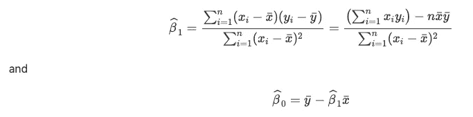

其中 x 和 y 分别表示 x 和 y 的样本均值。

(如果你很难手工计算ˇβ0 和ˇβ1，看看这个[闪亮的应用](https://statsandr.com/blog/a-shiny-app-for-simple-linear-regression-by-hand-and-in-r/)，它可以帮助你根据你的数据轻松找到这些估计值。)

# 系数ˇβ的解释

**截距**ˇβ0 是自变量 X **取值 0** 时因变量 Y **的**平均值。它的估计对评估两个变量之间是否存在线性关系没有兴趣。然而，如果你想知道当 x=0 时，Y 的平均值是多少，这是有意义的。 [4](https://statsandr.com/blog/multiple-linear-regression-made-simple/#fn4)****

另一方面，**斜率**ˇβ1 对应于当 X **变化一个单位**时 Y **的预期**变化。它告诉我们两个重要的信息:****

1.  斜率的**符号表示线**的**方向——正斜率(ˇβ1>0)表示两个感兴趣的变量之间存在正关系(它们以相同的方向变化)，而负斜率(ˇβ1<0)表示两个变量之间存在负关系(它们以相反的方向变化)。**
2.  斜率的**值提供变量 Y 的**演变速度**的信息，作为变量 x 的函数。斜率绝对值越大，x 的每个单位的 Y 的预期变化越大。然而，注意，大值不一定意味着关系具有统计显著性(关于关系的[显著性部分有更多信息)。](https://statsandr.com/blog/multiple-linear-regression-made-simple/#significance-of-the-relationship)**

这类似于[相关系数](https://statsandr.com/blog/correlation-coefficient-and-correlation-test-in-r/)，它给出了关于两个变量之间关系的方向和强度的信息。

为了在 R 中执行线性回归，我们使用了`lm()`函数(代表线性模型)。该函数要求先设置因变量，再设置自变量，用波浪号(`~`)隔开。

应用于我们的重量和汽车消耗的例子，我们有:

```
model <- lm(mpg ~ wt, data = dat)
```

`summary()`函数给出了模型的结果:

```
summary(model)## 
## Call:
## lm(formula = mpg ~ wt, data = dat)
## 
## Residuals:
##     Min      1Q  Median      3Q     Max 
## -4.5432 -2.3647 -0.1252  1.4096  6.8727 
## 
## Coefficients:
##             Estimate Std. Error t value Pr(>|t|)    
## (Intercept)  37.2851     1.8776  19.858  < 2e-16 ***
## wt           -5.3445     0.5591  -9.559 1.29e-10 ***
## ---
## Signif. codes:  0 '***' 0.001 '**' 0.01 '*' 0.05 '.' 0.1 ' ' 1
## 
## Residual standard error: 3.046 on 30 degrees of freedom
## Multiple R-squared:  0.7528, Adjusted R-squared:  0.7446 
## F-statistic: 91.38 on 1 and 30 DF,  p-value: 1.294e-10
```

在实践中，我们通常在解释系数之前检查应用条件*(因为如果不遵守这些条件，结果可能会有偏差)。然而，在本文中，我在测试条件之前给出了解释，因为重点是展示如何解释结果，而不是找到一个有效的模型。*

结果可总结如下(参见表格`Coefficients`中的`Estimate`栏):

*   截距ˇβ0 = 37.29 表示，假设汽车重量为 0 磅，我们可以预计平均油耗为 37.29 英里/加仑。这种解释是为了说明的目的，但作为一个汽车重量 0 磅是不可能的，这种解释没有任何意义。因此，在实践中，我们不会解释这种情况下的截距。参见[部分](https://statsandr.com/blog/multiple-linear-regression-made-simple/#another-interpretation-of-the-intercept)中自变量以平均值为中心时截距的另一种解释。
*   斜率ˇβ1 =-5.34 表明:
*   重量和一辆汽车用一加仑油可以行驶的距离之间有一个**负关系**(鉴于之前散点图中各点的负趋势，这是意料之中的)。
*   但更重要的是，斜率为-5.34 意味着，重量增加一个单位(即增加 1000 磅)，每加仑的英里数平均减少 5.34 个单位。换句话说，**每增加 1000 磅，英里/加仑数平均减少 5.34** 。

# 截距的另一种解释

截距的另一个有用的解释是当自变量以均值为中心时。在这种情况下，截距被解释为 X 值等于 X 平均值的个体的 Y 平均值。

让我们在实践中看到它。我们首先将`wt`变量置于平均值附近，然后使用这个新变量重新运行一个简单的线性模型:

```
dat_centered <- datdat_centered$wt_centered <- dat$wt - mean(dat$wt)mod_centered <- lm(mpg ~ wt_centered,
  data = dat_centered
)summary(mod_centered)## 
## Call:
## lm(formula = mpg ~ wt_centered, data = dat_centered)
## 
## Residuals:
##     Min      1Q  Median      3Q     Max 
## -4.5432 -2.3647 -0.1252  1.4096  6.8727 
## 
## Coefficients:
##             Estimate Std. Error t value Pr(>|t|)    
## (Intercept)  20.0906     0.5384  37.313  < 2e-16 ***
## wt_centered  -5.3445     0.5591  -9.559 1.29e-10 ***
## ---
## Signif. codes:  0 '***' 0.001 '**' 0.01 '*' 0.05 '.' 0.1 ' ' 1
## 
## Residual standard error: 3.046 on 30 degrees of freedom
## Multiple R-squared:  0.7528, Adjusted R-squared:  0.7446 
## F-statistic: 91.38 on 1 and 30 DF,  p-value: 1.294e-10
```

根据结果，我们看到:

*   斜率没有改变，解释与没有居中的情况相同(这是有意义的，因为回归线只是简单地向右或向左移动)。
*   更重要的是，截距现在是ˇβ0 = 20.09，因此我们可以预计，一辆平均重量的汽车平均油耗为 20.09 英里/加仑(平均重量为 3.22，即 3220 磅)。

这种居中特别有趣:

*   当连续自变量的**没有**有意义的值为 0 时(这种情况下，重量为 0 磅的汽车没有意义)，或者
*   解释截距的时候很重要。

请注意，不一定要仅围绕平均值进行居中。自变量也可以集中在数据范围内的某个值上。只要值有意义并且在数据范围内，居中的确切值并不重要(不建议将其居中在数据范围之外的值上，因为我们不确定该范围之外的两个变量之间的关系类型)。对于我们的例子，我们可能会发现选择最低值或最高值的权重是最佳选择。因此，由我们来决定解释截距最有意义的权重。

# 关系的重要性

如前所述，斜率的**值本身并不能**使**评估线性关系**的显著性成为可能。换句话说，不同于 0 的斜率不一定意味着它与 0 有*显著*不同，因此不意味着总体中的两个变量之间有**显著**关系。10°的斜率可能不显著，2°的斜率可能显著。

该关系的显著性还取决于斜率的可变性，斜率通过其标准误差来衡量，通常记为 se(ˇβ1)。

为了评估线性关系的重要性，我们不用过多的细节，将斜率除以其标准误差。该比率是测试统计值，遵循具有 N2 个自由度的学生分布: [5](https://statsandr.com/blog/multiple-linear-regression-made-simple/#fn5)

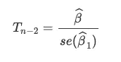

对于双边检验，无效假设和替代假设是: [6](https://statsandr.com/blog/multiple-linear-regression-made-simple/#fn6)

*   H0:β1=0(两个变量之间没有(线性)关系)
*   H1:β1≠0(两个变量之间存在(线性)关系)

粗略地说，如果该比率的绝对值大于 2，则斜率明显不同于 0，因此两个变量之间的关系很重要(在这种情况下，它是正还是负取决于估计值的符号ˇβ1)。

标准误和测试统计显示在表格`Coefficients`的`Std. Error`和`t value`栏中。

幸运的是，R 给出了一个更精确和更简单的方法来评估关系的重要性。该信息在`Coefficients`表的`Pr(>|t|)`栏中提供。这是测试的[*p*-值](https://statsandr.com/blog/student-s-t-test-in-r-and-by-hand-how-to-compare-two-groups-under-different-scenarios/#a-note-on-p-value-and-significance-level-alpha)。对于任何统计检验，如果*p*-值大于或等于显著性水平(通常α=0.05)，我们不拒绝零假设，如果*p*-值低于显著性水平，我们拒绝零假设。如果我们不拒绝零假设，我们不拒绝两个变量之间没有关系的假设(因为我们不拒绝斜率为 0 的假设)。相反，如果我们拒绝没有关系的零假设，我们可以得出结论，这两个变量之间存在显著的线性关系。

在我们的示例中，*p*-value = 1.29 e-10<0.05，因此我们在显著性水平α=5%拒绝零假设。因此，我们得出结论，汽车重量和油耗之间有着**显著的关系**。

*提示:*为了确保我只解释有意义的参数，我倾向于首先根据 *p* 值检查参数的意义，然后相应地解释估计值。为了完整起见，请注意测试也是在截距上执行的。*p*-值小于 0.05，我们还得出截距明显不同于 0 的结论。

# 相关性并不意味着因果关系

请注意，两个变量之间的显著关系并不一定意味着一个变量对另一个变量有影响，或者这两个变量之间有因果关系！

X 和 Y 之间的显著关系可能出现在几种情况下:

*   x 导致 Y
*   y 导致 X
*   第三个变量导致 X 和 Y
*   这三个原因的结合

单靠一个统计模型无法建立两个变量之间的因果联系。证明两个变量之间的因果关系更加复杂，除其他外，还需要特定的实验设计、结果随时间的可重复性以及各种样本。这就是为什么你会经常读到“[相关性并不意味着因果关系](https://statsandr.com/blog/correlation-coefficient-and-correlation-test-in-r/#correlation-does-not-imply-causation)”和线性回归遵循同样的原则。

# 申请条件

线性回归不能用于所有情况。除了要求因变量必须是连续的定量变量外，简单线性回归还要求数据满足以下条件:

1.  **线性:**两个变量之间的关系应该是线性的(至少大致如此)。因此，在进行简单的线性回归之前，总是需要用散点图来表示数据。 [7](https://statsandr.com/blog/multiple-linear-regression-made-simple/#fn7)

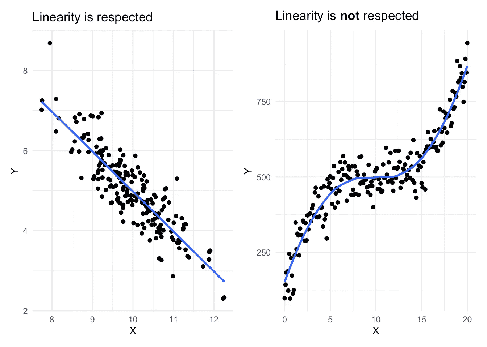

作者的情节

1.  **独立性:**观察必须是独立的。通常是抽样计划和实验设计提供了这种情况的信息。如果数据来自不同的个人或实验单位，通常是独立的。另一方面，如果在不同时期测量相同的个体，数据很可能不是独立的。
2.  **残差的正态性:**对于大样本量，无论误差是否遵循[正态分布](https://statsandr.com/blog/do-my-data-follow-a-normal-distribution-a-note-on-the-most-widely-used-distribution-and-how-to-test-for-normality-in-r/)(中心极限定理的一个结果，详见[恩斯特和艾伯斯](https://statsandr.com/blog/multiple-linear-regression-made-simple/#ref-ernst2017regression) ( [2017](https://statsandr.com/blog/multiple-linear-regression-made-simple/#ref-ernst2017regression) ))置信区间和对系数的检验都(近似)有效！对于小样本量，残差应遵循正态分布。这种情况可以通过视觉测试(通过 [QQ 图](https://statsandr.com/blog/descriptive-statistics-in-r/#qq-plot)和/或[直方图](https://statsandr.com/blog/descriptive-statistics-in-r/#histogram))，或者更正式地测试(例如通过[夏皮罗-维尔克测试](https://statsandr.com/blog/do-my-data-follow-a-normal-distribution-a-note-on-the-most-widely-used-distribution-and-how-to-test-for-normality-in-r/#normality-test))。
3.  **残差的同方差:**误差的方差应该是常数。当残差的离差随着预测值(拟合值)的增加而增加时，则缺少同方差。这种情况可以通过视觉测试(通过标绘标准化残差与拟合值)或更正式地测试(通过 Breusch-Pagan 测试)。
4.  **没有影响点:**如果数据包含[异常值](https://statsandr.com/blog/outliers-detection-in-r/)，识别它们是至关重要的，这样它们**就不会**、**自己影响**回归的结果。请注意，例如，如果点在回归线的直线上，异常值本身*不是问题*，因为它不会影响回归线。如果它对估计值(尤其是回归线的斜率)有实质性的影响，那么它就成为线性回归中的一个问题。这可以通过识别异常值并比较有和没有潜在异常值的结果来解决(两种方法的结果是否相同？)

*提示:*我记得前 4 个条件，感谢首字母缩略词“LINE”，表示线性、独立性、正态性和方差相等。

如果不满足任何条件，测试和结论可能是错误的，因此最好避免使用和解释模型。如果是这种情况，通常可以通过变换(例如，对数变换、平方或平方根、Box-Cox 变换等)来满足条件。)的数据。如果没有帮助，可以考虑删除一些变量或添加其他变量，甚至考虑非线性模型。

请记住，在实践中，在根据模型得出任何结论之前，应验证**应用条件。我在这里避免测试我们的数据的条件，因为它将在多元线性回归的上下文中详细讨论(参见本[部分](https://statsandr.com/blog/multiple-linear-regression-made-simple/#conditions-of-application-1))。**

# 形象化

如果你是博客的常客，你可能知道我喜欢画(简单而有效)[可视化](https://statsandr.com/tags/visualization/)来说明我的统计分析。线性回归也不例外。

有许多方法可以可视化这两个感兴趣的变量之间的关系，但我目前发现的最简单的方法是通过同名包中的`visreg()`函数:

```
library(visreg)
visreg(model)
```

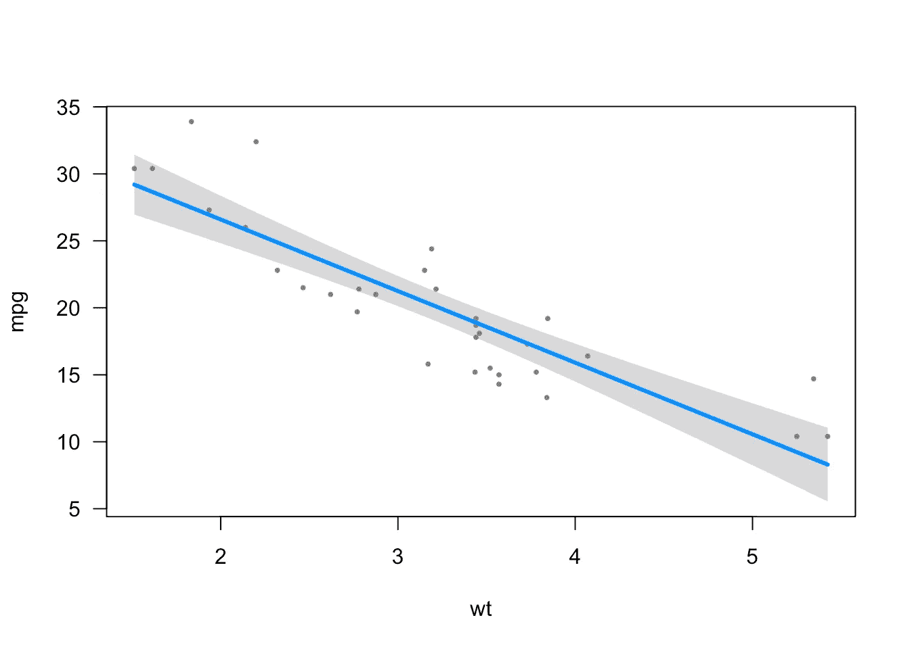

作者的情节

我喜欢这种简单的方法——只有一行代码。

但是，其他元素也可以显示在回归图上(例如回归方程和 R^2).这可以通过`{ggpubr}`包中的`stat_regline_equation()`和`stat_cor()`功能轻松完成:

```
# load necessary libraries
library(ggpubr)# create plot with regression line, regression equation and R^2
ggplot(dat, aes(x = wt, y = mpg)) +
  geom_smooth(method = "lm") +
  geom_point() +
  stat_regline_equation(label.x = 3, label.y = 32) + # for regression equation
  stat_cor(aes(label = ..rr.label..), label.x = 3, label.y = 30) + # for R^2
  theme_minimal()
```

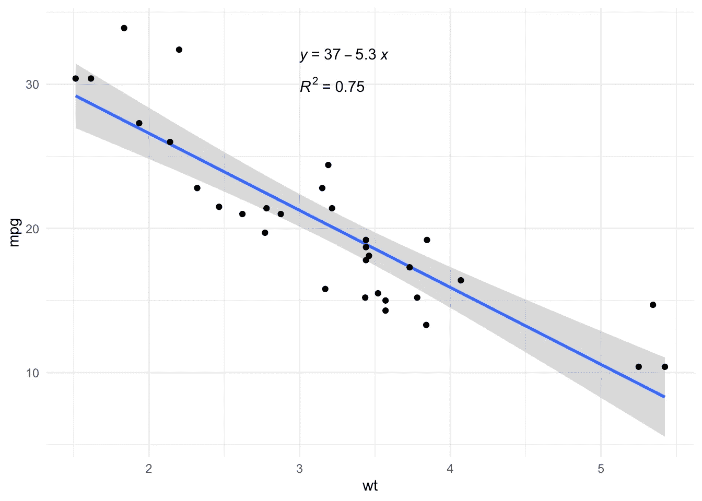

作者的情节

# 多元线性回归

现在，您已经理解了简单线性回归背后的原理，并且知道了如何解释结果，是时候讨论多元线性回归了。

我们还从多元线性回归的基本原理开始，然后展示如何解释结果，如何测试应用的条件，并以更高级的主题结束。

# 原则

多元线性回归是简单线性回归的推广，在某种意义上，这种方法可以通过其参数中的线性函数将一个变量与几个变量**联系起来。**

多元线性回归用于评估两个变量**之间的关系，同时考虑其他变量**的影响。通过考虑其他变量的影响，我们抵消了这些其他变量的影响，以便**隔离**并测量两个感兴趣变量之间的关系。这一点是与简单线性回归的主要区别。

为了说明如何在 R 中执行多元线性回归，我们使用与简单线性回归(`mtcars`)相同的数据集。下面是一个简短的预览:

```
head(dat)##                    mpg cyl disp  hp drat    wt  qsec vs am gear carb
## Mazda RX4         21.0   6  160 110 3.90 2.620 16.46  0  1    4    4
## Mazda RX4 Wag     21.0   6  160 110 3.90 2.875 17.02  0  1    4    4
## Datsun 710        22.8   4  108  93 3.85 2.320 18.61  1  1    4    1
## Hornet 4 Drive    21.4   6  258 110 3.08 3.215 19.44  1  0    3    1
## Hornet Sportabout 18.7   8  360 175 3.15 3.440 17.02  0  0    3    2
## Valiant           18.1   6  225 105 2.76 3.460 20.22  1  0    3    1
```

我们已经看到，一辆汽车用一加仑油可以行驶的距离与其重量之间存在显著的负线性关系(ˇβ1 =-5.34，p 值< 0.001).

However, one may wonder whether there are not in reality other factors that could explain a car’s fuel consumption.

To explore this, we can visualize the relationship between a car’s fuel consumption ( 【 ) together with its weight ( 【 ), horsepower ( 【 ) and displacement ( 【 ) (engine displacement is the combined swept (or displaced) volume of air resulting from the up-and-down movement of pistons in the cylinders, usually the higher the more powerful the car):

```
ggplot(dat) +
  aes(x = wt, y = mpg, colour = hp, size = disp) +
  geom_point() +
  scale_color_gradient() +
  labs(
    y = "Miles per gallon",
    x = "Weight (1000 lbs)",
    color = "Horsepower",
    size = "Displacement"
  ) +
  theme_minimal()
```

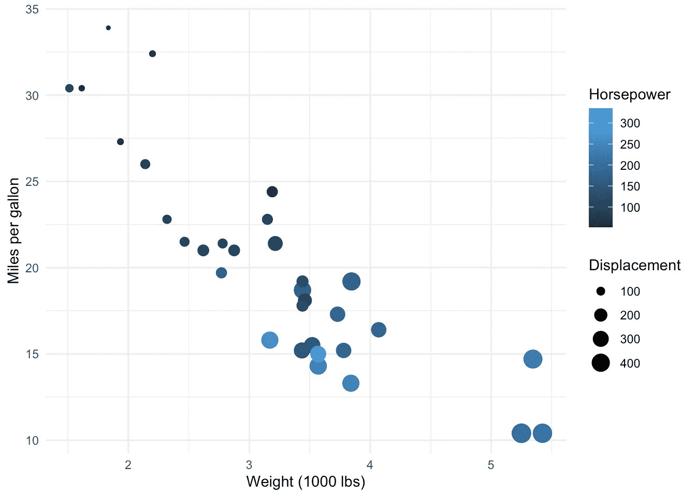

Plot by author

It seems that, in addition to the negative relationship between miles per gallon and weight, there is also:

*   a negative relationship between miles/gallon and horsepower (lighter points, indicating more horsepower, tend to be more present in low levels of miles per gallon)
*   a negative relationship between miles/gallon and displacement (bigger points, indicating larger values of displacement, tend to be more present in low levels of miles per gallon).

Therefore, we would like to evaluate the relation between the fuel consumption and the weight, but this time by adding information on the horsepower and displacement. By adding this additional information, we are able to **仅捕获英里/加仑与重量**之间的直接关系(马力和排量产生的间接影响被抵消)。

这就是多元线性回归的全部意义！事实上，在多元线性回归中，因变量和解释变量之间的估计关系是一种**调整的**关系，即不受其他解释变量的线性影响。

让我们通过在线性回归模型中增加马力和排量来说明调整的概念:

```
model2 <- lm(mpg ~ wt + hp + disp,
  data = dat
)summary(model2)## 
## Call:
## lm(formula = mpg ~ wt + hp + disp, data = dat)
## 
## Residuals:
##    Min     1Q Median     3Q    Max 
## -3.891 -1.640 -0.172  1.061  5.861 
## 
## Coefficients:
##              Estimate Std. Error t value Pr(>|t|)    
## (Intercept) 37.105505   2.110815  17.579  < 2e-16 ***
## wt          -3.800891   1.066191  -3.565  0.00133 ** 
## hp          -0.031157   0.011436  -2.724  0.01097 *  
## disp        -0.000937   0.010350  -0.091  0.92851    
## ---
## Signif. codes:  0 '***' 0.001 '**' 0.01 '*' 0.05 '.' 0.1 ' ' 1
## 
## Residual standard error: 2.639 on 28 degrees of freedom
## Multiple R-squared:  0.8268, Adjusted R-squared:  0.8083 
## F-statistic: 44.57 on 3 and 28 DF,  p-value: 8.65e-11
```

我们可以看到，现在，英里/加仑与重量之间的关系在斜率方面变弱了(现在β1= -3.8，而只考虑重量时β1= -5.34)。

重量对油耗的影响根据马力和排量的影响进行调整。这是在考虑了马力和排量的影响后，英里/加仑和重量之间的剩余影响。在本[章节](https://statsandr.com/blog/multiple-linear-regression-made-simple/#interpretations-of-coefficients-widehatbeta-1)中有更详细的解释。

# 等式

多重线性回归模型由以下等式定义

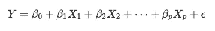

它类似于简单线性回归方程，除了有多个独立变量(X1，X2，…，Xp)。

通过最小二乘法对参数β0，…，βp 的估计基于与简单线性回归相同的原理，但是应用于 pp 维度。因此，问题不再是找到最佳线(最靠近成对点(yi，xi)的线)，而是找到最靠近坐标点(yi，xi1，…，xip)的 pp 维平面。这是通过 ***最小化*平面**上的点的偏差的平方和来实现的:

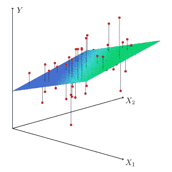

资料来源:Thaddeussegura

# 系数ˇβ的解释

最小二乘法导致系数的调整估计。术语“调整”是指在考虑了其他独立变量对因变量以及预测变量的线性影响后的**。**

换句话说，当其他解释变量(X2，…，Xp)的线性效应被移除时，系数β1 对应于 Y 和 X1 之间关系的斜率，既在因变量 Y 的水平也在 X1 的水平。

将重量、马力和排量作为独立变量应用于我们的模型，我们得到:

```
summary(model2)## 
## Call:
## lm(formula = mpg ~ wt + hp + disp, data = dat)
## 
## Residuals:
##    Min     1Q Median     3Q    Max 
## -3.891 -1.640 -0.172  1.061  5.861 
## 
## Coefficients:
##              Estimate Std. Error t value Pr(>|t|)    
## (Intercept) 37.105505   2.110815  17.579  < 2e-16 ***
## wt          -3.800891   1.066191  -3.565  0.00133 ** 
## hp          -0.031157   0.011436  -2.724  0.01097 *  
## disp        -0.000937   0.010350  -0.091  0.92851    
## ---
## Signif. codes:  0 '***' 0.001 '**' 0.01 '*' 0.05 '.' 0.1 ' ' 1
## 
## Residual standard error: 2.639 on 28 degrees of freedom
## Multiple R-squared:  0.8268, Adjusted R-squared:  0.8083 
## F-statistic: 44.57 on 3 and 28 DF,  p-value: 8.65e-11
```

表`Coefficients`给出了每个参数的估计值(列`Estimate`)，以及参数无效值的 p 值(列`Pr(>|t|)`)。

假设与简单线性回归相同，即:

*   H0:βj=0
*   H1:βj≠0

βj=0 的检验相当于检验假设:在所有其他条件相同的情况下，因变量是否与所研究的自变量相关联，也就是说，处于其他自变量的恒定水平。

换句话说:

*   β1=0 的测试对应于测试假设:在马力和排量不变的情况下，油耗与汽车重量有关吗
*   β2=0 的测试对应于测试假设:在重量和排量不变的情况下，油耗与马力相关吗
*   β3=0 的测试对应于测试假设:在重量和排量不变的情况下，燃油消耗是否与排量相关
*   (为了完整起见:β0=0 的测试对应于测试假设:当重量、马力和排量等于 0 时，英里/加仑是否不同于 0)

在实践中，我们通常在解释系数之前检查应用条件*(因为如果不遵守这些条件，结果可能会有偏差)。然而，在本文中，我在测试条件之前给出了解释，因为重点是展示如何解释结果，而不是找到一个有效的模型。*

基于我们模型的输出，我们得出结论:

*   在英里/加仑和重量之间有一个显著的负相关关系，**在其他条件相同的情况下**。因此，重量每增加一个单位(即增加 1000 磅)，在马力和排量保持不变的情况下，平均每加仑行驶英里数减少 3.8 英里(p 值= 0.001)。
*   在其他条件相同的情况下，英里/加仑和马力之间存在显著的负相关关系。因此，在重量和排量不变的情况下，每增加一个单位的马力，一加仑汽油行驶的距离平均减少 0.03 英里(p 值= 0.011)。
*   当重量和马力保持不变时，我们不拒绝英里/加仑和排量之间没有关系的假设(因为 p 值= 0.929 > 0.05)。
*   (为了完整性，但只有当它有意义时才应该被解释:对于重量、马力和排量= 0，我们可以预计一辆汽车平均油耗为 37.11 英里/加仑(p 值< 0.001). See a more useful interpretation of the intercept when the independent variables are centered in this [部分](https://statsandr.com/blog/multiple-linear-regression-made-simple/#another-interpretation-of-the-intercept))。)

这就是如何解释定量自变量。**解释定性独立变量**略有不同，因为在其他条件相同的情况下，它量化了某一水平相对于参考水平的影响。因此，它根据因变量比较不同的组(由分类变量的不同水平形成)(这就是为什么线性回归可以被视为 t 检验和 ANOVA 的扩展)。

为了说明，我们根据重量(`wt`)和发动机的形状(`vs`)来模拟燃料消耗(`mpg`)。变量`vs`有两级:V 型[参考级](https://statsandr.com/blog/data-manipulation-in-r/#change-reference-level)和直列发动机。 [7](https://statsandr.com/blog/multiple-linear-regression-made-simple/#fn7)

```
## Recoding dat$vs
library(forcats)
dat$vs <- as.character(dat$vs)
dat$vs <- fct_recode(dat$vs,
  "V-shaped" = "0",
  "Straight" = "1"
)model3 <- lm(mpg ~ wt + vs,
  data = dat
)summary(model3)## 
## Call:
## lm(formula = mpg ~ wt + vs, data = dat)
## 
## Residuals:
##     Min      1Q  Median      3Q     Max 
## -3.7071 -2.4415 -0.3129  1.4319  6.0156 
## 
## Coefficients:
##             Estimate Std. Error t value Pr(>|t|)    
## (Intercept)  33.0042     2.3554  14.012 1.92e-14 ***
## wt           -4.4428     0.6134  -7.243 5.63e-08 ***
## vsStraight    3.1544     1.1907   2.649   0.0129 *  
## ---
## Signif. codes:  0 '***' 0.001 '**' 0.01 '*' 0.05 '.' 0.1 ' ' 1
## 
## Residual standard error: 2.78 on 29 degrees of freedom
## Multiple R-squared:  0.801,  Adjusted R-squared:  0.7873 
## F-statistic: 58.36 on 2 and 29 DF,  p-value: 6.818e-11
```

基于我们模型的输出，我们得出结论:

*   对于 V 型发动机，重量增加一个单位(即增加 1000 磅)，平均每加仑行驶里程数减少 4.44 英里(p 值= 0.013)。
*   (为了完整性，但只有当它有意义时才应该解释:对于重量= 0 和 V 形发动机，我们可以预计汽车的平均油耗为 33 英里/加仑(p 值< 0.001). See a more useful interpretation of the intercept when the independent variables are centered in this [部分](https://statsandr.com/blog/multiple-linear-regression-made-simple/#another-interpretation-of-the-intercept))。)
*   申请条件

# 对于简单线性回归，多元线性回归需要一些应用条件，以使模型可用，结果可解释。简单线性回归的条件也适用于多元线性回归，即:

**因变量和自变量之间关系的线性**[8](https://statsandr.com/blog/multiple-linear-regression-made-simple/#fn8)

1.  **观察值的独立性**
2.  **残差的正态性**
3.  **残差的同方差**
4.  **无影响点** ( [异常值](https://statsandr.com/blog/outliers-detection-in-r/))
5.  但是多元线性回归还有一个条件:

**无多重共线性:**当自变量之间存在强线性[](https://statsandr.com/blog/correlation-coefficient-and-correlation-test-in-r/)****相关性时，出现多重共线性，条件是模型中的其他变量。检查它是很重要的，因为当变量改变时，它可能导致估计参数的不精确或不稳定。可以通过研究每对独立变量之间的相关性来评估，或者更好的是，通过计算方差膨胀因子(VIF)来评估。相对于解释变量严格独立的情况，VIF 衡量估计回归系数的方差增加了多少。高 VIF 值是多重共线性的标志(根据域的不同，阈值通常为 5 或 10)。减少 VIF 最简单的方法是去除一些相关的独立变量，或者最终将数据标准化。****

1.  **你会经常看到这些条件通过运行`plot(model, which = 1:6)`得到验证，完全正确。然而，我最近从`{performance}`包中发现了`check_model()`函数，它同时测试所有这些条件(老实说，以一种更优雅的方式)。 [9](https://statsandr.com/blog/multiple-linear-regression-made-simple/#fn9)**

**应用在我们的`model2`上，以英里/加仑为因变量，重量、马力和排量为自变量，我们得到:**

**作者的情节**

```
# install.packages("performance")
# install.packages("see")
library(performance)check_model(model2)
```

**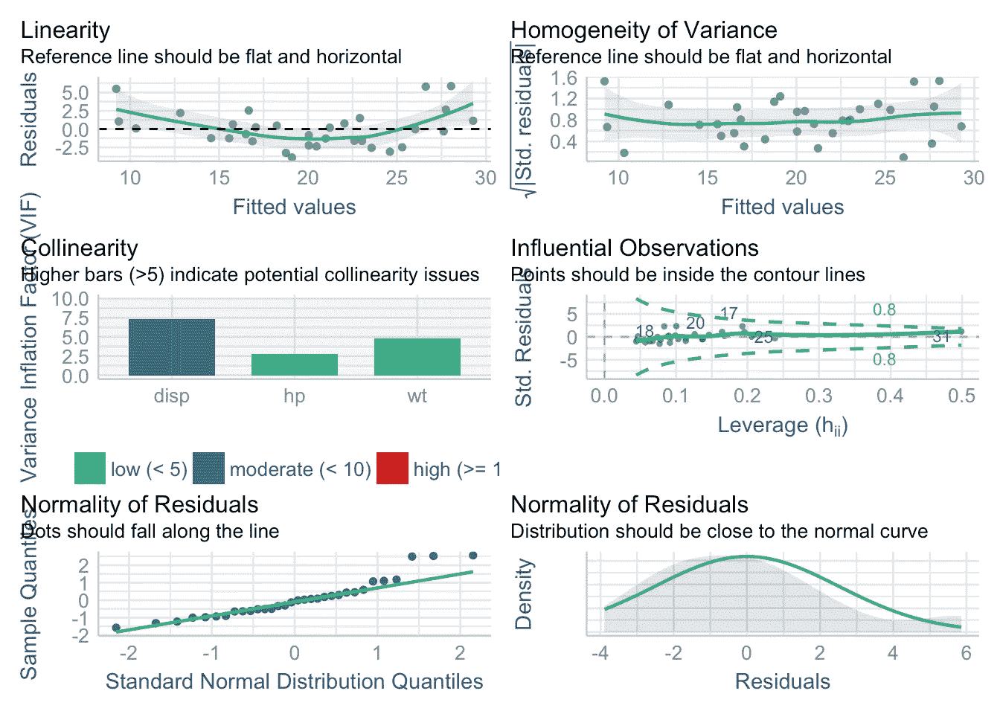**

**除了同时测试所有条件之外，它还提供了关于如何解释不同诊断图以及您应该期待什么的见解(参见每个图的副标题):**

**方差的同质性(右上图)受到重视**

*   **多重共线性(左中图)不是问题(对于 VIF，我倾向于使用阈值 10，并且它们都低于 10) [11](https://statsandr.com/blog/multiple-linear-regression-made-simple/#fn11)**
*   **没有有影响的点(右中图)**
*   **由于 3 个点偏离参考线，残差的正态性(两个底部图)也不完美，但对我来说似乎仍然可以接受。在任何情况下，给定参数 [12](https://statsandr.com/blog/multiple-linear-regression-made-simple/#fn12) 的数量，并且给定与正态分布的小偏差，观察值的数量足够大，因此无论误差是否遵循正态分布，对系数的测试都(近似)有效**
*   **线性(左上图)并不完美，所以让我们分别检查每个独立变量:**
*   **作者的情节**

```
# weight
ggplot(dat, aes(x = wt, y = mpg)) +
  geom_point() +
  theme_minimal()
```

**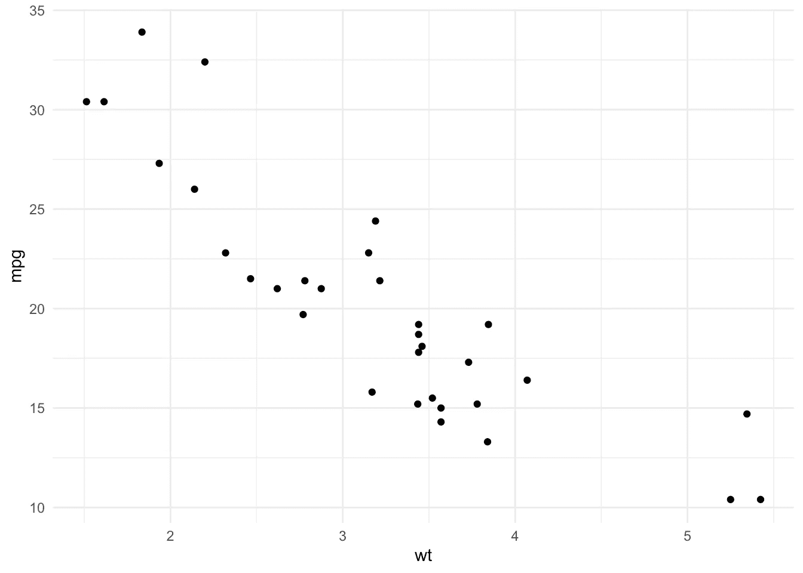**

**作者的情节**

```
# horsepower
ggplot(dat, aes(x = hp, y = mpg)) +
  geom_point() +
  theme_minimal()
```

**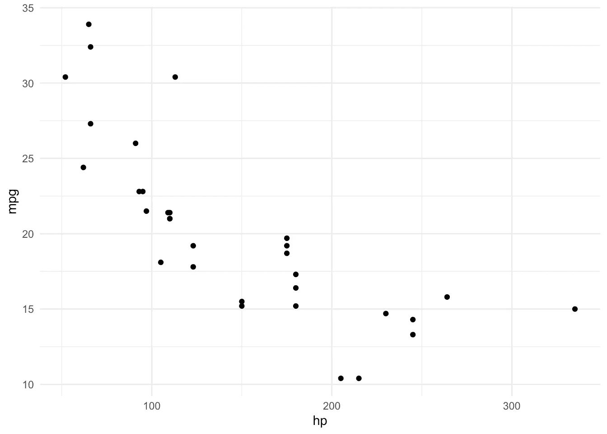**

**作者的情节**

```
# displacement
ggplot(dat, aes(x = disp, y = mpg)) +
  geom_point() +
  theme_minimal()
```

**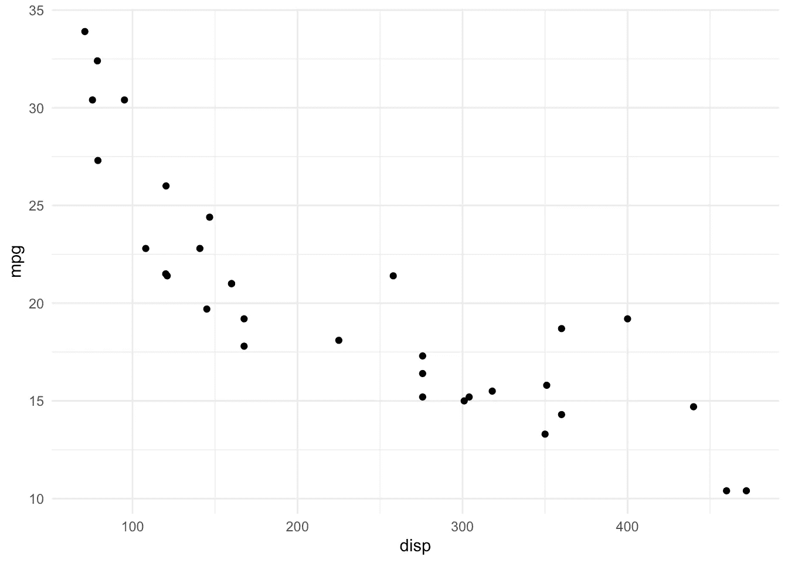**

**似乎英里/加仑和马力之间的关系不是线性的，这可能是该模型的轻微线性缺陷的主要组成部分。为了提高线性度，可以移除变量或应用变换(例如对数和/或平方)。 [13](https://statsandr.com/blog/multiple-linear-regression-made-simple/#fn13) 如果这不能解决线性问题，可以考虑其他类型的模型。**

**为了简单和说明的目的，我们假设本文的其余部分是线性的。**

**当满足应用条件时，我们通常说模型有效。但并不是所有有效的型号都是*好的*型号。下一节讨论模型选择。**

**如何选择好的线性模型？**

# **满足应用条件的模型是最低要求，但您可能会找到几个满足此标准的模型。因此，有人可能会问**如何在所有有效的不同模型**中做出选择？**

**选择一个好的线性模型的三个最常用的工具是根据:**

**与模型相关联的 p 值，**

1.  **决定系数 R^2 和**
2.  **阿凯克信息标准**
3.  **这些方法将在接下来的章节中详细介绍。注意，前两个适用于简单和多元线性回归，而第三个仅适用于多元线性回归。**

**与模型关联的 p 值**

# **在解释模型的估计值之前，最好先检查与模型相关的 p 值。该 p 值指示该模型是否比仅具有截距的模型**更好。****

**测试的假设(称为 f 检验)是:**

**H0:β1=β2=⋯=βp=0**

*   **H1:H1:至少有一个系数β≠0**
*   **该 p 值可在`summary()`输出的底部找到:**

**p 值= 8.65e-11。零假设被拒绝，因此我们得出结论，我们的模型比只有截距的模型更好，因为至少有一个系数β明显不同于 0。**

```
summary(model2)## 
## Call:
## lm(formula = mpg ~ wt + hp + disp, data = dat)
## 
## Residuals:
##    Min     1Q Median     3Q    Max 
## -3.891 -1.640 -0.172  1.061  5.861 
## 
## Coefficients:
##              Estimate Std. Error t value Pr(>|t|)    
## (Intercept) 37.105505   2.110815  17.579  < 2e-16 ***
## wt          -3.800891   1.066191  -3.565  0.00133 ** 
## hp          -0.031157   0.011436  -2.724  0.01097 *  
## disp        -0.000937   0.010350  -0.091  0.92851    
## ---
## Signif. codes:  0 '***' 0.001 '**' 0.01 '*' 0.05 '.' 0.1 ' ' 1
## 
## Residual standard error: 2.639 on 28 degrees of freedom
## Multiple R-squared:  0.8268, Adjusted R-squared:  0.8083 
## F-statistic: 44.57 on 3 and 28 DF,  p-value: 8.65e-11
```

**如果其中一个模型的 p 值> 0.05，这意味着您选择的变量没有一个有助于解释因变量。换句话说，你应该完全忘记这个模型，因为它不会比简单地取因变量的平均值更好。**

**决定系数 R^2**

# **决定系数 R^2 是模型的**拟合优度的度量。它衡量模型解释的总可变性的比例，或模型与数据的拟合程度。****

**R^2 在 0 和 1 之间变化:**

**R^2=0:这个模型解释不了什么**

*   **R^2=1:模型解释了一切**
*   **0**
*   **the higher the R^2, the better the model explains the dependent variable. As a rule of thumb, a R^2> 0.7 表示模型 [13](https://statsandr.com/blog/multiple-linear-regression-made-simple/#fn13) 的良好拟合**
*   **注意，在简单的线性回归模型中，决定系数等于[相关系数](https://statsandr.com/blog/correlation-coefficient-and-correlation-test-in-r/)的平方:R^2=corr(X,Y)^2.**

**将英里/加仑作为因变量，重量、马力和排量作为自变量，应用于我们的`model2`,我们得到:**

**R^2 显示在`summary()`输出的底部，或者可以用`summary(model2)$r.squared`提取。**

```
summary(model2)## 
## Call:
## lm(formula = mpg ~ wt + hp + disp, data = dat)
## 
## Residuals:
##    Min     1Q Median     3Q    Max 
## -3.891 -1.640 -0.172  1.061  5.861 
## 
## Coefficients:
##              Estimate Std. Error t value Pr(>|t|)    
## (Intercept) 37.105505   2.110815  17.579  < 2e-16 ***
## wt          -3.800891   1.066191  -3.565  0.00133 ** 
## hp          -0.031157   0.011436  -2.724  0.01097 *  
## disp        -0.000937   0.010350  -0.091  0.92851    
## ---
## Signif. codes:  0 '***' 0.001 '**' 0.01 '*' 0.05 '.' 0.1 ' ' 1
## 
## Residual standard error: 2.639 on 28 degrees of freedom
## Multiple R-squared:  0.8268, Adjusted R-squared:  0.8083 
## F-statistic: 44.57 on 3 and 28 DF,  p-value: 8.65e-11
```

**该车型的 R^2 为 0.8268，这意味着一加仑汽油行驶距离的 82.68%由汽车的重量、马力和排量决定。相对较高的 R^2 意味着汽车的重量、马力和排量是解释一加仑燃料可以行驶的距离的良好特征。**

**注意，如果要比较自变量数量不同的模型，最好参考调整后的 R^2 (=此处为 0.8083)。的确，在模型中加入变量并不能使 R^2 降低，即使变量与因变量无关(所以在模型中加入变量时 R^2 会人为增加，或者至少保持不变)。因此，调整后的 R^2 通过惩罚额外的变量来考虑模型的复杂性(变量的数量)，因此它是拟合优度和节俭之间的折衷。**

**吝啬**

# **一个**简约的模型(很少的变量)通常比一个复杂的模型(很多变量)更受青睐**。有两种方法可以从具有许多独立变量的模型中获得一个简洁的模型:**

**我们可以**反复删除与因变量**最不相关的自变量(即在[方差分析表](https://statsandr.com/blog/multiple-linear-regression-made-simple/#overall-effect-of-categorical-variables)中具有最高 p 值的那个)，直到它们都与响应变量显著相关，或者**

1.  **我们可以根据**赤池信息标准(AIC)** 选择模型。AIC 表达了用尽可能少的系数拟合模型的愿望，并允许对模型进行比较。根据这个标准，最好的模型是具有最低 AIC 的模型。该标准基于拟合质量和其复杂性之间的折衷。我们通常从具有许多独立变量的全局模型开始，程序(称为逐步算法) [14](https://statsandr.com/blog/multiple-linear-regression-made-simple/#fn14) 自动比较模型，然后根据 AIC 选择最佳模型。**
2.  **我们展示了如何在 r 中执行第二个选项。为了便于说明，我们从一个模型开始，该模型将数据集中的所有变量作为独立变量(不要忘记首先转换因子变量):**

**(公式`mpg ~ .`是将数据集中存在的所有变量视为自变量的捷径，除了已被指定为因变量的变量(此处为`mpg`)。**

```
## vs has already been transformed into factor
## so only am is transformed here## Recoding dat$vs
library(forcats)
dat$am <- as.character(dat$am)
dat$am <- fct_recode(dat$am,
  "Automatic" = "0",
  "Manual" = "1"
)model4 <- lm(mpg ~ .,
  data = dat
)model4 <- step(model4, trace = FALSE)
```

**根据这一标准选择的型号如下:**

**使用自动程序时要小心，因为即使它是所选的最佳模型，它也是基于:**

```
summary(model4)## 
## Call:
## lm(formula = mpg ~ wt + qsec + am, data = dat)
## 
## Residuals:
##     Min      1Q  Median      3Q     Max 
## -3.4811 -1.5555 -0.7257  1.4110  4.6610 
## 
## Coefficients:
##             Estimate Std. Error t value Pr(>|t|)    
## (Intercept)   9.6178     6.9596   1.382 0.177915    
## wt           -3.9165     0.7112  -5.507 6.95e-06 ***
## qsec          1.2259     0.2887   4.247 0.000216 ***
## amManual      2.9358     1.4109   2.081 0.046716 *  
## ---
## Signif. codes:  0 '***' 0.001 '**' 0.01 '*' 0.05 '.' 0.1 ' ' 1
## 
## Residual standard error: 2.459 on 28 degrees of freedom
## Multiple R-squared:  0.8497, Adjusted R-squared:  0.8336 
## F-statistic: 52.75 on 3 and 28 DF,  p-value: 1.21e-11
```

**在一个单一的标准(AIC 在这种情况下)，但更重要的是；**

*   **它基于一些数学规则，这意味着不考虑行业知识或人类专业知识。**
*   **我相信这种模型选择的自动程序是一个很好的起点，但是我也相信最终的模型应该总是与其他模型进行检查和测试，以确保它在实践中是有意义的(应用常识)。**

**最后但同样重要的是，不要忘记验证[应用条件](https://statsandr.com/blog/multiple-linear-regression-made-simple/#conditions-of-application-1)，因为逐步程序不能保证它们得到遵守。**

**形象化**

# **有许多方法可以将线性回归的结果可视化。我知道的最简单的两个是:**

**`visreg()`它在不同的图中说明了因变量和自变量之间的关系(每个自变量一个，除非你指定了你想要说明的关系):**

1.  **作者的情节**

```
library(visreg)
visreg(model4)
```

****

**作者的情节**

**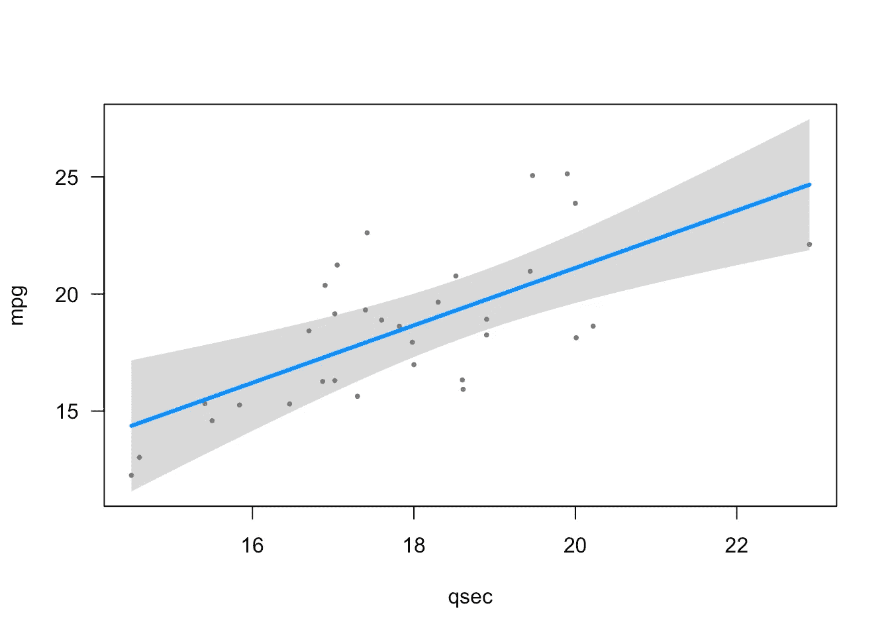**

**作者的情节**

****

**`ggcoefstats()`在一张图中显示了结果:**

1.  **作者的情节**

```
library(ggstatsplot)
ggcoefstats(model4)
```

**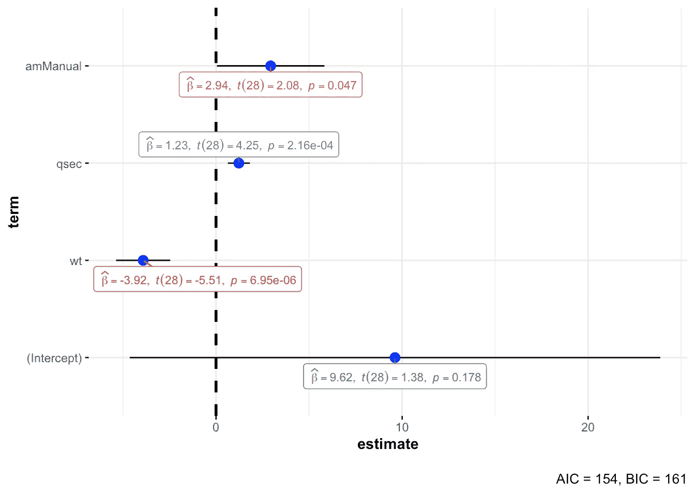**

**在该图中:**

**当实线不与垂直虚线交叉时，估计值在 5%显著性水平上显著不同于 0(即 p 值< 0.05)**

*   **furthermore, a point to the right (left) of the vertical dashed line means that there is a positive (negative) relationship between the two variables**
*   **the more extreme the point, the stronger the relationship**
*   **To go further**

# **Below some more advanced topics related to linear regression. Feel free to comment at the end of the article if you believe I missed an important one.**

**Extract model’s equation**

# **You can easily extract the equation of your linear model in LaTeX or directly in your R Markdown document thanks to the 【 function from the 【 package:**

**The function works for linear regression, but also for many other models such as [ANOVA](https://statsandr.com/blog/anova-in-r/) 、GLM、逻辑回归等)。**

```
library(equatiomatic)
extract_eq(model4, use_coefs = TRUE)
```

**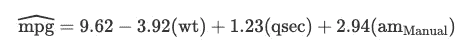**

**自动报告**

# **同名软件包中的`report()`功能允许根据最佳实践指南自动生成模型报告:**

**请注意，该函数也适用于数据框架、统计测试和其他模型。**

```
library(report)report(model4)## We fitted a linear model (estimated using OLS) to predict mpg with wt, qsec and am (formula: mpg ~ wt + qsec + am). The model explains a statistically significant and substantial proportion of variance (R2 = 0.85, F(3, 28) = 52.75, p < .001, adj. R2 = 0.83). The model's intercept, corresponding to wt = 0, qsec = 0 and am = Automatic, is at 9.62 (95% CI [-4.64, 23.87], t(28) = 1.38, p = 0.178). Within this model:
## 
##   - The effect of wt is statistically significant and negative (beta = -3.92, 95% CI [-5.37, -2.46], t(28) = -5.51, p < .001; Std. beta = -0.64, 95% CI [-0.87, -0.40])
##   - The effect of qsec is statistically significant and positive (beta = 1.23, 95% CI [0.63, 1.82], t(28) = 4.25, p < .001; Std. beta = 0.36, 95% CI [0.19, 0.54])
##   - The effect of am [Manual] is statistically significant and positive (beta = 2.94, 95% CI [0.05, 5.83], t(28) = 2.08, p = 0.047; Std. beta = 0.49, 95% CI [7.59e-03, 0.97])
## 
## Standardized parameters were obtained by fitting the model on a standardized version of the dataset.
```

**预言**

# **线性回归也经常用于**预测目的**。可以用`predict()`函数计算出**新数据**的置信区间和预测区间。**

**假设我们想预测一辆带手动变速器的汽车的英里/加仑数，该车重 3000 磅，在 18 秒内行驶 1/4 英里(`qsec`):**

**根据我们的模型，预计这辆车一加仑油可行驶 22.87 英里。**

```
# confidence interval for new data
predict(model4,
  new = data.frame(wt = 3, qsec = 18, am = "Manual"),
  interval = "confidence",
  level = .95
)##        fit      lwr    upr
## 1 22.87005 21.09811 24.642# prediction interval for new data
predict(model4,
  new = data.frame(wt = 3, qsec = 18, am = "Manual"),
  interval = "prediction",
  level = .95
)##        fit      lwr      upr
## 1 22.87005 17.53074 28.20937
```

**置信区间和预测区间的区别在于:**

**一个**置信区间**给出了一个新观察值的 Y 的**平均值**的预测值，而**

*   **一个**预测**区间给出了一个**个体** Y 对于一个新观察的预测值。**
*   **预测区间比置信区间宽，以说明由于预测个体反应而产生的**额外不确定性，而不是给定 x 值的平均值****

**线性假设检验**

# **线性假设检验可以推广第[节](https://statsandr.com/blog/multiple-linear-regression-made-simple/#p-value-associated-to-the-model)中提到的 f 检验，同时提供系数比较检验或系数线性组合相等检验的可能性。**

**例如，要测试线性约束:**

**H0:β1=β2=0**

*   **H1:H1:不是 H0**
*   **我们使用`{car}`包的`linearHypothesis()`函数如下:**

**我们拒绝零假设，我们得出结论，β1 和β2 中至少有一个不同于 0 (p 值= 1.55e-09)。**

```
library(car)
linearHypothesis(model4, c("wt = 0", "qsec = 0"))## Linear hypothesis test
## 
## Hypothesis:
## wt = 0
## qsec = 0
## 
## Model 1: restricted model
## Model 2: mpg ~ wt + qsec + am
## 
##   Res.Df    RSS Df Sum of Sq      F   Pr(>F)    
## 1     30 720.90                                 
## 2     28 169.29  2    551.61 45.618 1.55e-09 ***
## ---
## Signif. codes:  0 '***' 0.001 '**' 0.01 '*' 0.05 '.' 0.1 ' ' 1
```

**分类变量的总体效应**

# **当自变量是 k 个类别的分类变量时，回归表提供 k1 p 值:**

**变量`vs`和`am`有两个级别，因此回归输出中显示一个级别。变量`cyl`有 3 个级别(4、6 和 8)，所以显示其中的 2 个。`vs`和`am`的总体效果在`Pr(>|t|)`栏中报告，但不包括`cyl`的**总体**效果，因为该变量有 2 个以上的级别。**

```
model5 <- lm(mpg ~ vs + am + as.factor(cyl),
  data = dat
)summary(model5)## 
## Call:
## lm(formula = mpg ~ vs + am + as.factor(cyl), data = dat)
## 
## Residuals:
##     Min      1Q  Median      3Q     Max 
## -6.2821 -1.4402  0.0391  1.8845  6.2179 
## 
## Coefficients:
##                 Estimate Std. Error t value Pr(>|t|)    
## (Intercept)       22.809      2.928   7.789 2.24e-08 ***
## vsStraight         1.708      2.235   0.764  0.45135    
## amManual           3.165      1.528   2.071  0.04805 *  
## as.factor(cyl)6   -5.399      1.837  -2.938  0.00668 ** 
## as.factor(cyl)8   -8.161      2.892  -2.822  0.00884 ** 
## ---
## Signif. codes:  0 '***' 0.001 '**' 0.01 '*' 0.05 '.' 0.1 ' ' 1
## 
## Residual standard error: 3.097 on 27 degrees of freedom
## Multiple R-squared:  0.7701, Adjusted R-squared:  0.736 
## F-statistic: 22.61 on 4 and 27 DF,  p-value: 2.741e-08
```

**为了获得分类变量总体效应的 p 值，我们需要通过`{car}`包中的`Anova()`函数获得方差分析表: [15](https://statsandr.com/blog/multiple-linear-regression-made-simple/#fn15)**

**从这张方差分析表中，我们得出结论:**

```
library(car)
Anova(model5)## Anova Table (Type II tests)
## 
## Response: mpg
##                 Sum Sq Df F value  Pr(>F)  
## vs               5.601  1  0.5841 0.45135  
## am              41.122  1  4.2886 0.04805 *
## as.factor(cyl)  94.591  2  4.9324 0.01493 *
## Residuals      258.895 27                  
## ---
## Signif. codes:  0 '***' 0.001 '**' 0.01 '*' 0.05 '.' 0.1 ' ' 1
```

**`vs`与`mpg`无明显关联(p 值= 0.451)**

*   **`am`和`cyl`与`mpg`显著相关(p 值< 0.05)**
*   **互动**

# **到目前为止，我们已经讨论了没有任何交互作用的多元线性回归。如果因素 A 对响应的影响取决于因素 B 所采取的水平，则因素 A 和 B **之间存在**相互作用**影响。****

**在 R 中，可以按如下方式添加交互:**

**从输出中我们得出结论，重量和传输之间存在相互作用(p 值= 0.00102)。这意味着重量对一加仑**行驶距离的影响取决于变速箱类型**。**

```
model6 <- lm(mpg ~ wt + am + wt:am,
  data = dat
)# Or in a shorter way:
model6 <- lm(mpg ~ wt * am,
  data = dat
)summary(model6)## 
## Call:
## lm(formula = mpg ~ wt * am, data = dat)
## 
## Residuals:
##     Min      1Q  Median      3Q     Max 
## -3.6004 -1.5446 -0.5325  0.9012  6.0909 
## 
## Coefficients:
##             Estimate Std. Error t value Pr(>|t|)    
## (Intercept)  31.4161     3.0201  10.402 4.00e-11 ***
## wt           -3.7859     0.7856  -4.819 4.55e-05 ***
## amManual     14.8784     4.2640   3.489  0.00162 ** 
## wt:amManual  -5.2984     1.4447  -3.667  0.00102 ** 
## ---
## Signif. codes:  0 '***' 0.001 '**' 0.01 '*' 0.05 '.' 0.1 ' ' 1
## 
## Residual standard error: 2.591 on 28 degrees of freedom
## Multiple R-squared:  0.833,  Adjusted R-squared:  0.8151 
## F-statistic: 46.57 on 3 and 28 DF,  p-value: 5.209e-11
```

**处理交互的最简单方法是可视化分类变量的每个级别的关系:**

**作者的情节**

```
visreg(model6, "wt", by = "am")
```

**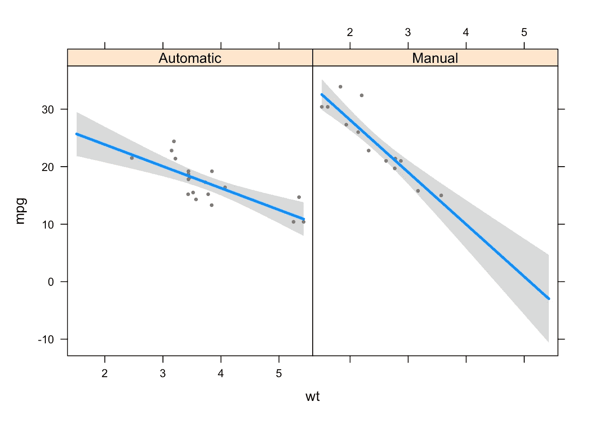**

**我们看到，与自动变速器的汽车相比，手动变速器的汽车重量和英里/加仑之间的关系更强(斜率更陡)。**

**这是一个很好的例子，说明当研究两个变量(比如 X 和 Y)之间的关系时，如果也有可能与 X 和 Y 都相关的其他变量的数据，将它们包括在回归中并根据这些变量有条件地分析关系**是很重要的。****

**忽略一些应该包含在模型中的变量可能会导致错误和误导性的结论，直到关系完全颠倒(这种现象被称为[辛普森悖论](https://en.wikipedia.org/wiki/Simpson%27s_paradox))。**

**摘要**

# **在本文中，我们首先提醒一下[简单线性回归](https://statsandr.com/blog/multiple-linear-regression-made-simple/#simple-linear-regression-reminder)，特别是它的[原理](https://statsandr.com/blog/multiple-linear-regression-made-simple/#principle)以及如何[解释结果](https://statsandr.com/blog/multiple-linear-regression-made-simple/#interpretations-of-coefficients-widehatbeta)。**

**这为更好地理解[多元线性回归](https://statsandr.com/blog/multiple-linear-regression-made-simple/#multiple-linear-regression)奠定了基础。在解释了其[原理](https://statsandr.com/blog/multiple-linear-regression-made-simple/#principle-1)之后，我们展示了如何[解释输出](https://statsandr.com/blog/multiple-linear-regression-made-simple/#interpretations-of-coefficients-widehatbeta-1)以及如何选择一个[良好的线性模型](https://statsandr.com/blog/multiple-linear-regression-made-simple/#how-to-choose-a-good-linear-model)。然后我们提到了几个[可视化](https://statsandr.com/blog/multiple-linear-regression-made-simple/#visualizations-1)，并以更多的[高级主题](https://statsandr.com/blog/multiple-linear-regression-made-simple/#to-go-further)结束了这篇文章。**

**感谢阅读。我希望这篇文章能帮助你更好地理解线性回归，并给你信心在 r。**

**和往常一样，如果您有与本文主题相关的问题或建议，请将其添加为评论，以便其他读者可以从讨论中受益。**

**参考**

# **奥斯汀，彼得 C，和 Ewout W Steyerberg。2015."线性回归分析中每个变量所需的受试者人数."*临床流行病学杂志*68(6):627–36。**

**恩斯特，安雅 F，卡斯帕 J 艾伯斯。2017.“临床心理学研究实践中的回归假设？对常见误解的系统回顾。”PeerJ 5: e3323。**

**詹姆斯、加雷思、丹妮拉·威滕、特雷弗·哈斯蒂和罗伯特·蒂布拉尼。2013.*统计学习入门*。第 112 卷。斯普林格。**

**有些人将回归分析视为推断统计学的一部分。这是真的，因为一个样本是用来评估一个群体中两个或更多变量之间的联系的。我倾向于将回归与推断统计区分开来，原因很简单:( I)回归通常在更广的范围内使用(用于预测分析等),并且因为(ii)线性回归的主要目标(参见本[部分](https://statsandr.com/blog/multiple-linear-regression-made-simple/#simple-linear-regression-reminder))不同于推断统计领域众所周知的置信区间和假设检验的目标。 [↩︎](https://statsandr.com/blog/multiple-linear-regression-made-simple/#fnref1)**

1.  **形式上，ANOVA 也可用于比较 2 组，但实际上我们倾向于将其用于 3 组或更多组，将 t 检验留给 2 组。 [↩︎](https://statsandr.com/blog/multiple-linear-regression-made-simple/#fnref2)**
2.  **关于数据集的更多信息可以通过执行`?mtcars`找到。 [↩︎](https://statsandr.com/blog/multiple-linear-regression-made-simple/#fnref3)**
3.  **请注意，当 X 不能等于 0 或在实践中没有意义时，最好避免解释截距。 [↩︎](https://statsandr.com/blog/multiple-linear-regression-made-simple/#fnref4)**
4.  **n 是观察次数。 [↩︎](https://statsandr.com/blog/multiple-linear-regression-made-simple/#fnref5)**
5.  **也接受 0 以外的其他值。在这种情况下，测试统计变为 tn2 =ˇβa/se(ˇβ1 ),其中 a 为假设斜率。 [↩︎](https://statsandr.com/blog/multiple-linear-regression-made-simple/#fnref6)**
6.  **请注意，可以通过两个变量的散点图或残差和拟合值的散点图来检查线性。在的[部分可以看到更多相关信息。](https://statsandr.com/blog/multiple-linear-regression-made-simple/#conditions-of-application-1) [↩︎](https://statsandr.com/blog/multiple-linear-regression-made-simple/#fnref7)**
7.  **您可以随时使用`relevel()`功能更改参考电平。查看更多[数据操作技术](https://statsandr.com/blog/data-manipulation-in-r/)。 [↩︎](https://statsandr.com/blog/multiple-linear-regression-made-simple/#fnref8)**
8.  **请注意，也可以对残差进行线性测试。 [↩︎](https://statsandr.com/blog/multiple-linear-regression-made-simple/#fnref9)**
9.  **安装完`{performance}`包后，您还需要手动安装`{see}`包。如果需要更多帮助，请参见[如何安装 R 包](https://statsandr.com/blog/an-efficient-way-to-install-and-load-r-packages/)。 [↩︎](https://statsandr.com/blog/multiple-linear-regression-made-simple/#fnref10)**
10.  **我使用阈值 10 是因为，如[James et al .](https://statsandr.com/blog/multiple-linear-regression-made-simple/#ref-james2013introduction)([2013](https://statsandr.com/blog/multiple-linear-regression-made-simple/#ref-james2013introduction))所示，介于 5 和 10 之间的值表示中度相关，而大于 10 的 VIF 值表示高度和*不可容忍的*相关。 [↩︎](https://statsandr.com/blog/multiple-linear-regression-made-simple/#fnref11)**
11.  **[Austin 和 Steyerberg](https://statsandr.com/blog/multiple-linear-regression-made-simple/#ref-austin2015number) ( [2015](https://statsandr.com/blog/multiple-linear-regression-made-simple/#ref-austin2015number) )表明，在使用普通最小二乘法估计的线性回归模型中，每个变量有两个受试者往往能够准确估计回归系数。我们的数据集包含 32 个观察值，远远超过每个变量两个受试者的最小值。 [↩︎](https://statsandr.com/blog/multiple-linear-regression-made-simple/#fnref12)**
12.  **如果您应用对数变换，请参见关于如何解释结果的两个指南:英文版[和法文版](https://sites.google.com/site/curtiskephart/ta/econ113/interpreting-beta)[分别为](https://www.parisschoolofeconomics.eu/docs/yin-remi/interpretation-des-coefficients.pdf)和。 [↩︎](https://statsandr.com/blog/multiple-linear-regression-made-simple/#fnref13)**
13.  **请注意，高 R^2 并不保证您选择了最好的变量或您的模型是好的。它只是告诉我们模型与数据吻合得很好。建议在比较模型时运用常识，不要只参考 R^2(特别是当 R^2 接近时)。 [↩︎](https://statsandr.com/blog/multiple-linear-regression-made-simple/#fnref14)**
14.  **主要有两种方法；向后向前。反向方法包括从包含所有可能相关的解释变量的模型开始，然后递归地去除降低模型的信息标准的变量，直到不可能降低为止。向前方法是向后方法的反向方法，从这个意义上说，我们从一个具有最低信息标准的单变量模型开始，并且在每一步都添加一个解释变量。默认情况下，R 中的`step()`函数组合了向后和向前方法。 [↩︎](https://statsandr.com/blog/multiple-linear-regression-made-simple/#fnref15)**
15.  **不要与`anova()`函数混淆，因为它提供的结果取决于变量在模型中出现的顺序。 [↩︎](https://statsandr.com/blog/multiple-linear-regression-made-simple/#fnref16)**
16.  **相关文章**

# **[手工假设检验](https://statsandr.com/blog/hypothesis-test-by-hand/)**

*   **[R 中的方差分析](https://statsandr.com/blog/anova-in-r/)**
*   **[R 中的离群点检测](https://statsandr.com/blog/outliers-detection-in-r/)**
*   **[R 中的 Wilcoxon 检验:如何在非正态假设下比较两组](https://statsandr.com/blog/wilcoxon-test-in-r-how-to-compare-2-groups-under-the-non-normality-assumption/)**
*   **[R 中的相关系数和相关检验](https://statsandr.com/blog/correlation-coefficient-and-correlation-test-in-r/)**
*   ***原载于 2021 年 10 月 4 日 https://statsandr.com*[](https://statsandr.com/blog/multiple-linear-regression-made-simple/)**。****

****Originally published at* [*https://statsandr.com*](https://statsandr.com/blog/multiple-linear-regression-made-simple/) *on October 4, 2021.****