# 多元线性回归 Python 101

> 原文：<https://towardsdatascience.com/multiple-linear-regression-python-101-af459110a8af?source=collection_archive---------3----------------------->

## [入门](https://towardsdatascience.com/tagged/getting-started)

## 数据准备和预测建模分步指南

[来源:Adobe 股票许可](https://stock.adobe.com/images/data-scientist-big-data-artificial-intelligence-machine-learning-technology-concept-silhouette-glasses-in-front-of-laptop-computer-screen-with-programming-coded/183306935?prev_url=detail)

开始使用 Python 构建您的第一个多元线性回归预测模型可能会令人生畏！这篇文章提供了一个基于 CRISP-DM 的实用工作流程、指南和示例代码。希望你会觉得有用，欢迎评论。

# 线性回归的概念性工作流程

数据挖掘的[跨行业标准流程](https://www.datascience-pm.com/crisp-dm-2/)是描述数据科学生命周期的领先流程模型。这个项目在建立线性回归模型时遵循以下战术工作流程。该流程图对 CRISP-DM 流程的四个子任务进行排序，涵盖数据理解、数据准备、建模和评估。

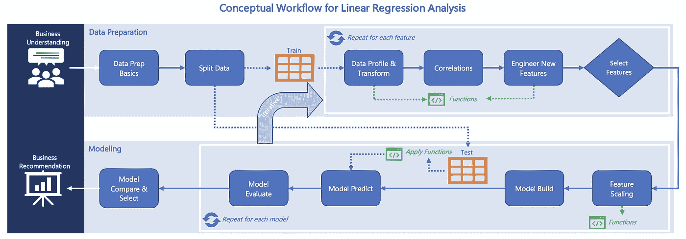

来源:作者

流程中固有的简单想法包括:

*   在太多的概要分析和分析之前拆分您的数据
*   为每个特性迭代一组通用的数据准备任务
*   遍历包含不同特性的各种模型
*   使用函数在整个项目中保持数据转换的一致性和代码效率

现在让我们开始，一步一步地完成一个项目。

# **数据准备工作流程**

我使用的是华盛顿金县的房屋销售数据集，它在 Kaggle 和数据科学训练营上很受欢迎。数据**包含 21 列，横跨>20000 个在 2014–2015**之间跨越 12 个月完成的西雅图大都会房屋销售交易。多元线性回归模型将使用普通最小二乘法(OLS)并预测连续变量“房屋销售价格”。

数据、Jupyter 笔记本和 Python 代码可在 [my GitHub](https://github.com/cutterback/p02-home-sales-predictive-project) 获得。

## **步骤 1 —数据准备基础知识**

为了开始了解我们的数据，该流程包括以下基本任务:

*   加载数据
*   组合和集成数据
*   转换数据类型
*   修复数据质量问题
*   删除重复项
*   使数据干净、格式化和可用的步骤

为了方便访问，我将我所有的库导入捆绑在一个地方。

下一步是加载我们的。csv 数据转换成熊猫数据帧，并采取窥视。

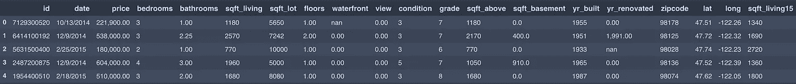

该文件包含住宅列表标准属性；我的笔记本里有一本数据字典。

乍一看，注意浴室中的小数值和 yr _ renovated 和滨水区中的“nan”null。下面使用 DataFrame.info()，我们注意到需要解决的数据类型和 null 问题。

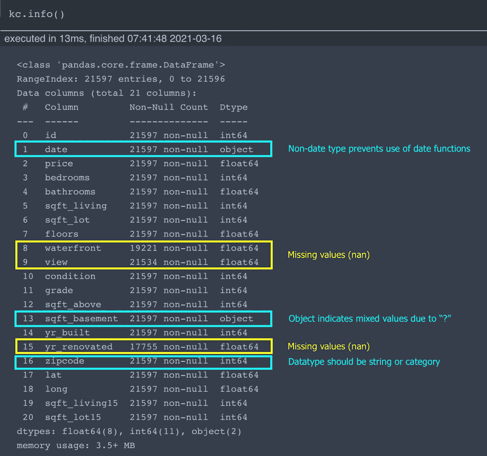

因此，基于这一点和这里没有显示的几个 Series.value_counts()，我们可以进行调整以清理我们的房屋销售数据。

现在让我们使用 Dataframe.describe()来看看基本的统计数据和范围。

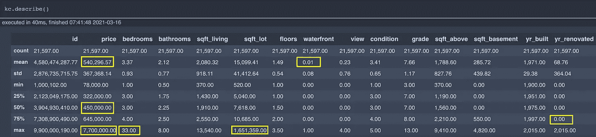

回顾上表可以看出:

*   价格:偏正，平均值高于中值。异常值为 770 万美元
*   卧室:异常值在 33
*   Sqft_Lot:在 1.6M 处有明显的异常值，平均值接近中值的两倍。
*   海滨:人口稀少，很少有 1。
*   yr _ revealed:75%的小部分房屋为 0。

经过一番考虑，我放弃了 33 间卧室的单个记录。除了这个记录，只有少数家庭有 8 或 9 间卧室，所以我只是把这个作为一个可能的数据输入错误。即使在几个属性上有其他异常值，我也没有过滤或删除任何其他记录。

处理重复数据、合并其他数据或任何其他常规数据准备任务都可以包含在此数据准备基础流程中。现在，数据是一致的，并且准备好被分割用于数据剖析、相关性分析和特征工程。

## **步骤 2——将数据分成训练集和测试集**

对于将在*新数据上使用的预测模型来预测生产*，在分析和分析之前拆分数据有助于防止数据泄漏。

> [数据泄露](https://machinelearningmastery.com/data-leakage-machine-learning/):当你用来训练机器学习算法的数据恰好拥有你试图预测的信息。

鉴于这一分析是一次性的历史工作，我在做了相关分析后将数据分开。这意味着我使用整个样本开发特性。然而，我在第 2 步展示了分离逻辑，以与上面的最佳实践图保持一致。

上面的 Python 代码片段创建了 X(预测值)和 y(目标值)数据集。作为目标因变量，我包括价格，价格的对数和价格的 box-cox 变换。这三个目标选项是在模型开发过程中反复开发的。

## 步骤 3 —数据分析和转换

剖析和可视化探索数据有助于评估潜在的特征和关系。虽然任何类型的探索都是公平的游戏，但我反复关注每个预测者 X(例如卧室)的这些目标*和目标 y(例如价格日志)*。

*   检查一段时间内的变量趋势
*   确认线性关系(X-y)
*   调查异常值
*   评估变量分布、正态性和偏斜
*   用一键编码转换变量类

**类别变量图**

我创建了一个函数(称为 distplots，在我的 Jupyter 笔记本中可用)来绘制任何 X 预测值，包括直方图、散点图、箱线图和前 N 个累积值。我假设我的模型中的一个变量是卧室，因为这通常是买卖房屋时的区分描述符。

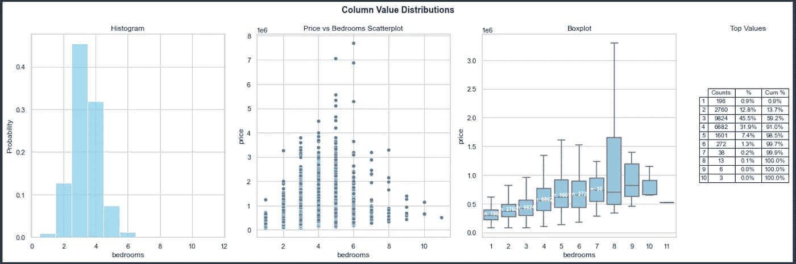

回顾输出，有几个观察结果:

*   剔除 33 间卧室的异常值后，只有 0.3%的家庭拥有 6 间以上的卧室
*   中位数逻辑上落在 3 到 4 间卧室之间
*   箱线图显示了随着卧室数量的增加，中值价格在增加

…但最终卧室和价格之间的相关性很弱，只有 0.32，没有影响我的模型性能，所以我没有考虑。

我还使用 distplots 函数来可视化其他变量。

**平均居住面积趋势**

如果你有基于时间的变量，分析趋势有助于看到方向或势头。例如，在过去的一个世纪里，家庭的平均居住面积增加了。由于一些老房子有更多的卧室，我绘制了第二个轴来查看每个卧室的居住面积。这里的代码是一个双轴条形图，带有使用 Seaborn 和 Matplotlib 库的趋势线。

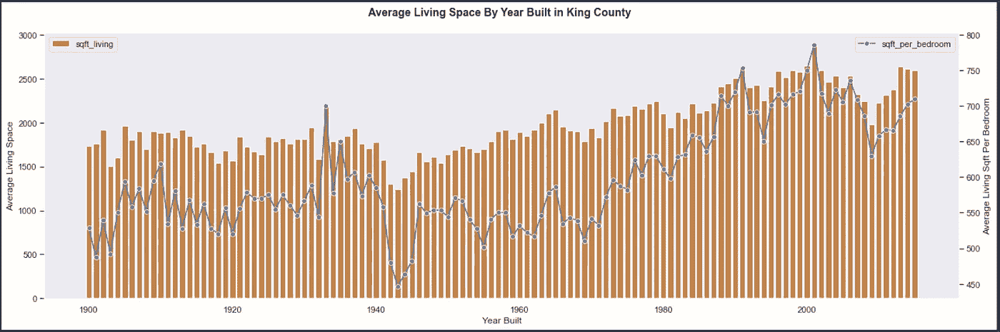

这张图表显示了 20 世纪 70 年代西雅图地区居住空间的“起飞”。对于自 1970 年以来建造的房屋，我们看到居住面积增加了 32%，平均卧室增加了 9%，每间卧室增加了 21%。sqft_per_bedroom 功能作为 living_sqft 的补充功能制作了最终模型。

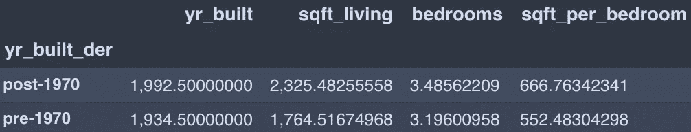

**Pairplot 关联分析**

另一种数据分析技术是直观地检查变量的交集以寻找关联。这里我使用了 Seaborn 的 pairplot，它为每个组合创建了一个散点图，在对角线上留下了一个直方图。

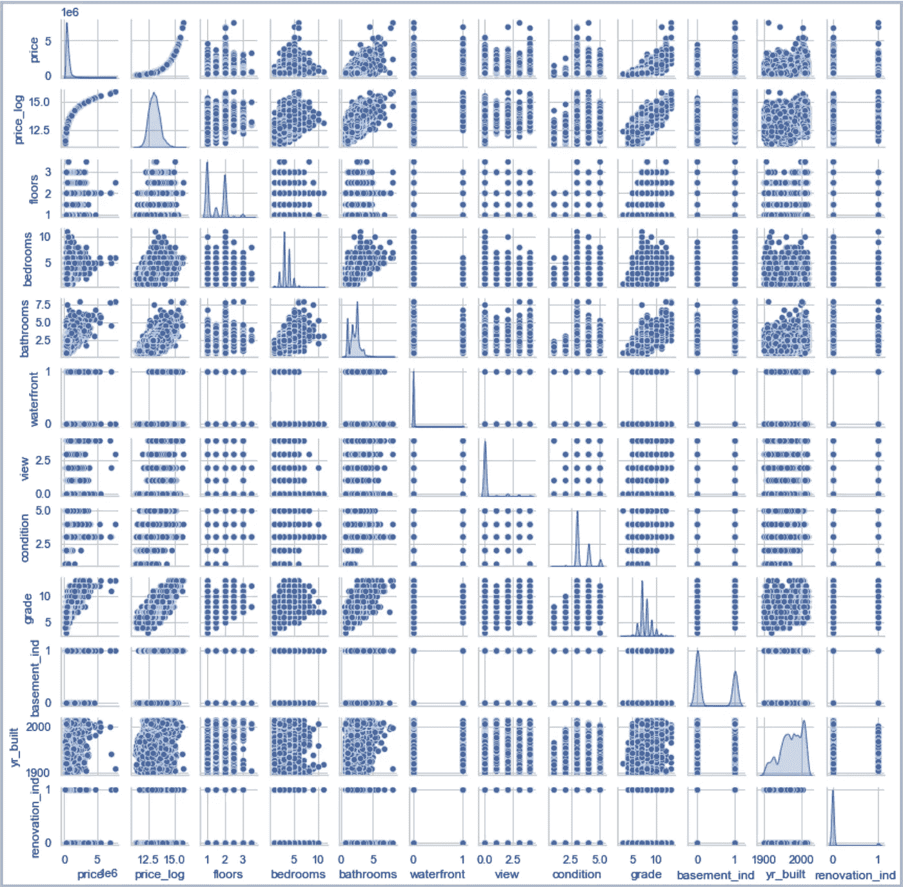

*   与价格成线性关系:等级、条件、浴室
*   价格不确定或非线性:建造年份、指标、卧室

**一键编码**

一种常见的方法是一键编码(OHE ),将分类变量转换为特征。我测试了几个 OHE 变量，如条件、等级、卧室和浴室，看看它们是否比连续变量表现得更好。我发现每一个都作为连续变量更好。

最后我得到了两个 OHE 变量:zipcode 和 grade_grp(将住宅建筑群从 3-13 简化为 4 类)。我用了熊猫。get_dummies()方法将要素透视到 OHE 列，删除第一个类以最小化纯多重共线性风险。

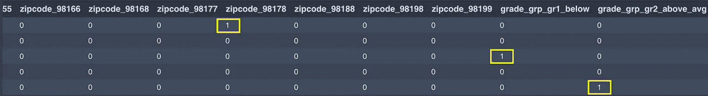

## 步骤 4 —相关性分析

下一步是查看与这些目标的相关性:

*   验证哪些预测要素(X)与目标(y)相关
*   检查多重共线性预测值之间的相关性

**皮尔逊相关系数(r) —目标 y**

根据预测值 price_log (y)检查每个要素(X)的皮尔逊相关系数。相关性将提供对在线性回归模型中表现良好的特征的洞察。我使用这些结果以及相关矩阵热图作为包含哪些功能的指南。

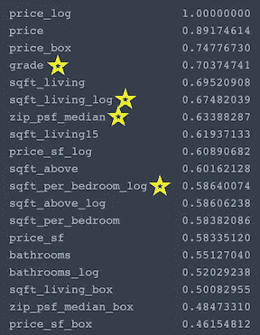

这四个标有星号的特征具有中等或强相关性，并构成了最终的 OLS 模型。

*   强相关性(0.6–0.8):sqft _ living，grade，sqft_above，zip_psf_median，sqft_living15
*   中度相关(0.4–0.6):浴室，景观

**检查多重共线性**

> 当自变量相关时，表明一个变量的变化与另一个变量的变化相关。相关性越强，改变一个变量而不改变另一个变量就越困难。—吉姆·弗罗斯特“回归分析”

查看预测值之间的相关性是避免选取具有可能导致模型无效的强多重共线性的要素的关键步骤。代码块创建变量对，并按照最高相关性对它们进行排序。

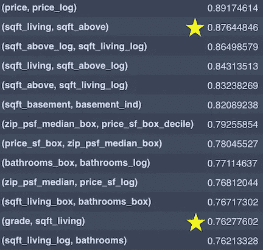

突出显示两种不同的场景(上面标有星号):

*   sqft _ living with sqft_above 0.876 correlation-我尝试在我的模型#3 中纳入 sqft _ above，但由于多重共线性而放弃了这一点。
*   Grade，Sqft_living 的相关系数为 0.76——即使高度相关，我也能够包含这两个特性，而不会出现重大问题。

这里的建议是高度重视使用皮尔逊或其他统计数据(如方差膨胀因子(VIF))的预测值相关性。

## **第五步——设计新功能**

第一次通过数据集创建线性回归模型时，最初可能不需要任何新功能。但是在您的第一次模型迭代之后，潜在的转换包括:

*   添加一个混杂变量以减少模型偏差
*   将要素转换为人均要素或表示为比率
*   使用求逆、对数、平方根或 box-cox 对特征进行幂变换
*   添加多项式特征(例如 X)以更好地拟合曲率
*   添加一个交互项，梳理出两个预测值之间线性关系的变化

对于金县房价销售预测，我研究了除多项式以外的所有上述方法。对于我的基线模型#1，让我们先看看简单的未转换数据是如何工作的。

*   目标变量:价格(未转换)
*   预测变量(前 6 个相关性):sqft_living、sqft_above、sqft_living15、浴室、视图、等级(全部未转换)

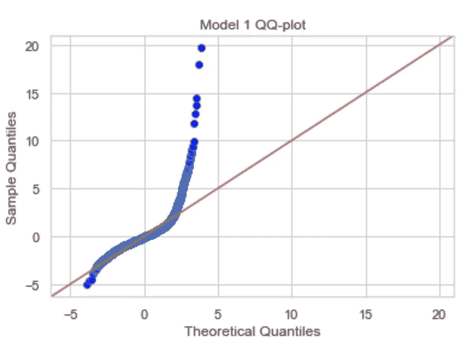

呀！

虽然模型#1 注册了 0.577 的调整后 r 平方值和显著的 p 值，但正如总体模型残差的 QQ 图所示，它具有巨大的偏斜和多重共线性。

我们显然需要观察预测值分布，并考虑其他特征。

**检查正常性并创建日志功能**

给定非正态残差和偏斜的价格分布，我创建了 Python 函数 check_normality 和 create_log，它接受一个 dataframe 列，创建一个日志序列并显示双直方图进行比较。

使用这些函数，我将 King County 价格序列转换为 price_log。如下所示的对数序列更加标准化，偏斜度接近 0，峰度略低于 1。在转换之前，price 的偏斜度超过 4，峰度为 35，有近 200 个观察值超过第 4 个标准差。作为一个指南，理想的正态性应该是偏斜接近 0，峰度在 0-6 之间，3 是理想的。

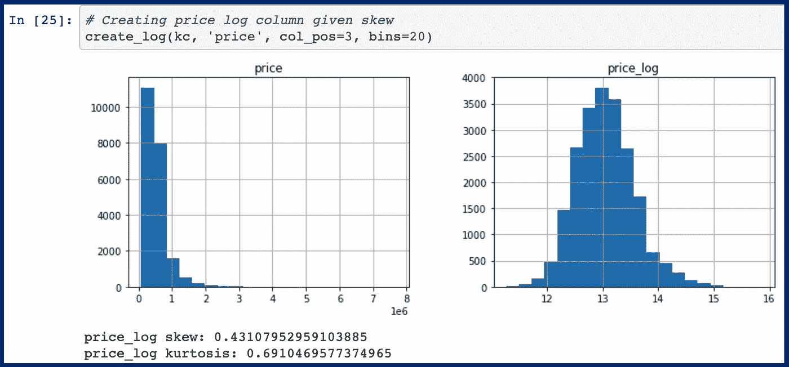

线性回归假设不要求因变量或自变量具有正态分布，只要求正态模型残差。我选定 price_log 作为模型迭代 2 号到 8 号的因变量，因为它提高了性能并消除了剩余曲线偏差。

**创建指标特征—改造和地下室**

在对数据进行分析并尝试将翻新年份作为一个特征之后，我决定包含分类指示器特征 revenue _ ind 和 basement_ind，其中 1 表示“是”。

**按邮编划分的每平方英尺价格中位数**

将邮政编码纳入模型非常重要，因为不同地理区域的价格差异很大。在模型#6 中，我首先使用 70 个邮政编码作为一次性编码的分类变量，但是由于残差非常差，所以放弃了这个模型。相反，我添加了一个特征“每平方英尺的中值价格”，我将它应用于 zipcode 的数据。该特征的 box-cox 变换版本最终是重要的，因此被包括在最终的模型#8 中。

**距离西雅图市中心几英里**

该功能使用每个家庭的纬度和经度来测量到西雅图中心的距离。该功能实际上是在上述邮政编码每平方英尺价格之前创建的，基于这样的想法，即城市人口中心附近的价格通常较高。最初，这一功能非常重要，但一旦与邮政编码每平方英尺的中位数价格一起纳入，它就失去了大部分影响力。

## **第 6 步——选择特征**

数据准备的最后一步是选择在回归模型的下一次迭代中包含哪些要素。这个实验过程是由你完成的数据分析和先前的模型结果决定的。

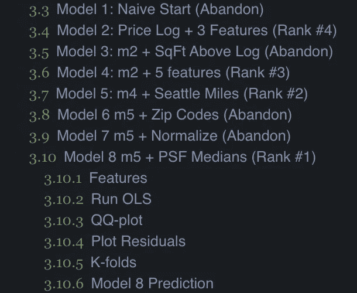

我的方法是制作一个仅包含所选特征的训练和测试数据的副本，这样我就有一组数据帧和模型结果专门用于每个模型迭代。

我在我的笔记本上保存了 8 个模型迭代，但是在特性、转换、缩放等方面至少运行了两倍多的实验。我认为我的四次迭代在统计上是有效的，而四次迭代由于性能、残差或多重共线性而被放弃。我停在了包含以下特征的 8 号模型上。

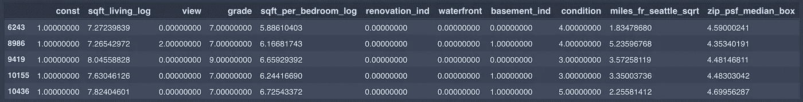

# **建模工作流**

选择特性决策是我们从数据准备到建模工作流的转换点。在这一部分，我将只关注最终的模型#8 过程和结果。在下面的每个模型构建和模型预测部分，我都包含了相关的模型评估步骤。

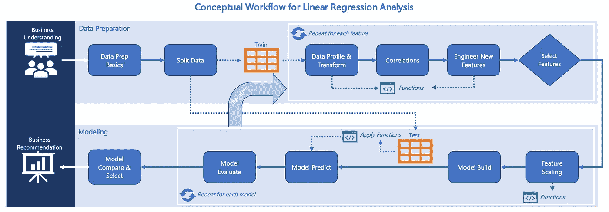

来源:作者

## **步骤 7——特征缩放**

在构建(拟合)线性回归模型之前，要素缩放步骤包括标准化(归一化)、居中或缩放要素所需的任何方法。您可能使用的常见 sklearn 函数包括 StandardScaler、MinMaxScaler 或 RobustScaler。对于我的最终模型，我没有缩放任何功能。

## **第 8 步——模型构建**

函数 calc_sm_ols 接受 X 和 y 数据帧，并符合 statsmodel 普通最小二乘法(ols)回归模型。该函数打印模型摘要、均方根误差(RMSE)和平均绝对误差(MAE)，并将 price_log 转换回可解释的形式。

让我们将模型 8 的特征与我们的训练数据相匹配，看看我们看起来如何。

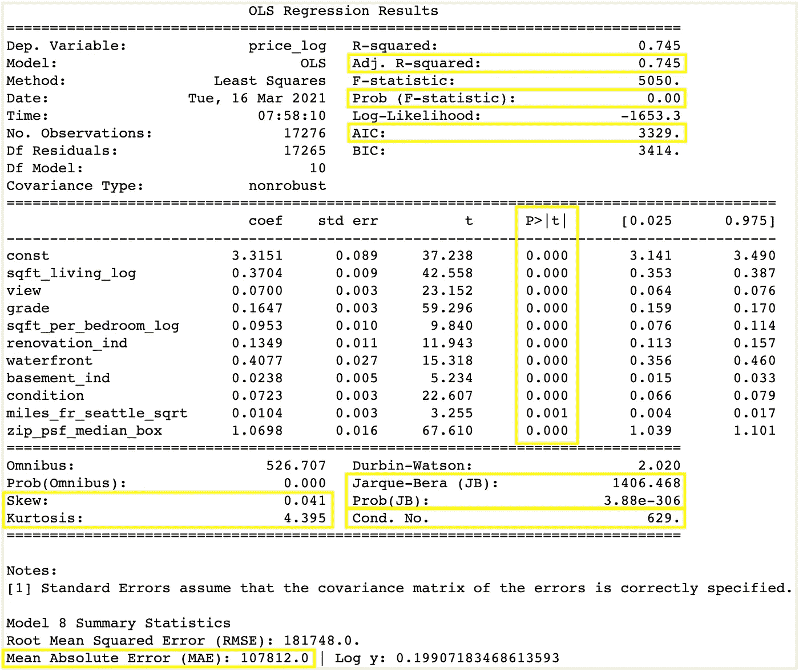

黄色框中的统计数据是关键的性能组件:

*   **调整后的 R 平方:** 0.745 表示模型解释了 74.5%的方差。这是我的模型中最好的，我对残差感到满意。
*   **总体 p 值:** 0.00 表示我们可以拒绝零假设；在 alpha 为 0.05 的情况下，模型结果的 p 值非常显著。
*   **赤池信息标准** ( **AIC** ): 3329 是我认为统计有效的四个模型中最低的，表示最好。
*   **特征 p 值:**所有 10 个特征的 p 值都低于 0.05，因此我们可以拒绝任何特征的结果是由于随机性的观点。
*   **偏斜:**模型在 0.041 处得分接近 0，表明残差分布接近正态。
*   **峰度:**4.395 分在 0-6 的理想范围内，接近正态分布峰度 3。这表明残差分布尾部比正态分布稍重，但是可以接受。
*   **JB 和 Prob(JB):** 基于接近 0 的概率(JB)，这进一步支持了我们有回归误差的近正态分布。
*   **条件编号:** 629 可能表示要素之间存在多重共线性，但不足以对 OLS 汇总发出警告。Statsmodel 文档建议该值应低于 20。
*   **平均绝对误差(MAE):** $107，812 表示预测房价的平均误差。我把重点放在 RMSE 平均误差上，以减少对大的异常残差求平方的影响。请记住，房价从不到 10 万美元到超过 700 万美元不等。

因此，总的来说，整个模型结果看起来很可靠，不完美，但在给定的可用数据和我的时间分配下，这是我能想到的最好的结果。

**总体 QQ 图**

让我们使用函数 qqplot 来直观地检查整体模型残差。

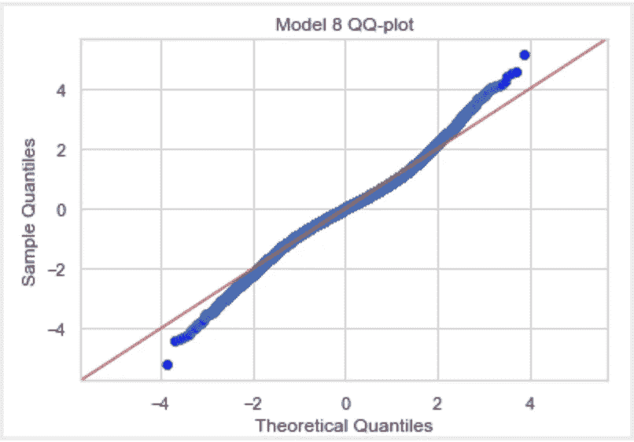

当查看 QQ 图时，完全标准化的残差将沿着红色对角线。我们的两条尾巴都掉了，尤其是每一端的最后一点。这些表示模型预测不正确的异常值，会生成较大的 RMSE 值。在未来的迭代中，我会努力改进这一点。

**特征残差图**

我们还需要检查每个独立变量的残差分布，以确认每个变量都是[同方差的](https://en.wikipedia.org/wiki/Homoscedasticity)。如果我们在残差中看到模式而不是随机性，我们的假设可能不可信，我们可能高估了拟合优度。函数 plot_residuals 循环遍历每个要素以绘制残差。

在 10 个特征中，9 个看起来很棒，1 个有趋势。让我们首先看一个例子，其中残差图在 sqft_living_log 特性上看起来很好。在右上方的框中，您可以看到残差的分布在 0 的上方和下方，几乎是随机的。这是我们希望看到的。

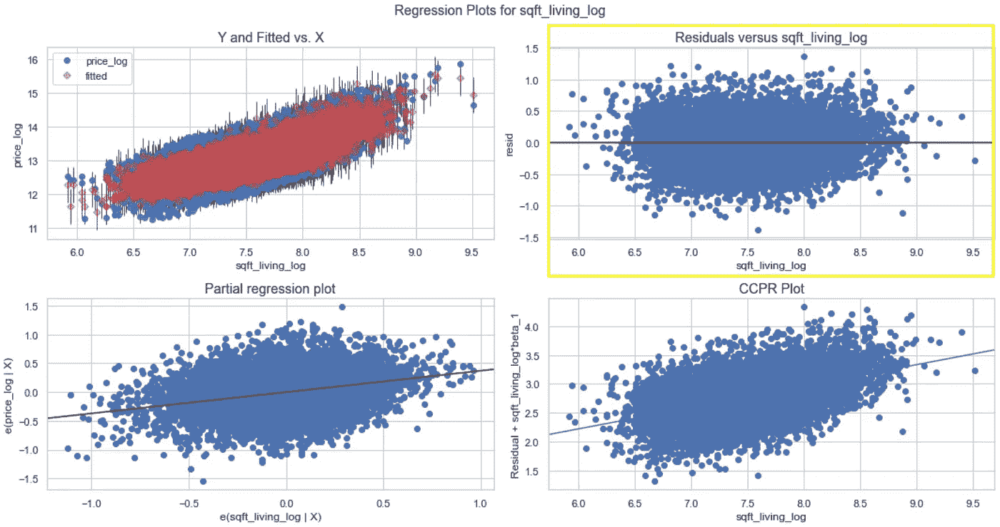

在我们的 zip_psf_median_box 特征中，残差确实显示出轻微的下降趋势。这可能表明这个特性需要一些调整，或者我们有一个混杂变量，我们应该在未来的迭代中合并。

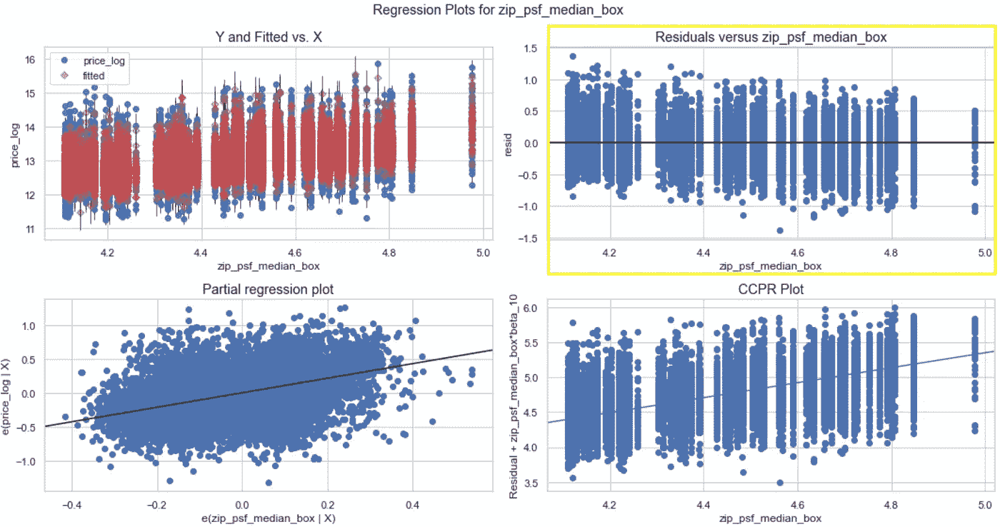

**K 重交叉验证**

熟悉模型的最后一步是使用 sklearn.model_selection 中的 k-folds。我对我们的完整样本进行了 5 次分割，以确保原始数据集中的每个观察值都有机会反复出现在训练集和测试集中。

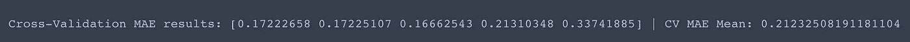

使用 5 k 倍的交叉验证导致平均 MAE 为 0.2123，而我们的 OLS 模型总结为 0.19907(在 price_log 上)。虽然 6.6%的差异比我想要的略高，但我相信这个模型是合理的。

我既使用了训练测试分割(80/20 ),也将 k 倍应用于整个样本。

## 步骤 9 —模型预测

现在，在最后一段，让我们使用我们的 X_test 和 y_test 数据，这些数据还没有暴露给我们的模型。下面的函数“预测”接受测试和训练数据来应用模型。输出包括用于评价的 RMSE 和 MAE 比较摘要。

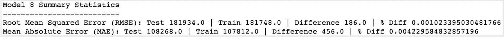

这种比较看起来是可靠的，因为试验预测产生了 108，268 美元的平均寿命，与列车平均寿命相差不到 1%。我们准备进入最后的选择环节。

## **步骤 10 —型号比较&选择**

我开发的 8 个正式模型中只有 4 个被认为是有价值的。推荐的模型#8 是迄今为止最好的，产生 10.8 万美元的 MAE 和 0.745 的调整 R 平方。与模型#2 相比，模型#8 代表了 MAE 中 38K 美元和调整后 R 平方中 0.174 美元的累积改善。

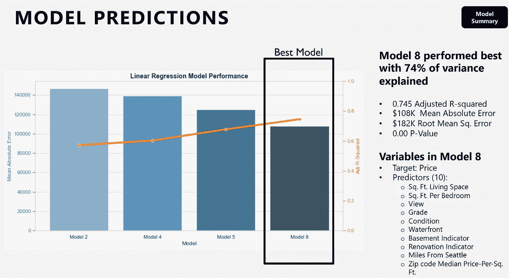

向企业描述这种多元线性回归模型的一个挑战是，我们有 10 个特征，并使用了几个对数转换。这使得可解释性变得困难。下面的可视化过滤了 7 个“平均”预测值，然后绘制了这个预测子集(244 个测试观察值)以显示价格和居住平方英尺之间的关系。

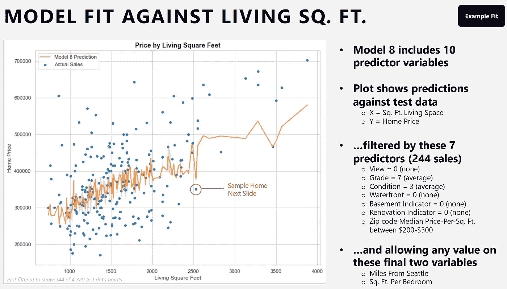

深入单个预测可以描述功能的相对影响。按照上面圈出的点来显示这个单独预测的组成。

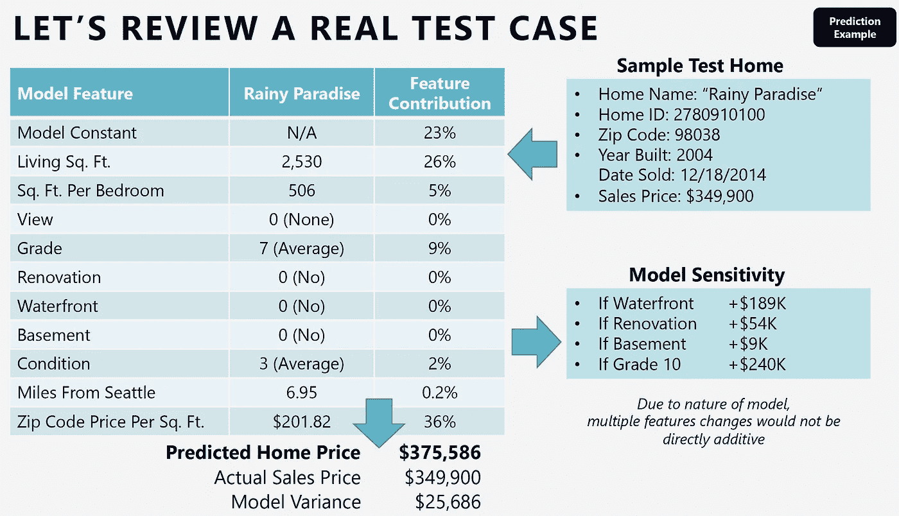

给定对数性质和分类变量，特征的相对重要性将因每个家庭而异。但至少对于这个家，我们可以评估以下几点:

*   他们的邮政编码中的模型常数、居住平方英尺和每平方英尺价格驱动了 85%的预测价格。
*   其他特征等级，每间卧室的面积，条件和距离西雅图市中心的英里数贡献了另外的 15%。

这个特别的住宅“雨天天堂”没有我们模型中的四个特征(根据这个住宅销售的数据，所有特征都是 0)。

*   海滨:如果是真的，预计价格会增加 18.9 万美元以上
*   翻新:如果属实，预计价格将增加 54，000 美元
*   地下室:如果是真的，将增加 9K 美元的预测价格
*   等级 10(vs . 7):如果是真的，将会在预测价格上增加 24 万美元

希望这种分析能使模型更加真实，并告知相关的特性重要性和敏感性。

# 最后的想法

感谢你坚持看完这篇冗长的帖子！我想在一个地方布置一个端到端的多元线性回归工作流程。我推荐的型号 8 不错，但我对六位数的 MAE 感到失望。如果我有更多的时间，我会继续优化这些模型，首先从以下几个方面着手:

*   更深入地看看异常值，或者也许将豪华模型与核心模型分开。
*   使用纬度和经度来尝试隔离邻域，并在邻域级别生成相对于邮政编码的每平方英尺价格中值。
*   更详细地看多项式和相互作用项。

请留下你的评论或想法！

 [## 通过我的推荐链接加入媒体-查克·厄特巴克

### 加入我的推荐链接- Chuck Utterback，从我自己和所有的人那里获得高质量的文章

chuckutterback.medium.com](https://chuckutterback.medium.com/membership)