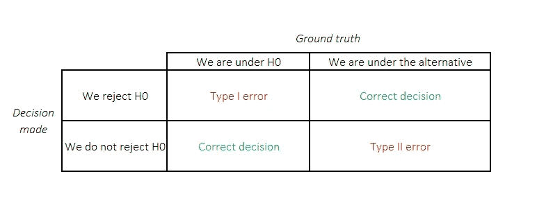
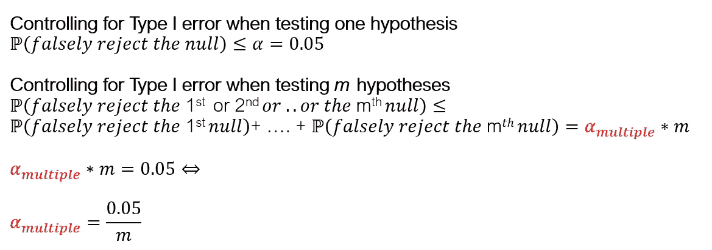
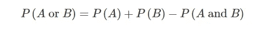
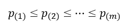
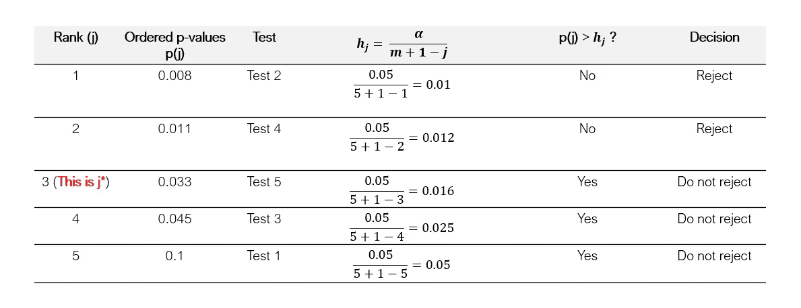
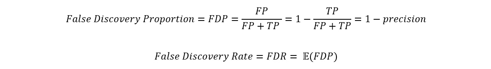
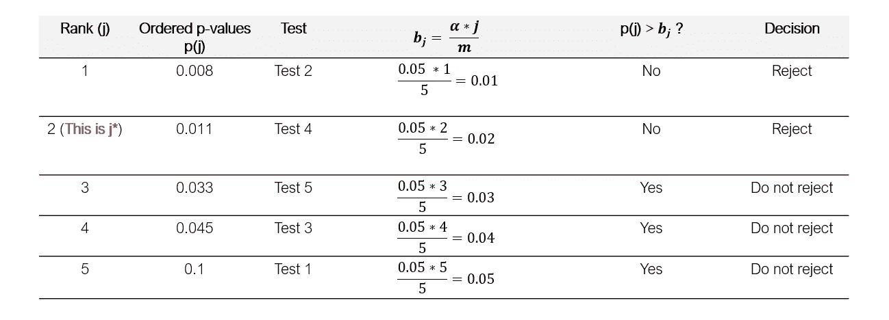

# 多重测试——你如何调整？

> 原文：<https://towardsdatascience.com/multiple-testing-how-should-you-adjust-41048eab4a3d?source=collection_archive---------10----------------------->

## [思想和理论](https://towardsdatascience.com/tagged/thoughts-and-theory)

## 概述多重测试调整以及如何控制家族错误率(FWER)和错误发现率(FDR ),并附有实例

照片由 [Riho Kroll](https://unsplash.com/@rihok?utm_source=medium&utm_medium=referral) 在 [Unsplash](https://unsplash.com?utm_source=medium&utm_medium=referral) 上拍摄

随着用于探索目的的大规模数据集的使用，多重检验调整越来越受欢迎。它现在是统计推断问题中的一个关键考虑因素。

多重测试问题的常见例子包括测试几个变量是否对给定的结果有影响，或者测试单个变量对无数结果的影响。例如，在全基因组关联研究(GWAS)中，研究人员对测试表型和数百万 DNA 核苷酸突变之间的关系感兴趣。

在本文中，我将讨论传统的多重测试的频率主义方法，其中心是 *p 值*。我们将回顾 Bonferroni 校正法、Holm 法和 Benjamini-Hochberg 法。其他流行的(有时更强大的)方法，如 Scheffé的，Tukey 的，和重采样方法将不包括在内。本文的结构是受 Tibshirani 等人的“*统计学习介绍*”(ISL)中的一章的启发。

## ***(一)假设检验和 p 值:快速复习***

## ***(II)控制家庭误差率(FWER)***

## ***(三)控制误发现率***

结束语将讨论如何进行多重检验，以及一般的假设检验。本文末尾还提供了 ISL 教科书中实验部分的链接，并附有 R 代码。

# ㈠假设检验和 p 值:快速复习

在开始多重测试之前，让我们快速回顾一下进行假设测试时要遵循的 4 个步骤。*下面的表 1* 提醒人们在检验假设时可能犯的两种错误(第一类错误*或假阳性率，第二类错误*或假阴性率)。**

表 1:假设检验中的第一类和第二类错误(作者)

## ***(步骤 1)定义 H0(零假设)、置信水平和功效***

传统上，我们希望得出一个置信度为 95%，统计能力为 80%的结论。“置信水平”是(1- *第一类误差)*,“统计功效”是(1- *第二类误差*)。我们修正了*I 型* *误差 a* t 5%并期望**谎称一次发现 5%** 。

## (步骤 2)使用观察到的数据，构建一个检验统计量来检验假设

通常，这是基于 *z* 、 *t* 或*卡方*分布。

## ***(步骤 3)计算 p 值***

p 值是对我们在步骤 2 中构建的检验统计量的极端程度的度量，该检验统计量假设了无效的零假设。

## ***(步骤 4)做出拒绝的决定，或者做出不拒绝零假设的决定***

这个决定是基于 p 值和预定义的*类型 I* 错误率:如果 p 值低于 0.05，我们拒绝零假设。

> 使用这个框架测试大量的假设需要特别的考虑。因为我们将第一类错误固定在 5%,在规则性条件下，我们平均会错误地拒绝 5%的空值。这意味着**如果我们同时测试 1000 个假设，我们预计会在 50 个中声称错误的发现。
> 这就是多重测试调整的重要性。**

那么，我们如何调整多重测试呢？

# (二)控制家庭误差率

当测试**一个**假设时，我们担心错误地拒绝**一个**零假设。当同时测试多个假设时，我们反而会担心错误地拒绝第一、第二… **或第** *m* 个无效假设。

我们将族式错误率(FWER)定义为出现至少一个*类型 I* 错误的概率。控制 FWER 最常用的两种方法是(Bonferroni 校正和(B) Holm 程序。

***(一)邦费罗尼*** 的修正

Bonferroni 校正:推导(作者)

Bonferroni 校正是基于加法基本规则的一个不等式:

添加规则(按作者)

在上述推导中，我们寻找将 FWER 控制在 0.05 的量“alpha 倍数”，这导致简单地将 *alpha* 除以假设*m*的数量，因此在实践中，**如果 p 值低于期望水平 *alpha* / *m*** ，则认为 p 值是显著的，其中 *m* 是被测试的假设的数量。

Bonferroni 修正保证我们不会做出错误的肯定声明(*第一类错误，*)，但这是以做出错误的否定声明(*第二类错误*)为代价的。当被检验的假设不独立时，由加法法则得出 P(A 或 B) < < P(A) + P(B)。因此，Bonferroni 校正通常需要比所需更大的实际 FWER，并且被认为是**保守**、，而不是一般的最佳方法。当 p 值不独立时，Tuckey 等其他方法可以提供更合适的替代方法。

**使用 Bonferroni 校正的多重测试示例:**

让我们假设我们同时运行了 5 个测试，并得出以下结果:

表 2:5 个同步假设检验的结果(按作者)

让我们将置信水平 *alpha* 设置为 0.05。

我们进行 5 次测试，所以 m=5
并且 Bonferroni 阈值是:a *lpha* /m = 0.05/5 = 0.01

因此，我们拒绝测试 2 的零假设，其中 p 值为<0.01

***(B)霍尔姆程序***

霍尔姆的程序也控制 FWER，但是**通常会比邦费罗尼修正**拒绝更多的无效假设，产生更少的*类型 II* 错误，并提供更大的能力。

霍尔姆的程序包括以下步骤:

1.  指定 FWER *alpha* 级别
2.  计算待测试的 *m* 个假设的 p 值
3.  p 值排序

有序 p 值

4.计算[1… *m* 中 *j* 的下列量

并将排序的 p 值与每个对应的 *hj* 进行比较。

5.寻找最小的 j 验证:

记为 j*

**续例:使用霍尔姆程序的多重测试:**

表 2:5 个同步假设检验的结果(按作者)

下表显示了执行霍尔姆程序的结果:

表 3:使用 ***霍尔姆程序*** 控制**前进**(作者)

使用霍尔姆的程序，我们拒绝了测试 2 和 4 的零假设。
请注意，在进行 Bonferroni 校正时，我们仅拒绝了测试 2 的空值。

Bonferroni 和 Holm 的程序不做任何假设(例如使用的测试统计、测试统计的独立性),可用于任何情况。

> 一般来说，当大量假设被检验时，控制 FWER 是有代价的。虽然分析师不太可能做出假阳性的断言，但他们也可能完全失去拒绝任何无效假设的能力:当测试太多假设时控制 FWER 会导致低统计能力。

为了获得新的科学发现，分析师可以容忍一些假阳性，并在后续研究中进一步调查这些发现。这就是控制错误发现率(FDR)发挥作用的地方。

# **(III)控制错误发现率(FDR)**

错误发现**率** (FD **R** )定义为错误发现比例的*期望*。

实际上，没有观察到错误发现**比例** (FD **P** )，因为不知道一个给定的假设将是真还是假(否则，我们可能不必测试它)。

注意，FDR 也是(1-**)*的*期望*。*

**

*将 FDR 控制在水平*α*保证了**平均来说，不超过*α%*的被拒绝的空值是假阳性**。实际上，这种程序没有标准的α水平。事实上， *alpha* 将取决于场景:FDR 方法本质上是探索性的，而不是验证性的。分析师愿意在犯一些错误的同时拒绝一些假设，并可以设计后续研究来证实他们的发现。如果数据收集和随访研究费用昂贵，那么 FDR 可能会低于或高于。*

****(A)使用 Benjamini-Hochberg 程序*** 控制 FDR*

1.  *指定控制 FDR 的 *alpha* 级别*
2.  *计算要测试的 *m* 个假设的 p 值*
3.  *p 值排序*

**

*有序 p 值*

*4.计算[1…*m**j*的下列量*

**

*并将排序的 p 值与每个对应的 *bj* 进行比较。*

*5.寻找最小的 j 验证:*

**

*记为 j**

**

***续例:使用 B-H 程序的多重测试:***

*在实践中，我们将不止对 5 个假设运行这个过程，但是为了一致性，我们保留相同的例子。*

*让我们想象一下，我们正在进行一项探索性研究，我们愿意在我们的发现中接受多达 5%的假阳性。*

**

*表 2:5 个同步假设检验的结果(按作者)*

**

*表 4:使用 **Benjamini-Hochberg 程序**控制 **FDR** (作者)*

*使用 B-H 的程序，我们拒绝了测试 2 和 4 的零假设。*

*在我们的示例中，**只要 p 值(即测试的假设)是独立的(或轻度相关的)，该程序保证平均不超过 5%的发现是假阳性，**。*

# *结束语和建议*

*基于 *p 值*的假设检验存在许多缺陷，以至于越来越多的人支持将统计显著性的阈值从 0.05 降低到 0.005。*

*假设检验通常依赖于理论分布，而理论分布有时是不可用的。当使用理论分布时，分析师需要确保模型假设不会被严重违反，因为这可能会使 p 值膨胀或收缩。例如，违反基本分布或协方差矩阵假设可能会导致测试统计数据膨胀和 p 值更显著。重采样方法可能是有用的，特别是当没有理论上的零分布可用时(例如，如果数据严重偏斜和零膨胀，以至于基于 t 统计的检验不再合适)。*

*通常，分析师需要定义分析是验证性的还是探索性的。目标是测试数千或数百万个假设以获得未探索领域的知识，还是测试 5 种干预措施中的一种是否对人群有影响？如果分析是探索性的，分析师可以专注于 FDR，并使用一些空间来做出发现。如果分析是确定性的，基于 Holm 程序、Tuckey 或 Scheffé方法的调整可能更合适。*

*无论是验证性的还是探索性的，评估被测试的假设的独立程度总是很重要的。如果假设是相关的，Bonferroni 调整要保守得多，甚至 Holm 的程序也只在满足独立性假设时保证 FDR。*

*最后，无论实验的性质如何，都需要重复和验证来加强对科学主张的信心，并且经常建议进行额外的数据收集和后续研究。统计分析应侧重于点估计和置信区间估计，并涉及元分析方法，以利用重复实验的结果来加强科学发现的可信度。*

***资料来源:**
*《统计学习导论》，提布拉尼等著**

*关于 **R 代码**请参考此链接**:**[https://hastie.su.domains/ISLR2/ISLRv2_website.pdf](https://hastie.su.domains/ISLR2/ISLRv2_website.pdf)(第 582 页)*