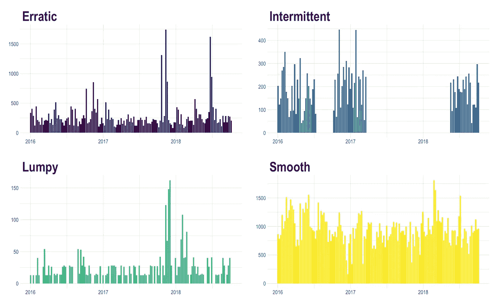
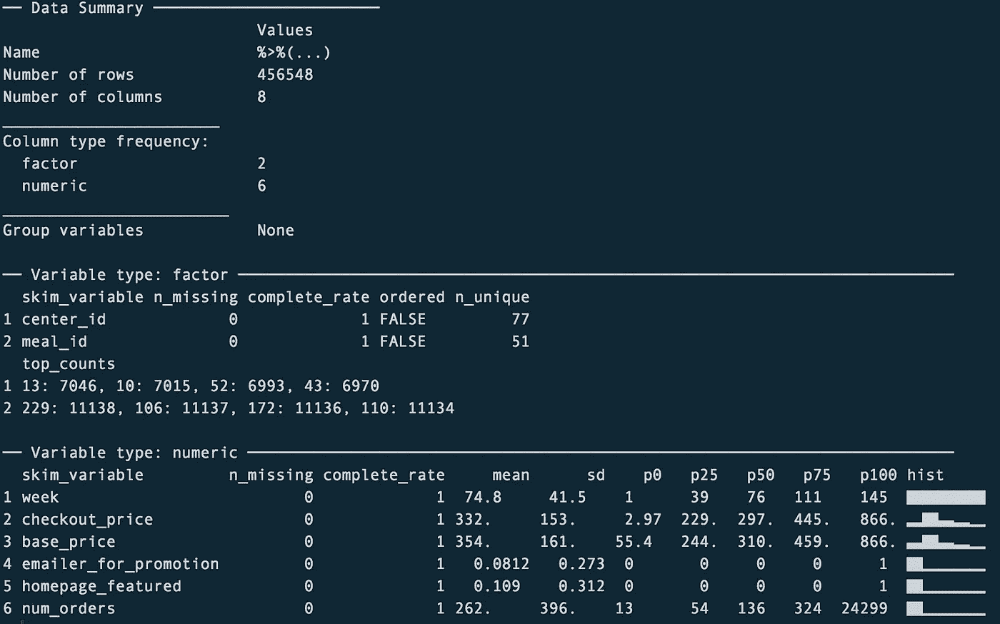
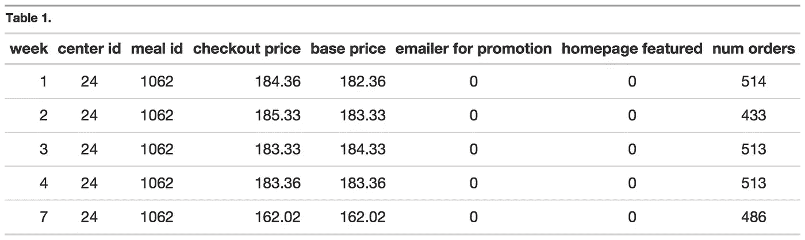
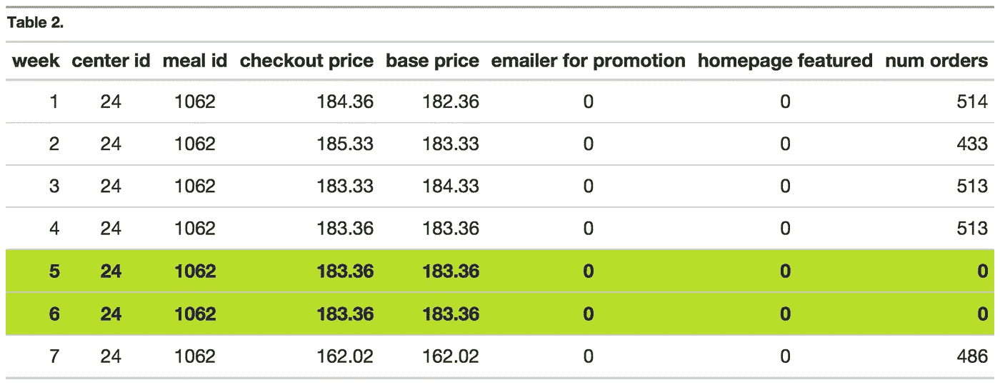
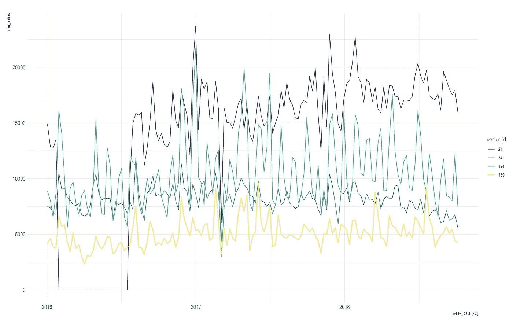
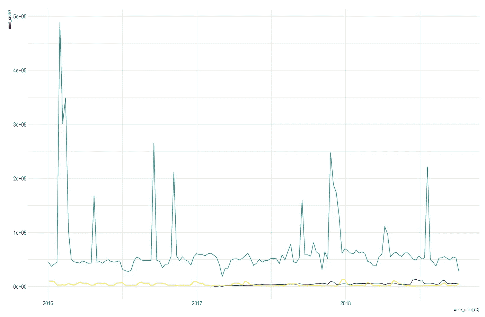
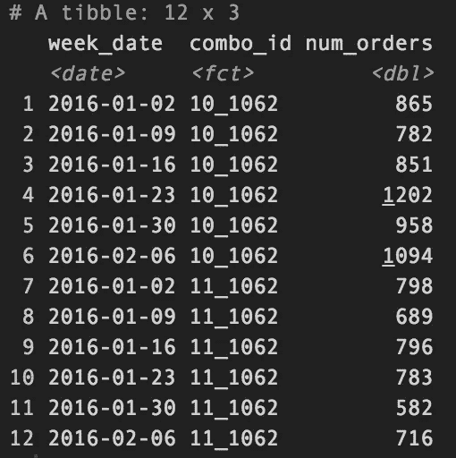
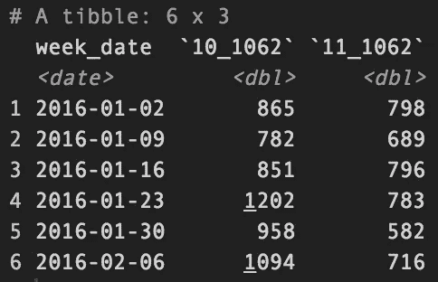
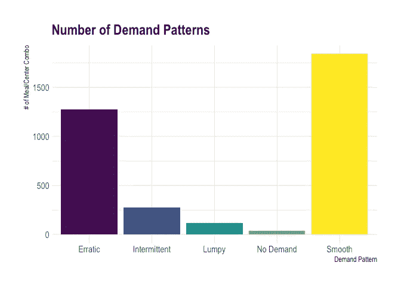

# 基于 R 的多时间序列预测和需求模式分类—第一部分

> 原文：<https://towardsdatascience.com/multiple-time-series-forecast-demand-pattern-classification-using-r-part-1-31601158d33b?source=collection_archive---------11----------------------->

## Syntetos Boylan Croston (SBC)类型，整齐的预测，需求模式



T 这里我们要重点介绍 ***时间序列预测*** ( *利用统计/机器学习/深度学习模型预测未来值)* & ***需求模式分类*** ( *根据数量和时间对产品进行分类*)。

在这篇博客中，我将解释我们如何使用统计(经典模型)、机器学习&深度学习模型、时间序列特征工程&需求模式分类来拟合**多个(1000+)** 时间序列模型。该系列将具有以下 **5** 部分:

> **第一部分:**数据清洗&需求分类。
> 
> [**第二部分:*****统计时间序列模型*** (ARIMA、ETS、克罗斯顿等。)使用 fpp3(整齐预测)R 包。](https://gouthaman.medium.com/multiple-time-series-forecast-demand-pattern-classification-using-r-part-2-13e284768f4)
> 
> [**第三部分:**时间序列 ***特征工程*** 使用 timetk R 包。](https://gouthaman.medium.com/multiple-time-series-forecast-demand-pattern-classification-using-r-part-3-8473e47edf6e)
> 
> **第四部分:**拟合 ***机器学习模型*** (XGBoost，Random Forest 等。)*&***超参数调整*** 使用 modeltime & tidymodels R 包。*
> 
> ***第五部分:**拟合 ***深度学习模型***(NBeats&DeepAR)&超参数调优使用 modeltime，modeltime.gluonts R 包。*

*我们开始吧！*

*PS:这不是解决这个问题的唯一方法。然而，这是解决这个问题的一种方法。*

## *数据*

*我使用的数据来自 AnalyticsVidhya 的 [*食品需求预测黑客马拉松*](https://datahack.analyticsvidhya.com/contest/genpact-machine-learning-hackathon-1/#LeaderBoard) *。*本次黑客马拉松的目标是预测送餐服务的每餐/中心套餐的订单数量。我们总共有 3548 份*套餐/中心套餐(即 77 家中心& 51 份套餐)，这意味着 ***将需要安装 3548 个时间系列型号*** 。这种技术在商业环境中也被称为 ***可扩展*** 预测。**

**让我们导入库。**

```
**pacman::p_load(tidyverse, magrittr) # data wrangling packagespacman::p_load(lubridate, tsintermittent, fpp3, modeltime, timetk, modeltime.gluonts, tidymodels, modeltime.ensemble, modeltime.resample) # time series model packagespacman::p_load(foreach, future) # parallel functionspacman::p_load(viridis, plotly) # visualizations packagestheme_set(hrbrthemes::theme_ipsum()) # set default themes**
```

**现在读取训练数据以拟合时间序列模型，并提交数据以预测未来值。**

```
**meal_demand_tbl <- read.csv(unz("data/raw/train_GzS76OK.zip", "train.csv")) # reading train datanew_tbl <- read.csv("data/raw/test_QoiMO9B.csv") # the data need to forecastskimr::skim(meal_demand_tbl %>% 
              # remove id
              select(-id) %>% 
              # make center & meal id factors
              mutate(center_id = factor(center_id),
                     meal_id = factor(meal_id))) # summary of data**
```

## **数据预处理**

**在这个阶段，执行数据预处理步骤。该数据随后被转换为时间序列数据(即转换为 *tsibble* 对象:这是一种特殊类型的数据，用于处理 *fpp3* 包中的时间序列模型)。**

****

**一览表**

**上述总结表明，77 个中心出售 51 种膳食，这就产生了总共 3，548 个时间序列数据，每个时间序列数据包括 145 周。这里我们需要预测每份套餐的订单数量(`num_orders`)。此外，通过查看列`complete_rate`，我们可以看到变量中没有缺失值。**

**列`week`是从 1 到 145 的数字，所以我们需要将其改为日期。我们还将删除不需要预测的组合(餐饮/中心)。**

```
**date_list <- tibble(id = seq(1, 155, 1),
                    week_date = seq(from = as.Date("2016-01-02"), by = "week", length.out = 155))master_data_tbl <- meal_demand_tbl %>%
  left_join(date_list, by = c("week" = "id")) %>% # joining the date
  inner_join(distinct(new_tbl, meal_id, center_id), by = c("meal_id", "center_id")) %>% # remove combos that did not want to forecast
  select(week_date, num_orders, everything(), -c(week, id))**
```

**现在让我们将训练和提交数据转换成完整的数据，即通过插入新的`date`行将不规则时间序列数据转换成规则时间序列数据。这些新创建的`date`行为`num_orders` &其他变量生成缺失值。因此，**零**是通过假设在这些特定的几周内没有销售发生而为变量`num_orders` 估算的，对于其他变量，我们用它们相应的上周值替换它们。**

**例如，下面的时间序列数据(表 1)显示，在第 4 周之后，直到第 7 周都有数据丢失。表 2 显示了缺失周(即第 5 周和第 6 周)的完整数据和新条目。**

****

**表 1**

****

**表 2**

**然后`emailer_for_promotion` & `homepage_featured`变量被转换成一个因子。**

```
**master_data_tbl <- master_data_tbl %>%
  as_tsibble(key = c(meal_id, center_id), index = week_date) %>%
  ## num_urders missing value imputation ----
  fill_gaps(num_orders = 0, .full = end()) %>% # make it complete by max week dates
  ## X variables missing value imputation ----
  group_by_key() %>%
  fill_(fill_cols = c("emailer_for_promotion", "homepage_featured", "base_price", "checkout_price")) %>% # filling other variables
  ungroup() %>%
  ## change variables to factor ----
  mutate(emailer_for_promotion = factor(emailer_for_promotion), 
         homepage_featured = factor(homepage_featured))**
```

**用`submission`文件进行类似的操作。**

```
**## New Table (Submission file) data wrangling ----
new_tbl <- new_tbl %>%
  left_join(date_list, by = c("week" = "id")) %>% # joining the date
  full_join(new_data(master_data_tbl, n = 10), by = c("center_id", "meal_id", "week_date")) %>%
  as_tsibble(key = c(meal_id, center_id), index = week_date) %>%
  group_by_key() %>%
  fill_(fill_cols = c("emailer_for_promotion", "homepage_featured", "base_price", "checkout_price")) %>% # filling other variables
  ungroup() %>%
  # change variables to factor
  mutate(emailer_for_promotion = factor(emailer_for_promotion), 
         homepage_featured = factor(homepage_featured))**
```

## **时间序列食品数据可视化**

****图表 1:各中心的订单数量****

```
**master_data_tbl %>%
  # Randomly Pick 4 Centres
  distinct(center_id) %>% 
  sample_n(4) %>% 

  # Joining the transaction data
  left_join(master_data_tbl) %>% 
  group_by(week_date, center_id) %>% # aggregate to centres
  summarise(num_orders = sum(num_orders, na.rm = T)) %>%
  as_tsibble(key = center_id, index = week_date) %>%
  fill_gaps(num_orders = 0, .full = end()) %>%
  autoplot(num_orders) +
  scale_color_viridis(discrete = T)**
```

****

**上图显示， ***中心#24*** 的前几周的交易都是 0；这些交易已被删除。但是，在此时间段之后，仍有连续的交易被包含在数据中以符合模型。**

```
**master_data_tbl <- master_data_tbl %>%
  filter(center_id != 24) %>%
  bind_rows(master_data_tbl %>%
              filter(center_id == 24 & week_date > as.Date("2016-07-16"))) # remove entries before 2016/07/16 for center 24**
```

****图 2:按用餐 ID 排列的订单数量****

```
**master_data_tbl %>%
  # Randomly Pick 4 Meals
  distinct(meal_id) %>%
  sample_n(3) %>%
  # Joining the transaction data
  left_join(master_data_tbl) %>% 
  group_by(week_date, meal_id) %>%
  summarise(num_orders = sum(num_orders, na.rm = T)) %>%
  as_tsibble(key = meal_id, index = week_date) %>%
  fill_gaps(num_orders = 0, .full = end()) %>%
  autoplot(num_orders) +
  scale_color_viridis(discrete = T)**
```

****

**上面的图显示了引入新的膳食，使时间序列数据变短。因此，有一种可能性，这些类型的时间序列数据应分别对待交叉验证方法。**

****

**照片由[雷切尔·帕克](https://unsplash.com/@therachelstory?utm_source=medium&utm_medium=referral)在 [Unsplash](https://unsplash.com?utm_source=medium&utm_medium=referral) 上拍摄**

# **需求分类 SBC 方法。**

**N 现在我们将确定每一餐/中心套餐的需求模式类别(S ***平稳、不稳定、不稳定&间歇)*** 。**

> **为什么？**

**当你对现实世界的数据(即你的组织数据)进行预测时，你将会以一种零星的需求模式结束你的大部分产品。这些类型产品显示出较低的预测准确度，并且很难提高它们的准确度。这是因为它们的[可预测性](https://demand-planning.com/2018/03/20/how-to-gauge-forecastability/)很低。那么我们能为这些类型的产品做些什么呢？我们必须计算安全库存值，而不是花时间增加他们的预测准确性。**

**此外，在大多数情况下，这些零星的产品不是高收入来源。这将有助于我们将预测项目分为两部分。对于常规需求，产品侧重于提高预测准确性，而零星需求产品计算安全库存。**

**此外，确定这些需求模式意味着不同的时间序列模型可以适用于他们。例如，Croston & SBA 适用于零星需求模式。**

> **怎么会？**

**在 R 中我们可以使用 [R 包](https://kourentzes.com/forecasting/2015/09/23/another-update-for-tsintermittent/) `tsintermittent`中的函数`idclass`。在函数`idclass`中，当参数`type`等于`SBC`时，会计算出以下两个值:**

1.  **`cv2` —测量数量的变化**
2.  **`p` —测量需求间隔**

**基于这两个衡量标准，我们可以将需求模式分为 ***平滑****(p<1.32&cv2<0.49)****、不稳定****(p<1.32&cv2≥0.49)****、起伏****(p≥1.32【1.32】***

> ****平滑:****

**平稳的需求模式显示了规则的需求和规则的时间。即这种类型的产品可以每天或每周出售。**

> ****飘忽不定:****

**不稳定的需求模式显示出时间上的规律性，但是销售量变化很大。即，这种类型的产品可以每天或每周销售，然而，例如，某一天它可以销售 3 件，而另一天它可以销售 100 件。**

> ****间歇:****

**间歇性需求模式在时间上表现出不规则性，在数量上表现出规则性。也就是说，这种类型的产品在第一周售出，然后在几周内不会售出，但最终会售出相同数量的产品。**

> ****块状:****

**起伏不定的需求模式表现出时间上的不规则性和数量上的不规则性。无论使用什么类型的时间序列模型，这种特殊类型的需求模式都很难预测。这类产品的解决方案是有一个安全库存。**

**开始编码吧！**

**首先，我们将较长格式的数据转换为较宽的格式，即创建 3，548 列(*用餐总数/中心时间序列数据*)。例如:**

****

**更长的格式**

****

**更宽的格式**

```
**# make each combo ts as column
  wide_dt <- .x %>%
    transmute(week_date, id = paste0("x_", center_id, "_", meal_id), num_orders) %>%
    pivot_wider(names_from = id, values_from = num_orders, values_fill = 0) %>%
    arrange(week_date) %>% # arrange by week date
    select(-week_date) %>%
    data.frame()**
```

**然后将`idclass`应用于转换后的数据帧。**

```
**ts_cate_obj <- idclass(wide_dt, type = "SBC", outplot = "none")**
```

**`ts_cate_obj`上面显示的是一个矩阵。我们现在将这个矩阵格式改为`data.frame`，然后应用临界值对需求模式进行分类。**

```
**ts_categorization <- data.frame(id = row.names(t(wide_dt)),
                                  cv2 = ts_cate_obj$cv2,
                                  p = ts_cate_obj$p) %>%
    separate(id, into = c("x", "center_id", "meal_id"), sep = "_") %>%
    select(-x) %>%
    mutate(demand_cate = case_when(p < 1.32 & cv2 < 0.49 ~ "Smooth",
                                   p >= 1.32 & cv2 < 0.49 ~ "Intermittent",
                                   p < 1.32 & cv2 >= 0.49 ~ "Erratic",
                                   p >= 1.32 & cv2 >= 0.49 ~ "Lumpy")) %>%
    mutate(center_id = as.integer(as.character(center_id)),
           meal_id = as.integer(as.character(meal_id)))**
```

**我们用一个柱状图来看上面分析的总结。**

****

**上图显示，在数据中，大多数时间序列的餐饮/中心组合属于平稳和不稳定。这意味着常规的时间序列模型如 ARIMA、ETS 等。会很适合。此外，先进的模型，如克罗斯顿和 SBA 已安装，以解决间歇性和起伏不定的需求模式。机器学习/深度学习模型也可以通过使用这些需求模式类型作为特征来拟合。 ***交叉验证方法已用于拟合无需求(即交易少于 20)组合。*****

**在接下来的部分中，我们将进行特征工程，拟合时间序列模型，机器学习模型，深度学习模型，并比较它们的准确性，以找到合适的模型。**

## ****参考文献****

**北卡罗来纳州科伦茨，2014 年。*R—Nikola OS kour entzes*间歇需求预测包。Kourentzes.com。可查阅:<https://kourentzes . com/forecasting/2014/06/23/intermittent-demand-forecasting-package-for-r/>【2021 年 1 月 22 日获取】。**

**弗莱普。2021.*需求分类:为什么可预测性很重要——Frepple APS*。可在:<https://frepple.com/blog/demand-classification/>【2021 年 1 月 22 日获取】。**