# 基于 R 的多时间序列预测和需求模式分类——第二部分

> 原文：<https://towardsdatascience.com/multiple-time-series-forecast-demand-pattern-classification-using-r-part-2-13e284768f4?source=collection_archive---------15----------------------->

集合、ARIMA、ETS、动态调和回归、时间序列线性回归、STL 分解 ETS、霍尔特线性、霍尔特线性阻尼、简单指数平滑、漂移、季节性朴素、朴素、克罗斯顿、SBA

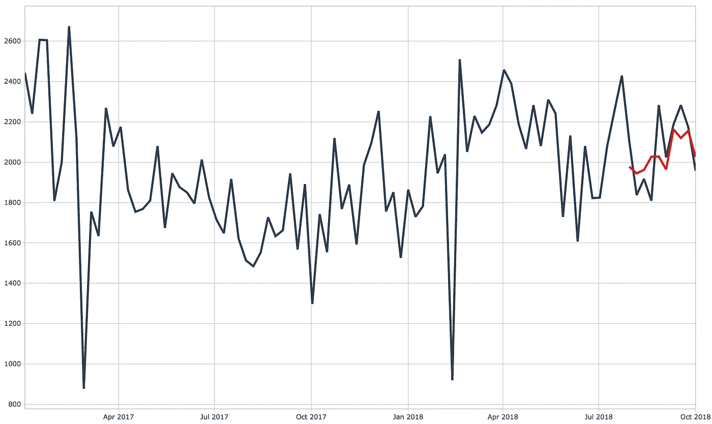

T 这是我之前[博客](https://gouthaman.medium.com/multiple-time-series-forecast-demand-pattern-classification-using-r-part-1-31601158d33b)的延续。在之前的博客中，我们看了如何执行基本的 ***数据预处理*** &如何使用函数 `*idclass*`对时间序列 *进行分类。该系列将具有以下 **5** 部件:*

> [***第一部分:*** *数据清理&需求分类。*](/multiple-time-series-forecast-demand-pattern-classification-using-r-part-1-31601158d33b)
> 
> ***第二部分:*** *拟合* ***统计时间序列模型*** *(ARIMA、ETS、CROSTON 等。)使用 fpp3(整齐预测)R 包。*
> 
> [***第三部分:*** *时间序列* ***特征工程*** *使用 timetk R 包。*](https://gouthaman.medium.com/multiple-time-series-forecast-demand-pattern-classification-using-r-part-3-8473e47edf6e)
> 
> ***Part 4:****Fit****机器学习模型*** *(XGBoost，Random Forest 等。)***&****超参数调优*** *使用 modeltime & tidymodels R 包。**
> 
> ****第五部分:****Fit****deep learning 模型****(NBeats&DeepAR)&超参数调优使用 modeltime，modeltime.gluonts R 包。**

*在这篇博客中，我将解释如何拟合****(ARIMA、ETS、分解模型等)。)*** 对一组时间序列数据***【3548 组】*** 并为每组选择合适的时间序列模型。**

**我们开始吧！**

## **工作流程图:**

**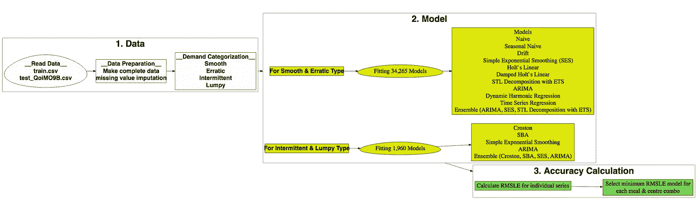**

**统计模型拟合工作流程**

**上图显示了为适应经典统计模型而执行的工作流程。在这个工作流程中，第一阶段( ***读取数据，数据准备&需求分类*** )在我的[之前的](/multiple-time-series-forecast-demand-pattern-classification-using-r-part-1-31601158d33b)博客中已经解释过了。这里我们将着重于拟合统计模型&计算**R**oot**M**E**S**quared**L**对数 **E** rror (RMSLE)精度度量来选择合适的模型。**

**让我们导入库。**

```
**pacman::p_load(tidyverse, magrittr) # data wrangling packagespacman::p_load(lubridate, tsintermittent, fpp3, modeltime, timetk, modeltime.gluonts, tidymodels, modeltime.ensemble, modeltime.resample) # time series model packagespacman::p_load(foreach, future) # parallel functionspacman::p_load(viridis, plotly) # visualizations packagestheme_set(hrbrthemes::theme_ipsum()) # set default themes**
```

## **步骤 01:为平稳和不稳定类型拟合时间序列模型。**

**我们已经确定了每个餐饮/中心组的需求类型。现在我们将只过滤 ***平滑&不稳定*** 需求类型餐/中心组时间序列数据。**

```
**smooth_tbl <- master_data_tbl %>%
  filter(demand_cate %in% c("Smooth", "Erratic"))**
```

**现在，过滤后的数据被分为每一餐/中心组合的训练和测试(过去 10 周)数据。**

```
**train_tbl <- smooth_tbl %>%
  filter_index(. ~ "2018-07-23")test_tbl <- smooth_tbl %>%
  filter_index("2018-07-30" ~ .)**
```

> **注意:这里我们的数据框架是一个 ***tsibble*** 对象，这是一种处理时间序列数据的特殊类型的数据框架。我们已经在 tsibble“master _ data _ TBL”中将“center&meal id”指定为关键变量。所以我们的 tidyverse 函数将适用于所有的膳食/中心组。例如，当我们应用函数“filter_index”时，它将按日期过滤所有组。**

**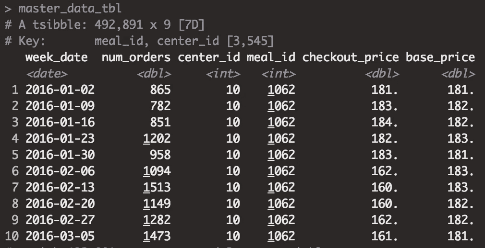**

**表 1: tsibble 数据**

**接下来，我们将为每一餐/中心组 ***拟合以下 11 个时间序列模型，即共拟合 34，265 个模型。*****

> **34265 款是怎么来的？**

**还有***1839***平滑&***1276***飘忽不定的类型餐/中心组，这使得总共有***3115***不同的组。我们将为每组配备 11 种不同的型号，总共有***3115 * 11 = 34265。*****

****Naive:**Naive 模型将所有未来值设置为与上次观察值相同。**

****季节性朴素模型:**季节性朴素模型用于季节性数据。在这种情况下，每个未来值等于同一季节的最后值。**

****漂移:**漂移模型是朴素模型的变体，允许预测随时间增加或减少。**

****简单指数平滑:**简单指数平滑模型用于无法确定明确趋势或季节模式的情况。**

****霍尔特线性模型:**霍尔特线性模型是 SES 的扩展版本，允许根据趋势进行预测。**

****阻尼霍尔特线性:**阻尼加性趋势模型是霍尔特线性的扩展版本，允许趋势随着阻尼参数**φ**的变化而变化。**

****分解预测:**分解模型用于使用**季节和趋势分解使用黄土(STL)** 方法分解时间序列。ETS 方法可用于预测**经季节性调整的**数据，之后季节性成分可添加到预测数据中。**

**[**ARIMA:**](https://otexts.com/fpp3/arima.html)ARIMA 模型解释了数据中的自相关性。这里我们将拟合一个自动 ARIMA 模型，该模型使用**最小 AICC** 自动选择 ARMA 订单。**

**[**动态调和回归:**](https://otexts.com/fpp3/dynamic.html) 动态调和回归模型允许包含其他数据，如基价、结账价、电子邮件促销&主页精选。**

****时间序列回归:**时间序列回归模型用于预测因变量 Y，假设它与其他自变量 x 具有线性关系，即在这种情况下，在预测订单数量与结帐价格、基础价格、促销电子邮件地址&主页特色具有线性关系时做出假设。**

****集合:**集合模型简单地同时使用几个不同的模型，并计算结果预报的平均值。例如，在这里，ARIMA、SES &分解模型被一起用来计算平均预测值。**

**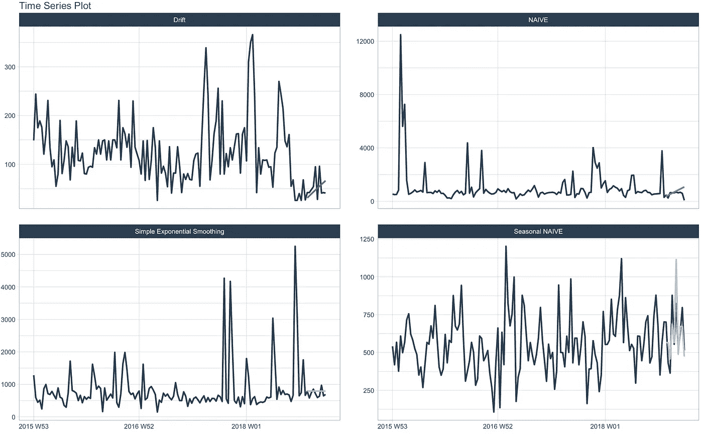**

**图 1:带有预测值的拟合模型示例**

**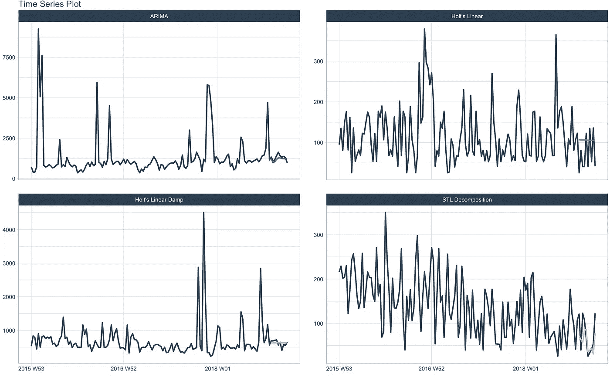**

**图 2:带有预测值的拟合模型示例**

**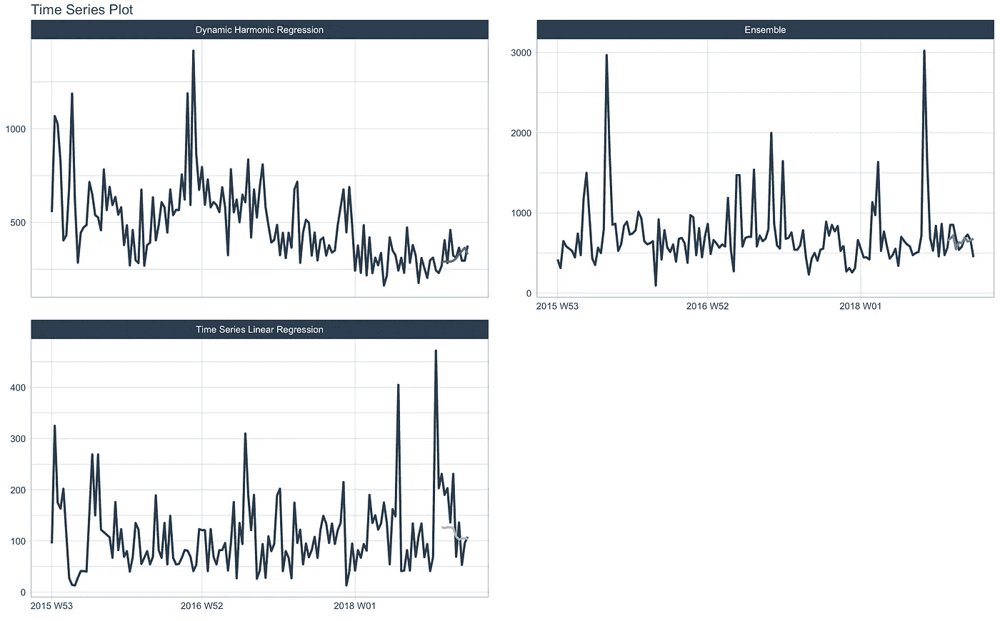**

**图 3:带有预测值的拟合模型示例**

**现在，我们将使用 R 包`fpp3`将上述 11 个模型拟合到 R 中。这里我们对*对数转换后的订单数量施加一个正约束。你可以在 R 代码中看到我们增加了**一个**作为偏移量；这是为了克服 **log(0)** 无穷大的问题。***

> ***这将需要更长的时间来运行，因为它适合 34k 模型。***

```
***fpp3_model_table <- train_tbl %>%
  model( ## Model 1: Naive ----
    naive_mod = NAIVE(log(num_orders + 1)), ## Model 2: Snaive ----
    snaive_mod = SNAIVE(log(num_orders + 1)), ## Model 3: Drift ----
    drift_mod = RW(log(num_orders + 1) ~ drift()), ## Model 4: SES ----
    ses_mod = ETS(log(num_orders + 1) ~ error("A") + trend("N") + season("N"), opt_crit = "mse"), ## Model 5: Holt's Linear ----
    hl_mod = ETS(log(num_orders + 1) ~ error("A") + trend("A") + season("N"), opt_crit = "mse"), ## Model 6: Damped Holt's Linear ----
    hldamp_mod = ETS(log(num_orders + 1) ~ error("A") + trend("Ad") + season("N"), opt_crit = "mse"), ## Model 7: STL decomposition with ETS ----
    stl_ets_mod = decomposition_model(STL(log(num_orders + 1)), ETS(season_adjust ~ season("N"))), ## Model 8: ARIMA ----
    arima_mod = ARIMA(log(num_orders + 1)), ## Model 9: Dynamic harmonic regression ----
    dhr_mod = ARIMA(log(num_orders + 1) ~ PDQ(0,0,0) + fourier(K=6) + checkout_price + emailer_for_promotion), ## Model 10: TSLM ----
    tslm_mod = TSLM(log(num_orders + 1) ~ checkout_price + base_price + emailer_for_promotion)) %>% ## Model 11: Ensemble Model ----
  mutate(ensemble_sm_mod = combination_ensemble(arima_mod, ses_mod, stl_ets_mod))***
```

## ***步骤 02:拟合间歇和波动类型的时间序列模型。***

***在这一步中，我们将过滤 ***间歇&块状*** 餐/中心组时间序列数据。***

```
***inter_tbl <- master_data_tbl %>%
  filter(demand_cate %in% c("Intermittent", "Lumpy"))***
```

***现在，过滤后的数据被分为每一餐/中心组的训练和测试(过去 10 周)数据。***

```
***train_tbl <- inter_tbl %>%
  filter_index(. ~ "2018 W30")test_tbl <- inter_tbl %>%
  filter_index("2018 W31" ~ .)***
```

***接下来，我们将为每个餐饮/中心组 ***拟合以下 5 个时间序列模型，即共拟合 1，960 个模型。******

> ***1960 款是怎么来的？***

***还有 ***273*** 间歇& ***119*** 块状类型的餐/餐群，这就使得总共有*392 个不同的群。我们将为每组配备 5 种不同的型号，总共是***392 * 5 = 1960。*******

*****简单指数平滑:**参考上面的解释。***

*****ARIMA:** 参考上面的解释。***

***[**克罗斯顿:**](https://kourentzes.com/forecasting/2014/06/23/intermittent-demand-forecasting-package-for-r/) 克罗斯顿模型是最适合滞销品(间歇)的方法。***

***[**SBA:**](https://kourentzes.com/forecasting/2014/06/23/intermittent-demand-forecasting-package-for-r/)**SBA 模型是克罗斯顿方法的另一个变体/改进版本。*****

*******集合:**在这里，克罗斯顿、SBA、ARIMA & SES 模型一起用来计算平均预报值。*****

*****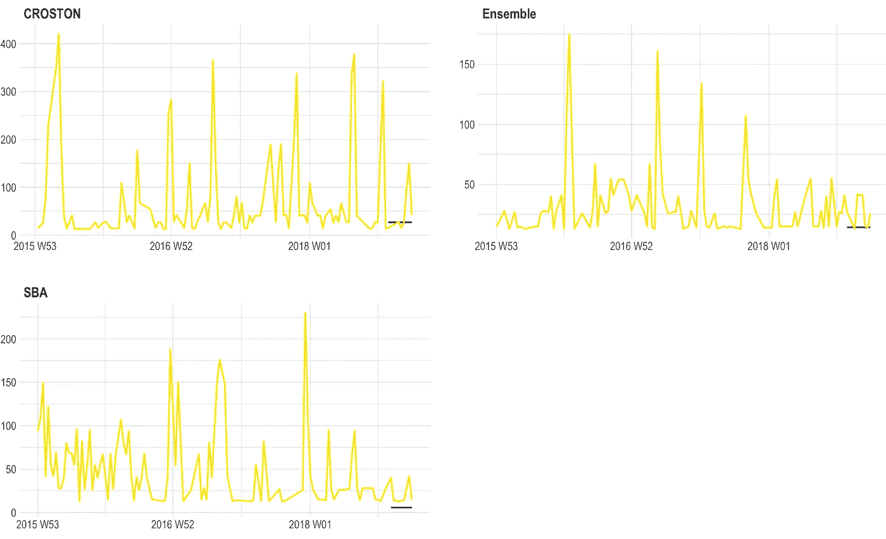*****

*****图 4:带有预测值的间歇拟合模型示例*****

*****现在，我们将使用 R 包`fpp3`将上述 5 个模型拟合到 R 中。*****

```
*****fpp3_model_table <- train_tbl %>%
  model(
    ## Model 1: Croston ----
    crost_mod = CROSTON(log(num_orders + 1)), ## Model 2: SBA ----
    sba_mod = CROSTON(log(num_orders + 1), type = "sba"), ## Model 3: SES ----
    ses_mod = ETS(log(num_orders + 1) ~ error("A") + trend("N") + season("N"), opt_crit = "mse"), ## Model 4: ARIMA ----
    arima_mod = ARIMA(log(num_orders + 1))) %>% ## Model 5: Ensemble ----
  mutate(ensemble_inter_mod = combination_ensemble(crost_mod, sba_mod, ses_mod, arima_mod))*****
```

## *****步骤 03:测试期间的预测。*****

*****我们现在有 ***36，225(即 34，265 + 1，960)*** 合身款。接下来，我们需要找出哪种模式适合每个用餐/中心组。为了做到这一点，我们必须在测试期间预测每个模型，并计算它们的准确性度量。*****

*****现在我们将对测试期进行预测。*****

```
*****forecast_tbl <- fpp3_model_table %>%
    forecast(test_tbl, times = 0) %>%
    as_tibble() %>%
    select(week_date, meal_id, center_id, .model, fc_qty = .mean)*****
```

## *****步骤 04:计算准确度。*****

*****在此阶段，我们将计算每个模型的精确度，以便为每个**餐/中心**组选择合适的模型。这里使用的精度度量是**R**oot**M**ean**S**quared**L**对数**E**error(**RMSLE)**。我选择 RMSLE 仅仅是因为它是本次竞赛用来评估的指标。然而，我个人更喜欢 **RMSSE** ，因为这曾在 **M5 预测竞赛中使用过。*******

*****可以通过使用 R 包`Metrics`中的函数`rmsle`在 R 中计算 RMSLE。*****

```
*****forecast_tbl <- master_data_tbl %>% as_tibble() %>% # change tsibble -> tibble select(week_date, center_id, meal_id, num_orders) %>% right_join(forecast_tbl, by = c("week_date", "meal_id", "center_id")) %>% # join forecast values mutate(fc_qty = ifelse(fc_qty < 0, 0, fc_qty)) # change negative & NA ordersaccuracy_tbl <- forecast_tbl %>% group_by(center_id, meal_id, .model) %>% summarise(accuracy_rmsle = Metrics::rmsle(num_orders, fc_qty)) # calculate RMSLE*****
```

*****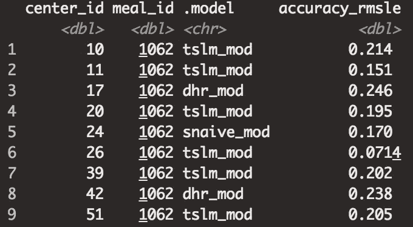*****

*****表 2:精度表*****

## *****第五步:选择合适的型号。*****

*****在这一阶段，我们将根据**最小 RMSLE 为每一餐/中心组选择一个合适的模型。*******

```
*****suitable_model_tbl <- accuracy_tbl %>%
  ungroup() %>%
  group_by(meal_id, center_id) %>%
  filter(accuracy_rmsle == min(accuracy_rmsle)) %>%
  slice(n = 1)*****
```

*****现在，我们有了一份适合每个餐饮/中心群体的模型列表。*****

*****例如，下表显示，对于中心 110 和膳食 2104，最合适的模型是季节性朴素模型(`snaive_mod`)，而对于中心 67 &膳食 1885，最合适的模型是霍尔特线性模型(`hl_mod`)。这些相应的模型可用于每个组未来的订单数量预测。*****

*****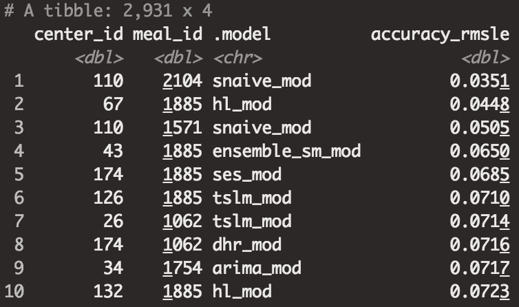*****

*****表 3:合适的型号列表*****

## *****步骤 06:准确性可视化和概述*****

*****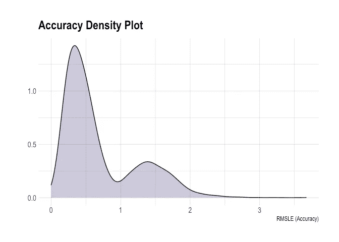*****

*****图 5:精度密度图*****

*****上图显示了我们合适的模型的精确度的概况。它表明，对于大多数膳食/中心组，实现了高准确度(即小于 1 RMSLE)。然而，有一些膳食/中心组显示出较低的准确性；对于这些低精度组，可以拟合其他高级时间序列/机器学习模型来提高预测精度。此外，大多数低精度组是不稳定的/间歇的，这意味着对于这些类型的组，而不是拟合高级模型，重点应该是安全库存计算。*****

*****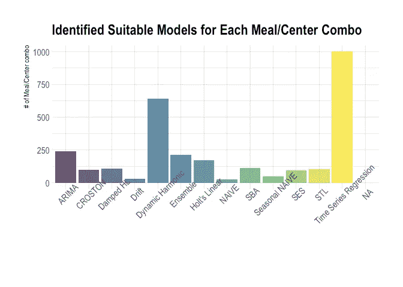*****

*****地块 6:合适的模型*****

*****上图显示了由最小 RMSLE 选择的适合模型的膳食/中心组的数量。结果表明，ARIMA、动态调和回归和时间序列回归模型是最适合膳食/中心组的模型。*****

*****因此，现在我们知道如何为一组时间序列数据拟合经典时间序列模型。然而，这在实际/商业世界中有一些缺点。那些缺点是什么？*****

1.  *******时间:**当组数增加时，训练需要很长时间。比如我们这种情况，为了找到 3.5k 合适的模型，需要训练将近 35k 的模型。*****
2.  *******再现性:**一旦你为一个团队找到了合适的模型，我们假设这个模型也将用于未来。实际上，情况并非如此，因为当添加新的事务时，最合适的模型可能会改变。*****
3.  *******没有可扩展性:**没有一个全局模型。也就是说，我们必须为每一组设计不同的模型。*****

*****我们能做些什么来克服这些问题？*****

*****这些问题的答案是机器学习&深度学习模型。*****

*****在我的下一篇博客中，我将解释我们如何适应机器学习和深度学习模型，并进行特征工程。这个机器学习模型也大大提高了我们的准确性。*****

## *****参考*****

*****Hyndman，R.J .，& Athanasopoulos，G. (2021) *预测:原则与实践*，第三版，原文:澳大利亚墨尔本。OTexts.com/fpp3.于[2021 年 2 月 8 日访问]。*****

*****北卡罗来纳州科伦茨，2014 年。*R-Nikola OS Kourentzes*间歇需求预测包。Kourentzes.com。可在:<https://kourentzes . com/forecasting/2014/06/23/intermittent-demand-forecasting-package-for-r/>[2021 年 1 月 22 日访问]。*****