# 基于 PyCaret 的多时间序列预测

> 原文：<https://towardsdatascience.com/multiple-time-series-forecasting-with-pycaret-bc0a779a22fe?source=collection_archive---------2----------------------->

## 使用 PyCaret 预测多个时间序列的分步教程

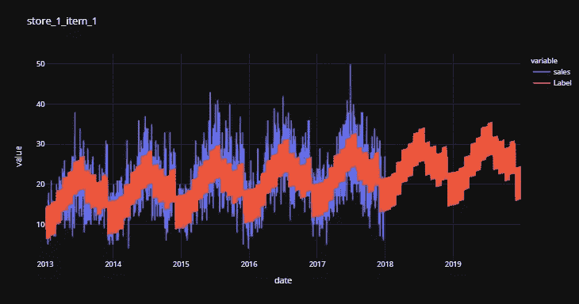

py caret——Python 中的开源、低代码机器学习库

# PyCaret

PyCaret 是一个开源的低代码机器学习库和端到端的模型管理工具，内置于 Python 中，用于自动化机器学习工作流。它因其易用性、简单性以及快速有效地构建和部署端到端 ML 原型的能力而广受欢迎。

PyCaret 是一个替代的低代码库，可以用来用几行代码替换数百行代码。这使得实验周期成倍地快速和有效。

py caret**简单**T2 好用。PyCaret 中执行的所有操作都顺序存储在一个**管道**中，该管道对于**部署是完全自动化的。**无论是输入缺失值、一键编码、转换分类数据、特征工程，甚至是超参数调整，PyCaret 都实现了自动化。

本教程假设您对 PyCaret 有一定的了解和经验。如果您以前没有使用过，没关系，您可以通过这些教程快速入门:

*   [PyCaret 2.2 已经发布——新功能](/pycaret-2-2-is-here-whats-new-ad7612ca63b)
*   [宣布 PyCaret 2.0](/announcing-pycaret-2-0-39c11014540e)
*   [关于 PyCaret 你不知道的五件事](/5-things-you-dont-know-about-pycaret-528db0436eec)

# **重述**

在我的[上一篇教程](/time-series-forecasting-with-pycaret-regression-module-237b703a0c63)中，我已经演示了如何使用 PyCaret 通过 [PyCaret 回归模块](https://pycaret.readthedocs.io/en/latest/api/regression.html)使用机器学习来预测时间序列数据。如果你还没有阅读，你可以先阅读[使用 PyCaret 回归模块进行时间序列预测](/time-series-forecasting-with-pycaret-regression-module-237b703a0c63)教程，然后再继续阅读本教程，因为本教程建立在上一篇教程中涉及的一些重要概念之上。

# 正在安装 PyCaret

安装 PyCaret 非常容易，只需要几分钟。我们强烈建议使用虚拟环境来避免与其他库的潜在冲突。

PyCaret 的默认安装是 pycaret 的精简版本，它只安装这里列出的[硬依赖项](https://github.com/pycaret/pycaret/blob/master/requirements.txt)。

```
**# install slim version (default)** pip install pycaret**# install the full version**
pip install pycaret[full]
```

当你安装 pycaret 的完整版本时，这里列出的所有可选的依赖项[也会被安装。](https://github.com/pycaret/pycaret/blob/master/requirements-optional.txt)

# 👉PyCaret 回归模块

PyCaret **回归模块**是一个受监督的机器学习模块，用于估计**因变量**(通常称为“结果变量”，或“目标”)和一个或多个**自变量**(通常称为“特征”，或“预测器”)之间的关系。

回归的目标是预测连续值，如销售额、数量、温度、客户数量等。PyCaret 中的所有模块都提供了许多[预处理](https://www.pycaret.org/preprocessing)功能，通过[设置](https://www.pycaret.org/setup)功能为建模准备数据。它有超过 25 个现成的算法和几个图来分析训练模型的性能。

# 👉资料组

在本教程中，我将展示多时间序列数据预测的端到端实现，包括训练和预测未来值。

我使用了 Kaggle 的[商店商品需求预测挑战](https://www.kaggle.com/c/demand-forecasting-kernels-only)数据集。该数据集有 10 个不同的商店，每个商店有 50 个项目，即五年(2013 年至 2017 年)共 500 个每日级别的时间序列数据。

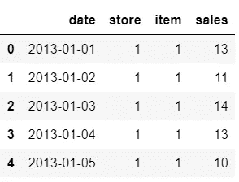

样本数据集

# 👉加载并准备数据

```
**# read the csv file** import pandas as pd
data = pd.read_csv('train.csv')
data['date'] = pd.to_datetime(data['date'])**# combine store and item column as time_series**
data['store'] = ['store_' + str(i) for i in data['store']]
data['item'] = ['item_' + str(i) for i in data['item']]
data['time_series'] = data[['store', 'item']].apply(lambda x: '_'.join(x), axis=1)
data.drop(['store', 'item'], axis=1, inplace=True)**# extract features from date**
data['month'] = [i.month for i in data['date']]
data['year'] = [i.year for i in data['date']]
data['day_of_week'] = [i.dayofweek for i in data['date']]
data['day_of_year'] = [i.dayofyear for i in data['date']]data.head()
```

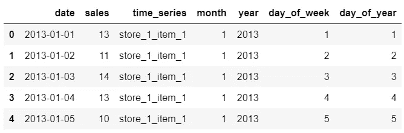

从数据中取样行

```
**# check the unique time_series**
data['time_series'].nunique()
>>> 500
```

# 👉可视化时间序列

```
**# plot multiple time series with moving avgs in a loop**import plotly.express as pxfor i in data['time_series'].unique():
    subset = data[data['time_series'] == i]
    subset['moving_average'] = subset['sales'].rolling(30).mean()
    fig = px.line(subset, x="date", y=["sales","moving_average"], title = i, template = 'plotly_dark')
    fig.show()
```

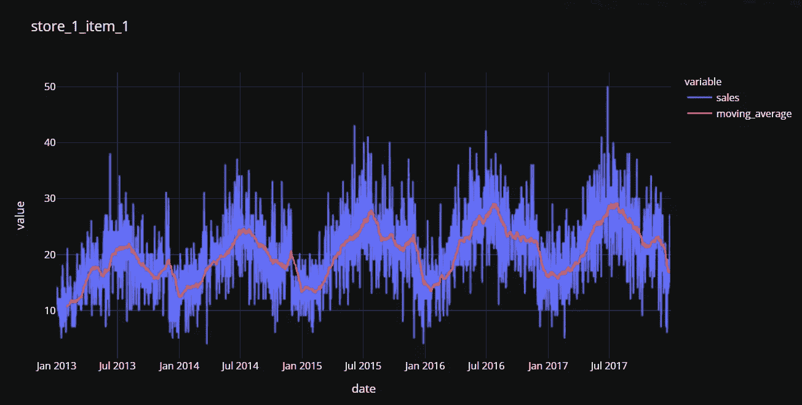

store_1_item_1 时间序列和 30 天移动平均值

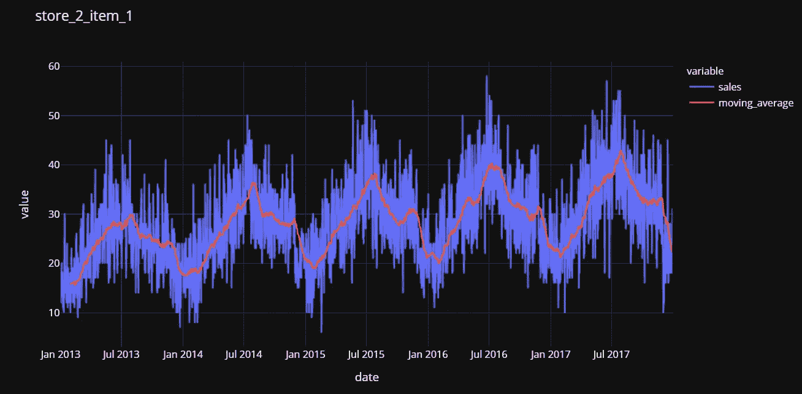

store_2_item_1 时间序列和 30 天移动平均值

# 👉开始培训过程

现在我们已经准备好了数据，让我们开始训练循环。注意所有功能中的`verbose = False`，以避免训练时在控制台上打印结果。

下面的代码是我们在数据准备步骤中创建的围绕`time_series`列的循环。总共有 150 个时间序列(10 家商店 x 50 件商品)。

下面的第 10 行是过滤数据集的`time_series`变量。循环中的第一部分是初始化`setup`函数，然后是`compare_models`寻找最佳模型。第 24–26 行捕获结果，并将最佳模型的性能指标附加到一个名为`all_results`的列表中。代码的最后一部分使用`finalize_model`函数在整个数据集上重新训练最佳模型，包括测试集中剩下的 5%,并将包括模型在内的整个管道保存为 pickle 文件。

[https://gist . github . com/moe zali 1/f 258195 ba1c 677654 abffb 0 D1 ACB 2c 0](https://gist.github.com/moezali1/f258195ba1c677654abffb0d1acb2cc0)

我们现在可以从`all_results`列表创建一个数据帧。它将显示为每个时间序列选择的最佳模型。

```
concat_results = pd.concat(all_results,axis=0)
concat_results.head()
```

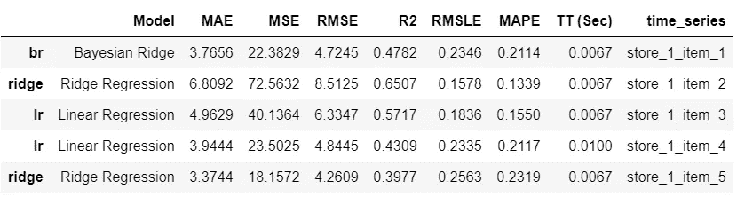

concat_results 中的样本行

# 培训过程👇

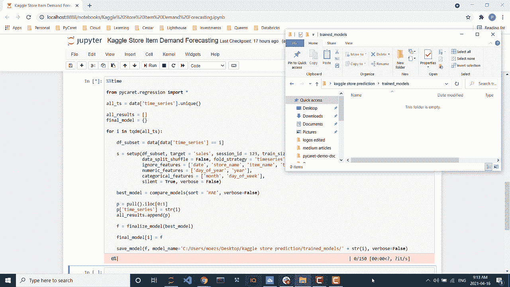

培训过程

# 👉使用训练好的模型生成预测

既然我们已经训练了模型，让我们使用它们来生成预测，但是首先，我们需要创建用于评分的数据集(X 变量)。

```
**# create a date range from 2013 to 2019**
all_dates = pd.date_range(start='2013-01-01', end = '2019-12-31', freq = 'D')**# create empty dataframe**
score_df = pd.DataFrame()**# add columns to dataset**
score_df['date'] = all_dates
score_df['month'] = [i.month for i in score_df['date']]
score_df['year'] = [i.year for i in score_df['date']]
score_df['day_of_week'] = [i.dayofweek for i in score_df['date']]
score_df['day_of_year'] = [i.dayofyear for i in score_df['date']]score_df.head()
```

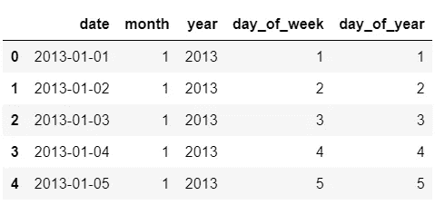

score_df 数据集中的样本行

现在让我们创建一个循环来加载经过训练的管道，并使用`predict_model`函数来生成预测标签。

```
from pycaret.regression import load_model, predict_modelall_score_df = []for i in tqdm(data['time_series'].unique()):
    l = load_model('trained_models/' + str(i), verbose=False)
    p = predict_model(l, data=score_df)
    p['time_series'] = i
    all_score_df.append(p)concat_df = pd.concat(all_score_df, axis=0)
concat_df.head()
```

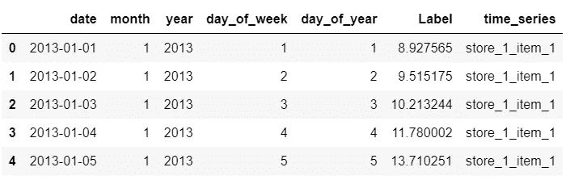

对 concat_df 中的行进行采样

我们现在将加入`data`和`concat_df`。

```
final_df = pd.merge(concat_df, data, how = 'left', left_on=['date', 'time_series'], right_on = ['date', 'time_series'])
final_df.head()
```

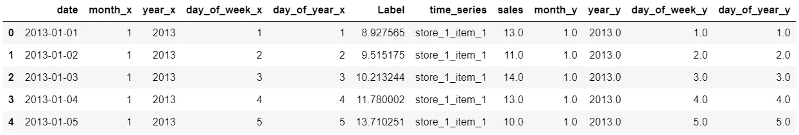

final_df 中的样本行

我们现在可以创建一个循环来查看所有的图。

```
for i in final_df['time_series'].unique()[:5]:
    sub_df = final_df[final_df['time_series'] == i]

    import plotly.express as px
    fig = px.line(sub_df, x="date", y=['sales', 'Label'], title=i, template = 'plotly_dark')
    fig.show()
```

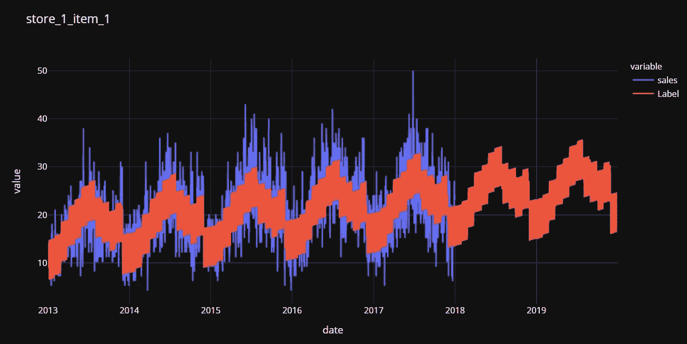

store_1_item_1 实际销售额和预测标签

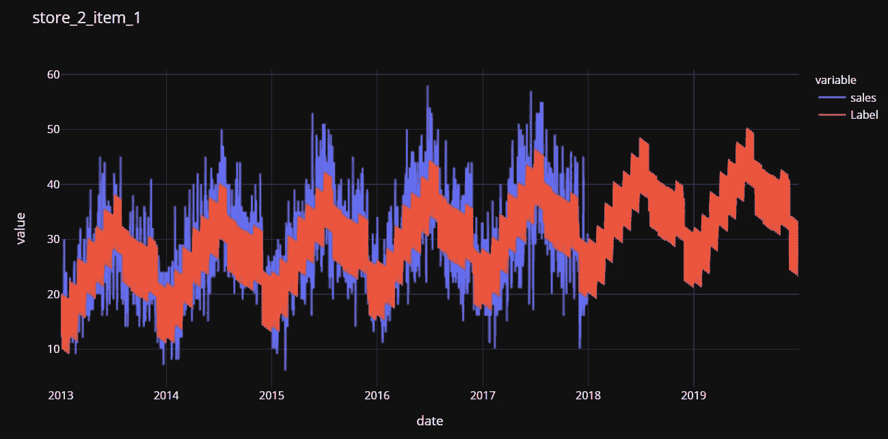

store_2_item_1 实际销售额和预测标签

我希望您会喜欢 PyCaret 的易用性和简单性。在不到 50 行代码和一个小时的实验中，我训练了超过 10，000 个模型(25 个估计值 x 500 个时间序列)，并生产了 500 个最佳模型来生成预测。

# 即将推出！

下周我将写一篇关于使用 [PyCaret 异常检测模块](https://pycaret.readthedocs.io/en/latest/api/anomaly.html)对时间序列数据进行无监督异常检测的教程。请在 [Medium](https://medium.com/@moez-62905) 、 [LinkedIn](https://www.linkedin.com/in/profile-moez/) 和 [Twitter](https://twitter.com/moezpycaretorg1) 上关注我，获取更多更新。

使用 Python 中的这个轻量级工作流自动化库，您可以实现的目标是无限的。如果你觉得这很有用，请不要忘记给我们 GitHub 库上的⭐️。

想了解更多关于 PyCaret 的信息，请在 LinkedIn 和 Youtube 上关注我们。

加入我们的休闲频道。邀请链接[此处](https://join.slack.com/t/pycaret/shared_invite/zt-p7aaexnl-EqdTfZ9U~mF0CwNcltffHg)。

# 您可能还对以下内容感兴趣:

[使用 PyCaret 2.0](/build-your-own-automl-in-power-bi-using-pycaret-8291b64181d)
[在 Power BI 中构建您自己的 AutoML 使用 Docker](/deploy-machine-learning-pipeline-on-cloud-using-docker-container-bec64458dc01)
[在 Azure 上部署机器学习管道在 Google Kubernetes 引擎上部署机器学习管道](/deploy-machine-learning-model-on-google-kubernetes-engine-94daac85108b)
[在 AWS Fargate 上部署机器学习管道](/deploy-machine-learning-pipeline-on-aws-fargate-eb6e1c50507)
[构建并部署您的第一个机器学习 web 应用](/build-and-deploy-your-first-machine-learning-web-app-e020db344a99)
[使用 AWS Fargate server less](/deploy-pycaret-and-streamlit-app-using-aws-fargate-serverless-infrastructure-8b7d7c0584c2)
[部署 PyCaret 和 Streamlit 应用](/build-and-deploy-machine-learning-web-app-using-pycaret-and-streamlit-28883a569104)

# 重要链接

[文档](https://pycaret.readthedocs.io/en/latest/installation.html)
[博客](https://medium.com/@moez_62905)
[GitHub](http://www.github.com/pycaret/pycaret)
[stack overflow](https://stackoverflow.com/questions/tagged/pycaret)
[安装 PyCaret](https://pycaret.readthedocs.io/en/latest/installation.html) [笔记本教程](https://pycaret.readthedocs.io/en/latest/tutorials.html) [贡献于 PyCaret](https://pycaret.readthedocs.io/en/latest/contribute.html)

# 想了解某个特定模块？

单击下面的链接查看文档和工作示例。

[分类](https://pycaret.readthedocs.io/en/latest/api/classification.html) [回归](https://pycaret.readthedocs.io/en/latest/api/regression.html)
[聚类](https://pycaret.readthedocs.io/en/latest/api/clustering.html)
异常检测
[自然语言处理](https://pycaret.readthedocs.io/en/latest/api/nlp.html) [关联规则挖掘](https://pycaret.readthedocs.io/en/latest/api/arules.html)