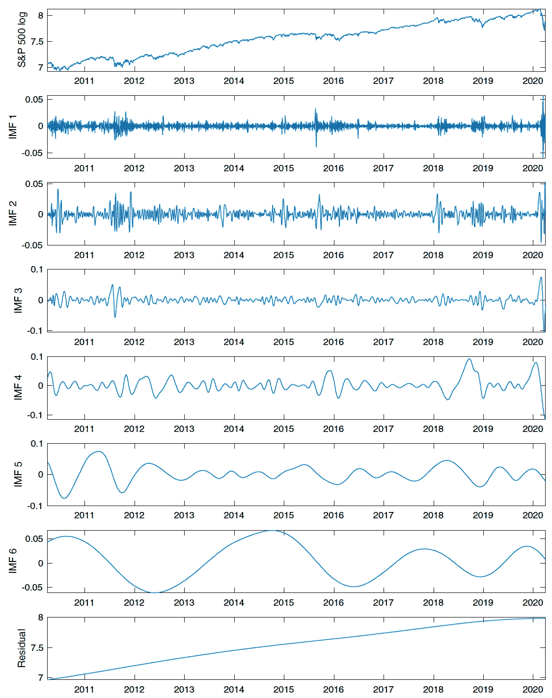
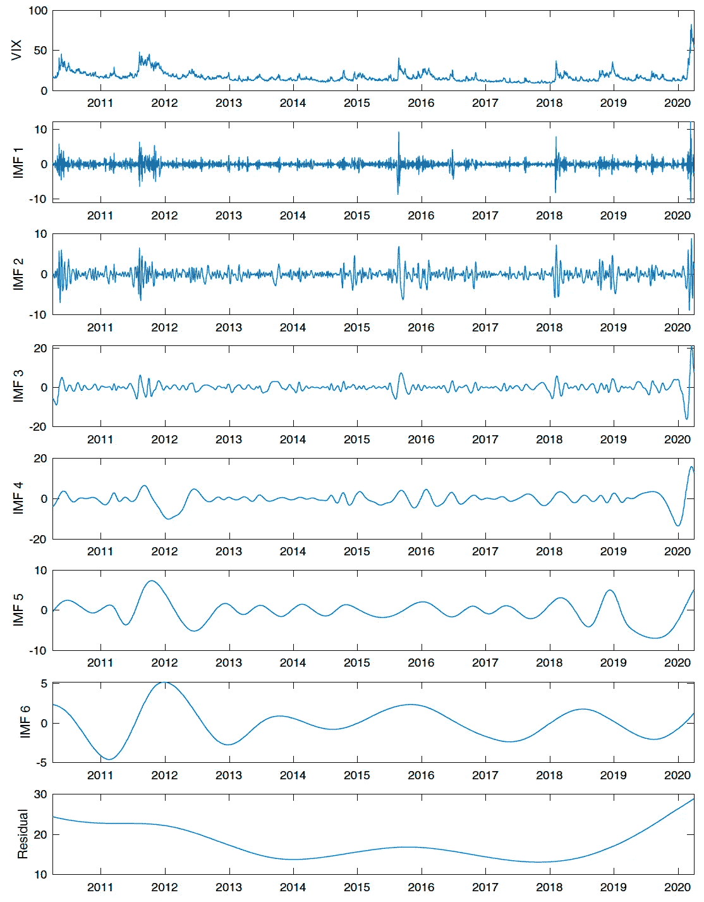
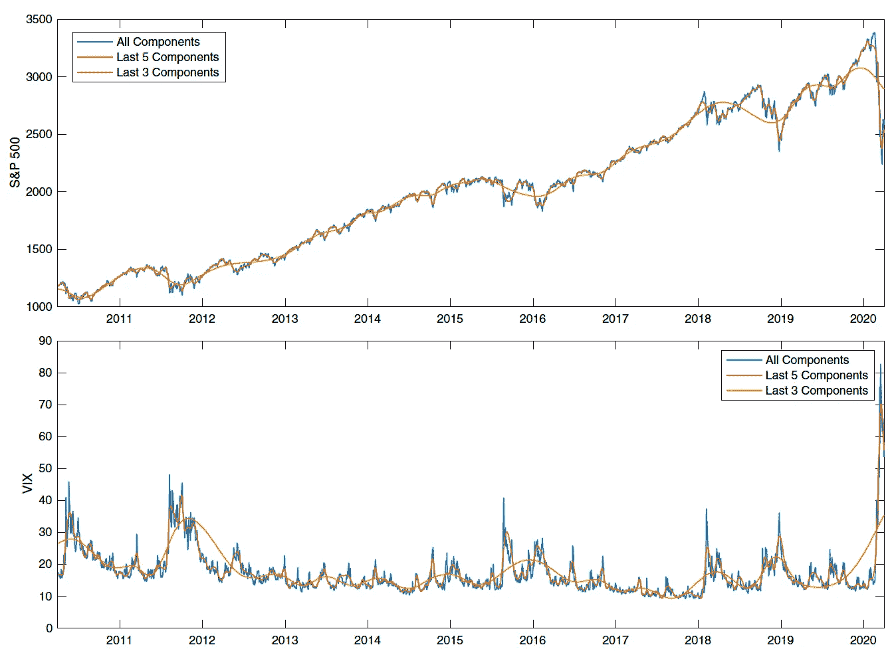
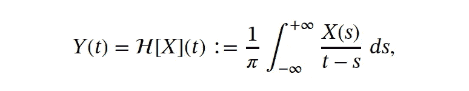
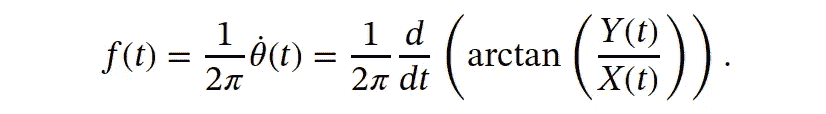
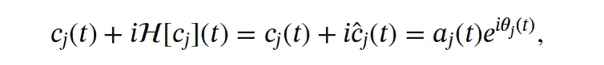
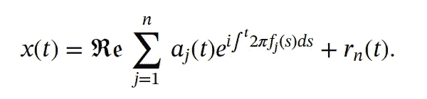
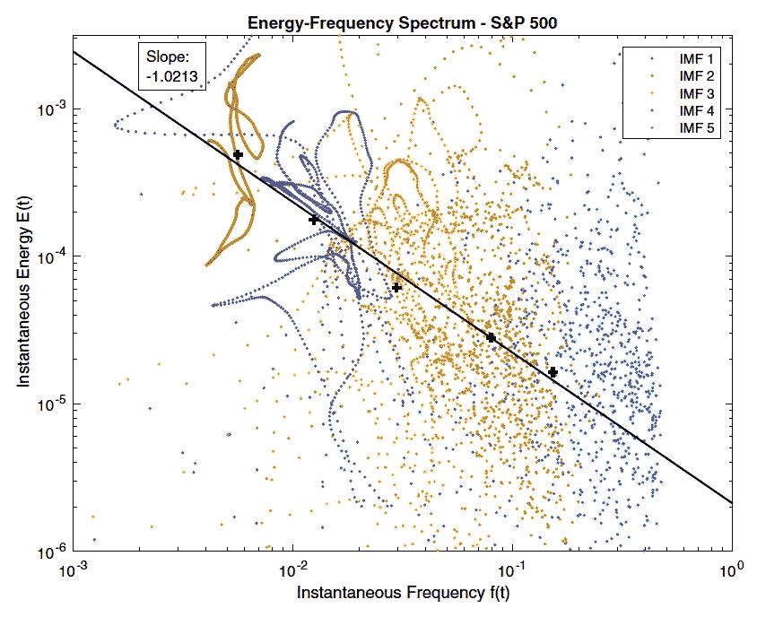
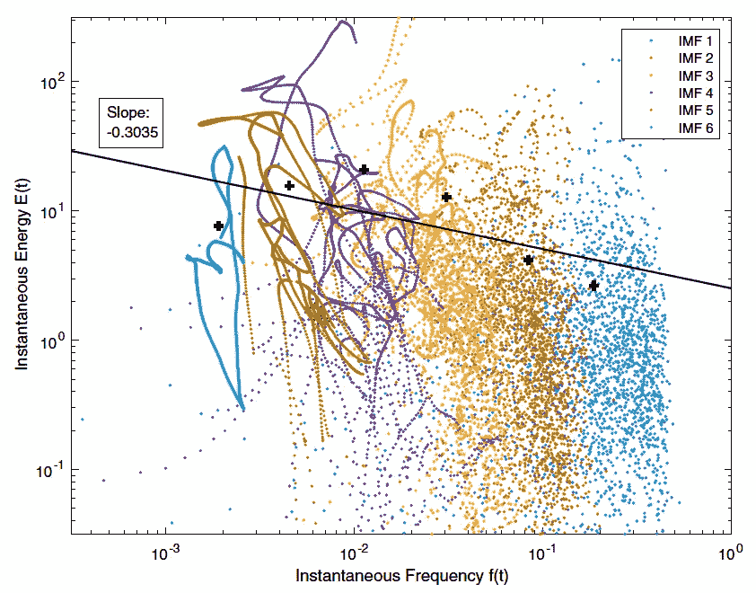
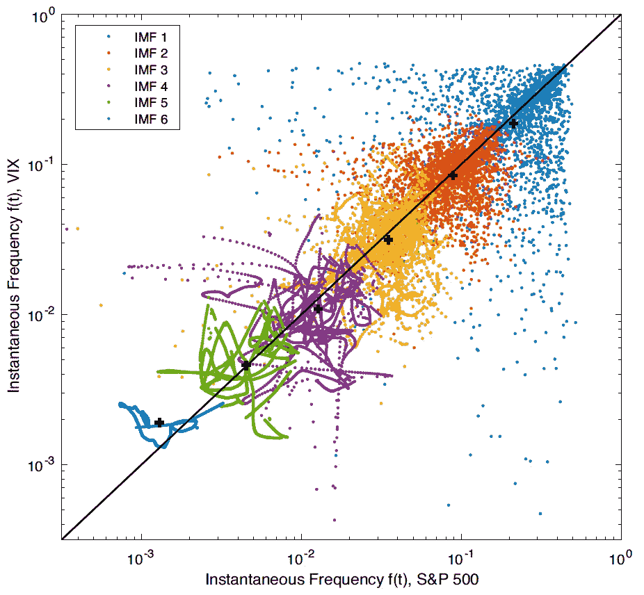

# 多尺度金融信号处理

> 原文：<https://towardsdatascience.com/multiscale-financial-signal-processing-324fa05c75a2?source=collection_archive---------17----------------------->

## 经验模态分解和希尔伯特谱分析

“一切都是能量”——照片由[大流士·巴沙尔](https://unsplash.com/@dariusbashar?utm_source=unsplash&utm_medium=referral&utm_content=creditCopyText)在 [Unsplash](https://unsplash.com/s/photos/fractal?utm_source=unsplash&utm_medium=referral&utm_content=creditCopyText) 上拍摄

市场观察和实证研究表明，资产价格通常由多种因素驱动，从长期经济周期到短期的快速波动。这表明，金融时间序列可能嵌入不同的时间尺度。

另一方面，在金融时间序列中经常观察到非平稳、行为和非线性动态。这些特征很难被线性模型捕捉到，因此需要一种自适应的非线性分析方法。几十年来，基于短时傅立叶变换的方法已经得到发展并应用于非平稳时间序列，但在捕捉非线性动态方面仍然存在挑战，并且通常规定的假设使得这些方法不完全适应。这就需要一种自适应的非线性分析方法。

# 希尔伯特-黄变换(HHT)

自适应时间序列分析的另一种方法是希尔伯特-黄变换(HHT)。HHT 方法可以使用经验模态分解(EMD)将任何时间序列分解成具有非平稳振幅和频率的振荡分量。这种完全自适应的方法为原始时间序列提供了多尺度分解，从而提供了关于时间序列的更丰富的信息。随后使用希尔伯特变换提取每个分量的瞬时频率和瞬时幅度。分解到不同的时间尺度上，还允许重建到不同的分辨率，提供了一个平滑和过滤工具，是嘈杂的金融时间序列的理想选择。

EMD 是我们多阶段程序的第一步。对于在一段时间[0， *T* ]内观察到的任何给定时间序列 *x(t)* ，我们以迭代方式将其分解为有限的振荡分量序列 *cⱼ(t)* ，对于 j=1，…，n，加上一个称为剩余项的非振荡趋势:

为了确保每个 *cⱼ(t)* 具有适当的振荡特性，应用了 IMF 的概念。IMF 是允许良好行为和物理上有意义的希尔伯特变换的时间实函数。具体而言，每个国际货币基金组织由以下两个标准定义:

*   无本地振荡:极值的数量和过零点的数量必须相等或最多相差一。
*   对称:上包络定义的函数的最大值和下包络定义的最小值在任何时候都必须加起来为零*T*∈【0， *T* 。

此外，我们将互补集成经验模式分解方法应用于非平稳金融时间序列。这种噪声辅助的方法将任何时间序列分解成许多固有模式函数，以及相应的瞬时振幅和瞬时频率。

下面我们举例说明 S&P500 和 VIX 分解的本征模函数(IMF)和剩余项。

从标准普尔 500(log-price)2010 年 4 月 1 日至 2020 年 3 月 31 日的互补系综经验模态分解中提取的内禀模态函数(IMF)和残差项。最上面一行显示原始时间序列。倒数第二行显示相应时间序列的 IMF 模式。每个图的底部一行显示了时间序列的剩余项。

从 2010 年 4 月 1 日至 2020 年 3 月 31 日的波动率指数(VIX)的互补系综经验模式分解中提取的固有模式函数(IMF)和残差项。最上面一行显示原始时间序列。倒数第二行显示相应时间序列的 IMF 模式。每个图的底部一行显示了时间序列的剩余项。

这些模式对应不同的频率，从快速波动到长期趋势。这种分解允许我们 I)通过排除一些高频分量来平滑/过滤任何时间序列，以及 ii)使用分量子集来重建任何时间序列。

使用不同组分量的时间序列重建。

# 能量频谱

注意，每种模式(IMF)也对应不同的波动频率。上述分解允许我们在逐个模式(逐个频率)的基础上比较任何两个时间序列。

振荡实值函数可以看作复平面上的轨道在实轴上的投影。对于任何时间函数 *X(t)* ，希尔伯特变换**由下式给出**

因此 *Y(t)* 提供了 *X(t)* 的互补虚部，以在上半平面中形成解析函数，定义如下

在哪里

然后，瞬时频率被定义为相位函数的 2𝜋标准化变化率，也就是说，

将希尔伯特变换分别应用于每个 IMF 分量产生一系列分析信号

反过来，原始时间序列可以表示为具有时变振幅和频率的时间序列的稀疏谱表示:

此外，第 *j* 个分量的瞬时能量定义为

因此，对于每个时间序列，我们得到一个 ***能量-频谱图。***

S&P500:瞬时能量 E(t)随着瞬时频率 *f(t)* 的增加而减小。

对 VIX 来说，瞬时能量 E(t)下降的速度比 S&P500 低得多。

> S&P500 和 VIX 共享相似的瞬时频率，但是瞬时能量显著不同。

标准普尔 500 vs VIX:各模式的瞬时频率非常相似，这意味着它们都是由相似的波动频率驱动的，尽管幅度明显不同。

总之，这种方法的主要输出是一系列 IMF，以及时变瞬时幅度和瞬时频率。不同的模式组合允许我们使用不同时间尺度的成分来重构时间序列。使用希尔伯特谱分析，我们计算相关的瞬时能量-频率谱来说明原始时间序列中嵌入的各种时间尺度的特性。

多尺度信号处理也非常适合分析加密货币价格(参见这篇[论文](https://papers.ssrn.com/sol3/papers.cfm?abstract_id=3833262))。对于其他例子，如黄金(GLD)和国债，以及机器学习应用，我们建议读者参考下面的完整[论文](https://papers.ssrn.com/sol3/papers.cfm?abstract_id=3595914)(或者可能是关于这个主题的未来帖子)。

*免责声明:这不是投资建议。*

# 参考

梁，赵(2021)，特征生成与机器学习的金融时间序列分析与预测[ [pdf](https://papers.ssrn.com/sol3/papers.cfm?abstract_id=3595914) ]，[随机模型在商业与工业中的应用](https://onlinelibrary.wiley.com/doi/10.1002/asmb.2625)

梁，赵(2021)，自适应互补系综 EMD 与加密货币价格的能频谱[pdf](https://papers.ssrn.com/sol3/papers.cfm?abstract_id=3833262)

[谷歌学术](https://scholar.google.com/citations?user=P40aOHIAAAAJ&hl=en) // [领英页面](https://www.linkedin.com/in/timstleung/) // [首页](https://sites.google.com/site/timleungresearch/research)