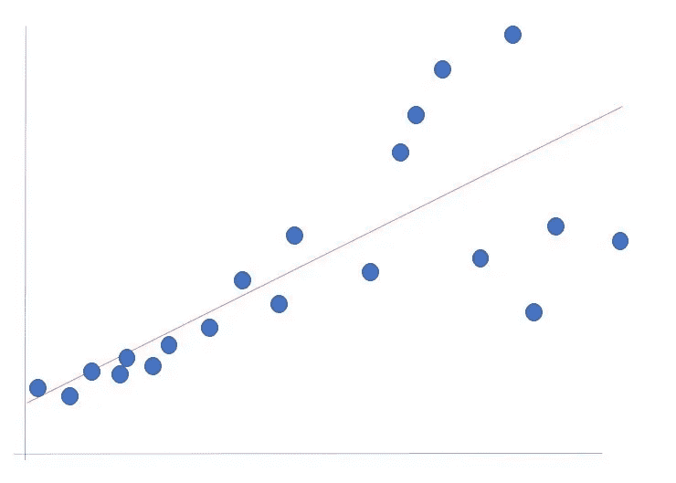

# 多元线性回归

> 原文：<https://towardsdatascience.com/multivariant-linear-regression-e636a4f99b40?source=collection_archive---------15----------------------->

## 哦，男孩，同性恋


多元回归|照片由 paweczerwi ski 拍摄

这篇文章是我上一篇关于[线性回归](/an-introduction-to-linear-regression-9cbb64b52d23)文章的延续。

重申我上一篇文章中关于最小二乘回归中的误差公式是很重要的。


最小二乘回归选择具有最低总 SSE 的线

这个误差平方和的和，就是这条线上的理论值和实际观测值之间的差异，也就是蓝点所在的点。这些差异的平方，然后将这些平方相加，总面积就是 **SSE** ，误差平方和。


平方和回归(SSR)

这里是平方和回归( **SSR** )。这基本上说明了方差的大小。我们在预测值之间看到的基本效果是什么，这个模型需要做多少工作。如果这是一个非常大的数字，它本身并不意味着模型是好是坏。但是如果这个 SSR 远大于它，或者回归的平方和远大于这些差异的平方和(SSE)，那么它就是一个好模型。测量值介于预测值和平均值之间。

平方和 total ( **SST** )有时等于 SSR + SSE。有时主要是如果你使用最小二乘回归，首先，这是有意义的——我们在这里对平方求和，所以你是在做最小二乘回归。另一个更重要的事情是，这是人们总是忘记的，这个等式， **SST = SSR +SSE 只对训练数据**成立。对于测试数据来说是不成立的。**上交所之所以可以任意放大测试数据**。如果它变得太大，那么事情可能会出错。SSE 可以变得任意大，所以即使比 SST 大，它也可以变得比 SST 大很多。SST 仅基于训练数据，而 SSE 基于您的测试数据。


SSE 可以比 SST 大

因此，R 的值很可能是负值，我们都知道，如果它真的是某个东西的平方，R 不可能是负值。但是如你所见，这个公式不是任何皮尔逊 R 的平方，或者类似的东西。

线的另一种精度测量是使用均方根误差(RMSE)。用它来估计误差意味着我们比标准差多损失了一个自由度，所以我们把 RSE 写成:


根据 SSE 定义

```
# mean squared errormse = np.sum((y_pred — y_actual)**2)# root mean squared error, m is number of training samples
rmse = np.sqrt(mse/m)
# results.mse_resid
```

## 假设

以下是线性回归的一些重要假设。

*   因变量和自变量之间的线性关系
*   测量误差是随机的
*   残差是同方差的

主要假设是**残差是同方差的**。同方差意味着它们始终大致相同，这意味着残差不会突然变大。而事实往往不是这样，事情往往不是同质化的。那你会怎么做？好吧，如果你能做到这些技巧中的一个，比如改变 y 值，在做任何线性回归之前转换它们，那就太好了！否则，假设不成立时能做什么？这是一个肮脏的秘密:他们什么都不做。他们只是假装他们的残差是异方差的，尽管事实上他们是异方差的，这意味着误差始终是不一致的。


我们假设的同方差模型

名词（noun 的缩写）b:误差并不是正态分布的，而是均匀分布的，误差只需要始终大致相同。然而，它们确实需要以零为中心。

## 极端值


易受异常值影响:异常值是具有较大残差的观察值

线性回归容易受到异常值的影响。这里，你有一个很好的线性关系，这条线完美地穿过这些数据点。第二张图不是，因为右上角的数据点将回归线拉得很高。像这样的离群值真的是一个问题，你可以通过各种方式摆脱离群值，比如杠杆和库克距离。

线性回归根据 x 和 y 值的平均值拟合直线。它符合一条穿过两个值的平均值的线。这条线相对于每个点的拉力绕点旋转。离平均值越远的点在斜坡上的拉力越大——这就是杠杆作用。另一种量化每个点的“拉力”的方法是将线与没有每个点的数据拟合，并观察参数如何移动:这是库克距离。

## 系数和 p 值

当回归线是线性的时，**回归系数**是一个常数，代表一个变量作为另一个变量的函数的变化率——它是回归线的**斜率。**

*   系数的 p 值表明这些关系在统计上是否显著。
*   **t 统计是系数除以其标准误差。**

## 检查残差

这很重要！你应该经常检查残差的趋势。


您应该看不到任何模式

右边的数据点比左边多，这没关系，这只是数据的形状。x 轴上的预测值和 y 轴上的残差，即预测值的误差。

*   残差=观察值(实际数据)-预测值(数据移至回归线的位置)

残差的正值(在 y 轴上)表示预测值过低，负值表示预测值过高。零表示猜测完全正确！

**残差中不应该有模式！**

问题是，总的来说，残差在右边比在左边更靠近这条虚线吗？或者更糟——虚线下面的残差比虚线上面的多吗？虚线是什么，在你有零残差的地方虚线是零。残差也是预测的 y 值和实际的 y 值之间的差异。它们应该都在零附近徘徊，因为有一个预测的 y 值的意义在于解释你的数据。而且预测的 y 值一般应该接近你的 y 值。

当不是这种情况时，你有残差。有时候，在你的残差中看到一个明显的趋势是一个机会。这意味着您可以在残差中使用该趋势，仅向残差添加另一个模型。

始终绘制残差图来检查趋势。检查残差与 y 的关系，确保它们总是正相关，相关性越高，拟合越差。原因是，如果残差与 y 高度相关，这意味着 y 越大，残差也越大。这实际上经常发生。检验残差的正态性也很重要。

残差为**异方差**的一个常见标志是“扇形”误差，即误差右侧比左侧大。



注意原始数据中的“扇形”, RHS 的误差比 LHS 大得多

同样，残差中不应该有明显的趋势。但是，通常残差可以被假定为是等方差的，而实际上并非如此，就像下面的扇形一样。第三个结果，非线性的，是一个非常糟糕的结果，不能假设是同方差的，误差趋势是抛物线。


这种非线性误差趋势很可能表明，数据与所用参数之间的关系没有得到最好的捕捉；**残差中有信息**。看起来我们实际上可以用多项式来拟合这些残差。或者，我们可以首先简单地将多项式添加到我们的线性模型中，这样做之后，总的来说我们会有更少的误差。

## 多元线性回归


所有这些回归在参数上都是线性的

正如我在上一篇文章中提到的，为什么不通过说指数是一个不同的变量，如 z，来使最后一个公式中的变量线性呢？这些是新的变量，然后我们有一个线性设置，方程变成了多元线性回归。


多个独立变量使这成为多元线性回归的一个例子

## 一个热编码与虚拟变量

这通常被误解。一种是一次性编码(OHE ),另一种是线性回归的虚拟变量编码方式。虚拟变量基本上和 OHE 一样，你只需要 n-1 个变量。性别不是 OHE 当你只有一个标有“性别”的列，1 代表“男性”，0 代表“女性”时，这实际上是一个虚拟变量。这不是一个热门的编码，因为没有女性一栏，只有男性一栏。所以这一栏不应该叫做性别，因为不存在一和零这样的性别，这一栏应该叫做是男性。

使用虚拟变量，您可以删除列，而使用 OHE，您永远不会删除列。这就是独热编码的定义。**热门编码不是数据科学术语**，而是来自一个非常不同的工程领域。传递虚拟变量在统计学上更有用，因为你不会有共线性。但是你可能不会有共线性，可能不是肯定的。使用 OHE 允许更好的模型解释。请记住，使用 OHE，您永远不会删除列，这样做是传递一个虚拟变量。

# python 中的多元线性回归

下面这个例子，我们想预测股票价格指数，就像其他人一样。

名词（noun 的缩写）b:为了简单起见，这是一个大禁忌，这个模型只是使用测试数据进行拟合——没有训练/调整/测试分割。

```
# imports
from pandas import DataFrame
from sklearn import linear_model
import statsmodels.api as sm
from sklearn.metrics import mean_squared_error, r2_score
import matplotlib.pyplot as plt# create dataframe from stock data
Stock_Market = {‘Year’: [2017,2017,2017,2017,2017,2017,2017,2017,2017,2017,2017,2017,2016,2016,2016,2016,2016,2016,2016,2016,2016,2016,2016,2016],
 ‘Month’: [12, 11,10,9,8,7,6,5,4,3,2,1,12,11,10,9,8,7,6,5,4,3,2,1],
 ‘Interest_Rate’: [2.75,2.5,2.5,2.5,2.5,2.5,2.5,2.25,2.25,2.25,2,2,2,1.75,1.75,1.75,1.75,1.75,1.75,1.75,1.75,1.75,1.75,1.75],
 ‘Unemployment_Rate’: [5.3,5.3,5.3,5.3,5.4,5.6,5.5,5.5,5.5,5.6,5.7,5.9,6,5.9,5.8,6.1,6.2,6.1,6.1,6.1,5.9,6.2,6.2,6.1],
 ‘Stock_Index_Price’: [1464,1394,1357,1293,1256,1254,1234,1195,1159,1167,1130,1075,1047,965,943,958,971,949,884,866,876,822,704,719] 
 }# inputs
df = DataFrame(Stock_Market,
 columns=[‘Year’,’Month’,’Interest_Rate’,’Unemployment_Rate’,’Stock_Index_Price’])# check that the data is well imported
df.head()
```


数据看起来导入得很好

确定感兴趣的变量，并对其进行缩放。扩展您的数据以确保安全！不管别人怎么说，如果你对数据进行缩放，你不会有不同的结果——你可以用数学方法证明这一点。**我的陈述是真实的，只要你不考虑浮点的东西**。**如果你有非常大或非常小的数字，那么你有浮点不精确**。这可能会导致很多问题。首先，如果不缩放，你会得到非常大的数字和非常小的数字。首先，如果你缩放一切，那么一切看起来都是一样的。一切都在负二和正二之间，一切都以零为中心。原因是大多数人会使用所谓的标准定标器来定标，也就是你的正态或高斯分布。你要做的是减去平均值，然后除以标准差。

缩放的另一个好处是，如果您使用迭代方法，您的数据通常会收敛得更快。但是，只要你有一个线性系统，就有一个数学证明(这是一个所谓的凸问题)，如果是这样，在所有情况下都有一个特定的解决方案，不管数据缩放。原则上，如果你缩放，你不会得到更多或更少的精度——但是浮点不精确是一件要小心的事情！

我们保留“利率”和“失业率”以便进一步分析:

```
x = df[[‘Interest_Rate’,’Unemployment_Rate’]]
y = df[‘Stock_Index_Price’]# scale the data
from sklearn.preprocessing import StandardScaler
scaler = StandardScaler()
scaler.fit(x)
x = scaler.transform(x)from sklearn.linear_model import LinearRegression
regression_model = LinearRegression()
# Fit the data(train the model)
regression_model.fit(x, y)# predict
y_predicted = regression_model.predict(x)print(‘Intercept: \n’, regression_model.intercept_) # pull out intercept
print(‘Coefficients: \n’, regression_model.coef_) # pull out coeffeicients
```


该输出包括构建多元线性回归方程的截距和系数。

名词（noun 的缩写）b:我们对数据进行了缩放，所以上面的系数反映了这一点。尽管如此，高利率与股价上涨之间存在关联，而随着失业率下降，与价格上涨的关联效应较小。我们可以看到，缩放系数大致相同，因此可以直接比较。

```
Stock_Index_Price = (Intercept) + (Interest_Rate coef)*X1 + (Unemployment_Rate coef)*X2
```

插入新号码:

```
Stock_Index_Price = (1070.083) + (118.233)*X1 + (-80.815)*X2# prediction with sklearn
New_Interest_Rate = 2.75
New_Unemployment_Rate = 5.3
# create a scaled feature array and make the prediction
feature_array = scaler.transform([[New_Interest_Rate ,New_Unemployment_Rate]])
print (‘Predicted Stock Index Price: \n’, regression_model.predict(feature_array))
```


鉴于新的利率和失业率，我们预计股票会是这个价格

## 统计模型

相同的分析，但这次是用`sm`。我再次强调需要知道的更重要的包是`sklearn`

```
# with statsmodels
X = sm.add_constant(x) # adding a constant

model = sm.OLS(y, X).fit()
predictions = model.predict(X) 

print_model = model.summary()
print(print_model)
```


Adj R 总是低于 R |由于多输入，我们失去了 2 个自由度

```
# Summary graphs:
import scipy.stats as stats
import statsmodels.api as statsmodels
from statsmodels.graphics.regressionplots import *
import seaborn as sns
import numpy as npsns.distplot(model.resid, hist=True)
plt.grid(True)
plt.xlabel(‘Residual’)
plt.ylabel(‘Frequency’)
plt.title(‘Residual Histogram’)
plt.show()# Residuals vs Fitted Values
residuals = model.resid # outlier_linear = name of linear model on #our dataset
fitted_vals = model.predict(X) # making predictions from our fit #modelplt.plot(fitted_vals, residuals, ‘o’) # plotting predictions from #fit model vs residualsplt.xlabel(‘Fitted Values’)
plt.ylabel(‘Residuals’)
plt.title(‘Residuals vs. Fitted Values (w/ 1 outlier)’)
plt.show()# create Q-Q plot to ensure normality
statsmodels.qqplot(residuals, stats.norm, fit=True, line=’45')# leverage Plot (Cook’s Distance)
influence_plot(model) # from statsmodels.graphics.regressionplots #import *
```


残差呈现合理的正态分布


残差图，无明显趋势——残差表现出合理的均方误差


正如所料，较大的残差=对拟合线的较大影响|残差被归一化(学生化)


数据呈正态分布，直方图已确认

## 结论

我们已经深入研究了线性模型，并运行了一些 Jupyter 笔记本代码单元来研究最小二乘线性回归。记住线性指的是参数——在上面的股票例子中，数据是多元的:我们使用利率和失业率来预测数字结果:给定这些输入的股票价格。强调了残差同方差的重要性，尽管是简短地强调了杠杆和异常值的重要性。

在我的下一篇文章中，我将扩展这些概念并探索使用 [bootstrap 和回归模型](/linear-regression-with-bootstrapping-4924c05d2a9)！

在 [Linkedin](https://www.linkedin.com/in/james-a-w-godwin/) 上找到我

*物理学家兼数据科学家——适用于新机遇| SaaS |体育|初创企业|扩大规模*