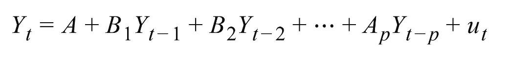
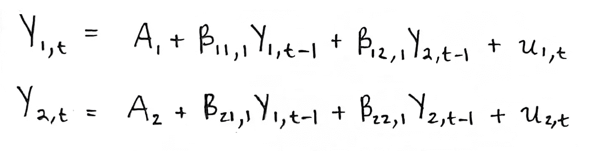
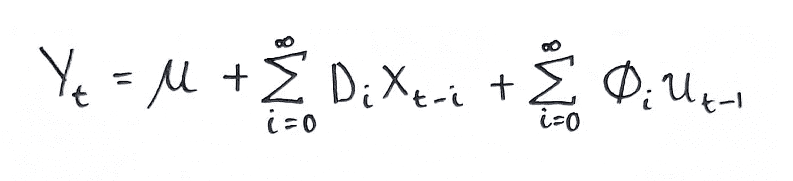
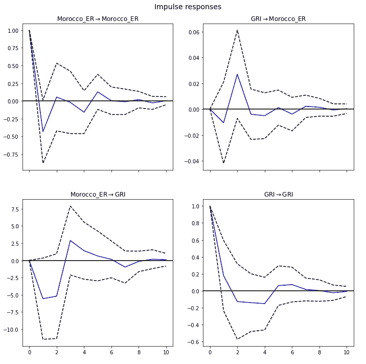

# 多元自回归模型和脉冲响应分析

> 原文：<https://towardsdatascience.com/multivariate-autoregressive-models-and-impulse-response-analysis-cb5ead9b2b68?source=collection_archive---------6----------------------->

## [实践教程](https://towardsdatascience.com/tagged/hands-on-tutorials)

## 多元宏观经济分析的向量自回归模型和脉冲响应函数的计量经济学重点介绍。

由[卢卡斯·布拉塞克](https://unsplash.com/@goumbik?utm_source=medium&utm_medium=referral)在 [Unsplash](https://unsplash.com?utm_source=medium&utm_medium=referral) 上拍摄

考虑及时发现有意义模式的难度；例如，随着销售的发展，天气的变化，甚至一个人自己的睡眠周期。与其他数据类型相比，时间序列数据有其独特的考虑因素。为了消除歧义，随机性和周期性要求建模技术特别适合模式识别。单变量或单变量时间序列模型简单有效；然而，只有一个因变量的模型可能过于简化，需要强有力的假设，而这些假设在现实世界中可能是不可行的。这在宏观经济学中尤为重要，因为它几乎总是需要对多个因变量进行建模。因此，宏观经济学在很大程度上依赖于专门为多元时间序列数据开发的计量经济学模型。

多元[自回归](https://en.wikipedia.org/wiki/Autoregressive_model)模型的使用并不仅限于经济学——它们在商业环境中非常有用，尽管主要用途是用于预测。另一方面，经济学家也对理解[脉冲响应](https://en.wikipedia.org/wiki/Impulse_response)感兴趣，这需要超越预测来评估因果影响。通过我在世界银行的咨询工作，我发现实证宏观经济研究需要理解如何将多元自回归模型转化为脉冲响应函数。因此，本文的目的是介绍[向量自回归(VAR)](https://en.wikipedia.org/wiki/Vector_autoregression) 模型和脉冲响应分析。其目的是为这个主题提供一个起点，可以有选择地扩展这个主题，为进一步的探索提供有用资源的建议。

首先，我介绍了将多元时间序列模型用于宏观经济学的背景知识。接下来，我将简要介绍 VAR 模型的设置和功能。接下来，我讨论脉冲响应分析，重点是脉冲响应函数的外推和对[格兰杰因果关系](https://en.wikipedia.org/wiki/Granger_causality)的评估。最后，我给出了关于在 Python 和 R 中实现 VAR 模型的实际细节，并给出了解释最终脉冲响应函数的建议。

## **时间序列计量经济学**

[自回归](https://en.wikipedia.org/wiki/Autoregressive_model)是描述时变随机过程的术语。相应地，时间序列计量经济学提供了自回归统计模型来描述经济时间序列数据。当处理时间序列数据时，有两个统计特性需要考虑:平稳性和协整性。[平稳性](https://en.wikipedia.org/wiki/Stationary_process)是指时间序列的一种属性，使得均值、方差和自相关结构将随时间保持不变。这意味着一个平稳的时间序列会随着时间的推移以一种保持一致的方式发生变化。需要明确的是，这并不意味着级数本身保持不变。更明确地说，一个平稳的时间序列在一段时间内具有恒定的方差，并且没有趋势或周期性波动，例如由季节性引起的波动。时间序列往往不是平稳的，这就需要对时间序列进行转换，以考虑平稳性的假设。转换方法包括[对数据进行差分](https://en.wikipedia.org/wiki/Data_differencing)，或者对时间序列取对数或平方根。关于时间序列平稳性的更多细节，我建议这篇有帮助的[中帖](/stationarity-in-time-series-analysis-90c94f27322)。

[协整](https://en.wikipedia.org/wiki/Cointegration)是一个时间序列集合的统计属性，在多元设置中特别相关。给定一组建模为方程组的非平稳时间序列，如果该系统的平稳线性组合(具有[低阶积分](https://en.wikipedia.org/wiki/Order_of_integration_(calculus)))存在，那么组合的时间序列(多元时间序列)可以说是协整的。更具体地说，由于多变量模型有几个变量，所以这些变量的任意组合之间可能存在协整关系。在实际意义上，这个性质对于理解随机或确定性趋势是很重要的。从统计学的意义上来说，协整意味着一组时间序列的均值差异在一段时间内保持不变，而不提供方向性的指示。换句话说，当多变量时间序列被协整时，在变量的一个或多个组合之间存在长期的、统计上显著的关系。关于时间序列协整的更多信息，请看这篇简短的[中期文章](https://medium.com/analytics-vidhya/cointegration-for-time-series-analysis-1d0a758a20f1)。

由于国家一级的经济观察往往频率较低，一个复杂的问题是宏观经济数据往往很少。例如，国内生产总值(GDP)通常作为年度数字发布。尽管如此，当我们的目标是理解一个经济体的整体行为时，我们很自然地会关注时间序列数据。因此，宏观经济学家在理解时间序列的统计特性方面有既得利益，这些特性根据序列的频率和持续时间而变化。作为免责声明，本简介并不是对时间序列的所有重要统计特性的全面回顾。例如，在宏观经济学中，[条件异方差](https://www.sciencedirect.com/science/article/abs/pii/0304407686900631)和[随机波动](https://academic.oup.com/restud/article-abstract/65/3/361/1565336)的概念对于研究时间序列也很重要。在本文中，我主要关注平稳性和协整性，因为这两个统计特性对于理解向量自回归(VAR)模型的基本假设非常重要，这将在下一节中介绍。

## **向量自回归模型**

对于多个时间序列，选择的计量经济模型是向量自回归(VAR)模型。在机器学习领域，该模型有时被称为 VAR 预测算法。基本的 VAR 模型可以描述为[协方差平稳](https://www.statlect.com/glossary/covariance-stationary)，这意味着我们假设时间序列过程是平稳的并且遍历[时不变](https://en.wikipedia.org/wiki/Time-invariant_system)均值、[方差、](https://en.wikipedia.org/wiki/Autocovariance) ( [Zivot & Wang，2003](https://link.springer.com/chapter/10.1007/978-0-387-21763-5_11) )。VAR 模型的一个简化是，除了[确定性](https://en.wikipedia.org/wiki/Deterministic_system)回归变量([普法夫，2008](https://www.jstatsoft.org/article/view/v027i04) )之外，它只通过内生变量自身的历史来解释内生变量。使模型自回归的是每个时间序列被建模为过去值的函数，这意味着预测器是序列的时间延迟值，也称为“滞后”。在单变量自回归模型中，预测因子或滞后因子会影响因变量，但反之则不会；相反，在像 VAR 这样的多元模型中，变量(即时间序列)以双向关系相互影响。

由于多个时间序列相互影响，因此可以将它们建模为一个方程组，每个时间序列(变量)有一个方程。简而言之，VAR 中的每个时间序列都被建模为其自身的过去值和系统中其他时间序列的过去值的线性组合。从数学上讲，风险值过程可以用下面的等式来描述:

VAR 过程。来源: [statsmodels 文档](https://www.statsmodels.org/dev/vector_ar.html#structural-vector-autoregressions)

从形式上看，VAR 过程对一个 *T * K* 多元时间序列 *Yₜ* 进行建模，其中 *T* 表示观测值的个数， *K* 表示变量的个数；其中 *uₜ∼N(0,σᵤ)* 和 *Aᵢ* 是一个 *K * K* 系数矩阵( [statsmodels 文档](https://www.statsmodels.org/dev/vector_ar.html#structural-vector-autoregressions))。在这里,“变量”一词可互换使用来指代单个时间序列，因此 *K* 是单个时间序列的数量，而 *Yₜ* 是该序列的集合。滞后数的范围从 1 到 *p* ，其中滞后被用作上述方程中的预测量， *p* 的值代表方程组的阶数。β值代表 *Yₜ* 的滞后系数，范围从 *β* ₁到 *βₚ* 。最后一项“*uₜ”*是误差项，可以认为是“白噪声”。

考虑下面的等式，它显示了最简单的场景，我们有一个滞后和两个时间序列: *Y₁* 和 *Y₂.*目标是在时间 *t* 预测这些序列；因此，计算 *Y₁,ₜ* 需要 *Y₁* 和 *Y₂.的过去值*同样，计算 *Y₂,ₜ* 需要两个系列的过去值。

双时间序列一阶 VAR 模型的方程组。改编自[来源](https://www.machinelearningplus.com/time-series/vector-autoregression-examples-python/)，图片由作者提供。

在上面的方程组中， *Y₁,ₜ -₁* 是 *Y₁* 的第一滞后， *Y₂,ₜ -₁* 是 *Y₂的第一滞后；*这两个第一滞后都包含在每个方程*中。由于每个系列只有一个滞后，这意味着方程是一阶的(即 *p* 为 1)。当 *p* 为 1 阶时，VAR 模型本身可以描述为一阶模型。对于 VAR 过程背后的直觉的极好概述，我推荐 Selva Prabhakaran 的这篇[博客文章](https://www.machinelearningplus.com/time-series/vector-autoregression-examples-python/)。*

建立 VAR 模型时，滞后阶数 *p* 非常重要，由观测值数量 *T* 和方程数量 *K* 共同决定。在实践中，确定最佳滞后阶数 *p* 是通过迭代拟合具有递增滞后阶数的模型并选择具有最低 [Akaike 信息标准](https://en.wikipedia.org/wiki/Akaike_information_criterion) (AIC)分数的模型来实现的。还有其他指标可用于模型选择，但 AIC 评分被认为是最佳实践。要了解更多信息，我建议这篇[中期文章](/the-akaike-information-criterion-c20c8fd832f2)涵盖 AIC 车型选择标准的一些细节。更深入的了解，建议参考柴田日泰的论文题目([柴田，1976](https://academic.oup.com/biomet/article-abstract/63/1/117/236232) )。

基本风险值模型有多种变化，每种都有特定的变化，旨在克服基本模型的缺点。在没有外生变量( *X)* 的情况下，扰动[方差-协方差矩阵](https://en.wikipedia.org/wiki/Covariance_matrix)包含了 *Yₜ* ( [Baum，2013](https://pdf4pro.com/view/ec-823-applied-econometrics-fmwww-bc-edu-235e95.html) )中变量间同期相关性的所有相关信息。在这种情况下，可以使用[结构风险值(SVAR)](https://en.wikipedia.org/wiki/Vector_autoregression#Structural_vs._reduced_form) 模型；当理论可以用来限制同期相关性时，这是有用的。或者，如果 *Yₜ* 中的变量不是协方差稳定的，但是它们的一阶差是，它们可以用[向量误差校正模型](https://en.wikipedia.org/wiki/Error_correction_model#VECM) (VECM)建模。这是因为变量之间存在平衡关系，这可以使它们保持稳定而不产生差异。也就是说，当变量之间存在协整时，向量误差修正模型是合适的，因为这样就有可能处理非平稳(即不是协方差平稳的)多元时间序列通过纳入协整关系( [Baum，2013](https://pdf4pro.com/view/ec-823-applied-econometrics-fmwww-bc-edu-235e95.html) )。

本质上，模型的选择取决于可用于做出主观限制决策的领域知识的深度，以及时间序列的统计特性。尽管我有追求简单的本能，但我发现超越基本 VAR 模型是有实际理由的。或许甚至到了考虑其他宏观经济方法的地步，比如叙事方法或 T2 的乔莱斯基分解法。例如，未能考虑政府支出的预期变动，将导致与[叙述方法](https://www.aeaweb.org/articles?id=10.1257/aer.107.4.967) ( [Ramey，2011](https://academic.oup.com/qje/article-abstract/126/1/1/1902509) )不一致的风险值结果。

## **脉冲响应分析**

虽然 VAR 模型也用于机器学习领域，但主要用途是用于预测。区分经济学，就是使用 VAR 模型分析脉冲响应和评估[格兰杰因果关系](https://en.wikipedia.org/wiki/Granger_causality)。脉冲响应可以定义为系统对外部变化的反应。在宏观经济背景下，该系统是一个包含多变量自回归模型的方程组，外部变化被称为外生冲击。VAR 模型中的所有变量都是相互依赖的；因此，单个系数估计值提供的系统对冲击反应的信息有限( [Zivot & Wang，2003](https://link.springer.com/chapter/10.1007/978-0-387-21763-5_11) )。因此，需要脉冲响应，它提供了有关风险值模型动态行为的信息。随后，脉冲响应函数(IRF)的目的是描述风险值模型对一个或多个变量冲击的反应演变( [Lütkepohl，2010](https://link.springer.com/chapter/10.1057/9780230280830_16) )。换句话说，IRF 让我们能够在一个方程组中追踪单个冲击的传递，这一特性使其有助于评估经济政策。

为了计算 IRF，我们以移动平均线的形式重写前面描述的 VAR 方程。这显示在下面的等式中:

脉冲响应函数。改编自[来源](https://pdf4pro.com/view/ec-823-applied-econometrics-fmwww-bc-edu-235e95.html)，图片由作者提供。

这种形式是 VAR 模型的向量移动平均表示，其中所有过去的 *Yₜ* 的值都被替换掉了。重要的是，采用移动平均线可以消除短期波动，突出长期趋势。在上式中， *X* 表示一组可选的外生变量， *Dᵢ* 矩阵表示动态乘数函数，也称为[传递函数](https://en.wikipedia.org/wiki/Transfer_function)。符号 *𝚽* 代表移动平均系数，其序列 *𝚽ᵢ、*代表层位 *i* 的脉冲响应函数。为了更深入地理解脉冲响应分析，我推荐一篇来自*计量经济学杂志* ( [Koop 等人，1996](https://www.sciencedirect.com/science/article/abs/pii/0304407695017534) )和另一篇来自*经济快报* ( [Pesaran & Shin，1998](https://www.sciencedirect.com/science/article/abs/pii/S0165176597002140) )的文章。

如前所述，基本风险值模型的缺点是无法描述变量之间的同期关系。在脉冲响应分析中，如果需要描述这些关系，了解冲击对多变量系统的同期影响是很重要的。一般来说，这是通过生成正交脉冲响应函数以适当的顺序排列模型变量来实现的。更具体地，在从误差[协方差矩阵](https://en.wikipedia.org/wiki/Covariance_matrix)的较低[乔莱斯基分解](https://en.wikipedia.org/wiki/Cholesky_decomposition)获得误差之间的相关性的情况下，应用[正交性](https://en.wikipedia.org/wiki/Orthogonality)。另一种方法是使用 SVAR 模型，其中主观限制用于直接模拟同期变量之间的关系。

因果关系在经济学中非常重要，对于时间序列数据，[格兰杰因果关系](https://en.wikipedia.org/wiki/Granger_causality)是用于确定特定类型因果关系的统计测试。根据人们对因果关系的哲学定义，人们可能会认为格兰杰因果关系不是真正的因果关系，而仅仅是“预测性”的因果关系。格兰杰因果关系检验专门衡量一个时间序列使用另一个时间序列的先前值预测未来值的能力。准确地说，格兰杰因果检验是在一个变量是否预测另一个变量的背景下对时间关系进行检验([格兰杰，1969](https://www.jstor.org/stable/1912791?seq=1) )。作为一个警告，计量经济学家提到了[后特设谬误](https://en.wikipedia.org/wiki/Post_hoc_ergo_propter_hoc)，即假设仅仅因为一件事先于另一件事，这就是因果关系的充分证据，这是一个谬误。关于风险值模型，格兰杰因果关系允许的最大限度是声称一组变量在风险值方程中是格兰杰因果关系。对于测试格兰杰因果关系的简短教程，我建议这篇[中期文章](/a-quick-introduction-on-granger-causality-testing-for-time-series-analysis-7113dc9420d2)。更深入的了解，推荐詹姆斯·d·汉密尔顿的《时间序列分析》教材( [1994](https://press.princeton.edu/books/hardcover/9780691042893/time-series-analysis) )。

关于因果关系的进一步说明，Valerie A. Ramey 教授对宏观经济学中的因果关系做了一个出色而易懂的概述，我强烈推荐她关于主题的[幻灯片。她提到，识别是将相关性转化为因果关系的关键，这一事实因需要解决动态、一般均衡效应和预期等问题而变得复杂。说到脉冲响应分析，除了基本的 VAR，还有两种常用的方法值得探讨:动态模拟(](https://econweb.ucsd.edu/~vramey/econ214.html) [Romer & Romer，2010](https://www.aeaweb.org/articles?id=10.1257/aer.100.3.763) )和 Jorda 局部投影( [Jorda，2005](https://www.aeaweb.org/articles?id=10.1257/0002828053828518) )。为了更好地理解脉冲响应在宏观经济学中的应用，我建议 Ramey 的两篇论文可以为脉冲响应分析的有用性提供背景:“好年景和坏年景下的政府支出乘数:来自美国历史数据的证据”( [Ramey，2014](https://www.nber.org/papers/w20719) )和最近的“基础设施投资的宏观经济后果”( [Ramey，2020](https://www.nber.org/papers/w27625) )。

## **IRF 模型的实现和解释**

我发现宏观经济数据的最佳来源是国际货币基金组织(IMF)。这个组织共享从他们的网站上免费下载的数据，他们提供一个可以用 Python 或 R 访问的 RESTful API。对于 Python，他们建议使用 T2 的这个指南，对于 R，他们提供一个包“ [imfr”来简化 API 的查询。就我个人而言，我更喜欢使用 R 包，因为它对于数据科学来说是最容易访问的。在 Python 中，](https://cran.r-project.org/web/packages/imfr/index.html) [statsmodels](https://www.statsmodels.org/stable/index.html) 库可用于构建 VAR 模型，并运行大量的[统计测试](https://www.statsmodels.org/dev/vector_ar.html#statistical-tests)。在 R 中，压缩性最强的包是 [vars](https://cran.r-project.org/web/packages/vars/index.html) 库。

在建立风险值模型之前，测试单个时间序列的平稳性和多元时间序列的协整性是有帮助的。有几种[单位根检验](https://en.wikipedia.org/wiki/Unit_root_test)可用于检验平稳性，如[增广迪基-富勒检验](https://en.wikipedia.org/wiki/Augmented_Dickey%E2%80%93Fuller_test)、 [KPSS 检验](https://en.wikipedia.org/wiki/KPSS_test)和[菲利普-佩伦检验](https://en.wikipedia.org/wiki/Phillips%E2%80%93Perron_test)。最常见的协整检验是[约翰森检验](https://en.wikipedia.org/wiki/Johansen_test)，它允许多变量时间序列中有一个以上的协整关系。构建 VAR 模型的一个关键部分是通过优化模型选择指标(如阿凯克信息标准(AIC))来确定滞后阶数。幸运的是，使用 Python 库 statsmodels 很容易完成模型选择，该库有一个内置函数[选择滞后顺序](https://www.statsmodels.org/dev/vector_ar.html#lag-order-selection)；这将根据所选指标的最佳分数来确定最佳延迟顺序。

解释脉冲响应函数(IRF)需要可视化，statsmodels 可以方便地绘制指定滞后长度的 IRF。绘制时，如下图所示，默认情况下，渐近标准差在 95%的显著性水平上绘制。

根据摩洛哥汇率和基于实验性文本分析的政策指数(标记为“GRI”)构建的 VAR 模型的脉冲响应函数图。图片作者。

在上图中，绘制了 10 个滞后的 IRF，在每个图中，蓝线代表 IRF，黑线代表置信区间。使用 statsmodels，还可以根据需要以正交或非正交形式绘制 IRF。为了测试脉冲响应函数中的预测误差，我们可以使用[预测误差方差分解(FEVD)](https://en.wikipedia.org/wiki/Variance_decomposition_of_forecast_errors) 。这种方差分解表示自回归中每个变量对其他变量贡献的信息量。本质上，这种分解决定了每个变量的预测误差方差中有多少可以由对其他变量的外生冲击来解释([佩萨兰&申，1998](https://www.sciencedirect.com/science/article/abs/pii/S0165176597002140) )。

## **最后的想法**

这篇文章概述了一个个人的旅程，是为了理解以政策为中心的实证宏观经济研究的实验结果而进行的。时间序列计量经济学是一门迷人的学科，我特别欣赏 Python 包 statsmodels 和 R 包 vars 提供的应用便利性。国际货币基金组织的数据 API 和这两个软件包使得玩弄宏观经济数据变得简单，这样我就能够在深入理论之前对这些方法建立一种直觉。数据科学工具的可访问性影响了我学习计量经济学的速度。因此，我非常感谢创建和维护这些工具的开源社区。

我希望这篇文章是对多元自回归模型和脉冲响应分析主题的有益介绍。一如既往，我欢迎反馈和问题，请随时通过 [Linkedin](https://www.linkedin.com/in/haaya-naushan-a4b5b61a5/) 与我联系。