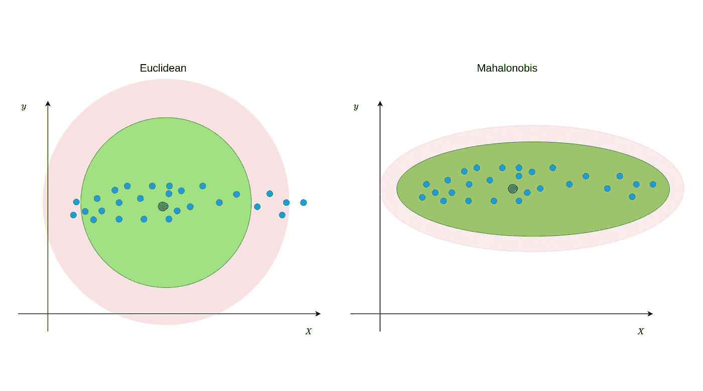
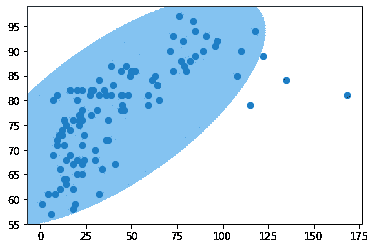

# Python 中的多元异常检测

> 原文：<https://towardsdatascience.com/multivariate-outlier-detection-in-python-e946cfc843b3?source=collection_archive---------0----------------------->

## Python 中的多元异常值和马氏距离

检测多元数据中的异常值通常是数据预处理中的挑战之一。有各种距离度量、分数和技术来检测异常值。欧几里德距离是最著名的距离度量之一，用于根据异常值到中心点的距离来识别异常值。还有一个 Z 值来定义单个数值变量的异常值。在某些情况下，聚类算法也是首选。所有这些方法都从不同的角度考虑异常值。基于一种方法发现的异常值可能不会被其他方法发现为异常值。因此，应该通过考虑变量的分布来选择这些方法和指标。然而，这也带来了对不同指标的需求。在本文中，我们将讨论用于检测多变量数据中异常值的距离度量，称为 Mahalanobis 距离。

## 马哈拉诺比斯距离

马哈拉诺比斯距离(MD)是一种有效的距离度量，用于计算点和分布之间的距离([参见](https://en.wikipedia.org/wiki/Mahalanobis_distance))。它对多元数据非常有效，因为它使用变量的协方差矩阵来查找数据点和中心之间的距离(见公式 1)。这意味着 MD 基于数据点的分布模式来检测异常值，这与欧几里德距离不同。请参见图 1 以了解区别。

图 1 —欧几里得距离与马氏距离(图片由作者提供)

从图 1 可以看出，数据点分散在某个方向。虽然欧几里德距离可以将一些非离群点指定为这种分布中的离群点，但是 Mahalanobis 距离可以跟上它。从图 2 可以看出，非线性关系也是如此。

图 2—欧几里得距离与马氏距离(图片由作者提供)

这种差异的主要原因是协方差矩阵，因为协方差表明变量如何一起变化。在计算 n 维空间中的中心和点之间的距离时使用协方差提供了基于变化找到真实的阈值边界。从公式 1 中所示的 MD 的距离公式可以看出，协方差矩阵呈现为 C，并且其负一次幂已经取值。向量 Xpi 表示 n 维空间中观察值的坐标。例如，假设有一个包含三个变量的数据集，它的第一行和第二行可以表示为:`Xp1:[13,15,23] and Xp2:[12,14,15]`。但是，在识别异常值时，应该找到中心与每个观测值之间的距离，而不是找到每个点之间的距离。取每个变量的平均值就可以得到中心点。

公式 1 —两点之间的马氏距离

> 注意:与图 1 和图 2 中给出的示例数据不同，当变量大部分分散在一个圆中时，欧几里德距离可能是更合适的选项。

## Python 的 Mahalanobis 距离

没错，是时候用 Python 求 Mahalanobis 距离了。如果你对 R 而不是 Python 感兴趣，可以看看我的另一篇文章。

 [## R 中的马氏距离和多元异常检测

### Mahalonobis 距离(MD)是一种有效的距离度量，用于计算点和分布之间的距离(参见…

towardsdatascience.com](/mahalonobis-distance-and-outlier-detection-in-r-cb9c37576d7d) 

在“Scipy”库中有一个计算 Mahalanobis 距离的方法。你可以从`scipy.spatial.distance.mahalanobis.`访问这个方法，你也可以在这里看到它的细节[。在以下步骤中，我们将使用公式 1 中给出的公式创建自己的方法来计算 Mahalanobis 距离，而不是使用此方法。](https://docs.scipy.org/doc/scipy/reference/generated/scipy.spatial.distance.mahalanobis.html)

我将使用名为“空气质量”的数据集，只使用变量“臭氧”和“温度”来检测异常值。或者，你可以从[这里](https://forge.scilab.org/index.php/p/rdataset/source/tree/master/csv/datasets/airquality.csv)下载这个数据集或者使用你的数据集。

首先，我们应该导入必要的库和数据集。为了使数据集为计算做好准备，只需选择变量“臭氧”和“温度”。另外，不要面对任何错误，如果有错误，NA 值应该被丢弃。此外，我更喜欢使用 NumPy 数组，而不是使用 pandas 数据帧。所以我把它转换成了 NumPy 数组。

第二步，我们需要获得必要的值来计算中心和点之间的距离。这些是“臭氧”和“温度”变量之间的中心点和协方差矩阵。

第三步，我们准备寻找数据集中中心点和每个观察点之间的距离。我们还需要从卡方分布中找到一个临界值。卡方用于查找截止值的原因是，Mahalanobis 距离返回距离的平方(D)。在寻找截止值时，我们还应该将分位数取为 0.95，因为 0.95 以外的点(双尾)将被视为异常值。分位数越少意味着临界值越小。我们还需要卡方的自由度值，它等于我们的数据集中变量的数量，所以是 2。

最后，我们在索引[24，35，67，81]处有四个异常值。现在，让我们通过 make 和 plot 来更清楚地理解这个过程。

如图 3 所示，这些点位于椭圆之外，被检测为异常值。这个椭圆表示根据 MD 包裹非异常值的区域。

图 3 —温度—臭氧变量中的异常值(图片由作者提供)

## 下一步是什么？

本文讨论了马氏距离及其与欧氏距离的区别。我们还从头开始在 Python 上应用了 Mahalanobis 距离公式。如前所述，根据数据在 n 维空间中的分布选择距离度量非常重要。你也可以看看另一个叫做[库克距离](https://en.wikipedia.org/wiki/Cook%27s_distance)的距离度量。

如果您有任何问题，请随时留下您的评论。

如果您对如何使用 R 中的[马氏距离来检测异常值感兴趣，可以查看我的另一篇文章。](/mahalonobis-distance-and-outlier-detection-in-r-cb9c37576d7d)

 [## R 中的马氏距离和多元异常检测

### 马哈拉诺比斯距离(MD)是一种有效的距离度量，用于计算点和分布之间的距离(参见…

towardsdatascience.com](/mahalonobis-distance-and-outlier-detection-in-r-cb9c37576d7d)