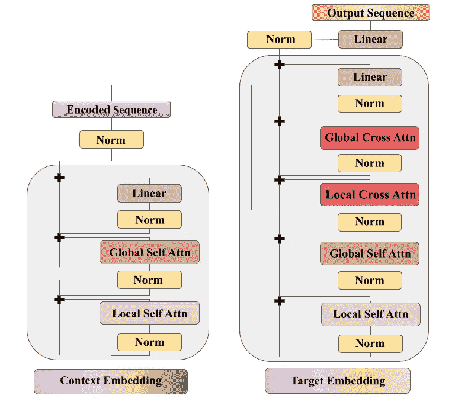
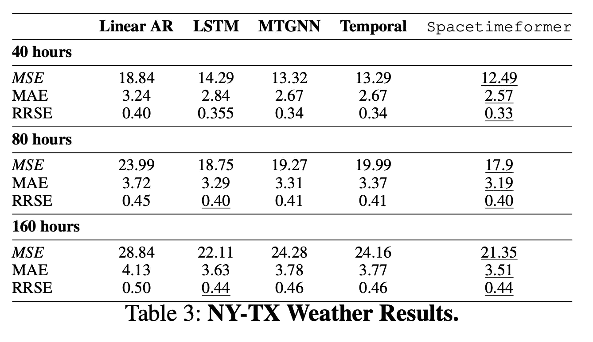
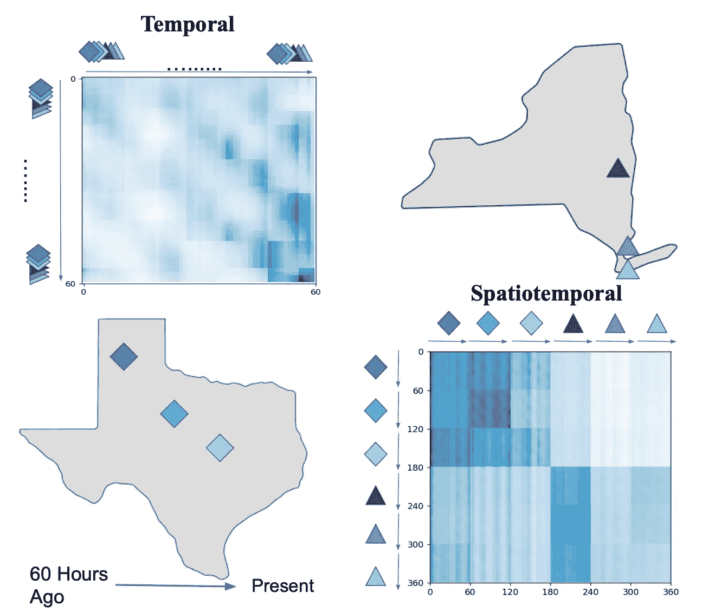

# 基于变压器的多元时间序列预测

> 原文：<https://towardsdatascience.com/multivariate-time-series-forecasting-with-transformers-384dc6ce989b?source=collection_archive---------0----------------------->

## [思想和理论](https://towardsdatascience.com/tagged/thoughts-and-theory)

## 无图时空学习

时间自我注意(左)和时空自我注意(右)。将每个时间步长分割成独立的时间序列变量，可以让我们了解各个变量之间的注意力模式。[本文所有图片均由作者提供]

机器学习的许多现实应用涉及基于历史背景对一组相关变量的结果进行预测。我们可能希望预测连接道路上的交通状况、附近地区的天气或对类似产品的需求。通过对多个时间序列一起建模，我们希望一个变量的变化可以揭示相关变量行为的关键信息。多元时间序列预测(TSF)数据集有两个难点:我们需要学习*时间*关系以了解值如何随时间变化，以及*空间*关系以了解变量如何相互影响。

流行的 TSF 统计方法可能难以解释长的上下文序列并扩展到复杂的变量关系。深度学习模型通过利用大型数据集来预测遥远未来的罕见事件，从而克服了这些挑战。许多方法专注于学习跨长时间跨度的时间模式，并且基于递归或卷积层。在高度空间域中，[图形神经网络(GNNs)](https://arxiv.org/abs/1901.00596) 可以将变量之间的关系分析为连接节点的图形。该图通常是预定义的，例如交通预测中的道路和十字路口地图。

在这篇文章中，我们希望解释我们最近在混合模型上的工作，该模型纯粹从数据中学习跨空间和时间的图形。我们将多元 TSF 转换成一个超长序列预测问题，这个问题可以通过最近对 Transformer 架构的改进来解决。这种方法在从温度预测到交通和能源预测等领域都取得了有竞争力的成果。

这是我们的研究论文的非正式摘要， ***“用于动态时空预测的长程变压器”，*** 格雷斯比，王，齐，2021。[论文可在 arXiv](https://arxiv.org/abs/2109.12218) 上获得，复制实验和将模型应用于新问题[所需的所有代码可在 GitHub](https://github.com/QData/spacetimeformer) 上找到。

# 变压器和时间序列预测

变压器是自然语言处理(NLP)任务的最新解决方案。它们基于多头自我关注(MSA)机制，在该机制中，沿着输入序列的每个标记与每一个其他标记进行比较，以便收集信息和学习动态上下文信息。[变压器学习其输入之间的信息传递图](https://thegradient.pub/transformers-are-graph-neural-networks/)。因为它们不按顺序分析它们的输入，变压器在很大程度上解决了在长期预测中阻碍递归神经网络(RNNs)的消失梯度问题。由于这个原因，Transformers 已经被应用于具有长历史信息的数据集，[包括 TSF](https://arxiv.org/abs/2012.07436) 。

多元 TSF 数据集通常按时间组织:所有 ***N*** 变量的值都表示为一个向量。然而，这仅允许变压器学习整个变量堆栈之间的关系。在复杂的多变量 TSF 问题中，每个变量与其历史以及其他变量历史中的不同事件都有意义的关系。对 TSF 数据的转换器的标准应用程序无法了解这一点，因为它将给定时间步长的每个变量的值视为其图形中的单个令牌；每个变量不能对它应该优先考虑的环境有自己的看法。这与 NLP 任务不同，在 NLP 任务中，变形金刚非常受欢迎，每个标记都代表一个统一的概念(一个单词)。

我们通过创建一个新的预测问题来解决这个问题，其中每个令牌代表每个时间步长的单个变量的值。然后，变压器可以随时关注任何变量的值，以便做出更准确的预测。这篇文章顶部的图表显示了这两种注意力的区别。

# 时空形成器

我们使用一种输入格式，其中在 ***T*** 时间步长的 ***N*** 变量被展平为一系列**(*N*x*T*)**令牌。每个变量的值用前馈层投影到高维空间。然后，我们添加关于对应于每个令牌的时间步长和变量的信息。时间和变量嵌入是随机初始化的，并与模型的其余部分一起训练，以改进我们对时间和空间关系的表示。我们希望预测的未来时间步长的值被设置为零，我们告诉模型哪些值在二进制“给定”嵌入中丢失了。不同的组成部分被相加和布局，使得 Transformer MSA 跨时间和可变空间构建一个*时空*图。嵌入管道如下图所示。

**时空序列输入:** (1)包含时间信息的多元输入格式。解码器输入丢失("？)将进行预测的值设置为零。(2)时间序列通过 [Time2Vec](https://arxiv.org/abs/1907.05321) 层，以生成表示周期性输入模式的频率嵌入。(3)二进制嵌入表示该值是作为上下文给出的还是需要预测的。(4)每个时间序列的整数索引被映射到具有查找表嵌入的“空间”表示。(5)用前馈层投影每个时间序列的 Time2Vec 嵌入和变量值。(6)值&时间、变量和给定的嵌入被求和并布局，使得 MSA 以更长的输入序列为代价处理跨时间和变量空间的关系。

标准转换器将每个标记与其他标记进行比较，以找到序列中的相关信息。这意味着模型的运行时和内存使用随着其输入的总长度成二次方增长。我们的方法通过使序列 ***N*** 比时间序列本身长一倍，大大夸大了这个问题。我们方法的其余部分处理工程挑战，使得在没有最高端 GPU/TPU 的情况下训练该模型成为可能。

在长输入序列应用中，高效变压器是一个活跃的研究领域。这些“远程转换器”看起来适合 GPU 内存中较长序列的梯度计算。他们经常通过[添加启发法来使注意力图稀疏](https://ai.googleblog.com/2021/03/constructing-transformers-for-longer.html)来做到这一点，但是这些假设在 NLP 之外并不总是成立的。我们使用[执行者注意力机制](https://ai.googleblog.com/2020/10/rethinking-attention-with-performers.html)，它用随机特征的内核线性近似 MSA。Performer 的效率足以适应数千个令牌的序列，并让我们在几个小时内在一个具有 10GB GPUs 的节点上训练我们的模型。

历史数据的上下文序列和我们想要预测的目标时间戳被转换成长的时空序列。基于执行器的编码器-解码器架构处理该序列，并预测每个变量在未来时间步长的值作为单独的令牌。然后，我们可以将预测重新堆叠为其原始格式，并进行训练以最小化预测误差指标，如均方误差。该模型还可以通过输出正态分布的均值和标准差来创建一系列预测，在这种情况下，我们训练以最大化地面实况序列的概率。完整的模型架构如下所示。

**时空模型架构:** *目标和情境嵌入通过一系列有效的注意层。“全局注意”模块查看每个变量的每个时间步长，而“局部注意”模块单独查看每个变量的时间步长。我们发现这在具有大的* N 的数据集中是有帮助的。

# 应用程序

我们将该模型与更标准的 TSF 和 GNN 方法进行比较。*线性* *AR* 是一个基本的线性模型，被训练来进行自回归预测，这意味着它一次输出一个令牌，并将其输出作为下一次预测的输入。 *LSTM* 是一个标准的基于 RNN 的编解码器模型，没有注意。 [*LSTNet*](https://arxiv.org/abs/1703.07015) 是基于 Conv1D 层和 RNNs 的自回归模型，通过跳过连接来记住长期上下文。[*DCR nn*](https://arxiv.org/abs/1707.01926)*是一个基于图形的模型，当预定义的变量图形可用时可以使用。像我们的方法一样， [*MTGNN*](https://arxiv.org/abs/2005.11650) 是一种 TSF/GNN 混合，它从数据中学习其图形结构，但不使用变压器进行时间预测。最后，我们包括了我们自己的模型的一个版本，该版本不将令牌分成时空图；每个变量的值照常堆叠在一起。这种"*【太阳穴】*消融是 [*告密者*](https://arxiv.org/abs/2012.07436)*的替身，但它利用了我们其余所有的工程技巧和训练过程来隔离时空注意力的好处。**

**首先，我们来看一个天气预报任务。我们使用 ASOS 网络收集了来自德克萨斯和纽约机场的大量温度数据。这两个群体之间的地理分离使得空间关系更加重要，并且这些关系必须从经验中学习，因为我们不提供任何位置信息。我们预测未来 40、80 和 160 小时，并比较均方误差(MSE)、平均绝对误差(MAE)和均方根误差(RRSE)。这个实验集中在 TSF 模型上，因为没有可用的图表。**

****

**时空形成器优于基线，它相对于*时间*注意力版本的优势似乎随着我们预测的长度而增加。我们的目标是学习一个时空注意力图，我们可以通过可视化时空形成器的注意力网络来验证这是什么。注意力矩阵通过揭示每个标记给予整个序列的注意力来可视化 MSA 每行是一个令牌，该行的列显示该令牌对序列中其他令牌的关注，包括它自己。下图显示了时空模型和仅时间模型的气象站变量和注意力矩阵，其中深蓝色对应更多的注意力。标准的时间机制学习一种滑动的波状模式，其中每个令牌主要集中在它自己(沿着对角线)和序列的最末端。Spacetimeformer 将该序列展平为单独的变量，每个变量都有自己的记号子序列(用绿色箭头和变量形状表示)。这导致了“块结构”的注意力矩阵，其中一个变量的所有标记倾向于优先考虑其他变量子集的时间步长。我们可以解释这些模式来理解模型正在学习的空间关系。在这种情况下，该模型可以正确地将德克萨斯州和纽约站聚集在一起——如果放大，您可以在每个子序列中看到相同的波状时间模式。**

****

**接下来，我们看看交通和能源预测中的三个基准数据集。AL Solar 测量阿拉巴马州 137 个地点的太阳能输出，而 Metr-LA 和 Pems-Bay 数据集分别测量洛杉矶和旧金山周围 200 多个道路传感器的车辆速度。我们生成 4 小时太阳预报和 1 小时交通预报。结果如下表所示。**

********

**时空形成器在所有情况下学习精确的预测模型。交通结果很有趣，因为复杂的道路网络使这些问题成为图形神经网络研究中的常见基准，在图形神经网络研究中，地图可以变成图形，并提前提供给模型。我们的模型具有相当的预测能力，同时隐含地从数据中学习路线图。**

**如果你想将这种方法应用到新的问题中，模型和训练过程的源代码会在 [GitHub 的 QData/spacetimeformer](https://github.com/QData/spacetimeformer) 上发布。在我们的[论文](https://arxiv.org/abs/2109.12218)中可以找到更多背景和相关工作的详细解释。**

**— — — — — — — — — — — — — — — — — — — — — — — — — — — — — — — — — — — — — — — — — — — — — — — — — — — — — — — — — — — —**

**杰克·格雷斯比，王哲，和齐。这项研究是由弗吉尼亚大学的 QData 实验室完成的。**