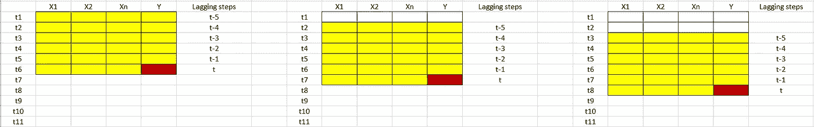
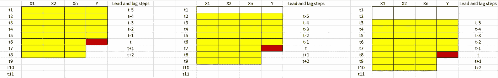

# 基于 LSTM 的超前滞后时间步长多元时间序列预测

> 原文：<https://towardsdatascience.com/multivariate-timeseries-forecast-with-lead-and-lag-timesteps-using-lstm-1a34915f08a?source=collection_archive---------10----------------------->

**为什么是多元变量，它如何帮助做出更好的预测**？

时间序列预测在大多数行业的决策中起着至关重要的作用。例如，预测运输公司要购买的集装箱数量可以为公司节省数百万美元。同样，预测特定产品类型的需求在定价中扮演着非常重要的角色，因此也是电子商务公司盈利的关键。

在大多数情况下，是企业或运营团队知道影响需求或供应的因素。简单地根据历史模式进行预测并不总是能得到想要的结果，或者并没有考虑到未来的前景。过去的错误有可能在未来的预测中重复。考虑影响因素并让团队有能力研究和理解它们对预测的影响总是好的。

这就是多元时间序列预测出现的时候。让我们用下面的图片来理解多元预测



图 1:具有滞后数据的多元时间序列预测(滞后=5 步)

图 1 描述了因变量 Y 在时间 t 的多变量时间序列预测，滞后=5。红色单元格是时间 t 时的预测值，该值取决于黄色单元格中的值(t-5 到 t)。这些是影响预测 Y at t 的独立变量。

我们可以将多元时间序列视为回归问题，其中独立变量是前一个滞后(直到 t-1)的特征，以及时间 t 的独立值。使用这种方法，对预测的控制远远超过了对前一个时间戳的控制。

下面是多元时间序列，它也考虑了铅值



图 2:具有超前和滞后特征的多元时间序列

从上图我们可以看出，除了滞后特性，lead=2 (t+2)时间步长也被认为是进行预测的时间步长。这使我们能够更好地控制影响预测的因素。在许多情况下，我们知道一些未来的因素也会影响我们当前的时间预测。通过这些方法，决策团队可以真正根据独立要素的各种输入值来模拟预测。

**利用 LSTM 实现预测模型**

现在让我们看看如何实现具有超前和滞后特性的多元时间序列。

1.  用提前和滞后因子准备好数据

使用 LSTM 对时间序列执行回归任务的主要区别在于，在时间序列中，需要考虑超前和滞后时间戳数据。让我们定义一个函数，它可以基于作为参数的超前和滞后来做这件事

```
# convert series to supervised learning
def series_to_supervised(data, n_lag=1, n_lead=1, dropnan=True):
 n_vars = 1 if type(data) is list else data.shape[1]
 df = DataFrame(data)
 cols, names = list(), list()
 # input sequence (t-n, … t-1)
 for i in range(n_lag, 0, -1):
 cols.append(df.shift(i))
 names += [(‘var%d(t-%d)’ % (j+1, i)) for j in range(n_vars)]
 # forecast sequence (t, t+1, … t+n)
 for i in range(0, n_lead):
 cols.append(df.shift(-i))
 if i == 0:
 names += [(‘var%d(t)’ % (j+1)) for j in range(n_vars)]
 else:
 names += [(‘var%d(t+%d)’ % (j+1, i)) for j in range(n_vars)]
 # put it all together
 agg = concat(cols, axis=1)
 agg.columns = names
 # drop rows with NaN values
 if dropnan:
 agg.dropna(inplace=True)
 return agg
```

上面的函数将数据转换成带有定制的 n_lag 和 n_lead 步骤的时间序列。该函数的输出包含滞后和超前步骤的数据，作为具有(t-n)或(t+n)时间戳的列

```
reframed = series_to_supervised(values, n_lag, (n_lead+1))#removing the future (t+n) dependent variable (Y)if n_lead>0:
  reframed= reframed.drop(reframed.iloc[:,[i for i in range(df_no.shape[1]*(n_lag+1),reframed.shape[1],df_no.shape[1])]],axis=1)
```

上述代码有助于在训练模型时删除未来的 Y(t+n)。一旦我们放弃了未来的 Y，我们有了重构的数据，这就像训练 LSTM 回归问题一样简单。

```
# splitting reframed to X and Y considering the first column to be out target featureX=reframed.drop(['var1(t)'],axis=1)
Y=reframed['var1(t)']X_values=X.values
Y_values=Y.values#n_preduct being the test lengthtrain_X,train_Y = X_values[:(X_values.shape[0]-n_predict),:],Y_values[:(X_values.shape[0]-n_predict)]
test_X,test_Y = X_values[(X_values.shape[0]-n_predict):,:],Y_values[(X_values.shape[0]-n_predict):]#reshaping train and test to feed to LSTM
train_X = train_X.reshape((train_X.shape[0], 1, train_X.shape[1]))
test_X = test_X.reshape((test_X.shape[0], 1, test_X.shape[1]))
```

创建一个简单的 LSTM 模型

```
opt = Adam(lr=0.001, beta_1=0.9, beta_2=0.999, decay=0.01)
model = Sequential()
model.add(LSTM(100,return_sequences=True, input_shape=(train_X.shape[1], train_X.shape[2])))
model.add(Dropout(0.25))
model.add(LSTM(units=50,return_sequences=True))
model.add(Dropout(0.20))
model.add(LSTM(units=10,return_sequences=False))
model.add(Dense(units=1, activation='linear'))
model.compile(loss='mae', optimizer=opt)
```

一旦模型准备就绪，我们就可以根据训练数据训练模型，并在测试中对其进行测试。下面的代码显示了一些训练检查点，可以用来帮助训练一个好的模型。

```
#adding few model check points
es = EarlyStopping(monitor='val_loss', min_delta=1e-10, patience=10, verbose=1)
  rlr = ReduceLROnPlateau(monitor='val_loss', factor=0.01, patience=10, verbose=1)
  mcp = ModelCheckpoint(filepath="/test.h5", monitor='val_loss', verbose=1, save_best_only=True, save_weights_only=False)
  tb = TensorBoard('logs')history = model.fit(train_X, train_Y, epochs=50, batch_size=10,callbacks=[mcp,rlr],validation_data=(test_X, test_Y), verbose=2, shuffle=False)
```

一旦模型被训练，我们就可以得到测试数据的预测

```
yhat = model.predict(test_X)
```

**总结**

在本文中，我们看到了什么是多元时间序列，以及如何使用超前和滞后数据进行预测。使用这种方法时，需要注意以下几点

1.  随着 n_lead 和 n_lag 的增加，特定预测的特征数量也会增加。例如，如果我们在每个时间戳有 5 个独立的特征，并且我们认为 n_lag=5 并且 n_lead =2，那么重构后的所有特征将是 5+5*(n_lag)+5*(n_lead)，这是 40 个特征的情况。
2.  需要大量的训练数据，因为使用滞后和超前会减少训练行数。
3.  每次我们改变 n_lead 和 n_lag 时，随着特征数量的增加或减少，必须明智地考虑 LSTM 模型结构以避免过度拟合。