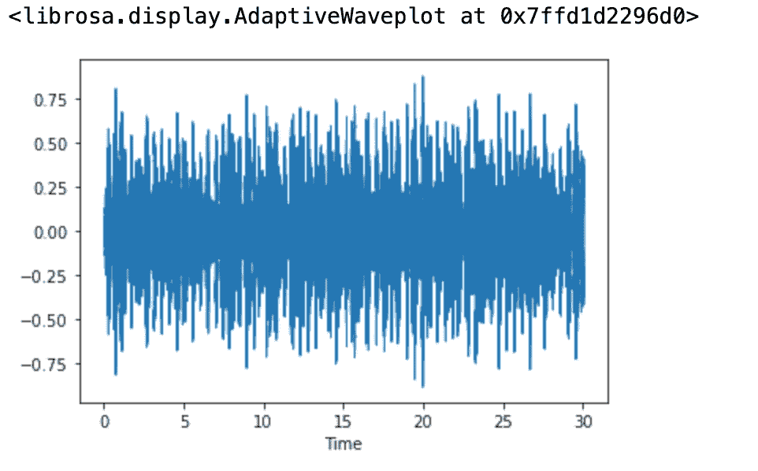
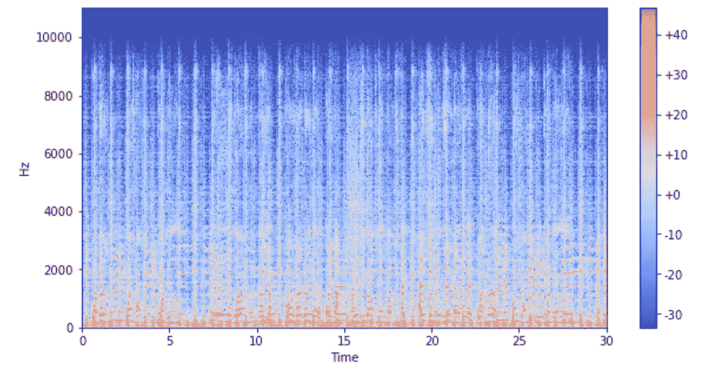
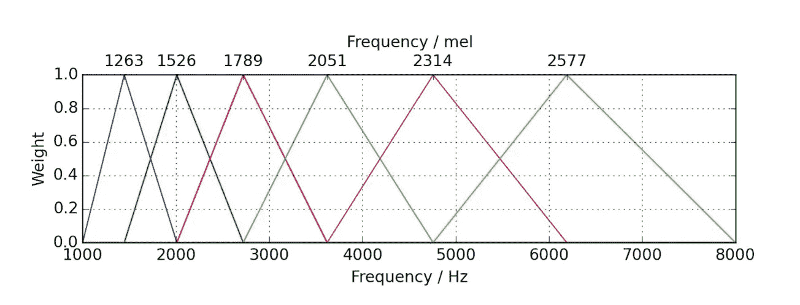
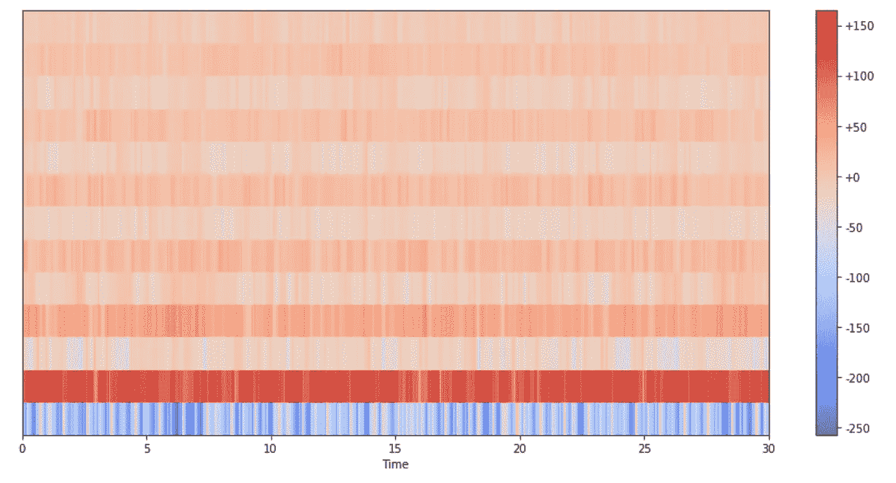
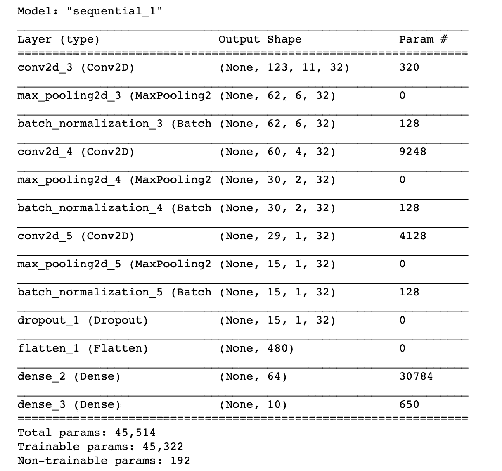
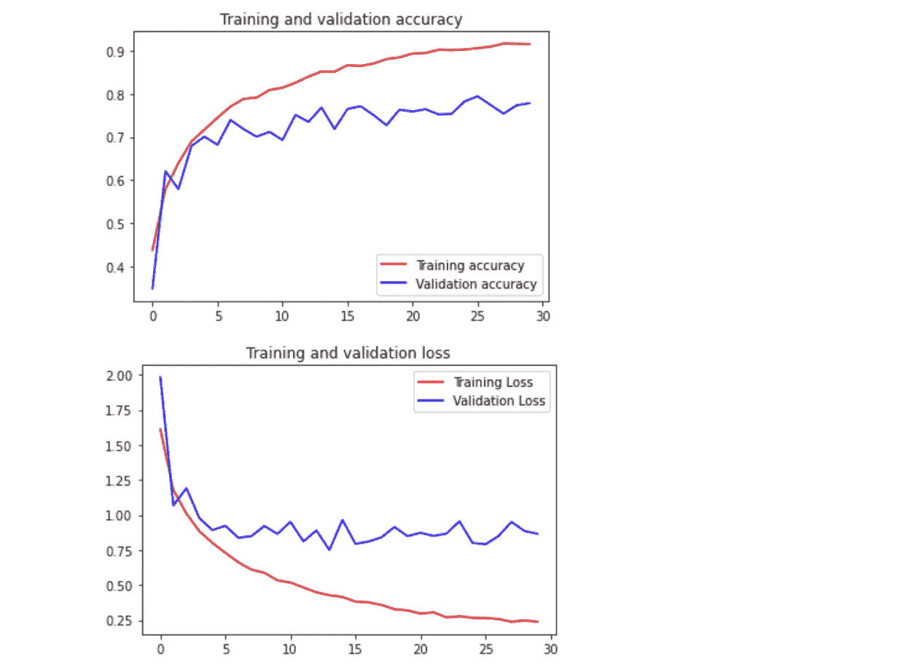

# 基于深度学习的音乐流派检测

> 原文：<https://towardsdatascience.com/music-genre-detection-with-deep-learning-cf89e4cb2ecc?source=collection_archive---------6----------------------->

## TensorFlow 模型如何用几行代码对音频文件进行分类。

无论你的音乐知识水平如何，都很难描述一种音乐类型是什么。为什么爵士乐听起来像爵士乐？你如何区分乡村音乐和迪斯科音乐？由于体裁没有一个系统的定义，不可能用**【if/else】*这样的语句对体裁进行程序化的分类。这就是深度学习发挥作用的时候了。我们将会看到每一种音乐类型都有自己特定类型的声学特征，我们可以从中学习。让我们开始吧！*

**

*照片由 [Mohammad Metri](https://unsplash.com/@mohammadmetri) 在 [Unsplash](https://unsplash.com/) 上拍摄*

# *介绍*

*这个项目的目标是对音频文件进行分类(在“*”中)。wav"* 格式)分成 10 种音乐流派:布鲁斯、古典、乡村、迪斯科、hiphop、爵士、金属、流行、雷鬼、摇滚。为此，我们将使用 [TensorFlow2/Keras](https://www.tensorflow.org/api_docs/python/tf) 作为我们的深度学习框架，使用 [Librosa](https://librosa.org/doc/latest/index.html#) 作为我们的音频预处理库。Librosa 是一个用于音乐和音频分析的 Python 包，它提供了创建音乐信息检索(M. I. R .)系统所必需的构件。*

*为了训练我们的模型，我们将使用 GTZAN 数据集，该数据集由 10 个流派的集合组成，每个流派有 100 个音频文件，长度都为 30 秒。数据集在这里[可用。](https://www.kaggle.com/andradaolteanu/gtzan-dataset-music-genre-classification)*

*预处理、训练和推理步骤都是在 Jupyter 笔记本电脑上进行的，该笔记本电脑具有 Conda-Python3 环境，具有模块化块和功能，以实现更好的清晰度和可移植性。请在这篇文章的结论部分找到我的 GitHub 的链接。*

# *声音和音频信号处理*

*一旦采样，声波就以一系列*浮点*值的形式驻留在你的硬盘上。其大小取决于采样率(通常为 44100Hz 或 22050Hz)和录制持续时间。这些时间序列可以很容易地加载到 *Numpy 数组*中进行处理。让我们使用 Librosa 可视化来自 GTZAN 数据集的一个音频文件:*

```
*song, sr = librosa.load('GTZAN_Dataset/genres_original/rock/rock.00000.wav')librosa.display.waveshow(song)*
```

**

*摇滚歌曲的声音振幅随时间(30 秒)变化的表示*

*通常使用*短时傅立叶变换* (STFT)来更好地理解音频信号的定性行为。这是一个数学工具，允许我们**分析频谱随时间的变化**。以下是方法。*

*首先，我们定义一个 *frame_size* (通常是一批 2048 个样本)。在每一帧上，通过应用*离散傅立叶变换* (DFT)来计算(n 个频率仓的)频率向量。频率向量是我们的音频信号在频域中的即时表示。你可以把它看作是在一个给定的时间(例如一个给定的帧)所有频率区间上的能量分布的声音描述。*

*第二，随着音乐播放，帧改变(下一帧与前一帧相距一个 *hop_length* )并且能量分布也随之改变。因此，我们通过对所有帧连续应用 DFT 来获得 STFT(或频谱图)的视觉表示，并在热图上表示它们，如下所示:*

```
*def plot_spectrogram(Y, sr, hop_length, y_axis="linear"):
    plt.figure(figsize=(10, 5))
    librosa.display.specshow(Y, sr=sr, hop_length=1024, x_axis="time", y_axis=y_axis)
    plt.colorbar(format="%+2.f")Y_log = librosa.power_to_db(np.abs(librosa.stft(song, hop_length=1024))**2)
plot_spectrogram(Y_log, sr, 1024)*
```

**

*所有频率仓随时间(30 秒)的对数振幅变化*

*上图是我们的摇滚歌曲。这张热图显示了每个频段是如何随时间演变的:红色越多，能量越大，声音越大。请注意较高频率(约 10kHz 频段)如何在 0 至 30 秒内保持蓝色，因为这些频段的信号幅度较小。此外，均匀间隔的垂直红线出现在整个文件，这显然是所有的乐器跟着节拍。*

> *想过摇滚到底是什么吗？*
> 
> *现在至少你知道它看起来像什么了！*

*但是我们的光谱图看起来仍然有些模糊，我们距离使它适合深度学习模型的摄取还有几步调整。你可能知道，我们人类听到的声音不是线性的:A1 (55Hz)和 A2(110Hz)之间的感知音高差异与 A4 (440Hz)和 A5 (880Hz)相同。这两个音程都是八度音阶，但是第一个八度音阶相差 55Hz，而另一个八度音阶相差 440Hz。*梅尔标度*定义了相对于感知频率均匀分布的频带。 **Mel 滤波器组经过计算，对较低频率的区分度更高，对较高频率的区分度较低**，就像人耳一样。通过执行如下加权鉴别来平滑谐波结构:*

**

*三角形 Mel 滤波器组*

*Mel 缩放后，最后一步是应用*离散余弦变换*，即**仅生成实值系数**。作为最佳实践，我们通常保留前 13 个系数( *n_mfcc=* 13)，称为*梅尔频率倒谱系数(mfcc)。*它们描述了光谱形状的最简单方面，而高阶系数对训练来说不太重要，因为它们往往描述更多类似噪声的信息。*

***MFCC 是更大光谱结构的有用描述符**，易于阅读并可由深度学习模型“解释”。让我们摘录我们摇滚歌曲中的 MFCC:*

```
*mfcc_song = librosa.feature.mfcc(song, n_mfcc=13, sr=sr)plt.figure(figsize=(15, 8))
librosa.display.specshow(mfcc_song, x_axis="time", sr=sr)
plt.colorbar(format="%+2.f")
plt.show()*
```

**

*13 乐队 MFCC 为一首 30 秒的摇滚歌曲*

*现在看起来很整洁！那么，我们这里到底有什么？ *mfcc_song* 的形状返回(13，1293)，例如对应于每个系数的 13 行和 1293 帧(每个帧 2048 个样本)持续 30 秒。这是一首摇滚歌曲的声音特征。为了学习摇滚流派，GTZAN 数据集还有 99 首歌曲要训练。让我们看看如何做到这一点。*

# *准备训练、验证和测试数据集*

*浏览完所有歌曲后，我注意到它们的长度可能会在 30 秒左右略有不同。为了确保我们处理的文件具有相同的持续时间，我们将在 29 秒内裁剪所有文件。我们还设置采样率 *sr* = 22050Hz，并计算每个切片的样本数。*

```
**# Sampling rate.* sr = 22050*# Let’s make sure all files have the same amount of samples, pick a duration right under 30 seconds.* TOTAL_SAMPLES = 29 * sr*# The dataset contains 999 files (1000–1 defective). Lets make it bigger.
# X amount of slices => X times more training examples.* NUM_SLICES = 10
SAMPLES_PER_SLICE = int(TOTAL_SAMPLES / NUM_SLICES)*
```

*此外，我们需要**生成更多的训练样本**，因为 1000 首歌曲并不多。将每首歌曲分成 10 个子部分似乎是一个合理的大小，以便从它们的声学特征中保留足够的信息。*

*我们的数据集由 10 个文件夹及其流派名称组成，每个文件夹包含 100 首歌曲。所以**标注过程**很简单:文件夹名→标签。我们现在可以将这种**分类公式化为监督问题**，因为每首歌曲都有一个分配给它的流派标签。*

*所有 MFCCs 和相关标签将存储在单独的 *json* 文件中，并在 *for 循环*中处理，如下所示:*

```
**# Let's browse each file, slice it and generate the 13 band mfcc for each slice.*
**for** i, (dirpath, dirnames, filenames) **in** enumerate(os.walk(source_path)):

    **for** file **in** filenames:
      song, sr = librosa.load(os.path.join(dirpath, file), duration=29)

      **for** s **in** range(NUM_SLICES):
          start_sample = SAMPLES_PER_SLICE * s
          end_sample = start_sample + SAMPLES_PER_SLICE
          mfcc = librosa.feature.mfcc(y=song[start_sample:end_sample], sr=sr, n_mfcc=13)
          mfcc = mfcc.T
          mydict["labels"].append(i-1)
          mydict["mfcc"].append(mfcc.tolist())

*# Let's write the dictionary in a json file.* 
**with** open(json_path, 'w') **as** f:
    json.dump(mydict, f)
    f.close()*
```

*最后，通过*Scikit-Learn train _ test _ split()*以 20%的比率生成验证和测试数据集。*

# *模型架构、训练和预测*

*我们将使用一个 *TensorFlow2* 框架来设计我们的*卷积神经网络* (CNN)，具有 3 层卷积和一个最终全连接层，具有 *softmax 激活*，具有 10 个输出(用于 10 个流派)。整体架构如下:*

**

*使用 *batch_size* =32 训练超过 30 个*时期*需要在*英特尔双核 i5* CPU 上花费几分钟，并在验证数据集上收敛到 77%的准确率。让我们用 *Matplotlib* 绘制度量曲线:*

**

# *结论*

*我在相同的数据上测试了其他模型架构，结果如下:*

*   *多层感知器→ 76%训练 acc 和 59%阀 acc*
*   *递归神经网络(LSTM 型)→ 90%训练 acc 和 76%阀 acc*

*本文中介绍的 CNN 架构最终获得了前所未有的最佳数据性能(77%)。为了减少方差，可以应用各种技术来微调模型，例如正则化、数据扩充、更多的漏失层等。让我知道你是否能拿出一个更好的分数，以及你实现它的方法。*

*请随意查看我的 [GitHub 库](https://github.com/msaintfelix/TensorFlow_MusicGenre_Classifier)上的模型基准。我的 [Kaggle](https://www.kaggle.com/marchenrysaintfelix/music-genre-cnn-classifier-with-75-val-acc) 上也提交了 CNN 的模型。感谢您的阅读！*