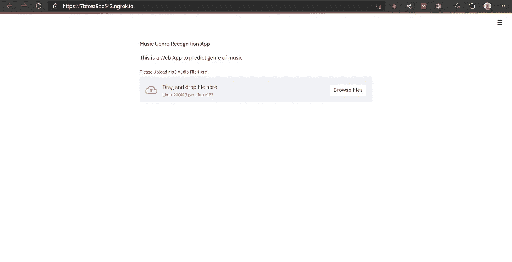
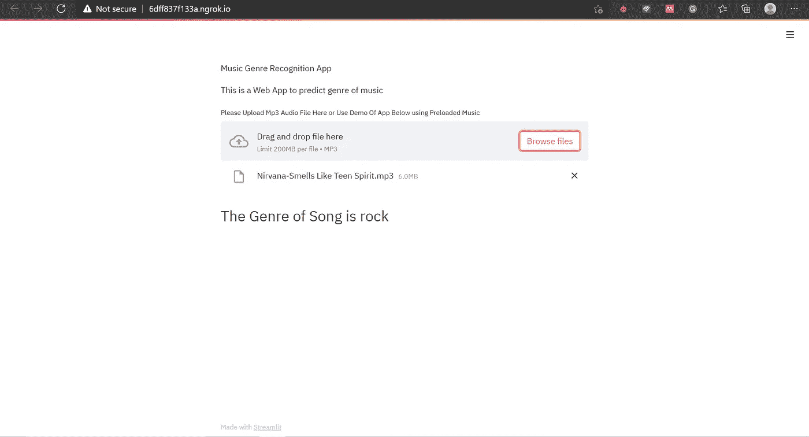
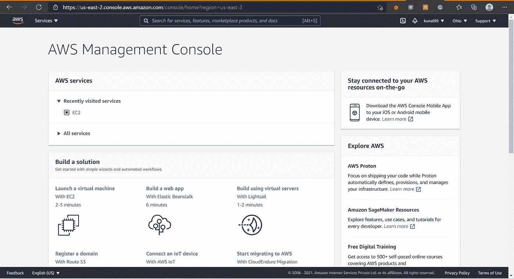
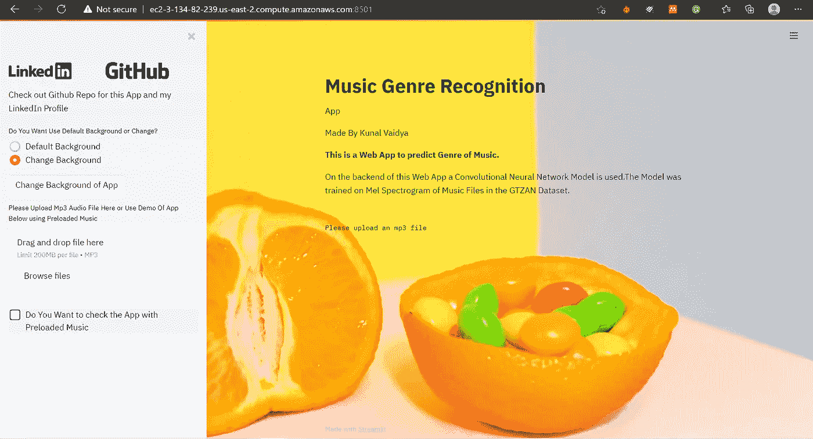
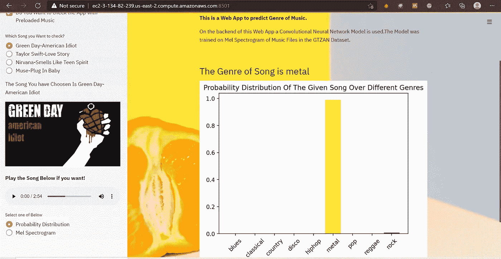

# 使用卷积神经网络的音乐流派识别-第二部分

> 原文：<https://towardsdatascience.com/music-genre-recognition-using-convolutional-neural-networks-part-2-f1cd2d64e983?source=collection_archive---------31----------------------->

## 了解如何使用 Streamlit 构建音乐流派识别应用程序，并将其部署在 Amazon EC2 上


照片由[奥斯丁·尼尔](https://unsplash.com/@arstyy?utm_source=medium&utm_medium=referral)在 [Unsplash](https://unsplash.com?utm_source=medium&utm_medium=referral) 拍摄

> 项目中任何不直接有助于尽快将有价值的软件交付给用户的角色都应该仔细考虑。—斯坦·英格·莫里斯巴克

你好，[在本文的第一部分中](/music-genre-recognition-using-convolutional-neural-networks-cnn-part-1-212c6b93da76)我们开发了一个卷积神经网络来识别音乐类型。在这一部分中，我们将使用令人惊叹的 Streamlit 库开发一个 web 应用程序。

学习深度学习或者机器学习的人大多掌握了如何建立模型，训练模型却不知道如何部署模型(包括这个项目 xP 之前的我)。部署一个模型和训练它一样重要，通过部署你的模型，人们可以利用它。向你的朋友展示你为你的模型开发的应用程序，而不是在 jupyter 笔记本上运行你的模型，这不是很酷吗？。

我将使用 *Streamlit* 库来构建应用程序，然后将其部署在 Amazon EC2 实例上。

# 构建应用程序

首先，如果您没有安装 Streamlit，请在终端中使用以下命令进行安装

`pip install streamlit`

Streamlit 是一个非常易于使用的框架，它是专门为非 web 开发人员设计的。我只是要建立一个基本的 web 应用程序，你可以通过添加自己的风格和创造力来进一步改进它。

首先，创建一个 python 脚本，并在其中编写应用程序的所有代码。

```
import streamlit as stst.write("Music Genre Recognition App") 
st.write("This is a Web App to predict genre of music")file = st.sidebar.file_uploader("Please Upload Mp3 Audio File Here or Use Demo Of App Below using Preloaded Music",type=["mp3"])
```

现在，要查看它在网页上的实际效果，你需要运行这个脚本。要运行，请在终端中键入以下命令。

```
streamlit run app.py
```



来源:作者图片

所以，这是一个非常基本的网络应用程序，它有一个文件上传程序来上传音乐的 mp3 文件。现在，我们需要编写代码从 file_uploader 获取文件输入，对其进行预处理，并使用我们的 CNN 模型给出预测。

首先，让我们导入所有我们需要的库

```
from PIL import Imageimport librosa
import numpy as np
import librosa.display
from pydub import AudioSegment
import matplotlib.cm as cm from matplotlib.colors import Normalize
```

现在，我们将创建一个将 mp3 音频文件转换成*的函数。wav 文件，因为 Librosa 只支持*。wav 文件。

```
def convert_mp3_to_wav(music_file):  
sound = AudioSegment.from_mp3(music_file)      sound.export("music_file.wav",format="wav")
```

如果你还记得的话，我们用 3 秒钟的音频片段训练我们的模型来识别流派。记住这一点，我们需要写一个函数，从我们的音乐中提取 3 秒钟的音频。

```
def extract(wav_file,t1,t2):  
  wav = AudioSegment.from_wav(wav_file)  
  wav = wav[1000*t1:1000*t2]  
  wav.export("extracted.wav",format='wav')
```

上述函数将在时间 t1 和 t2 之间分割出音频。

现在，最重要的部分是创建提取音频的 mel 声谱图。这个 mel 光谱图将被馈送到模型中进行预测。

```
def create_melspectrogram(wav_file):  
  y,sr = librosa.load(wav_file,duration=3)  
  mels = librosa.feature.melspectrogram(y=y,sr=sr)    
  fig = plt.Figure()  canvas = FigureCanvas(fig) 
  p = plt.imshow(librosa.power_to_db(mels,ref=np.max))   
  plt.savefig('melspectrogram.png')
```

我们将使用上面生成的 mel 声谱图创建一个函数来预测音乐的流派。

```
def predict(image_data,model):   
  image = img_to_array(image_data)   
  image = np.reshape(image,(1,288,432,4))   
  prediction =     model.predict(image/255)   
  prediction = prediction.reshape((9,))     
  class_label = np.argmax(prediction)     
  return class_label,predictionclass_labels = ['blues', 'classical', 'country', 'disco', 'hiphop', 'metal', 'pop', 'reggae', 'rock']
```

使用您在 GTZAN 数据集上训练的模型在此进行预测。如果你不知道如何在 Keras 中保存和加载模型，参考 [**如何保存和加载你的 Keras 深度学习模型(machinelearningmastery.com)**](https://machinelearningmastery.com/save-load-keras-deep-learning-models/)**。**

class_label 是具有最高概率的标签，并且预测捕获所有类别(即流派)上的概率分布。

class_labels 是一个将类型映射到数字的列表(即列表的索引)

现在，我们将合并我们编写的所有函数，以在我们的 web 应用程序上显示最终输出。

```
if file is None:  
  st.text("Please upload an mp3 file")
else:  
  convert_mp3_to_wav(file)  
  extract_relevant("music_file.wav",40,50)   
  create_melspectrogram("extracted.wav")   
  image_data =   load_img('melspectrogram.png',color_mode='rgba',target_size=(288,432))
  class_label,prediction = predict(image_data,model)   
  st.write("## The Genre of Song is "+class_labels[class_label])
```

现在我们差不多完成了，我们只需要看看这个简单的网页在浏览器中的样子。请注意，您还可以使用 streamlit 向您的 web 应用程序添加其他功能，如侧栏、单选按钮、背景图像，您可以自己探索这些功能。



来源；作者图片

这是我们的应用程序的外观，它非常粗糙，但你可以自己探索如何添加更多的功能，这真的很容易。

现在我们已经构建了我们的应用程序，我们将使用 Amazon EC2 实例来部署它

# 在 Amazon EC2 上部署

1.  在 Amazon Web Services 上创建一个免费帐户，填写所有详细信息，如姓名、地址、邮政编码等。您还需要提供您的借记卡信息，但他们不会收取任何费用。
2.  创建帐户后，浏览到 AWS 管理控制台。



来源:作者图片

选择，用 EC2 启动虚拟机，之后选择**亚马逊 Linux 2 AMI (HVM)，SSD 卷类型**

3.选择实例类型 t2.micro，现在只需转到下一步，直到配置安全组页面，这里我们需要创建一个自定义 TCP 端口，因为 Streamlit 在端口 8501 上工作。选择添加规则并在端口范围中写入 8501，在源中的任意位置选择**。**

**4.完成后，它将提示您创建一个密钥对，因此选择创建一个新的密钥对，并为其命名，下载密钥对，安全地存储它，因为您将需要它来访问您的虚拟机。**

**5.现在，在您存储密钥对(*)的目录中打开一个终端窗口。pem 分机)。在终端中键入以下内容。**

```
chmod 400 name.prem
```

**这将为提供必要的权限。pem 文件**

**6.现在，ssh 进入您创建的 EC2 实例**

```
ssh -i your_key_pair_name.pem ec2-user@your public dns address
```

**您可以在 EC2 控制台中找到您的公共 DNS 地址。您已经成功启动了您的 Amazon EC2 实例。**

**7.安装我们的应用程序和模型所需的所有软件包。**

```
sudo python3 -m pip install librosa llvmlite==0.33.0 numba==0.49.1
sudo yum install libsndfile
```

**这将安装 librosa 和 libsndfile。现在，我们将需要安装 ffmpeg，它的安装有点复杂，所以参考这篇文章[如何在运行 Amazon Linux 的 EC2 上安装 FFMPEG？| by Vivek Maskara | Medium](https://maskaravivek.medium.com/how-to-install-ffmpeg-on-ec2-running-amazon-linux-451e4a8e2694) 用于安装 ffmpeg。**

**安装 ffmpeg 后，要将其导出到我们的路径中，请使用**

```
export PATH=$PATH:<path where you installed fffmpeg>
```

**现在，安装 tensorflow**

```
sudo python3 -m pip install --no-cache-dir tensorflow==2.2.0 grpcio==1.24
```

**我们已经安装了所有需要的软件包。**

**8.创建一个 GitHub 存储库，将所有需要的文件添加到 GitHub 存储库中，包括模型权重、模型 json、应用程序的 python 脚本。使用下面的代码将这个存储库克隆到 amazon EC2 实例中。**

```
git clone [https://github.com/username/repository_name.git](https://github.com/KunalVaidya99/Music-Genre-Classification.git)
```

**9.将目录切换到您刚刚克隆的存储库，并运行包含 app 代码的 python 脚本**

```
streamlit run script_name.py --server.port 8501
```

**使用外部 URL 访问您的网络应用程序，瞧！您刚刚使用 Amazon EC2 实例部署了一个应用程序。**

**10.您将观察到，一旦您关闭终端，web 应用程序就变得不可访问，因此，即使在您关闭终端后，为了保持它的运行，我们需要使用 tmux。**

```
tmux new -s StreamSession
```

**这将创建一个 tmux 会话，并在该会话中输入第 9 点中提到的命令。完成此操作后，先按 Ctrl +b，然后按 d 从 tmux 会话中分离。现在，您可以随时访问 web 应用程序，甚至在关闭“终端”后也可以访问:)。**

**您刚刚部署了您的应用程序，现在任何人都可以访问和使用它，当然，您也可以向您的朋友展示它😃。**

# **结论**

**这是使用卷积神经网络进行音乐流派识别的最后一部分。这是一个关于如何开发模型、训练模型、围绕模型构建应用程序然后部署它的端到端教程。希望对所有深度学习爱好者有所帮助。**

**以下是我开发的 Web 应用程序的截图。**

****

**来源:作者图片**

****

**作者图片**

**可以在 [**音乐-流派-识别-App Streamlit(ec2–3–134–82–239.us-east-2.compute.amazonaws.com)**](http://ec2-3-134-82-239.us-east-2.compute.amazonaws.com:8501/)访问 Web App**

**请让我知道你是否觉得它有帮助。我总是喜欢诚实的反馈！**

**在这里找到链接到本文的 GitHub 知识库**

**[kunalvaida99/Music-Genre-Classification:音乐流派识别 App，准确率 89%。](https://github.com/KunalVaidya99/Music-Genre-Classification)(github.com)**

# **参考**

1.  **[如何在 AWS Ec2 — JCharisTech 上部署 Streamlit 应用](https://blog.jcharistech.com/2019/10/29/how-to-deploy-streamlit-apps-on-aws-ec2/)**
2.  **[如何在运行亚马逊 Linux 的 EC2 上安装 FFMPEG？|作者 Vivek Maskara | Medium](https://maskaravivek.medium.com/how-to-install-ffmpeg-on-ec2-running-amazon-linux-451e4a8e2694)**
3.  **[API 参考— Streamlit 0.76.0 文档](https://docs.streamlit.io/en/stable/api.html)**