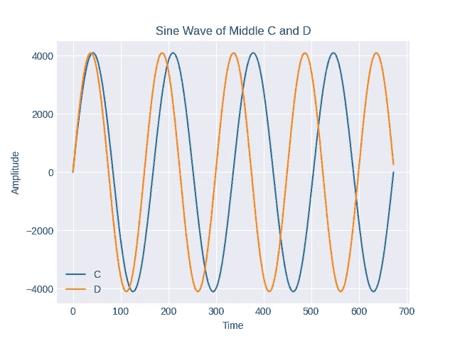
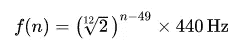
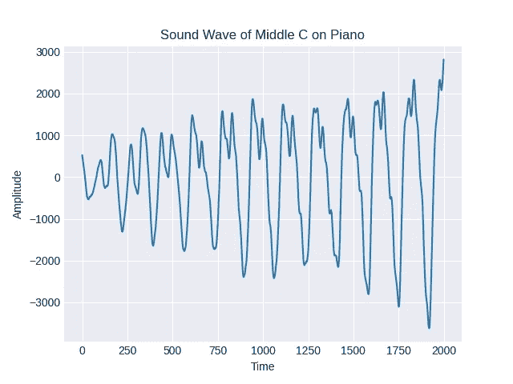

# Python 中的音乐

> 原文：<https://towardsdatascience.com/music-in-python-2f054deb41f4?source=collection_archive---------2----------------------->

## [实践教程](https://towardsdatascience.com/tagged/hands-on-tutorials)

## 音乐术语中的信号处理与乐理可视化

最近发现了这本书《T2 音乐》，作者是 Eli Maor，受到与一位对学习乐器感兴趣的朋友的对话的启发，我觉得用 Python 可视化一些数学和音乐概念会很有趣。

我绝不是一个有天赋的音乐家，也不是信号处理方面的专家，但我希望这篇帖子能帮助你理解一些使用音乐的数学概念，从不同的角度更多地欣赏音乐。上面提到的书是一本有趣的读物(首先，我不知道欧拉是由约翰·伯努利辅导的)，这篇文章旨在提供一些使用 Python 的视觉和听觉帮助。

# 什么是声音？

如何发出声音？你可以拍手、敲门或唱歌来发出声音，所有这些动作都会引起某种形式的振动。振动通过介质(空气、水等)传播。)像浪潮一样涌入我们的耳朵。然而，我们不能听到所有的振动，因为有些频率不在我们的听觉范围内。我们认为高频率意味着高音调，不同的音符有不同的频率。下图显示了中音 C 和它正上方的 D 的声波。

正如你所看到的，D 波完成一个周期需要的时间更少，因此频率更高。

# 用 Python 发出声音

为了让声音有特定的音高，我们需要知道频率。[维基百科](https://en.wikipedia.org/wiki/Piano_key_frequencies)有一个很棒的表格，将钢琴上的一个键映射到一个频率。一般来说，如果我们使用惯例，即中 C 以上的 A 具有 440Hz 的频率(备受争议的音乐会音高)，我们可以使用以下公式导出任何音符:

其中 *n* 是键的秩(A4 是第 49 个键)。

[这篇文章](/mathematics-of-music-in-python-b7d838c84f72)有关于如何计算音符频率和制造声波的示例代码。这里的代码非常相似，只是扩展到了 88 个键，而不是一个八度音阶:

上面的函数返回一个字典，该字典将一个音符名称映射到相应的赫兹频率。现在我们要做一波中 C:

在这里，持续时间以秒为单位，采样率决定声音的质量，振幅决定音量。44.1KHz(每秒 44，100 个样本)的采样速率对于消费音频来说非常常见。

使用上面的两个函数和 Scipy 的 wavfile 模块，我们可以创建一个 middle C 的. wav 文件。

这是输出音频。

# 制造逼真的声音

至少可以说，上面的音频很无聊，没有一个头脑正常的人会认为它是音乐。它缺乏许多我们认为乐器声音的特征，而且自始至终都太一致了。首先让我们将它与在真实钢琴上弹奏的中间 C 音进行比较。

同样的音符在钢琴上听起来和在小提琴上听起来不一样，因为音色(音质或特性)。当我们按下钢琴上的一个键时，它不仅仅产生一个声音(或一个波)，而是产生许多其他我们称之为泛音(谐波)的声音。不同的乐器产生不同的泛音，因此产生的音色可以让我们在演奏同一个音符时区分不同的乐器。

再次使用 Scipy，我们将加载钢琴音频并使用 Matplotlib 绘制声波。

这看起来一点也不像第一部分中的纯正弦波，尽管它们应该是同一个音符！它不再平滑，大小也变了。

由于泛音的存在，波并不“平滑”。上面的声波实际上是频率是中间 C 的倍数(包括 1，对于音符本身)的波的组合。在这种情况下，中间 C 是我们的基本音符。那些泛音是什么音？结果是高于(C5)一个八度的 C 的频率是中间 C 的两倍，所以这是我们的候选之一。事实上，所有 C 的频率都是彼此的倍数。但是当我们按下中间的 C 键时，听起来并不像是同时按下所有的 C 键。这是因为泛音比基频要弱得多。要模仿钢琴的声音，我们需要知道如何将泛音应用到基础音上。

信号处理中从一个输入信号(我们的声波是信号的离散版本)中分离不同频率的信号的一种常见技术是傅立叶变换。如果你不熟悉的话，这里有一个由 3blue1brown 制作的关于傅立叶变换的美丽的可视化视频。现在，就把它想象成一个让我们通过频率来整理声波的操作。我们将对我们的钢琴音频应用快速傅立叶变换(FFT)并绘制声谱图。

频谱图显示最高峰(我们最突出的信号)略高于 250 赫兹。这是有意义的，因为中间 C 的频率约为 261.65Hz。下一个刚好高于 500Hz (C5 的频率约为 523.25Hz)，依此类推。它们也是均匀分布的，这与我之前的主张相符，即泛音频率是基波的倍数。

下面这段代码计算了钢琴样本中每个泛音和基频之间的幅度比，这样我们就可以将其应用到纯正弦波中。

现在，我们将这些比率应用于我们的基本音符及其泛音。

我们越来越接近了，但声音始终太一致(音量保持不变)。当我们按下一个真正的钢琴键时，它开始很轻，然后很快变大，声音随着时间的推移而减弱。描述声音如何变化的一个模型是 ADSR(起音、衰减、延音和释音)。本质上，它把声音描述为经历四个阶段:倾斜的初始阶段，然后下降到一个较低的水平，在那里保持一段时间，然后减小到零。ADSR 对一些工具的建模比其他工具更好，但对我们来说应该足够了。下面是我用指数权重实现的 ADSR，让声音更加平滑和真实。当然，如果你愿意，你可以使用简单的线性砝码。

同一件乐器的声音在不同的房间会有所不同，因此 ADSR 阶段也可能有所不同。此外，如果我们知道声音如何在音乐厅中反弹，理论上我们可以建模并将其应用到我们的剪辑中，使其听起来像我们在音乐厅中演奏钢琴。更正式地说，当我们播放声音时，在给定位置的特定声学特征被称为脉冲响应(IRF)，如果我们将 IRF 和输入声波卷积在一起，我们可以得到输出声音，就好像我们在所述位置播放一样。

# 把它放在一起

现在，我们将泛音和 ADSR 权重应用于上面生成的纯正弦波。

请注意，这里使用的泛音和振幅的特征是我所拥有的录音所特有的(一个小房间里的旧斯坦威)。摆弄泛音和 ADSR 参数，看看什么效果最好。最终的音频离真实的乐器还很远，但比我们开始的要好很多。

当然，作为奖励，还有用 Python 写的音乐“hello world，Twinkle Twinkle Little Star”。

# 结论

我掩饰了很多重要的，有时是复杂的概念，因为这是一个轻松的阅读。我无意用复杂的公式和代码来剥夺音乐的乐趣或吓跑音乐家，因为我只是试图用一种更系统的思维方式(数学)来描述我们所听到的。通过使用 Numpy 和 Scipy 的几行代码，即使您没有训练有素的音乐家耳朵和完美的音高，也可以轻松地分析声音。

你可以在我的 [GitHub](https://github.com/khe35280/music_in_python) 上看到所有代码。

更多乐理在[第二部](/music-in-python-part-2-4f115be3c781)。