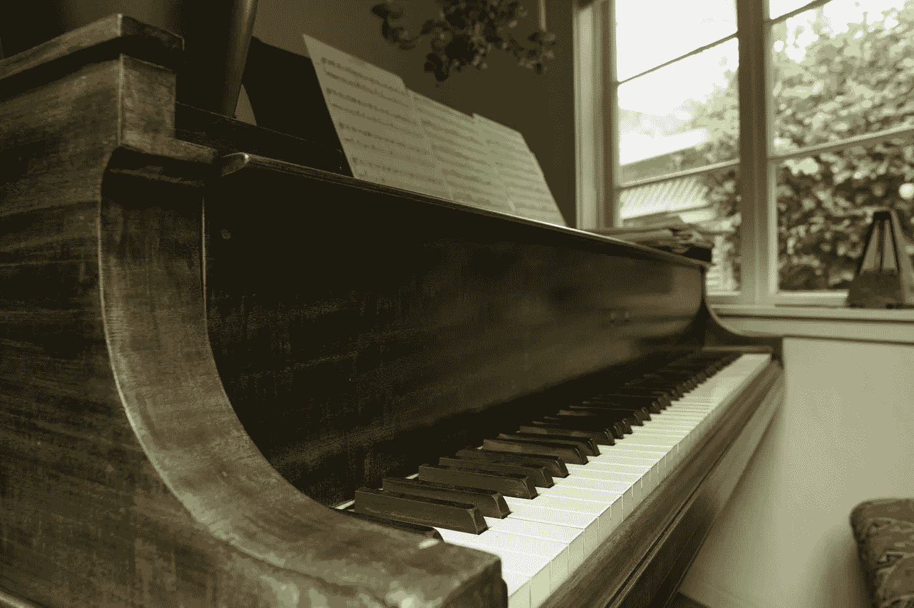
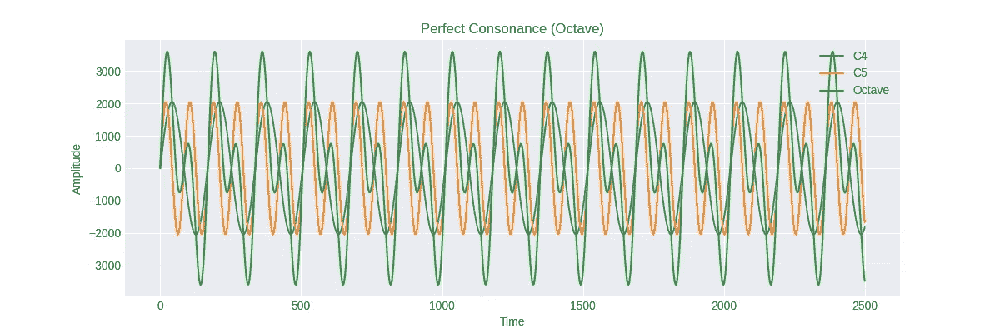
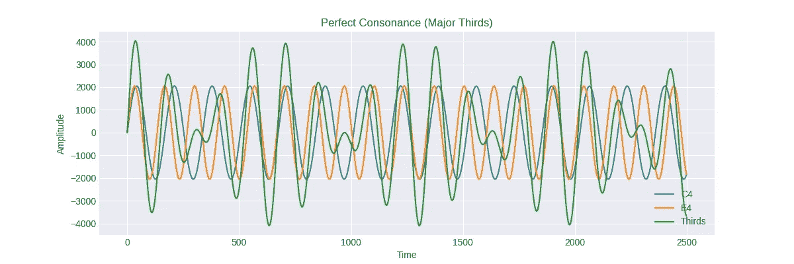
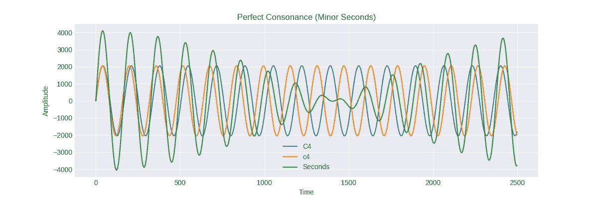

# Python 中的音乐第 2 部分

> 原文：<https://towardsdatascience.com/music-in-python-part-2-4f115be3c781?source=collection_archive---------22----------------------->

## [实践教程](https://towardsdatascience.com/tagged/hands-on-tutorials)

## 和谐与不和谐的形象化

作者图片

为了纪念世界钢琴日(一年中的第 88 天，因为一架标准钢琴上有 88 个键)，这是对[我之前关于 Python 中音频信号处理和分析的帖子](/music-in-python-2f054deb41f4)的简短跟进。这更像是音乐理论，强调视觉和听觉，而不是编码。

在这篇文章中，我将探讨为什么我们会把某些声音与甜蜜和轻松联系在一起，而另一些声音会让我们感到紧张。我还会将上一篇文章中的延音踏板添加到我的合成钢琴上，让它听起来更真实。

# 和谐与不和谐

在上一篇文章中，我谈到了泛音的频率是基音的整数倍。例如，音乐会 A 的频率为 440 赫兹，第二泛音的频率为 880 赫兹(比 A 高一个八度)。大多数人可能会觉得两个 A 同时演奏的声音很悦耳。然而，如果我们只是同时按下任意两个键，那就没有必要了。原来这和我们结合的音符的频率有关。

## 完全一致

两个 A 或任何相隔一个八度的音符(简称“八度”)是音乐中完美和谐的一个例子。我们可以用 Matplotlib 看看 C4(中间 C)和 C5 波的组合是什么样子。

您可以看到，C4 完成一个周期(从峰值到峰值)所需的时间(几乎)是 C5 的两倍。这也使得两个音符的波峰彼此非常接近，在相同的地方形成一个新的波峰。你可以从输出音频中分辨出这是一个 C，尽管它听起来比中间的 C 高一点。

## 不完全和谐

当我们把一些其他的音符加在一起时，声波可能不会像八度音程那样整齐排列。如果我们把分数倍数的音符加在一起，而不是整数倍数，会怎么样？

下图显示了 C4(261.63 赫兹)和 E4(329.62 赫兹)的组合，其比率约为 4:5。换句话说，当 C4 完成 4 个周期时，E4 在同样的时间内完成了 5 个周期。在音乐中，这种特殊的组合是大三度的一个例子，而大三度又有不完美的和声。我们可以看到，峰值并不总是排成一行，但偶尔会排成一行。

输出听起来不再像 C 或 E，但我们仍然发现它是一个令人愉快或明亮的连贯音符。

## 不一致

如果我们有两个音符，它们的周期似乎不一致，那会怎么样？波峰没有排成一条线，它们最终互相抵消，形成了下面奇怪的波浪。

虽然有些地方 C 和 C 升(c4，或降 D)几乎排成一行，但这比上面的大三度例子要花更长的时间。这里，C (261.63Hz)和升 C(277.18Hz)之间的比率不像大三度那样接近一个很好的分数。我们经常将由此产生的声音与紧张和刺耳联系在一起，因为我们可以听到不同的频率。

# 延音踏板

在我看来，延音踏板给钢琴增添了魔力。它在手指移动时连接音符，并将声音混合在一起，从而允许连续音符之间的和谐(或不和谐)。

当您按下延音踏板时，它会按住所有弹奏的键，直到您释放它。除了我们在上一篇文章中制作的钢琴，我们将在每个小节的开头“按下”踏板，在结尾“释放”踏板，以便一个小节中的所有音符融合在一起。

我们还将修改获取歌曲数据的函数来使用踏板。

当然，在一个小节开始时必须踩下踏板或者在一个小节中只使用一次踏板并不是规则。我以这种方式编码，这样我们仍然可以得到美妙的回声效果，而不必指定我们需要使用踏板的确切位置。下面是有踏板和没有踏板的 c 大调音阶的比较。

将延音应用到我们的闪烁闪烁示例:

旋律:C-C-G-G-A-A-G .两个 C(G-G 和 A-A 也是)是一致的，C-G 是完美的五度，而 A-G 是大二度；所有这些都是和谐的例子。

# 结论

音乐中的和谐与不和谐会随着时间、环境和流派而变化。尽管如此，当有效使用时，它们增加了独特的特征并构建了叙事。钢琴上的延音踏板允许音符混合，这放大了它们之间的关系，并让钢琴家引导他们的观众通过作品。谢谢你到目前为止的阅读，希望你喜欢音乐！

所有代码都在 [Github](https://github.com/khe35280/music_in_python) 上。

## 额外示例

摘自久石让的《空中楼阁*中的*天真*。这里有一些协和的例子(组成和弦的音符，以及旋律中音符的顺序)。*

节选自风之谷的*风之谷*的*安魂曲*，再次由美妙的久石让演唱。这里既有协和音也有不协和音，不协和音的使用使这首曲子听起来更神秘。