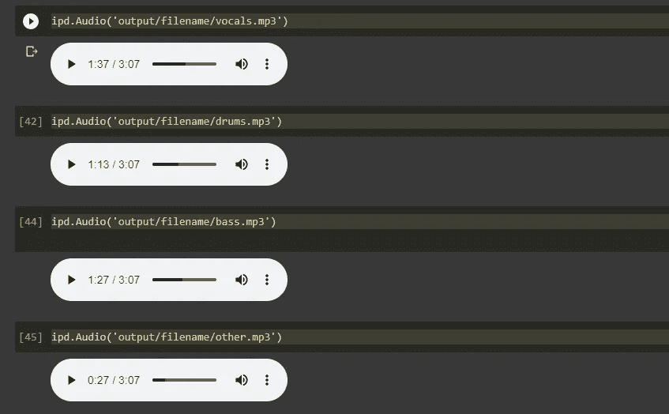

# 使用 Google Colab 上的 Spleeter 进行音乐源分离

> 原文：<https://towardsdatascience.com/music-source-separation-with-spleeter-on-google-colab-9161dc72d1e8?source=collection_archive---------20----------------------->


凯利·西克玛在 [Unsplash](https://unsplash.com?utm_source=medium&utm_medium=referral) 上的照片

音乐录音可以附带各种器乐曲目，如主唱、钢琴、鼓、贝斯等。每首曲目被称为*词干*，对大多数人来说，当他们听一首歌时，孤立这些词干是很自然的。例如，如果你听[旧时代摇滚](https://www.youtube.com/watch?v=SoaAb5MnKtY)，你会听到开头的钢琴梗、鲍勃·西格的主唱梗和鼓梗都在一起，你可以在整首歌中跟随每个梗。然而，不可能听到一个单独的词干而不被许多其他词干扭曲。这就是 Spleeter 发挥作用的地方…

## 什么是 Spleeter？

Spleeter 是音乐流媒体公司 Deezer 在 2019 年发布的一个源分离库。对于那些不熟悉 Deezer 的人来说，它与 Spotify 非常相似，大多在法国使用。Spleeter 是我们能够获得的最接近提取一首歌曲的单个曲目的工具，它主要被从事[音乐信息检索](https://en.wikipedia.org/wiki/Music_information_retrieval)的研究人员使用。Deezer 使用 Spleeter 进行他们自己的研究，他们希望发布一些可以让其他人以他们自己的方式使用的东西。

## 你能用 Spleeter 做什么？

除了研究，您还可以使用 Spleeter 做其他事情:

*   制作无伴奏合唱/乐器(也包括卡拉 ok)
*   用它来提取音响/乐器来创作你自己喜欢的歌曲版本(当然不是拷贝)
*   使用它来了解一首歌曲是如何从单个词干组合在一起的(源分离使词干听起来不那么失真)
*   播放你喜欢的艺术家的不同曲目；创建混搭
*   如果你演奏钢琴、鼓或低音乐器，你可以提取这些特定的音轨来清晰地听到和理解它们，并演奏/创作类似的东西

要跟随或自己执行这段代码，您可以在 Github 中找到我的 Spleeter Google Colab。我最初试图在 Jupyter 笔记本上执行这个，但出于我还不确定的原因，它没有工作，但它在 Google Colab 上工作得很好。如果您在 Python 应用程序上尝试这种方法，请让我知道它是否适合您，这样我就可以知道我错过了什么！

## 我的 Google Colab 代码的快速概述

我安装了一个导入的 3 个重要的库:youtube-dl、Spleeter 和 pydub。

*   pydub:处理音频文件的模块；具体来说。wav 文件(Spleeter 将每个词干生成一个. wav 文件)
*   youtube-dl:用于从 youtube 下载视频和音频文件
*   提取音乐的词干

您还想从 IPython.display 对象中导入“Audio ”,以便为您下载的歌曲创建一个 Audio 对象，并使用 display 函数来显示您的音频。

```
import spleeter
import youtube_dl
import pydub
import IPython.display as ipd
from IPython.display import Audio, display
from IPython.display import HTML
```

接下来，您必须创建一个变量来存储 YouTube 视频的参数，例如“bestaudio”特性和您希望它具有的输出名称。你可以在这里了解更多关于你可以得到的不同输出和 youtube-dl 库的文档[。](https://github.com/ytdl-org/youtube-dl/blob/master/README.md#readme)

```
ydl_args = {
  'format' = 'bestaudio/best'
  'outtmpl' = 'filename.mp3'
}
```

接下来，我使用名为 YouTube EDL 的 youtube_dl 实例来访问这些参数并下载它们。

```
ydl = youtube_dl.YoutubeDL(ydl_args)ydl.download(['url'])
```

下一步就是 Spleeter 的工作。更多关于它的文档信息，请点击[这里](https://github.com/deezer/spleeter/wiki/2.-Getting-started#using-5stems-model)。Spleeter 根据您想要提取的茎数提供了 3 个选项:2 茎、4 茎和 5 茎。

*   2 项=人声和伴奏
*   4 项=人声、鼓、低音和其他
*   5stems =人声、鼓、贝斯、钢琴和其他

我在我的项目中使用了 4 个词干，因为我知道我选择的歌曲主要是人声和鼓声。

```
!spleeter separate -p spleeter:4stems -o output/ entertainment.mp3
```

“-o”代表输出文件名，“-p”代表提供模型设置(4 项)。

当您执行 Spleeter 函数时，每个词干将被写成一个. wav 文件。因为我个人想处理. mp3 文件，所以我导入了一个名为“AudioSegment”的 pydub 实例，它的目的是读取。wav 音频文件。之后，我们可以将该文件导出为. mp3 文件。

```
from pydub import AudioSegment
sound = AudioSegment.from_wav("output/filename/vocals.wav")
sound.export("output/filename/vocals.mp3", format="mp3")
```

如果你对每一个干(人声、低音、鼓等)重复上述过程。)，剩下要做的最后一件事就是使用 IPython.display(简称为 ipd)来显示你最终的词干。它应该是这样的:



作者图片

就这些了！你想怎么听和玩这些文件取决于你。我把我的词干上传到 Audacity 应用程序，因为它单独显示每个词干，它允许你打开或关闭某些词干，或者一起播放它们。如果您也想使用 Audacity，下面是它的样子:


作者图片

## 结论

我希望这为 Spleeter 做什么以及如何使用它提供了一个清晰的图像。如果你要发布任何你在 Spleeter 上使用过的东西(音乐/音频),确保得到所有者的许可！我非常喜欢这个项目，但是，我注意到 Spleeter 并没有被真正的讨论过，所以我这篇文章的部分意图是向每个人展示这是易于访问的，并传播这个信息。这也可以作为完美的数据科学和人工智能入门，供热爱错综复杂的音乐的初学者使用。