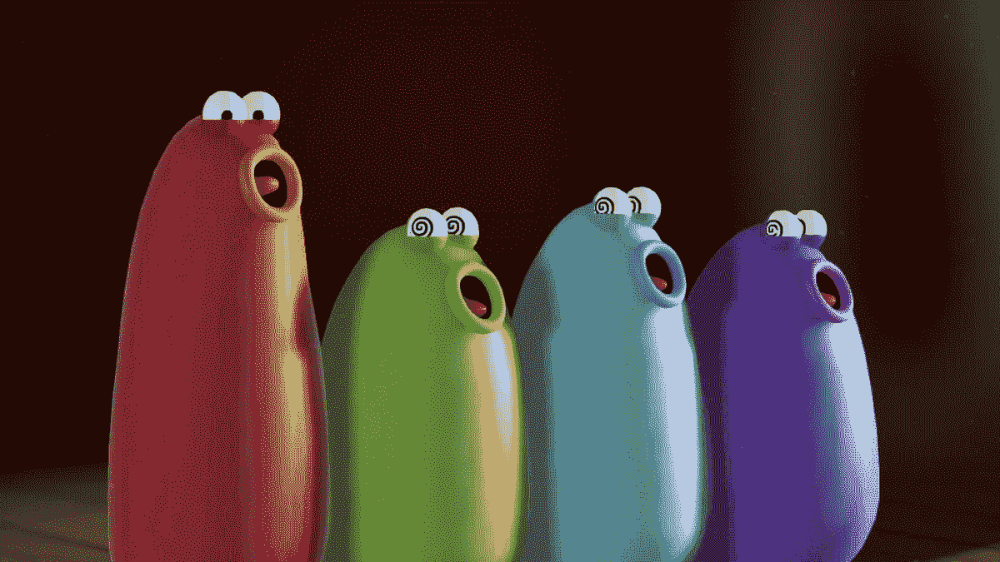
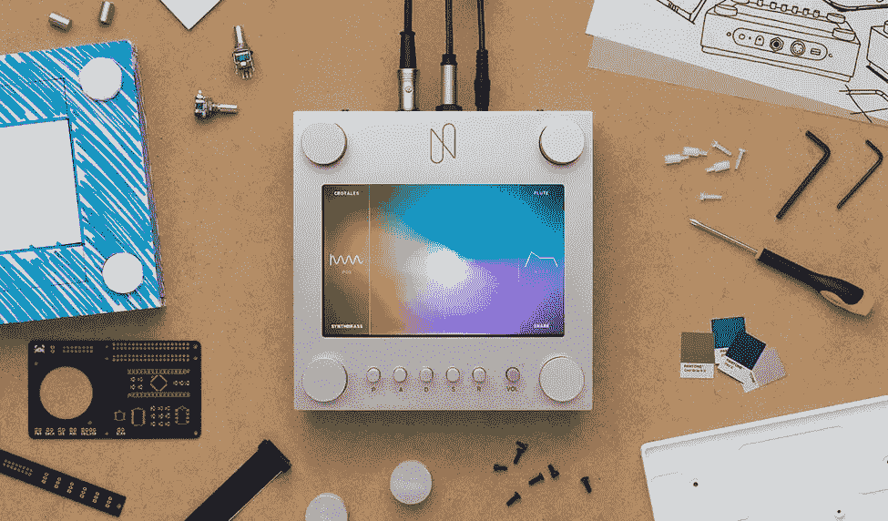
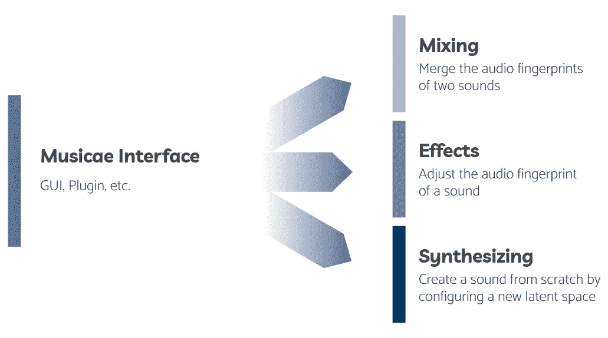
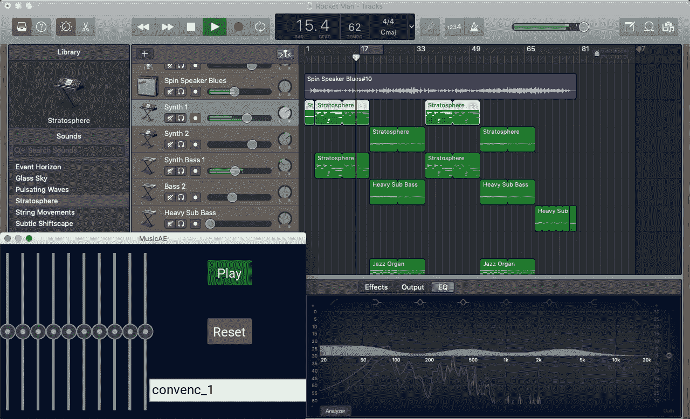

# MusicAE:一个音乐家友好的机器学习工具

> 原文：<https://towardsdatascience.com/musicae-a-musician-friendly-machine-learning-tool-7e7ccc3726df?source=collection_archive---------22----------------------->

## 如何让音乐人在数字时代使用机器学习工具的概述和示例

由西奥·雅克努、塞缪尔·马尔茨和扎卡里·弗里德曼撰写

# 目前有哪些音乐 ML 工具？

在过去的几年中，已经发布了许多工具来将机器学习(ML)引入音乐世界。最值得注意的是，谷歌已经使用 Magenta 发布了几十个有趣的应用程序和原型，“这是一个开源研究项目，探索机器学习作为一种工具在创作过程中的作用。”在无数可用的 ML 工具中，有些工具可以增强艺术家的作品，但许多工具却试图完全取代艺术家。

[Ai-Duet](https://experiments.withgoogle.com/ai/ai-duet/view/) 让你弹奏虚拟钢琴，并自动与你一起二重奏。[庆祝约翰·塞巴斯蒂安·巴赫](https://www.google.com/doodles/celebrating-johann-sebastian-bach)是一个谷歌涂鸦(取代搜索页面上的谷歌标题的应用和动画)，它允许你创作一首旋律，并产生巴赫风格的四声部对位法，同时不可否认地打破了巴赫的一些基本规则，他广泛地写了这些规则。更傻的是， [Blob Opera](https://artsandculture.google.com/experiment/blob-opera/AAHWrq360NcGbw?hl=en) 可以让你控制一群 Blob 形状的歌剧歌手，实时输入音高和元音。虽然这样的程序可能非常复杂，并且使用起来很有趣，但是它们的用例或多或少都是新奇的；没有一个严肃的艺术家会通过唱歌或模仿钢琴程序来创作音乐。然而，与此同时，另一种音乐 ML 正在崛起，它扩展了艺术家可用的工具，而不是完全取代它们。

Blob 歌剧歌手对他们的女高音的花腔表演感到惊讶| [谷歌艺术与文化](https://artsandculture.google.com/experiment/blob-opera/AAHWrq360NcGbw)

两个最流行的工具是[音调转换](https://sites.research.google/tonetransfer)和 [NSynth](https://nsynthsuper.withgoogle.com/) 。Tone Transfer 允许音乐家上传在任何乐器(或非乐器)上演奏的简短样本，并输出在四种乐器之一上演奏的样本的重新解释:长笛、萨克斯管、小号或小提琴。令人惊讶的是，它很好地捕捉了原曲的音高和音调变化，但它失败的地方在于界面。该工具仅作为网络应用程序在线提供，它笨拙地要求艺术家一次上传和下载一个简短的样本，无法轻松连接到数字音频工作站(DAWs)等常见程序。另一方面，NSynth 提供了大量关于如何构建物理乐器的开源文档，具有标准接口，如乐器数字接口(MIDI)或 USB。NSynth 的问题是，即使你能组装它，它也只能作为独立的乐器工作，不能作为大多数音乐家已经拥有的合成器或 MIDI 控制器的软件来实现。

NSynth Super 在带有 MIDI 接口| [的 Raspberry Pi 上构建的组装 NSynth 示例](https://nsynthsuper.withgoogle.com/)

那么，音乐家获得机器学习的理想工具是什么呢？在我们上面展示的许多例子中，人工智能正在取代或试图取代音乐家。在某些情况下，它试图模仿一个作曲家，在其他情况下，一个表演者，但它往往达不到要求。我们认为当 ML 技术被用来增强艺术家的创作体验时，它是最成功的。**此外，该工具必须易于使用，使用直观，并适合音乐家的工作流程。**保证最后一点的最佳方式是在音乐家已经熟悉的平台上构建工具，在这个数字时代，黄金标准是数字音频工作站。如果机器学习方法可以像虚拟工作室技术(VST)一样以标准格式作为插件来实现，音乐家将能够将其无缝集成到他们的正常工作流程中。

# 音乐简介

## 宗旨

> **MusicAE** 使用先进的机器学习技术来创建那些难以量化的声音元素的独特表示，并提供一个简单的界面来与它们进行创造性的交互。

## 它是如何工作的？

MusicAE 是神经网络驱动的合成器和效果工具，它使用自动编码器架构来学习某些声音的“指纹”,并在它们之间平滑地插值。自动编码器通过使用原始数据(如音频信号)作为输入来工作。他们学习使用更少的信息对数据进行编码或压缩，这一过程被称为**降维**、，然后对称地将数据重组为其原始形式。在解码器的中央，全部数据以尽可能少的数字表示。这被称为**潜在空间**、，代表输入数据的精华——“指纹”

自动编码器神经网络架构的图形表示|作者 [Steven Flores](https://www.compthree.com/blog/autoencoder/)

我们使用包含各种合成器、风琴和其他键盘乐器生成的音调的语料库来训练我们的自动编码器。经过几个时期的训练，自动编码器学会了如何有效地将声音压缩到一个较低维度的潜在空间，然后将其解码成几乎相同的声音。当你绕过编码器，简单地将一个数字向量引入潜在空间时，这个神经网络就变得有创造性了。网络将对潜在向量进行解码，就好像它是从声音中编码出来的一样，并将输出一个简短的音频样本，该样本不同于它所训练的任何声音。这就是音乐工具的用武之地。我们设想 MusicAE 的三种潜在用途:

*   **合成器:**这就像上面描述的例子。自动编码器没有音乐输入，用户只需在 GUI 上或使用 MIDI 控制器定义一个潜在向量，解码器网络就会产生声音。对潜在空间的平滑变化对应于输出的平滑变化，为音乐家提供了一种全新的合成独特声音的方式。
*   **效果:**在效果模式下，自动编码器使用音频流作为输入，解码器能够对其进行重建。通过引入潜在空间的小变化，声音以各种微妙的方式转变，就像通过失真、均衡器或其他效果一样。
*   **混音器:**在这种模式下，两个并行网络同时对两个音频流进行编码。然后，就像推子可以让你在音轨之间平滑过渡一样，两个潜在空间混合在一起，解码为一个。用户不仅可以选择在混音中包含多少每个音轨，还可以控制潜在空间中每个维度的混音，从而产生创造性的混音。

MusicAE |作者提供的三种操作的摘要

与传统合成器不同，传统合成器专门控制音高、波形、起音、衰减、中心频率、谐波、*等等*，自动编码器学习声音的这些特征，并将其抽象到一个潜在的空间中，以一种无意识地组合它们的方式。在上面描述的三种用途中，艺术家发现了一个新的维度，或者几个维度，是他们习惯使用的声音和工具。不仅能够在两种声音之间淡入淡出，而且能够根据它们潜在的表现形式错综复杂地混合它们，这是目前没有其他工具提供的完全独特的体验。

## 示范

下面使用原型图形用户界面(GUI)显示了混音和合成器模式的示例。对于混音，水平滑块控制每个轨道组合到潜在空间中进行解码的量，而十个垂直滑块组合轨道的单个潜在尺寸。在这个原型 GUI 中，autoencoder 模型是预先训练好的，可以通过文件名加载，就像混音和效果中的输入音频文件一样。在演示视频中，一个输入声音是脉动合成器低音，另一个是风琴。注意每种声音的不同品质，如低音的脉动，是如何随着不同的潜在维度的变化而结合在一起的。在合成器的情况下，每个滑块确定潜在空间中一个维度的值，我们听到解码的输出。

# 朝着插件方向努力

正如我们在第一部分中所讨论的，音乐工具的质量，以及它对音乐家的用处，直接关系到它与他们的工作流程的契合程度。在为数不多的供音乐家使用的人工智能音乐程序中，没有一个充分考虑了他们参与创作过程的环境。今天，几乎所有的音乐都是用 DAW 处理的，无论录音本身是数字的，还是简单的母带。如果你想让音乐人使用你的 ML 工具，你必须让它和 DAWs 一起工作！

创建可在 DAW 中工作的程序的最常见方式是使用插件和广泛支持的平台，如 VST。它们允许音乐家和程序员创建自己的图形用户界面，可以直接与加载到 DAW 中的音乐进行交互，并可以创建效果、MIDI 控件，甚至整个虚拟乐器。像 VST 这样的平台得到了广泛的支持，并且与大多数 Daw 兼容。对于 MusicAE，我们希望插件能够直接从 DAW 读取和写入音频。理想情况下，这些操作应该像高亮显示轨道以选择输入并定义空白轨道作为输出一样简单，或者像软件乐器一样载入我们的合成器。控制潜在空间的滑块可以直接在屏幕上控制，或者映射到通过 DAW 连接的 MIDI 控制器上的模拟旋钮和滑块。

虽然我们的原始代码是使用 python 设计的，这使我们可以轻松访问最广泛使用的机器学习和神经网络库，特别是 TensorFlow，但 vst 和软件工具几乎普遍使用 C++编程语言编写。能够将经过训练的 autoencoder 模型移植到不同的语言中，并学会在 VSTs 的约束下工作，这已被证明是一个挑战，但我们已经能够复制我们的原型 GUI 的功能，现在正在寻找更直观的界面，以便在任何 DAW 中无缝工作。下面是基于我们现有 GUI 的模型，旁边是流行的 Mac OS 应用 GarageBand。

作者将 MusicAE 模型集成为基于 DAW 的 Mac OS 插件

## 结论

虽然在机器学习和音乐的交叉领域有很多令人兴奋的工作，但很少有开发者认真考虑过数字音乐人的需求。我们的 MusicAE 目标不仅仅是构建一个工具，为音乐家提供一种全新的与音乐互动的方式，而且还帮助他们使用他们熟悉的方法将其集成到他们的工作流程中。到目前为止，我们已经试验了不同的神经网络体系结构，并找到了合适的模型，我们已经在独立的 GUI 中测试了这些模型。我们现在着眼于将这一功能完全整合到 VST 插件中，使我们的工具与大多数 Daw 兼容，从而使音乐人也能使用它。

该项目由 Theo Jaquenoud、Samuel Maltz 和 Zachary Friedman 完成，是库珀联盟高级电气工程设计项目的一部分。我们要感谢我们的顾问塞缪尔·基恩教授向我们介绍了这个项目，还要感谢库珀联盟的校友、目前在伦敦玛丽女王大学数字音乐中心攻读博士学位的 T2·约瑟夫上校。他首先构思了这个想法，并为我们构建软件提供了很多基础。