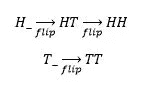
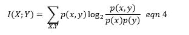
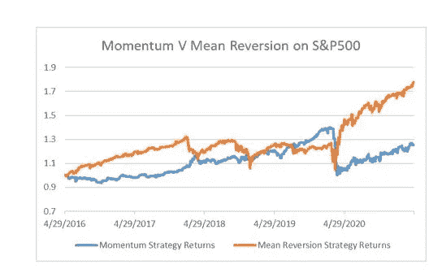
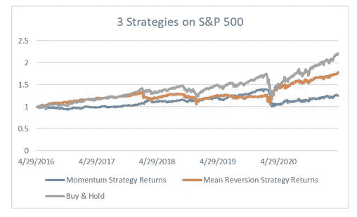

# 互信息:作为模仿的预测

> 原文：<https://towardsdatascience.com/mutual-information-prediction-as-imitation-da2cfb1e9bdd?source=collection_archive---------24----------------------->

## [行业笔记](https://towardsdatascience.com/tagged/notes-from-industry)

*这是关于信息论及其与数据驱动企业和战略的关系的系列文章中的第二篇。虽然在每一部分都会有一些等式，但是对于那些对细节不太感兴趣而对含义更感兴趣的人来说，它们可以被忽略。第一篇关于* [*熵的文章可以在这里找到。*](https://dougmh.medium.com/information-theory-a-gentle-introduction-6abaf99835ac)

在《麦克白》第一幕中击败了挪威和爱尔兰的联军之后，这个有名无实的角色遇到了三个女巫。女巫们接着做了三个预言，麦克白将会

1.格拉米的塔那，他现在的头衔

2.考多的塔那，这是他最近击败的敌人的称号

3.最后是苏格兰国王

后来，他们又发表了两个更可怕的预言。他们的第四个预言是，没有男人(女人生的)会杀死麦克白，他们的第五个预言是，他将是安全的，直到附近的森林侵占附近的小山。在某种程度上，你可以破坏西方文学中最受欢迎的作品之一，麦克白最终被 Macduff 杀死，因为 Macduff 的军队使用了附近森林中的伪装来占领附近的山丘。就像从特尔斐到奥马哈的许多其他神谕一样，女巫们的预言实现了，这要归功于运气、推理和足够的变幻莫测的良好结合，这使得它很难出错。

当然，如今的高管们往往不太关心他们的竞争对手是如何诞生的，也很少有时间去猜谜语。相反，他们想要可操作的信息，清楚地说明不需要 5 个动作和全部角色来完成。通常，特别是在操作环境中，他们希望在仔细收集数据和严格测试模型之前得到答案。

互信息通过将推理重新想象为一个最优模仿的游戏，提供了一种形式上和概念上的方法来解决预测问题。它为我们提供了一种方式，既正式又本能地评估我们看到的信息的价值，并了解如何通过减少噪音来防止信息过载。在这里，我们将讨论如何利用信息进行有效的预测，以及这种方法令人惊讶的辅助效用。

**隐藏信息——三种预测方式**

回到女巫和她们的前三个预言。他们的第三个预言，麦克白将成为国王，是我们大多数人在说预言时想到的事情。他们所描述的事件正在未来发生，而绝不是既定的。如果真的发生了，那就证明了别人不具备的特殊知识或远见。这是基本的有线电视天气预报员、华尔街分析师和对方付费电话通灵师使用的占卜类型。

就我们的目的而言，我们需要一个更一般化的预测定义，一个包含多种情景的定义。当计算机看到一张狗的图像，并正确地将它标记为狗时，这是一种预测。同样，当调查者试图找出工厂事故的根本原因时，这也是一种预测。将所有这些联系在一起的线索是，他们试图理解对他们来说隐藏的信息。与其严格地试图理解近期未来，不如说预测的更好定义是类似于: ***预测是从专业知识、直觉和观察中发现隐藏信息的任务*。**我们将在本系列中继续这样做，让我们相信这是有意义的。同样，苏格兰戏剧中的预言:

1.格拉米的塔那:过去——恢复信息还是调查

2.考多的塔那:现在——推断信息和相互作用

3.苏格兰国王:未来——正确的预测

我们很容易将第三个预言视为预言。我们先检查一下。如果你在这个星球上的任何历史时期随机选择任何人(例如，你没有任何特殊信息)，他们不太可能是 11 世纪的苏格兰人，更不可能是来自格拉米的贵族。为了正确地将某人归类为拥有贵族头衔，你至少需要一些特殊的信息，即使有了这些信息，你也可能会弄错。

同样地，女巫的第二个预言也是一个预言。大多数人在大多数时候都不是考多的塔那，虽然这个头衔正在授予麦克白，但女巫们对此并没有直接的了解。通过一些神秘主义，他们推断它正在发生，再次揭示隐藏的信息。

最后，让我们检查一下隐藏信息的定义是否符合我们的直觉。根据我们的直觉，预测通常是前瞻性的陈述。运用与之前相同的逻辑，我们看到大多数人，大多数时间都不是，也永远不会成为苏格兰国王。再一次，正确地将某人归类为未来的苏格兰国王需要相当多的特殊信息或者相当大的运气。

通过这三个例子，我们描述了一个一致的预测过程。首先要有特殊的信息或洞察力。其次，考虑这些信息的重要性和含义。最后对一个可能是错误的事件做一个可证伪的陈述。这非常符合我们上面的定义。

现在一个新的问题出现了。这个世界充满了信息，大多数信息都是无用的。了解皮奥里亚的天气不太可能让你洞察皇室血统。理想情况下，你希望依赖相关、可靠和高质量的信息，忽略不相关的信息。我们如何衡量我们所掌握的信息的质量？

**模仿&互资**

考虑下面的游戏:抛一枚硬币，无论它落在哪个面上，都抛第二枚硬币，直到它落在同一个面上，记录结果。这不是一个有趣的游戏。事实上，这个游戏和最初的掷硬币有相同的熵:1 比特。

掷硬币游戏的一些例子

我们要稍微改变一下游戏。我们现在不只是记录结果，而是试图预测结果。没有任何信息，有 50/50 的机会得到 HH 或 TT 结果。这是我们的新游戏:

1.抛第一枚硬币并隐藏结果

2.然后你可能知道宇宙过去或现在的任何一条信息，

3.猜测游戏的最终状态

4.翻转第二枚硬币，直到它与第一枚相符

我们的新目标是找到一些能告诉我们最终结果的数据。这里的解决方案很明显，揭开第一个翻转你就知道游戏的最终状态了。换句话说，最后一次翻转是对第一次翻转的完美模仿。或者，我们可以在游戏之外抛硬币，这不会告诉我们游戏的最终状态，也不会提供任何信息。

在这个翻转游戏中，我们要观察最终状态共享最大互信息的情况。互信息告诉我们一个事件在多大程度上减少了另一个事件的不确定性。它是一个观察到的信号模拟一个单独信号的程度，即使是不完美的模拟。第二次翻转是第一次的完美复制。游戏之外的硬币是独立的，因此不提供新信息。知道某人是 11 世纪的苏格兰人并不能保证他们会成为国王，但它提供了一些你原本不会得到的少量信息。相互信息由以下给出:

互信息 I(X；y)；p(x，Y)是 X 和 Y 成员的联合概率，而 p(x)和 p(y)是它们各自的概率

不可否认，这一个比以前的文章中的方程更吓人，但同样直观。该等式表明，两个事件(X 和 Y)的互信息(I)与 X 和 Y 的每组结果 p(x，Y)的概率以及它们的独立概率 p(x)和 p(y)成比例。就像熵一样，这是一种形式化的方式来陈述我们已经知道的东西:两个事件越相互关联，它们告诉我们的关于彼此的信息就越多。如果我们考虑翻转游戏中的两个硬币，它们共享一个 1 比特的共同信息，因为它们是完全相关的。知道了第一次翻转的结果，就从一个有 1 比特熵的游戏中消除了 1 比特的不确定性。来自游戏之外的硬币提供了 0 比特的相互信息，并且知道这与游戏的结果无关。

**策略分析**

知识性模仿并不总是像我们的抛硬币游戏那样明显。考虑以下交易策略。

2016 年 4 月至 2021 年 4 月标准普尔 500 两种策略的回报

虽然这里的两个时间序列看起来并不完全相似，但它们确实拥有关于彼此的最大限度的相互信息。[【2】](#_ftn2)

这两种策略将成为我们理解信息的常规策略，因此了解它们是什么是值得的。蓝色策略是一个简单的动量。一个简单的动量策略着眼于市场昨天做了什么，并假设它今天会做同样的事情。如果市场昨天上涨，那么你今天买入，如果下跌，就卖出。简单的均值回归——用橙色表示——正好相反:如果市场上涨，假设它被高估，今天就卖出；如果市场下跌，假设它被低估，现在就买入。了解一种策略的立场可以很好地告诉你另一种策略的立场。

从信息论的角度来看，动量和均值回复也是有趣的策略，还有另外一个原因。回想一下上一节，我们定义了一个叫做买入并持有的最小信息策略。这种策略仅仅是购买并持有(因此得名)一种证券[【3】](#_ftn3)。

同样的策略以买入并持有为基准，这是一种信息含量较低的策略

虽然动量和均值回归是彼此的完美预测指标，但它们也与我们的默认策略“买入并持有”分享最少的共同信息。这三者，最小信息方法和它的信息对手形成了更广泛的基准策略的基础。新的、更奇特的方法应该改进这些简单的策略，并且可以被描述为具有动量或均值回复偏差。由于均值回归和动量都经历过表现过度和表现不足的时期，理想的奇异策略不会偏向任何一方。

关于策略的一个小插曲。在本系列中，我们将花大量时间讨论与股票投资相关的投资组合构建和交易策略。这主要是因为财务数据的可用性。从信息、概念和统计的角度来看，决定如何以及何时进出标准普尔 500 指数的头寸，以及如何以及何时让一群人参与广告活动，这两者之间几乎没有区别。在证券投资组合中分配一堆钱以获取回报(投资组合构建)和将一堆任务分配给人员或机器以达到 KPI 之间几乎没有区别。

**优猜**

任何策略都是买入并持有的完美预测器，但是没有一个最优的猜测策略可以从买入并持有来预测动量或均值回复策略。在这个系列中,“猜测”和“预测”将被区分开来，就像我们用通俗的说法区分两者一样。猜测是随意的，很快就能完成，而预测则更为周到，也更费时。更具体地说，猜测是一种预测，除了最多的结果概率之外，没有关于事件的迫切信息。我们将要讨论的两种猜测是

纯粹猜测:策略是从所有可能的结果中随机选择结果

最佳猜测:一种策略，它选择一个结果，并且在没有仔细研究紧急信息的情况下尽可能正确

我们之前遇到过纯猜测的。在前面的掷骰子游戏中，我们使用了一种纯粹的猜测策略，在 16.7%的时间里正确地猜测出公平和不公平骰子的结果。我们也遇到过最优猜测策略。美国大盘股往往会产生正回报，或者至少在过去 120 多年里一直如此。如果这就是所有的信息，你的最佳猜测策略是买入市场，然后离场。

正如您可能已经猜到的那样，最佳猜测与交互信息密切相关。让我们再想想我们的骰子。提醒一下，一个公平的骰子有 1/6 的机会出现在任何面上；不公平的一方有 90%的几率‘1’，2%的几率给对方面子。一个纯粹的猜测策略会产生相同的结果，但是对于不公平的骰子，似乎应该有一个更好的策略。

根据互信息方程(方程 4 ),使 X 成为掷骰子的结果，Y 成为我们猜测的结果。最佳猜测策略将最大限度地使真实结果与猜测一致。换句话说，最佳猜测最大化了掷骰子和猜测之间的互信息。不公平骰子的一个策略是总是猜“1”这是对我们看到的实际掷骰子的一个很好的模仿，你 90%的时候都是对的。

最佳猜测对于快速决策至关重要。这是真正专家的领域。真正的专家利用他们的经验来了解未知的概率，以及从轶事观察中捕捉信息的启发法。如何检验一个专家是否真的有专长，是以后的问题。最佳猜测对于低信息量决策也至关重要。风险资本和天使投资者对早期公司的真实信息知之甚少，但如果他们能找出平均产生回报的公司类型的子集，投资所有这些公司是有意义的。

**信息过载&信息修剪**

上述最优猜测策略的一个怪癖是，“总是猜 1”策略与“总是猜 2”策略具有相同的与不公平骰子的交互信息信息优先的方法认为，虽然 2 很少出现，但它提供的信息可以被更好地利用。例如，如果我们建立第二个规则，说‘每当我们猜 2，就把它改成 1’，我们会表现得很好。换句话说，**互信息告诉我们什么时候数据是好的而模型是坏的**。

如果互信息可以告诉我们什么时候数据是好的，它也可以告诉我们什么时候数据是坏的。猜想:应该忽略坏数据。顺便说一下，它也可以用来告诉我们数据是否冗余。“总是猜 1”策略不会给出“总是猜 2”策略不会给出的信息。简单的动量策略不能提供简单的均值回复策略不能提供的信息。我们可以忽略这两个策略中的一个，情况不会更糟。

然而在现实世界中，我们很少能找到完美的信息替代品，也找不到完全不相关的信息。甚至洛杉矶的雨也可以与交易行为[【6】](#_ftn6)轻微相关。如果您将这一点与我们对信息力量的见解相结合，即更多的信息总是会减少不确定性，那么运营经理每天早上收到 50 页的图表和数字报告就不足为奇了。一个人不可能看懂的 50 页。我们需要一种方法来限制信息的摄入，以匹配我们消耗信息的带宽。

主成分分析(PCA)是一种传统的统计方法，可以将所有这些图表整理成可读性更强的图表。PCA 将你所有的图表合并成一小部分，这就是目标。不幸的是，这些图表是你最初 50 个图表的合成产物，与工厂车间没有直观的关系。更好的方法是删除冗余和不相关的信息，只保留相关和唯一的图表。

同样，我们有一个正式和直观的基于互信息的解决方案。在形式上，我们希望找到一组预测器，它们与目标具有最大的互信息，同时彼此之间的冗余最小。不太正式的是，我们希望找到模拟 KPI 但又不互相模拟的信号。这通常被称为最大相关性最小冗余(mRMR)[【7】](#_ftn7)特征选择方法。编写或找到一个 mRMR 算法来修剪一份早间报告并不难。这也可以通过一些经验法则来完成:我的图表看起来是像我的目标正面朝上还是朝下(相关性)，每个图表看起来不同还是一堆图表看起来相同(冗余)，我能否在每个 KPI 的 1 页上适合所有图表(带宽保留)。有了这种策略，就有可能将大量信息压缩成一份简单易懂的 5 页报告。

**基础知识**

随着熵和互信息的牢固确立，我们现在拥有了信息理论的基石。我们已经看到了许多玩具、寓言和轶事，表明这种方法的独特力量和灵活性。在下一篇文章中，我们将使用我们的构建模块来建立一些公理和原则，使我们能够以更复杂的方式处理数据驱动的决策和信息风险。

莎士比亚的《麦克白》……我真的需要引用这个吗？

从雅虎财经检索的数据

[【3】](#_ftnref3)想一个股票或债券

更多关于金融市场严峻/令人愤怒的统计数据，请看塔勒布的《黑天鹅》或曼德尔布罗的《市场的不当行为》

[【5】](#_ftnref5)在撰写本文时，Andeerssen Horowitz 的投资组合中有超过 250 名活跃成员(2021 年 5 月 6 日，[https://a16z.com/portfolio/)](https://a16z.com/portfolio/))

[【6】](#_ftnref6)愚蠢相关性的例子【https://www.tylervigen.com/spurious-correlations

【彭海春，龙，丁，“基于互信息的特征选择:最大依赖、最大相关和最小冗余准则”，《IEEE 模式分析与机器智能汇刊》，第 27 卷第 8 期，第 1226-1238 页，2005 年。

*免责声明:本文表达的观点仅代表作者个人观点，不一定代表任何雇主、组织或其附属机构的观点。*

2021 道格拉斯·汉密尔顿