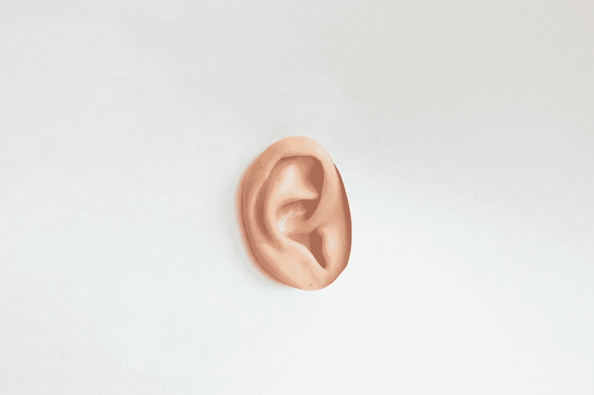

# MVPs:构建数据产品的缓慢而昂贵的方法？

> 原文：<https://towardsdatascience.com/mvps-the-slow-expensive-way-to-build-data-products-a95b166c10d3?source=collection_archive---------45----------------------->

佛朗哥·安东尼奥·乔瓦内拉在 [*Unsplash 上拍摄的照片。*](https://unsplash.com/photos/PVDWaEhSIAg)

## 有没有比 MVP 更快的方法来创建实际上可以使用、简单并且值得信赖的数据产品？

现在，让我们来谈谈 MVP(最小可行产品),以及为什么以这种方式构建数据产品对您的团队来说可能是一种非常昂贵、缓慢的学习方式。

很简单:MVP 听起来很棒。在专注于快速尝试事物、获得反馈和做出改进方面，他们可以是伟大的。

只不过大多数地方不这么做。

大多数地方只是继续增加名单上的下一个项目，从来没有减去或重新评估他们的 MVP 的价值。因为没有时间了，而用户/企业现在就需要它。

MVP 说“快！”这听起来不错。

说“我们不知道”是很棒的，因为它让你面对各种可能性。事实是，相对于 MVP，有一种更便宜、更快捷的方式来了解用户需要什么，以及你需要如何定位你的数据，以改变他们的生活，使他们变得依赖于你的见解和技术。

这叫做用户研究。

不太刺激？

你猜怎么着:你们大多数人做得很少。你们中的大多数人都没有常规的 it 程序，并且你们把大部分时间花在构建和猜测上，而不是去了解用户的问题空间、今天(或者明天)如何利用数据做出决策，以及你们的解决方案需要如何适应他们的生活。

(毕竟不是给你的——是给他们的。)

更快地学习对你的团队和组织来说是一个重要的竞争优势。

事实上，如果你的团队知道如何对数据做出反应，它(而不是人工智能)可能是你整个公司的头号竞争优势。)你在与用户交谈时捕捉到的。

看，你很聪明:你已经知道这可能是一个更好的方法。为什么？

不是猜测。

你一直在呼吁:你也和你的团队一起实践吗？

我们忘记了定性数据(也就是我们的研究发现)也是数据吗？

你知道快速学习意味着更少的时间浪费在错误的解决方案上。

当你的团队真正理解用户的问题空间时，他们最好的作品通常会出现。

**UX 研究，尤其是定性的 2x1 或 1x1 类型的访谈/跟踪式人种学，是必不可少的**如果你想停止猜测，并开始降低推出另一个不会被使用的数据产品的风险。

很有可能，你总是倾向于“构建一些东西”或者争论数据，或者构建你知道你将需要的基础设施，“不管前端会出现什么。”

因为建筑很容易测量。

因为做技术工作和扯皮数据、做模型感觉都是进步，一个人无法轻易衡量“听用户说话”的价值。

不习惯的那种。用户不信任，不关心，或者不能使用的那种，因为它太他妈复杂了。
那种从来没有被任何用户调查提前告知的。

我给大多数人的第一条建议是花更多的时间和你的用户在一起:观察、倾听、学习和询问。因为这是我们如何降低制造劣质产品的风险，并增加创新的竞技场。

这适用于你团队中的所有成员。

这些客户/用户暴露时间至关重要；如果你的团队中有 UX /设计人员，也不仅仅是他们。

事实上，如果你的员工中有试图“拥有”研究的设计/UX 专业人士，而不是打破墙壁让你的技术和数据团队成员来观察、促进和参与研究，他们就没有做好自己的工作。

好的设计从研究开始:从我们服务的使用我们数据产品的人开始。

这是关于了解他们的态度、关注点、决策过程、工作流程、观点和过去的行为，这样我们就可以利用现有的数据做得更好。

你只需要一个可重复的习惯和程序来做研究，包括你的整个团队。这是帮助你和你的团队创新的第一件事，并防止你依赖于“猜测、构建、获得幸运”的套路(这听起来就像我本周要演奏的爵士乐音乐会一样由数据驱动)。)

从长远来看(实际上可能不会太久)，你的用户会感谢你——并且你会走上以人为中心的设计之路，而不是谈论它。

当用户高兴时，商业价值通常会很快跟上。

**关于作者**

Brian T. O'Neill 是一名咨询产品设计师，帮助公司创建创新的 ML 和分析解决方案。他是 Designing for Analytics 的创始人和负责人，主持 [*体验数据*](https://designingforanalytics.com/ed) 播客，并为麻省理工学院沙盒创新计划提供建议。想在收件箱中获得更多关于创新数据产品设计的见解吗？[现在就订阅。](https://designingforanalytics.com/list)

[🎧](https://designingforanalytics.com/podcast-subscribe?dst=fromEmailSignature) | [网站](https://designingforanalytics.com/) | [LinkedIn](https://www.linkedin.com/in/brian-oneill-product-designer/) | [推特:@rhythmspice](https://twitter.com/rhythmspice)