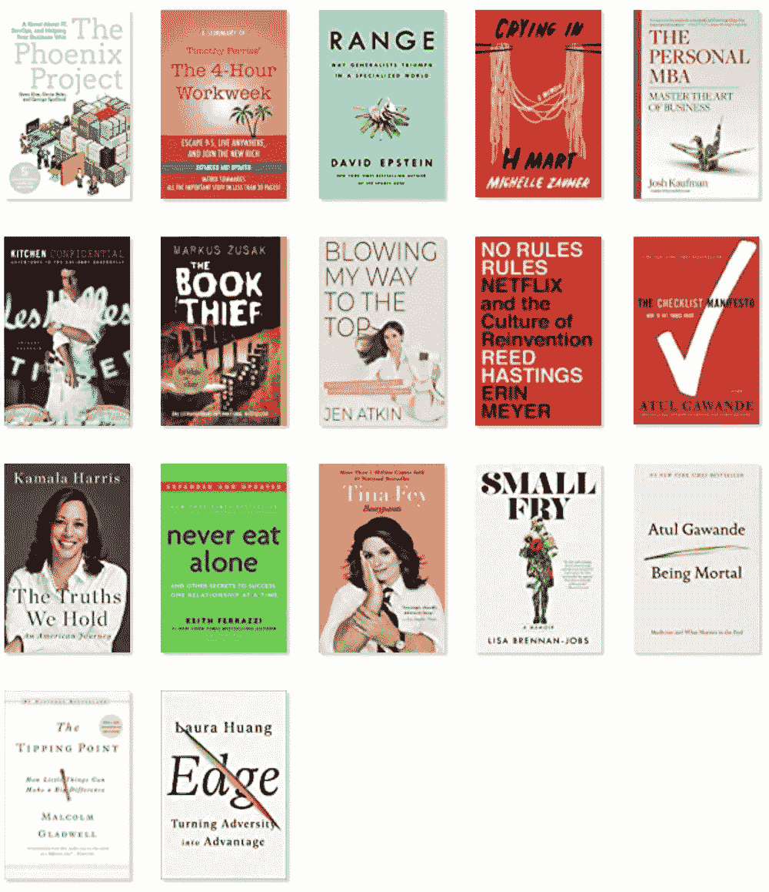
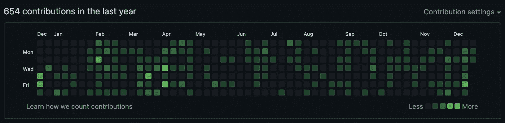

# 我作为数据科学家的 2021 年回顾

> 原文：<https://towardsdatascience.com/my-2021-year-in-review-as-a-data-scientist-dd081343ccc7?source=collection_archive---------17----------------------->

## 阅读、写作、编码和职业思考

照片由[史蒂夫·曾](https://unsplash.com/@stevetsang?utm_source=unsplash&utm_medium=referral&utm_content=creditCopyText)在 [Unsplash](https://unsplash.com/?utm_source=unsplash&utm_medium=referral&utm_content=creditCopyText) 上拍摄

# 阅读

我开始这一年的目标是每周读一本书。生活和工作忙起来了，所以没发生那种事。

以下是我 2021 年读过的书的清单:

*   [终有一死:医学和最终的意义](https://amzn.to/3yIMxCw)
*   [偷书贼](https://amzn.to/3mipnxW)
*   [没有规则规则:网飞和文化再造](https://amzn.to/3yEl3OF)
*   [我们坚持的真理:美国之旅](https://amzn.to/3e5Sa4e)
*   [凤凰计划:一部关于它的小说，DevOps，帮助你的生意](https://amzn.to/33KftPl)
*   [范围:为什么多面手会在专业领域取得成功](https://amzn.to/3H17fkj)
*   [永远不要单独吃饭](https://amzn.to/3yFWVet)
*   [Bossypants](https://amzn.to/3Fojgj2)
*   如何打破常规，找到你的目标，创造你应得的生活和事业
*   在 H Mart 哭泣:回忆录
*   每周 4 小时工作制:摆脱朝九晚五，住在任何地方，加入新富行列
*   [厨房机密更新版:美食地下冒险](https://amzn.to/3e5i6NF)
*   [个人 MBA:掌握商业艺术](https://amzn.to/3p8o9r1)
*   [小人物](https://amzn.to/3IZD1jk)
*   清单宣言:如何把事情做好
*   [引爆点:小小的事情可以产生巨大的影响](https://amzn.to/3e74kdu)
*   [优势:化逆境为优势](https://amzn.to/3seeNfk)

我的最爱？阿图尔·加万德的《凡人》。这是一本充满了感人、悲伤、令人心碎的生、死和死亡故事的书。这真是一本让我大开眼界的书。我获得了对长者更多的同情、尊重和理解。

如果你有任何书籍建议，请告诉我。我发现很难找到有趣的书来读。我喜欢自传，轻松的读物，好的小说，我不看惊悚小说。

# 写作

2021 年，我在 Medium 上写了 10 篇数据科学博客，连续三个月成为 Medium 上的顶级作家之一。查看它们:

## 实验:

*   [在线实验技巧——方差缩减](/online-experiments-tricks-variance-reduction-291b6032dcd7?sk=da701b2e28317425055112e726d2e860)

## 可视化:

*   [将 Python 可视化面板应用部署到谷歌云](/deploy-a-python-visualization-panel-app-to-google-cloud-cafe558fe787?sk=98a75bd79e98cba241cc6711e6fc5be5)
*   [使用 Python 中的 Datashader 实现大数据可视化](/big-data-visualization-using-datashader-in-python-c3fd00b9b6fc?sk=2e619dad70084fbf69d26cff55930f84)
*   [Python 中的可视化和交互式仪表盘](/visualization-and-interactive-dashboard-in-python-c2f2a88b2ba3?sk=c78ed971426bbccb89798759779aa303)
*   [Python 中的实时仪表盘](/real-time-dashboard-in-python-970e3c32b3d7?sk=09a2c71718d2ef2f7918f3a46b8585df)

## 数据访问:

*   [使用 intake-salesforce 在 Python 中查询 Salesforce 数据](/query-salesforce-data-in-python-using-intake-salesforce-b80c7a714943?sk=750e64ffc33dec6f94dcf876ef0a50df)
*   [Python 中查询 BigQuery 的 3 种方式](/3-ways-to-query-bigquery-in-python-66838f45cb43?sk=d62c419288f53c6673ebc82c4b964c4d)

## 其他:

*   [如何在 Github 上托管 Jupyter 笔记本幻灯片](/how-to-host-jupyter-notebook-slides-on-github-d785f30e6e2?sk=4f8e348f1cfd72c2620cb27a22ec1f11)
*   [从零开始的多类逻辑回归](/multiclass-logistic-regression-from-scratch-9cc0007da372?sk=3d2c8411e05f34b079b684dedc217f05)
*   [数据科学家的测试——使用 pytest 和假设进行单元测试](/testing-for-data-scientists-1223fcad4ac2?sk=bde5487fe3ad11a06ae3a92ed80d451b)

## 面谈

*   从[走向数据科学](/for-new-data-scientists-domain-knowledge-is-sometimes-more-important-than-technical-skills-90e103a8c4da)的采访
*   如何在 [AnacondaCon](https://anaconda.cloud/anacondacon) 推进您的数据科学职业生涯
*   在[UT Austin Master and PhD Quant Night](https://utaustin.joinhandshake.com/events/816925/share_preview)分享我的数据科学经验

## Anaconda 博客和提及

*   Anaconda 博客:[揭穿数据科学中最大的神话](https://www.anaconda.com/blog/debunking-the-biggest-myths-in-data-science)
*   Anaconda 博客:[成为一名数据科学家意味着什么？](https://www.anaconda.com/blog/what-does-it-mean-to-be-a-data-scientist)
*   Anaconda 博客:[如何成为数据科学家？](https://www.anaconda.com/blog/how-do-you-become-a-data-scientist)
*   [政治家篇](https://www.statesman.com/story/business/2021/11/12/data-firm-anaconda-top-austin-area-small-workplaces/8529758002/)
*   [ZDNet 文章](https://www.zdnet.com/education/computers-tech/best-python-course/)

# 编码

我猜我在夏天没怎么用 Github:)

我不能谈论我在工作中做什么。但是我可以谈谈我的开源项目。2021 年，我创建了两个 Python 开源包: [Intake-salesforce](https://github.com/sophiamyang/intake-salesforce) 和 [Intake-stripe](https://github.com/sophiamyang/intake-stripe) 。

> *Intake 是一个轻量级包，用于查找、调查、加载和传播数据。(*[【https://intake.readthedocs.io/en/latest/】](https://intake.readthedocs.io/en/latest/)*)T21)。*

[进气-销售力](https://github.com/sophiamyang/intake-salesforce)和[进气-条纹](https://github.com/sophiamyang/intake-stripe)是两个进气驱动器，用于轻松加载销售力数据和条纹数据。它们提供了从各种来源和 API 加载数据的一致方式。如果你感兴趣的话，可以看看这些包装和我在 [intake-salesforce](/query-salesforce-data-in-python-using-intake-salesforce-b80c7a714943?sk=750e64ffc33dec6f94dcf876ef0a50df) 上的博文。

# 职业思想

科技就业市场今年火了。每家科技公司都在疯狂招聘，包括我的公司，科技公司的薪酬在过去的一年里飙升。我得到了很多机会，我一直在想我的职业生涯会是什么样的，什么样的工作最适合我。

让我们一起做一个练习:

首先，让我们列出**你希望你的理想工作应该具备的五个最重要的品质**(假设报酬和工作生活平衡合理)。

*   对我来说，最重要的五件事是有趣的项目、好同事、自主权、所有权和信任。

接下来，如果非要牺牲一个，你牺牲哪个？

*   这个很简单，我会牺牲有趣的项目。这就是生活的现实。没有人能一直做有趣的项目，即使你是首席执行官。此外，下班后你有做任何你感兴趣的事情的自由。

然后，再选一个来祭祀。

*   现在越来越难了。我会牺牲所有权。这个很难。因为没有了主人翁的感觉，内在动力就会少一些。但是我想外在的动力仍然会让我前进。

接下来你会选择牺牲什么？

*   现在真的很难。好同事、自主和信任绝对重要。往往这三件事是相互交织在一起的。当有信任时，自主就会发生；当周围有好人时，信任就会发生。我想在这三者中，我可以放弃自主性，成为工作机器的最坏情况。

现在还剩两个，对你来说最重要的是什么？

*   在好同事和信任之间，如果我必须选择，我会选择好同事。信任是可以建立的，但是你不能改变其他人。我感到非常幸运能和我欣赏、喜爱和关心的人一起工作。许多名字、美丽的脸庞和微笑现在浮现在我的脑海里。我的同事是我最好的朋友和家人。

你选择了什么？你目前的工作能满足你最大的愿望吗？如果没有，看看我们的[职业页面](https://www.anaconda.com/careers)，因为 Anaconda 太棒了。

这就是我 2021 年的回顾。期待 2022 年！

作者索菲亚杨 2021 年 12 月 21 日。