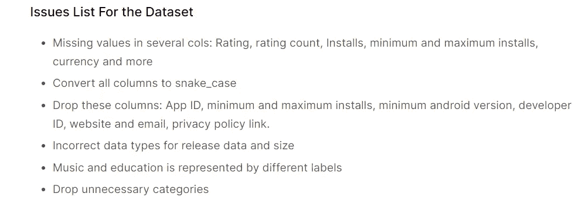
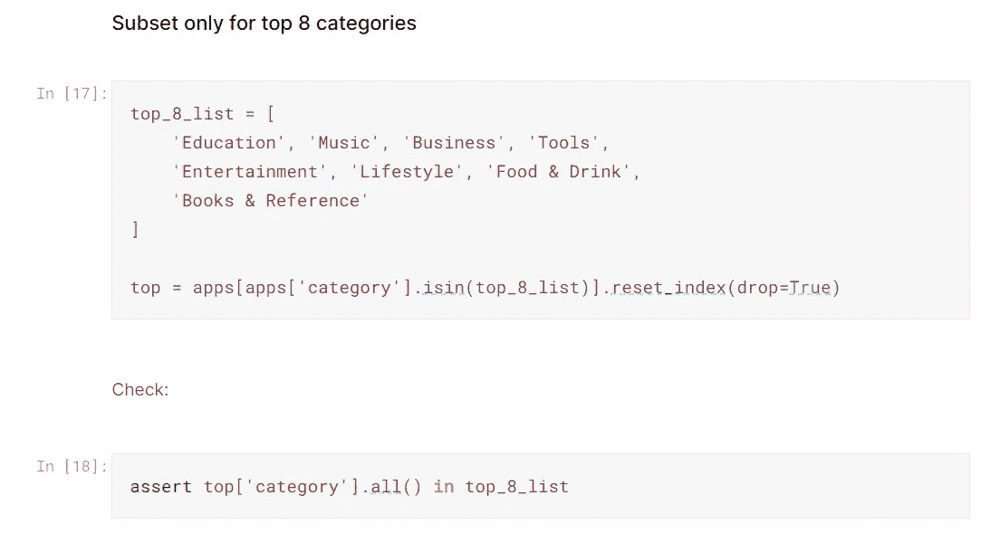
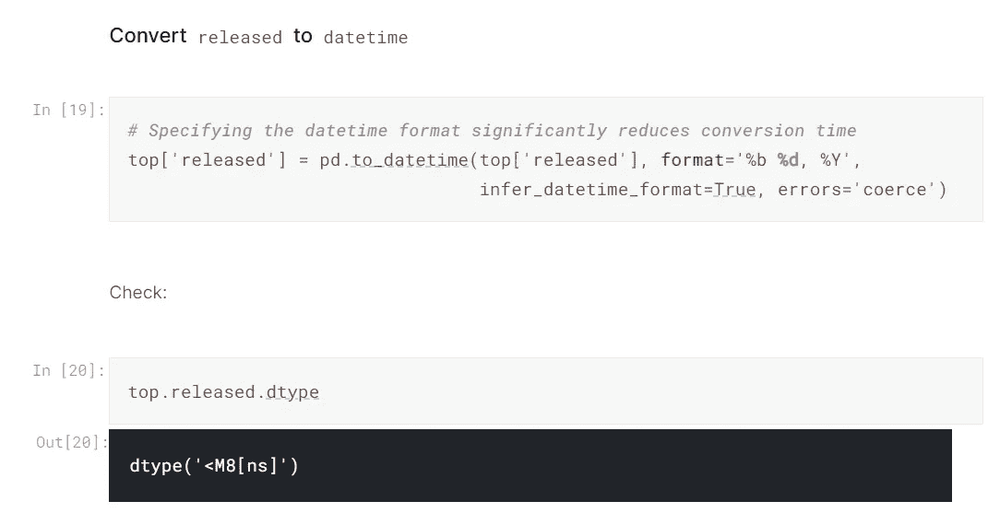
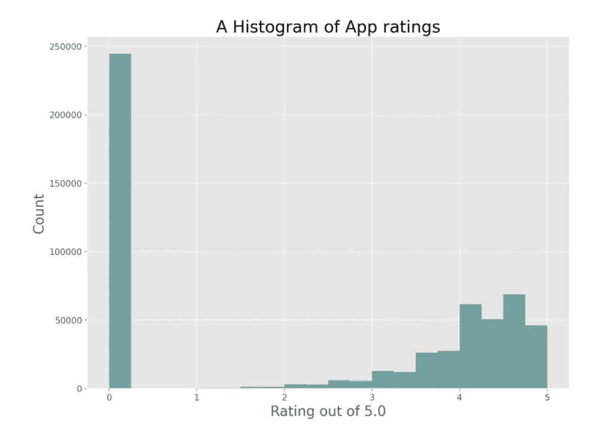
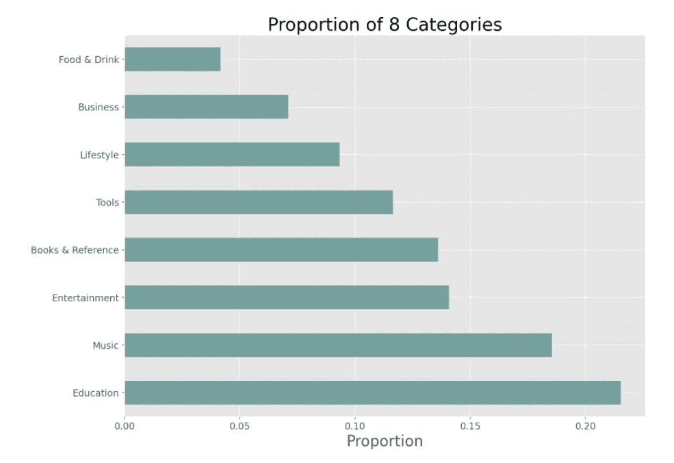
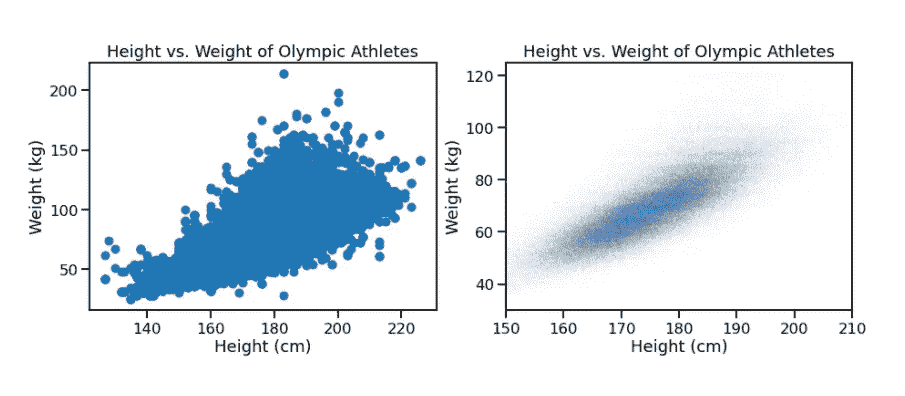
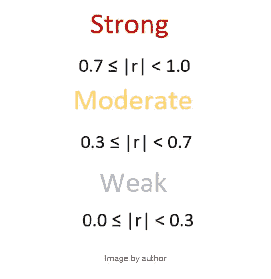
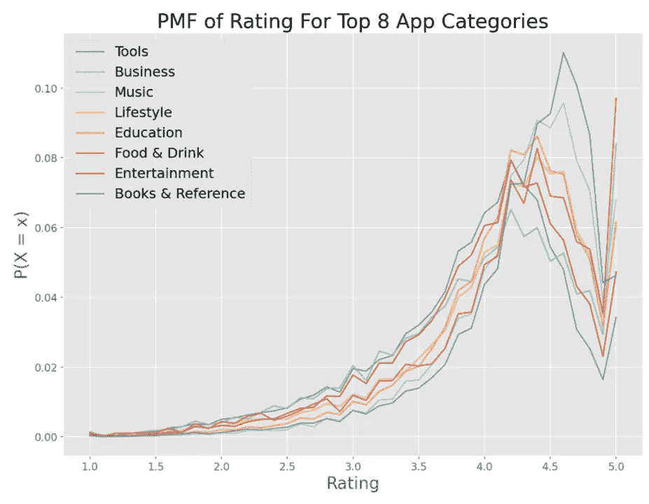
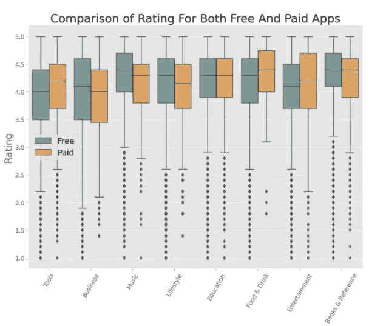
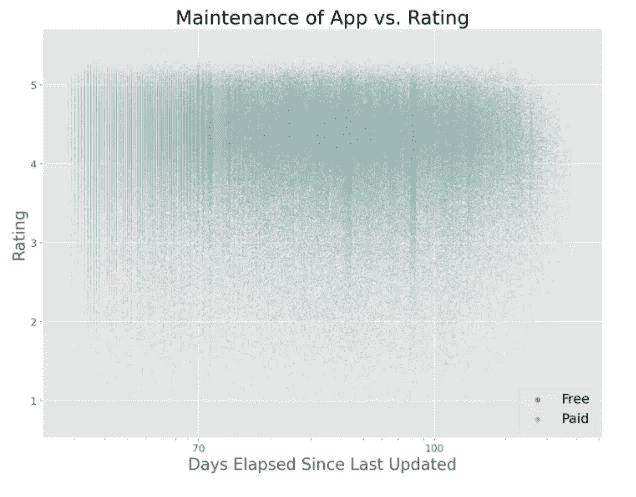

# 我的 6 部分强大的 EDA 模板，讲终极技能

> 原文：<https://towardsdatascience.com/my-6-part-powerful-eda-template-that-speaks-of-ultimate-skill-6bdde3c91431?source=collection_archive---------19----------------------->

## EDA —做得对…

**照片由** [**玛丽泰勒**](https://www.pexels.com/@mary-taylor?utm_content=attributionCopyText&utm_medium=referral&utm_source=pexels) **上** [**像素**](https://www.pexels.com/photo/energetic-man-standing-on-railing-near-fence-6009207/?utm_content=attributionCopyText&utm_medium=referral&utm_source=pexels)

## 你为什么卡住了？

当 Jupyter 笔记本的空白盯着你时，很难开始。您有一个包含数百个要素的数据集，但您不知道从哪里开始。你的直觉告诉你:“正常，从一个正态分布的特征开始”。一如既往…

你一头扎进数据中，从一个特征移动到另一个特征，直到你发现自己在森林里无目的地追逐野鹅。那么，是什么原因呢？

嗯，开始，说明你没有一个清晰的流程。许多人说探索性数据分析是任何项目中最重要的部分，会占用你大部分的时间。

这个社区充满了平庸的、无组织的、难以理解的 EDA。这就是为什么一个定义良好的、基于过程的方法会给你一个脱颖而出的机会。这告诉其他人，也许是潜在的雇主，你“知道你在做什么”，在处理看不见的数据时，你有自己的流程和规则。

还没有那个流程？别害怕，我掩护你。

今天我们就来说说我在做很多网络课程的时候学到的一个 EDA 模板。我使用 Google Playstore 数据集在 Kaggle 上做了一个 EDA 示例，该数据集包含超过 100 万个应用程序的信息。我建议您在一个单独的窗口中打开它，以充分利用这篇文章。如果你有一个 Kaggle 账户，你可以在这里访问笔记本[或者从 GitHub 克隆](https://www.kaggle.com/bextuychiev/my-6-part-powerful-eda-template)[回购](https://github.com/BexTuychiev/edas/tree/master/google_play_store)。

剧透一下，我选择的样本数据集并没有我想象的那么有趣。但是我尽了最大努力让这篇文章尽可能的有知识性。当我解释模板的每一部分时，我会在我介绍的主题上链接我的其他文章，而不是太详细地解释它们。尽情享受吧！

<https://ibexorigin.medium.com/membership>  

获得由强大的 AI-Alpha 信号选择和总结的最佳和最新的 ML 和 AI 论文:

<https://alphasignal.ai/?referrer=Bex>  

## #1.介绍数据集，清楚地陈述 EDA 的目标

任何 EDA 的第一部分都应该是提供任何必要的信息，以建立对数据集及其试图解决的问题的初步理解。

就像任何书面内容一样，你应该以这样一种方式写开头，让观众一直读到结尾。

> 即使你要展示代码，也不一定要令人厌烦。

在 Kaggle 上 OSIC 肺纤维化竞赛的[笔记本](https://www.kaggle.com/piantic/osic-pulmonary-fibrosis-progression-basic-eda)中，我看到了一个构建良好 EDA 简介的优秀策略。笔记本以问题的背景信息开始，并说明解决问题的重要性。然后，它继续给出数据集的基本信息，它是如何收集的，以及笔记本试图实现的目标。

在写这一节的时候，不要把它变成文字墙。使用良好的格式和适当的视觉效果让你的 EDA 令人难忘。

在单独的子部分中，导入所需的库和模块。你可以通过导入有用的库，如`tqdm, colorama`，并根据你的喜好调整`matplotlib`的`rcParams`。如果您想了解更多关于完美项目设置的信息，我推荐您阅读我的相关文章:

</from-kagglers-best-project-setup-for-ds-and-ml-ffb253485f98>  

## #2.基础探索和预处理

在进行可视化之前，通常需要对数据集进行高级概述。在一个小的小节中，使用常用的`pandas`函数，如`head`、`describe`、`info`等，来了解你的数据。

这样，您可以识别违反数据约束的基本清理问题，如[数据类型、唯一性和范围](/data-type-constraints-data-range-constraints-duplicate-data-with-pandas-44897a350b1e?source=your_stories_page-------------------------------------)。

我的建议是先突出所有问题，分别处理。数据清理既紧张又无聊，所以发现一个问题并立即着手解决它会让这个过程变得更糟。

> 试着用一种清晰的心态去发现所有的问题，而不去担心如何解决它们。

我喜欢在一个单元格中记录所有问题，就像这样:

作者图片

这让我可以在解决问题时划掉每个问题。在修复每一个时，我通常遵循以下模式:

作者图片

我用一个标题声明这个问题，并在一个单元格中修复它。为了检查错误，我使用了`assert`语句，如果检查成功，则不返回任何输出。否则，它抛出一个`AssertionError`。

对于海量数据集，即使是最小的操作也可能需要很长时间。当你认为某件事花费的时间比预期的要长时，很可能你做得很慢。尝试寻找你正在做的事情的更快的方法。

在我为本文准备的示例笔记本中，我注意到`pd.to_datetime`仅仅将一列转换为`datetime`就花了将近 2 分钟来处理一百万行。我在 StackOverflow 上搜索了一下，发现为函数提供一个格式字符串可以显著减少执行时间:

作者图片

对于百万行数据集，该解决方案只需几秒钟，而不是几分钟。

> 我相信有很多这样的快速清洁技巧，所以一定要搜索它们。

## #3.单变量探索

第三部分是视觉探索的开始。具体来说，单变量探索是关于可视化单个变量。

使用分布图，如直方图、 [PMF 和 PDF 图，CDFs](/3-best-often-better-histogram-alternatives-avoid-binning-bias-1ffd3c811a31?source=your_stories_page-------------------------------------) 帮助您识别每个数字特征的分布。当你继续建模时，你会对你的特征有更好的理解。

在这里，了解不同的概率分布是有帮助的，比如[正态](/how-to-use-normal-distribution-like-you-know-what-you-are-doing-1cf4c55241e3?source=your_stories_page-------------------------------------)、[泊松](/how-to-use-poisson-distribution-like-you-know-what-you-are-doing-c095c1e477c1?source=your_stories_page-------------------------------------)、二项式和[许多其他的](/how-to-think-probabilistically-with-discrete-distributions-ea28e2bcafdc?source=your_stories_page-------------------------------------)。

尤其是，拥有一个[正态分布的](/how-to-use-normal-distribution-like-you-know-what-you-are-doing-1cf4c55241e3?source=your_stories_page-------------------------------------)变量是你所能期望的最好的事情。但在现实中，你会经常遇到这样疯狂的事情:

作者图片

对于分类要素，使用条形图和计数图来查看数据集中每个类别的比例。同样，这对于分类问题至关重要，因为在拟合模型之前，您可以计算诸如类别不平衡之类的指标。

作者图片

## #4.二元探索

现在，开始一次看两个变量。探索[分类](/mastering-catplot-in-seaborn-categorical-data-visualization-guide-abab7b2067af?source=your_stories_page-------------------------------------)和[统计关系](/master-a-third-of-seaborn-statistical-plotting-with-relplot-df8642718f0f?source=your_stories_page-------------------------------------)。

这是你创造散点图、箱线图和热图等视觉效果的技巧大放异彩的地方。尽管它们很简单，但要把它们做对可能很难。考虑一下这个:

作者图片

您可以看到，通过调整绘图参数，您可以获得截然不同的结果。

计算相关矩阵来识别数字特征之间的线性关系也是一个好主意。在研究相关性时，重要的是[不要误解它](/how-to-not-misunderstand-correlation-75ce9b0289e)。

一般来说，高的正负系数表明强的正/负**线性**关系，而接近 0 的系数可能表明非线性关系。找出关系的类型有助于回归任务。

在这一节中，您还应该继续探索发行版。现在，你开始将它们相互比较，而不是单独看:

作者图片

比较变量时，使用概率质量函数、概率密度函数或累积分布函数。直方图在这方面很糟糕，因为你无法避免[宁滨偏差](/3-best-often-better-histogram-alternatives-avoid-binning-bias-1ffd3c811a31?source=your_stories_page-------------------------------------)和数据模糊。

## #5.多元探索

顾名思义，是时候将 3 个或更多的变量结合成一个单一的情节。在这一部分，你的想象力是极限。

作者图片

作者图片

不过，有几件事你必须记住。首先，不要在一个图中包含 4 个以上的变量。不必要的变量不但没有用，反而给图表增加了额外的难度，使它们难以解释。

> 永远记住，你的情节不需要看代码就能被每个人理解。这是有效可视化的关键。

如果你正在犹豫是用大小还是颜色来表示第三个变量，那么选择颜色。人类的眼睛自然更善于区分颜色，而不是标记大小的微小差异。

如果你在考虑使用支线剧情或者 FacetGrids，尽量保持支线剧情的数量尽可能的少。它们可能对你有用，但是观众通常没有足够的耐心去看每一个。所以，把关键的支线剧情从群体中分离出来，在更大的尺度上进行剧情设计。

</deep-guide-into-styling-plots-delivering-effective-visuals-12e40107b380>  

## #6.EDA 的结论

最后，在单独的部分总结探索的要点。这是非常有用的，因为一些 EDA 往往很长，读者可能会在读到结尾之前忘记关键点(包括你自己)。因此，在进入机器学习之前，简要提及关键发现可以确保一切都记忆犹新。