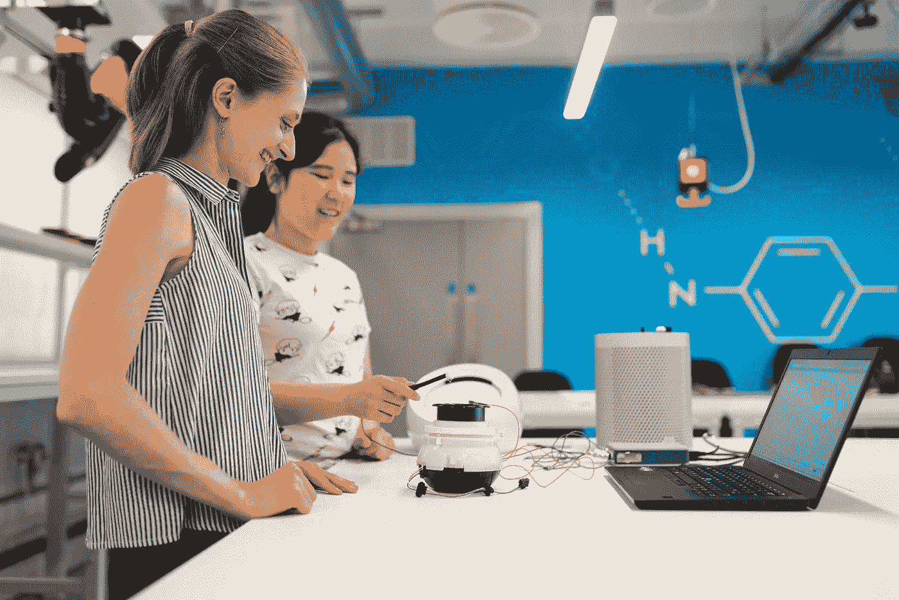

# 我对 3 年机器学习新手的建议

> 原文：<https://towardsdatascience.com/my-advice-to-machine-learning-newbies-after-3-years-in-the-game-6eef381f540?source=collection_archive---------0----------------------->

## 不要像我一样浪费几天，几周，几个月

照片由[**this is 工程**](https://www.pexels.com/@thisisengineering?utm_content=attributionCopyText&utm_medium=referral&utm_source=pexels) 发自 [**像素**](https://www.pexels.com/photo/engineers-in-workshop-3861960/?utm_content=attributionCopyText&utm_medium=referral&utm_source=pexels)

我在一家初创公司做了 3 年多的机器学习。我们筹集了一轮资金，开发了一些很酷的技术。但是在这个过程中浪费了很多时间。

当你的公司的未来依赖于它时，学习 ML 并不是掌握 ML 最轻松的途径。

在这个过程中，我犯了很多错误。以及一些成功的例子。

这是基于轶事经验的建议。

虽然最适合想解决实际问题的人，但它适用于所有初学者。

开始了。

# **远离无监督学习**

离远点。这是一个巨大的时间浪费。

尽管几乎每一个给我建议的人工智能博士都给了我建议，但无监督学习的多次尝试没有带来任何价值。我想这方面有很多学术研究。否则我无法解释这个悖论。

**无监督学习**是在无标签数据上训练模型。它通常涉及集群。理论上，这可以揭露以前未知的模式。

相反，**监督学习**学习输入和标记输出之间的关系。这是通过了解什么特征与什么输出相关联来实现的。

在我们的例子中，无监督学习每次都不如人类的直觉。

因此，虽然这个领域可能有一些很酷的应用程序，但这绝对不是轻而易举的事情。等你在别处有了经验再来谈这个。

# **跳过神经网络**

我见过神经网络优于传统模型，但收益很小，所需的努力很大。

神经网络会带来一些挑战，尤其是在你职业生涯的起步阶段。

1.  **迭代缓慢。你的学习曲线是你尝试新事物的速度的函数。神经网络通常比传统模型需要更长的训练时间。所以迭代的时间就少了。**
2.  **需要大量数据以避免过度拟合。**通常，这需要从事业务足够长的时间来收集大量数据，而大多数公司并没有预先标记这些数据。
3.  选项太多。虽然逻辑回归的超参数组合是有限的，但神经网络可以以无限不同的方式配置。这个兔子洞比解决方案更可能让你迷失和沮丧。
4.  传统的 ML 模型通常表现良好。对于一个 MVP 来说，从 sklearn 插入一个现成的模型通常就足够了。虽然数周的神经网络调整可能会给 f1 带来一些额外的积分，但在开始时往往不值得。
5.  **很难找到良师益友。**神经网络是一种奇怪的野兽。几乎任何人都可以告诉你他们是如何在高层工作的。但是很少有人有使用它们解决实际问题的经验。因此，你可能只能靠自己了。

总之，我不反对神经网络。但是用它们从 90 到 100，而不是从 0 到 1。

# **将所有问题框架为二元分类**

让你的模型尽可能容易学习。最简单的问题是二元分类。

一个**二元分类**模型输出 1 或 0。照片里要么有一只狗，要么没有。

相比之下，**多类分类**根据照片中是否包含狗、猫、鹦鹉或鸸鹋，返回 0、1、2 或 3。

一次又一次，并行运行多个二进制分类器比处理所有情况的单个多类模型有更好的结果。

最大的收获不是选择了正确的模型，而是用正确的方式构建了一个问题。

# **调整您的超参数**

这可以带来巨大的不同。

超参数是模型级配置。比如学习率。

使用自动化工具。有几个(即:GridSearchCV，TPOT…)。

你没有时间手动调整你的模型。设置一些调优界限，把你的实验推到云端。

***亲提示。*** *编写您的代码来挽救错误并定期保存结果。当云中的一个实验在 3 天后崩溃，没有保存任何结果时，我已经丢失了太多次结果。*

默认的超参数很少是最佳的。调整它们。

# **给尝试的时间框架，而不是结果的时间框架**

ML 不是软件工程。

你无法预测解决一个问题需要多长时间，甚至无法预测这个问题是否可以解决。你能做的就是预测一个实验需要多长时间。

前者最终会让你陷入困境。对于一个公司的业务部门来说，没有什么比一个经常低估时间需求的工程师更令人讨厌的了。

这是一个简单的观点，但如果你是在工作中学习 ML，这是很重要的一点。

# 永远永远永远记录你的实验

六个月后你会感谢自己的。

我建议注意:

*   型号/架构选择
*   超参数
*   数据的粗略描述(来源、大小、日期、特征……)
*   结果(即:精确度、召回率、f1…)。
*   指向数据快照的链接(如果可能)
*   评论和学习

不要想多了。电子表格非常适合这种情况。

最终，首席执行官或新的顾问会要求你尝试你已经尝试过的东西。但是你不会记得上次为什么失败了。能够查找和呈现过去的结果将会节省你大量的时间和烦恼。

写事后总结(以及偶尔的成功汇报)也会让你学到更多东西。它会帮助你看到模式，建立你的直觉。从长远来看，这是让你成为“高级人才”的原因。

# **结论**

这些是我花了几年时间构建 ML 驱动的应用程序后的一些心得。

虽然我的经验几乎只在 [NLP](https://en.wikipedia.org/wiki/Natural_language_processing) 领域，但没有理由不能应用到其他领域。

如果我留给你什么的话，我希望是这个:前沿技术可以产生伟大的成果，但你可能还没有准备好。遵循那些经过实践检验的真理。然后在需要的时候突破界限。

现在走出去，建立一些有用的技术。