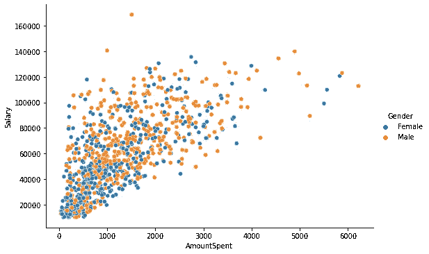

# 我学习数据科学新工具的最佳方法

> 原文：<https://towardsdatascience.com/my-best-method-to-learn-new-tools-in-data-science-31941c2fc810?source=collection_archive---------24----------------------->

## 以及我是如何练习的


由 [Unsplash](https://unsplash.com/s/photos/learning?utm_source=unsplash&utm_medium=referral&utm_content=creditCopyText) 上的 [Element5 数码](https://unsplash.com/@element5digital?utm_source=unsplash&utm_medium=referral&utm_content=creditCopyText)拍摄

近年来，数据科学经历了巨大的发展。数据收集、存储和处理方面的进步促进了这种增长。

利用数据创造价值的潜力吸引了许多行业。越来越多的企业在其运营中采用了以数据为中心的战略和流程。

不断增长的需求也促使开发人员和开源社区为数据科学创造新的工具。因此，在数据科学领域工作的人有许多库、框架或工具来完成他们的工作。

其中一些工具被设计成用不同的编程语言执行相同的任务。有些人比其他人更有效率。有些人专注于一项特定的任务。不可否认的事实是，我们有许多工具可供选择。

你可能会争辩说，最好坚持使用一种工具来完成特定的任务。然而，我更喜欢至少有几个选择。我还想做一个不同工具之间的比较。

在这篇文章中，我将尝试解释我是如何学习新工具的。我的策略是基于比较。我关注的是如何用不同的工具完成给定的任务。

这种比较让我看到了它们之间的不同和相似之处。此外，它有助于建立一种直觉，了解这些工具的创造者是如何处理特定问题的。

假设我对 Python 中的 Pandas 库很熟悉，并且想学习 r 中的 dplyr 库，我尝试对这两个库执行相同的任务。

假设我们有以下关于营销活动的数据集。


营销(作者图片)

我想创建一个新的列，包含支出金额和工资的比率。这里是如何使用熊猫和 dplyr 来完成的。

```
#pandas
marketing['spent_ratio'] = marketing['AmountSpent'] / marketing['Salary']#dplyr
mutate(marketing, spent_ratio = AmountSpent / Salary)
```

让我们再做一个比较熊猫和 SQL 的例子。假设我们有一个包含杂货及其价格的数据集。


(图片由作者提供)

我们想计算每个商店的平均商品价格。这个任务可以通过 Pandas 和 SQL 来完成，如下所示。

```
#Pandas
items[['store_id','price']].groupby('store_id').mean() 

             price                 
store_id  
-------------------                            
   1       1.833333                 
   2       3.820000                 
   3       3.650000 #SQL
mysql> select store_id, avg(price) 
    -> from items
    -> group by store_id;+----------+------------+
| store_id | avg(price) |
+----------+------------+
|        1 |   1.833333 |
|        2 |   3.820000 |
|        3 |   3.650000 |
+----------+------------+
```

这种方法让我更容易学习语法和掌握概念。它还帮助我在学习新工具的同时实践我已经知道的东西。

学习软件库和框架的挑战之一不是记住语法，而是知道何时应用哪种方法或功能。通过与我已经知道的进行比较来学习，选择适合给定任务的函数对我来说变得更容易了。

我用这种方法学习几乎任何工具。让我们也来比较一下 Python 的两个不同的数据可视化库。我已经知道了 Seaborn，想学牛郎星。

回想一下文章开头的营销数据集。例如，我们将创建一个散点图，比较女性和男性的支出金额和工资。

以下是 Seaborn 的做法。

```
import seaborn as snssns.relplot(
    data=marketing, x='AmountSpent', y='Salary', 
    kind='scatter', hue='Gender', aspect=1.5
)
```



(图片由作者提供)

下面是如何用 Altair 完成的。

```
import altair as altalt.Chart(marketing).mark_circle().encode(
     x='AmountSpent', y='Salary', color='Gender'
  ).properties(height=300, width=450)
```


(图片由作者提供)

如果你继续以这种方式学习，你会发现这些工具比你想象的更相似。过了一段时间，学习一个新的开始变得有趣而不是一个挑战。

我还比较了 SQL 和 NoSQL。大多数关系数据库管理系统使用 SQL(结构化查询语言)来管理以表格形式存储数据的数据库。NoSQL 指的是非关系数据库设计。它仍然提供了一种有组织的方式来存储数据，但不是以表格的形式。

我在 MySQL 中有一个简单的表，在 MongoDB 中有关于汽车及其价格的相同数据。对于每个品牌，我想计算 2019 年制造的汽车的平均价格。

下面是我们如何用 SQL 执行这个计算。

```
mysql> select make, avg(price)
    -> from car
    -> where year = "2019"
    -> group by make;+---------+------------+
| make    | avg(price) |
+---------+------------+
| BMW     | 53000.0000 |
| ford    | 42000.0000 |
| hyundai | 41000.0000 |
+---------+------------+
```

带 MongoDB 的 NoSQL 版本如下。

```
> db.car.aggregate([
... { $match: { year: "2019" }},
... { $group: { _id: "$make", avg_price: { $avg: "$price" }}}
... ]){ "_id" : "BMW", "avg_price" : 53000 }
{ "_id" : "ford", "avg_price" : 42000 }
{ "_id" : "hyundai", "avg_price" : 41000 }
```

## 结论

我学习新工具的最好方法是比较。我挑战自己，通过使用新工具来完成我知道的工具可以轻松完成的任务。这个方法对我来说非常有效。

过了一段时间，尝试新的库和框架变得很有趣。我不断地为不同的任务选择工具。但是，不妨碍我尝试新的。

我强烈建议至少在一个新工具上尝试这种方法。我认为它会让你的学习之旅变得更加轻松有趣。

感谢您的阅读。如果您有任何反馈，请告诉我。