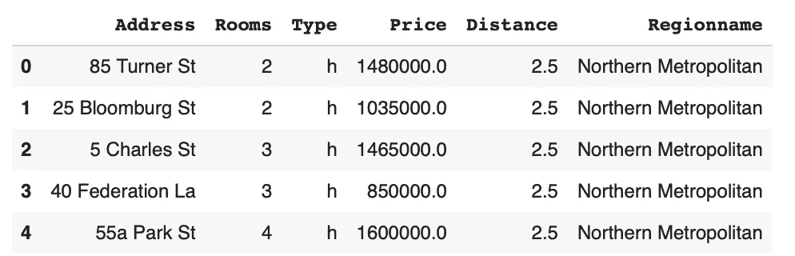
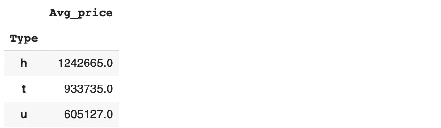
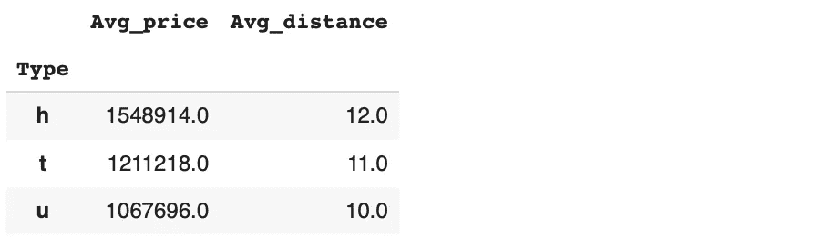

# 我学习新数据科学工具的最佳方式

> 原文：<https://towardsdatascience.com/my-best-way-to-learn-a-new-data-science-tool-b55dc0e36767?source=collection_archive---------27----------------------->

## 您需要一种有效的方法来采用丰富的工具选择。


马库斯·斯皮斯克在 [Unsplash](https://unsplash.com/s/photos/learn?utm_source=unsplash&utm_medium=referral&utm_content=creditCopyText) 上的照片

数据科学是一个跨学科领域，涉及许多不同的领域。然而，学习数据科学主要有两个方面。一个是理论知识，一个是软件工具。

没有合适的工具，我们就无法将想法付诸行动。它们允许我们从数据中提取洞察力。随着数据量的增加，工具的复杂性和种类也在增加。

不幸的是，没有一种工具能满足我们所有的需求。为了保持竞争力和高效运营，我们应该采用新工具。在这篇文章中，我将解释我学习新工具的策略。

让我们从数据科学生态系统中两个非常流行的工具开始:Pandas 和 SQL。如果你打算从事数据科学家和数据分析师的工作，你应该掌握它们。

我有一个数据集，其中包括墨尔本一些房屋的几个特征及其价格。它来自 Kaggle 上的墨尔本房产[数据集](https://www.kaggle.com/dansbecker/melbourne-housing-snapshot)。



(图片由作者提供)

考虑这样一种情况，我们需要计算不同类型房屋的平均价格。

以下是我们对熊猫的做法:

```
melb.groupby("Type").agg(Avg_price = ("Price","mean")).round()
```



(图片由作者提供)

我们可以对 SQL 进行同样的操作，如下所示:

```
SELECT type, ROUND(AVG(price)) AS Avg_price                                                                                   FROM melb                                                                                                                              GROUP BY type; type | avg_price
------+-----------
 t    |    933735
 h    |   1242665
 u    |    605127
```

这是一个非常简单的例子，展示了我如何练习学习新工具。我试着把它们和我已经知道的进行比较。这个比较包括做几个例子。

这种学习方式有两个主要优点:

*   因为我是基于我已经知道的工具进行比较的，所以我从学习我经常做的操作开始。它节省了我很多时间。比一下子全学会效率高多了。
*   这让我有机会进行高水平的比较。我对软件工具是如何设计的以及某些操作是如何安排的有了全面的了解。

这种比较也使我们更容易熟悉语法。尽管不同的软件工具可能有不同的语法，但常见操作的语法结构遵循相似的模式。

让我们做一个稍微复杂一点的例子。这次我们将添加另一个工具，即 r 的数据表包。

我们将计算不同类型房屋的平均价格和距离。我们还将添加一个过滤操作，以便只包括拥有 3 个以上房间的房屋。

熊猫:

```
melb[melb.Rooms > 3].groupby("Type").agg(
   Avg_price = ("Price","mean"),
   Avg_distance = ("Distance","mean")
).round()
```



(图片由作者提供)

SQL:

```
SELECT 
   type, 
   ROUND(AVG(price)) AS Avg_price,
   ROUND(AVG(distance)) AS Avg_distance
FROM melb
WHERE rooms > 3
GROUP BY type; type | avg_price | avg_distance
------+-----------+--------------
 t    |   1211218 |           11
 h    |   1548914 |           12
 u    |   1067696 |           10
```

数据表:

```
melb[Rooms > 3, 
   .(Avg_price = mean(Price), Avg_distance = round(mean(Distance))), 
     by=Type] Type Avg_price Avg_distance
1:    h   1548914           12
2:    t   1211218           11
3:    u   1067696           10
```

它们都提供了完成相同任务的有效方法。它们执行过滤、分组和聚合等特定部分的方式可能会有所不同。语法之间也存在细微的差别。

你可能会争辩说，如果这些工具可以执行相同的操作，我们就不需要学习所有这些工具。选择可能不总是取决于你。如果您的公司使用 R 编程语言进行开发，那么您可能需要使用数据表包，而不是 Pandas。

在某些情况下，某个特定的工具比其他工具具有某些优势。例如，如果一家公司将数据存储在关系数据库中，用 SQL 执行数据分析和操作是最可行的解决方案。

数据科学生态系统中有丰富的工具可供选择。当您处理大规模数据时，像 Pandas 和 SQL 这样的传统工具可能不是最佳选择。在这种情况下，您可能需要使用 Spark 等支持分布式计算的工具。

## 结论

近年来，数据科学获得了极大的普及。促成这种流行的原因之一是软件工具的进步。多亏了这些工具，我们能够非常容易和快速地处理数据。

由于工具选择丰富，数据科学家面临着立即学习新工具的挑战。我认为通过比较学习是采用新工具的好方法。

感谢您的阅读。如果您有任何反馈，请告诉我。