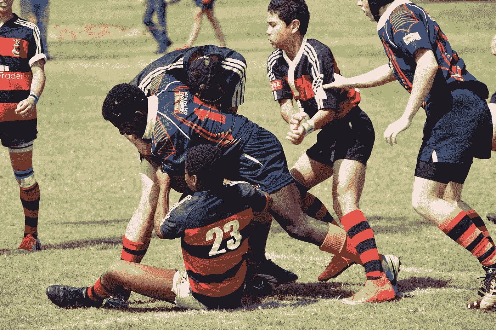

# 作为一名自学成才的数据科学家，我最大的挑战是

> 原文：<https://towardsdatascience.com/my-biggest-challenges-being-a-self-taught-data-scientist-e389f365f70c?source=collection_archive---------13----------------------->

## 以及我是如何克服它们的

菲利帕·罗斯-泰特在 [Unsplash](https://unsplash.com?utm_source=medium&utm_medium=referral) 拍摄的照片

伴随着互联网的兴起，自学也越来越多。在 21 世纪，自学从未像现在这样容易，这得益于通过互联网在全球范围内传播的大规模开放式在线课程(MOOCs)。这些课程越来越受欢迎，以至于有些人甚至开始质疑影响了企业界许多企业招聘策略的学术体系的可信度。

我个人已经承担了相当一部分 mooc——现在仍然如此。毫无疑问，我同意这些课程是无价的，至少其中一些是。没有双关的意思。

 [## 2021 年学习数据科学的课程

### 看看这份课程清单

medium.com](https://medium.com/analytics-vidhya/courses-to-learn-data-science-in-2021-a52e64344e5c) 

对于像我这样的大多数人来说，我们做的大多数事情都是因为我们不得不做；

当我在学校的时候，我做了我的家庭作业(我的一些老师不敢苟同)，因为我不得不这样做。

我找了份工作，因为我不得不。

每次训练结束后，我都会清洗我的足球鞋，因为我的靴子太脏了——在大多数职业俱乐部，脏靴子是一种罚款。

我们都**在生活中有**要做某些事情，不做这些事情会带来不利于我们真正**想要**做的事情的后果。

自学打破了这个轨迹。没有人告诉我们做什么，如果我们不做，也不会有任何后果。我们学习新的科目通常是因为我们想学，而不是因为我们必须学。随之而来的是它自身的主要障碍，这些障碍阻止了许多人进行跳跃。

## 没有方向感

当我第一次踏上数据科学之旅时，我知道自己想要实现一些明确的目标。例如，我知道我想成为一名数据科学家，我知道我想用我学到的技能帮助人们，我知道我想擅长数据科学。本质上，我知道我想要什么，但我从来不知道如何到达那里，如何衡量我是否到达那里。

想想吧…

一个人究竟如何衡量自己是否是数据科学家？—我知道有些人会说“*找到工作后你就是数据科学家*”，但这是否意味着每个因 Covid 而失业的数据科学家都不再是数据科学家，因为他们没有工作？显然不是一个好的衡量标准。

我不知道一个优秀的数据科学家是什么样的，在我参加的任何课程中都没有教授过。所以，我会花更多的时间学习不同的课程，试图找到我所缺少的东西。我读了一本书又一本书，一旦读完，我就会意识到我所知甚少，因此促使我寻找新书。

这变成了一个恶性循环，我没有完成任何实际工作。

**解决方案**:我总是发现与在该领域做大事的更资深的人联系会有所帮助。对我来说幸运的是，我遇到了[哈普瑞特·萨霍塔](https://www.linkedin.com/in/harpreetsahota204?lipi=urn%3Ali%3Apage%3Ad_flagship3_search_srp_people%3By6sC7ra5RlaHEBGG89uVOA%3D%3D)，从那以后我一直在关注他的工作和他所支持的领域里的人们。他还主持每周办公时间，在那里，一群各种水平的数据科学家聚在一起，谈论对我来说具有革命性意义的数据科学。

## 孤独

决定学习数据科学与我周围的人和我所习惯的大相径庭。我家里没有人有编程技能，我很确定我周围的每个人都会选择足球比赛而不是数学课。

当没人理解你的工作时，这是相当疯狂的…

鲍勃:嘿，伙计！你现在在做什么？

我:我是一名数据科学家。

鲍勃:

大多数对话都是这样进行的。

每当我与数据科学领域之外的人交谈时，我发现大多数时候我都在解释数据科学家到底是什么以及我们做什么。

再补充一点，每当我遇到问题时，绝对没有人可以让我大声抱怨或寻求帮助，他们离我至少有一个小时的路程(就旅行距离而言)。这并不是说在网上没有支持你的媒介，但有时，我觉得如果我有一个可以不时打电话和聊天的朋友会好得多。疫情也没帮上忙。

不要误解我。我在数据科学社区交了很多新朋友，但他们大多数生活在不同的国家，处于不同的时区。而且，在目前的气候下，我不可能赶飞机去看他们。

**解决方案**:对我帮助很大的是找到了新的爱好，我可以用它来将我的注意力从工作中分离出来，并以一种全新的思维重新审视它。我完全迷上了健美操。去年我开始做自由式健美操，从那以后我认识了很多新朋友——要么是想学一些技巧的人，要么是教我的人。不管怎样，只要有可能，和真人面对面交流总是很酷的。

## 其他数据科学家的恐惧

这听起来很傻…我害怕与其他数据科学家进行技术讨论。尤其是那些更资深的人。我总是认为他们比我更有资格(老实说，他们确实是)，因此也更有资格…

另外，你听过一群数据科学家说话吗？我第一次听到的时候，我发誓他们说的是克林贡语。

我猜这种不安全感源于某种形式的冒名顶替综合症——一种你不相信自己像别人认为的那样有能力的表现。以前，我总是避免与高级数据科学家进行技术交流，在我不能这样做的事件中，我总是尽可能少说话(换句话说，什么都不说)，即使我不同意他们说的一些事情。

**解决方法**:怀疑自己已经够糟糕了，但是拿自己和别人比，完全是对自己存在的不尊重。对此，我的最佳解决方案是把自己置于这样一种境地:我不得不与比我了解更多的人交谈。从字面上来说，变得舒服不舒服——阅读下面链接的文章获得更详细的分类。

 [## 克服数据科学骗子综合症的 5 招

### 从我个人的经验来看…

towardsdatascience.com](/5-hacks-to-overcome-data-science-imposter-syndrome-47cc45032e96) 

## 最后的想法

成为自学者的最大困难是克服你给自己设置的限制。你脑子里所有消极的自我对话。我坚信“任何人都可以学习任何他们想学的东西，如果他们决定去做的话”，但这首先要打破阻碍你进入下一个层次的精神障碍，这是第一步。

感谢您的阅读！在 [LinkedIn](https://www.linkedin.com/in/kurtispykes/) 和 [Twitter](https://twitter.com/KurtisPykes) 上与我联系，了解我关于数据科学、人工智能和自由职业的最新帖子。

## 相关文章

 [## 该是我们解散数据科学的时候了

### 为什么我们必须分散数据科学，以及它看起来会是什么样子

towardsdatascience.com](/its-about-time-we-broke-up-data-science-dd776ac2bd91)  [## 我将在四月份阅读的 4 本与数据相关的书

### 一定要看看这些书

towardsdatascience.com](/4-data-related-books-ill-be-reading-in-april-efd06b367e35)  [## 从写博客到我第一个 1000 美元月的道路

### 详细的细目分类

medium.datadriveninvestor.com](https://medium.datadriveninvestor.com/the-road-to-my-first-1000-month-from-blogging-891099362482)