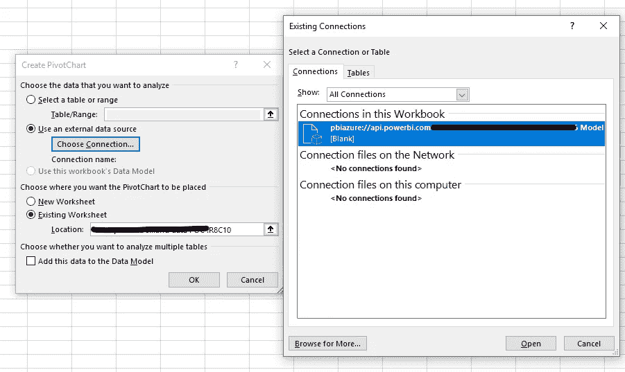
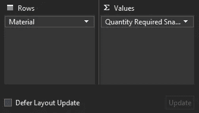

# 我目前最喜欢的 Power BI 功能

> 原文：<https://towardsdatascience.com/my-current-favorite-power-bi-feature-d2dce14d007b?source=collection_archive---------34----------------------->

## “在 Excel 中分析”选项改变了游戏规则

卢卡斯·布拉塞克在 [Unsplash](https://unsplash.com?utm_source=medium&utm_medium=referral) 上的照片

如果你是一名数据分析师，那么你可能有一个项目，其中每个人都希望以不同的方式查看相同的数据。当然，您可以用新的视图创建新的页面，但是在一天结束时，有人可能会带着一个稍微不同的用例回来，需要另一个图表或图形。报告开发会结束吗？

简介 Power BI 中的“在 Excel 中分析”功能。是什么让这个特性对最终用户*和*开发者如此重要？很高兴你问了。

## **临时数据透视表创建**

使用 Power BI 报告背后的数据，最终用户可以在 Excel 中创建自己的数据透视表。这消除了诸如“您能把这两列添加到图表中吗？”除了包括所有数据列之外，该文件还包括所有计算的度量，这使得业务分析师或任何对 DAX 代码缺乏经验的人都可以轻松掌握分析的强大功能。

如果仪表板的用户需要一次性报告的数据，那么让他们使用生成的 Excel 文件会特别方便，因为开发人员不必创建只使用一次的新页面。

## 实时数据

可以刷新由此功能创建的 Excel 文件，以便从 Power BI 报告中获取最新数据。只需右键单击→刷新即可。因此，业务经理可以创建他或她理想的数据视图，当下一个数据刷新周期到来时，他或她可以刷新报告，使其包含最新和最好的数据。

照片由[马库斯·温克勒](https://unsplash.com/@markuswinkler?utm_source=medium&utm_medium=referral)在 [Unsplash](https://unsplash.com?utm_source=medium&utm_medium=referral) 拍摄

## Excel 专业人员的熟悉程度

Excel 可能是商业专业人士使用起来最舒服的数据分析工具——至少对于小型数据集是这样。有些人可能不会很快使用 Power BI，或者他们可能已经花了很多时间在 Excel 文件中创建出色的分析。无论哪种方式，演示 Excel 中的分析功能都有助于那些不愿意学习新工具的人采用您的仪表板。

此外，用户可能希望将他们自己的数据合并到您的数据中，他们的数据可能在……您猜对了——Excel 中。此功能允许用户将其所有报告保存在一个文件中，或者使用 VLOOKUP 等公式将其数据集与 Power BI 仪表板背后的数据相结合。

## 您也可以制作数据透视图

在下面的截图中，您可以看到，一旦您单击插入数据透视图，您可以选择“使用外部数据源”,当您选择连接时，Power BI 连接已经可供您选择。

作者图片

## 提示和技巧

你准备好尝试这个功能了吗？以下是我在玩耍时学到的一些东西:

*   如果您希望某人能够使用 Power BI online 中的“在 Excel 中分析”按钮，您需要检查下面的第二个设置，以允许他们使用数据构建内容。

作者图片

*   如果您正在生成的 Excel 文件中设计您的数据透视表，您可以选中右下角的“延迟布局更新”(见下面的截图)。如果不这样做，文件将在每次对表进行更改后运行一次查询，如果添加一个包含大量唯一值的列/行，这可能需要一分钟左右的时间。

作者图片

*   您只能将 Power BI 度量放在数据透视表的“值”部分。因此，即使对于简单的公式，如 sum，您也需要创建一个度量值，以使数据透视表中的字段可求和。
*   保持表的组织性以及确保列名和度量值信息丰富非常重要，因为用户在使用文件时将能够看到所有的表和度量值。

感谢阅读！如果你有一个最喜欢的 Power BI 功能，或者你尝试了这个功能，请在评论中告诉我。