# “我的数据漂移了。接下来是什么？”如何处理生产中的 ML 模型漂移？

> 原文：<https://towardsdatascience.com/my-data-drifted-whats-next-how-to-handle-ml-model-drift-in-production-78719ef007b1?source=collection_archive---------6----------------------->

## [提示和技巧](https://towardsdatascience.com/tagged/tips-and-tricks)

## 可能步骤的介绍性概述。

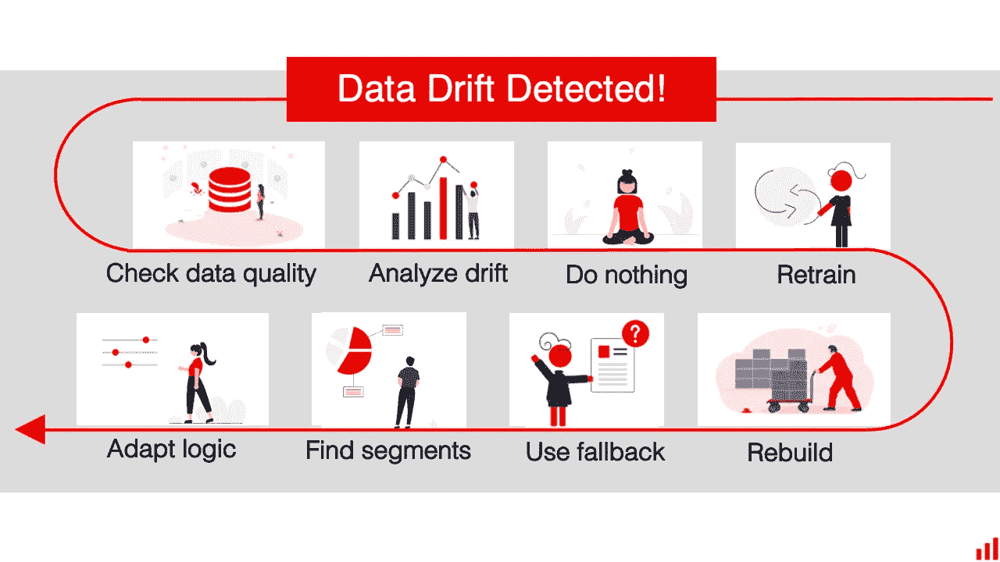

图片作者。

“我有一个生产中的模型，数据正在漂移。怎么反应？”

这是我们经常遇到的问题。

**这个** [**数据漂移**](https://evidentlyai.com/blog/machine-learning-monitoring-data-and-concept-drift) **可能是唯一的信号。**你在预测什么，但还不知道事实。模型输入和输出的统计变化是代理。数据发生了变化，您怀疑模型性能下降。

**其他情况，可以肯定知道。**您可以计算模型质量或业务指标。准确性、平均误差、欺诈率，应有尽有。性能变差了，数据也不同了。

接下来你能做什么？

下面是可能步骤的介绍性概述。

# 1.检查数据质量

图片作者。

如果你幸运的话，你有标签。应该盲目打“再培训”吗？

暂停一下可能是个好主意。

**数据漂移表示发生了变化。到底是什么？**来看看吧！

当我们谈到数据和预测漂移时，我们通常会想到模型相关性。这个模型仍然适合这个任务吗？是否在熟悉的环境中操作？

假设我们看到来自一个新地点的大量用户。他们有新的行为模式和特征。数据分布发生了变化。这就是我们所说的“真正的”数据漂移。

它可能会影响预测转化率或个性化营销提议的模型的性能。

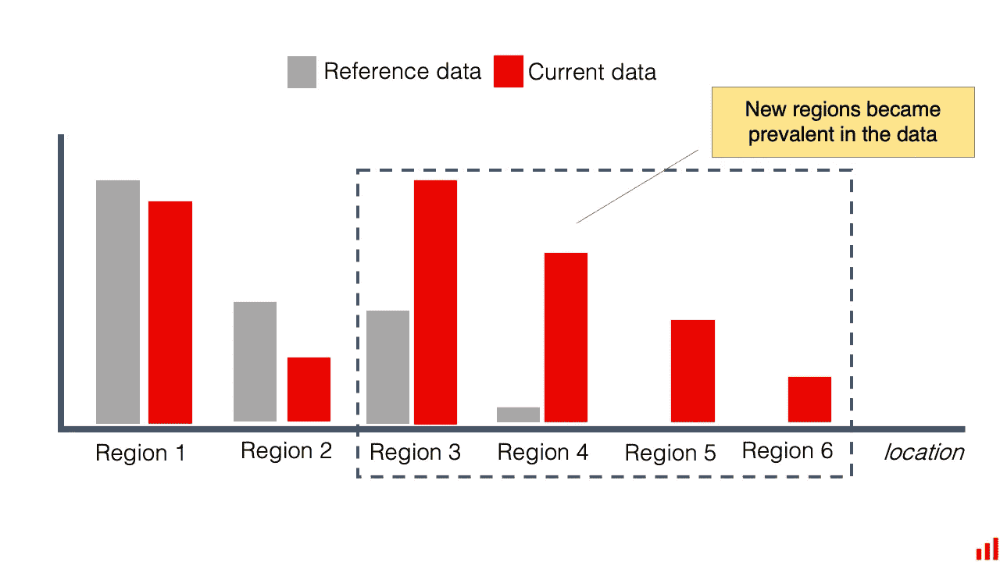

样本特征分布图(1)。是的，我们画了这个，但是你显然可以使用[开源 Python 库自动生成:)](https://github.com/evidentlyai/evidently)

但是假设在代码更新期间引入了一个 bug。因此，我们停止记录一些现有位置的数据。分布也会改变。

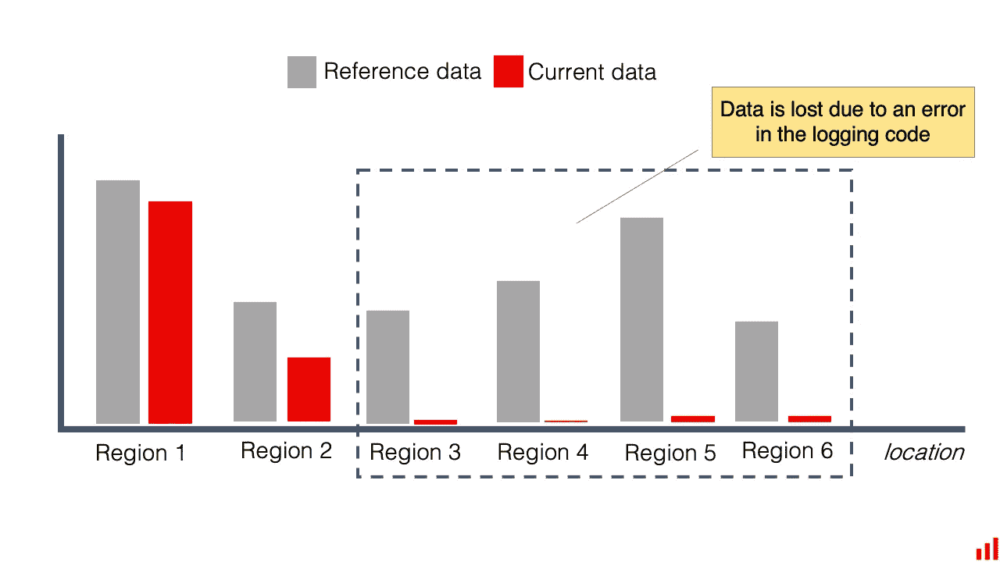

样本特征分布图(2)。图片作者。

**那是伪装成数据漂移的数据质量问题。**

数据输入错误、模式改变、上游模型问题——我们已经列出了数据可能出现问题的清单。

理想情况下，您应该[对数据质量和完整性进行单独检查](https://evidentlyai.com/machine-learning-monitoring-how-to-track-data-quality-and-integrity)，并及时做出反应。您可以监控缺失数据、范围符合性等。

如果设置了这两种类型的监视，数据漂移和数据质量警报可能会同时触发。在这种情况下，数据质量检查具有优先权。

我们先把数据搞定。

您可以再次从数据源获取数据，重写连接器，解决日志问题，更新模式或特性转换代码，等等。

在这种情况下，不需要重新训练或更新模型。模型是好的，数据不是。

数据质量几乎总是首先要考虑的问题。

# 2.调查漂移

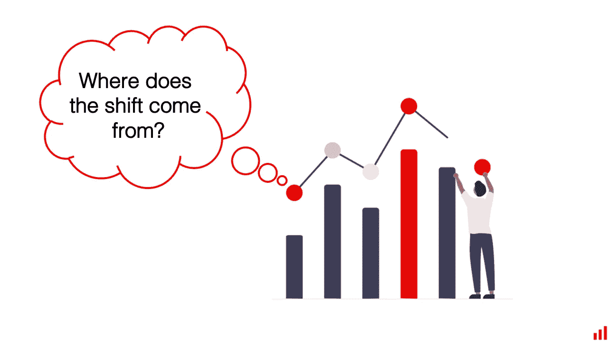

图片作者。

但是如果漂移是“真实”的呢？

该模型在动态环境中运行。事情变了。你可能会有[数据漂移，概念漂移，或者两者同时存在](https://evidentlyai.com/blog/machine-learning-monitoring-data-and-concept-drift)。

下一步是试图找到现实世界的罪魁祸首来解释它。

首先，您可以绘制漂移要素的分布。

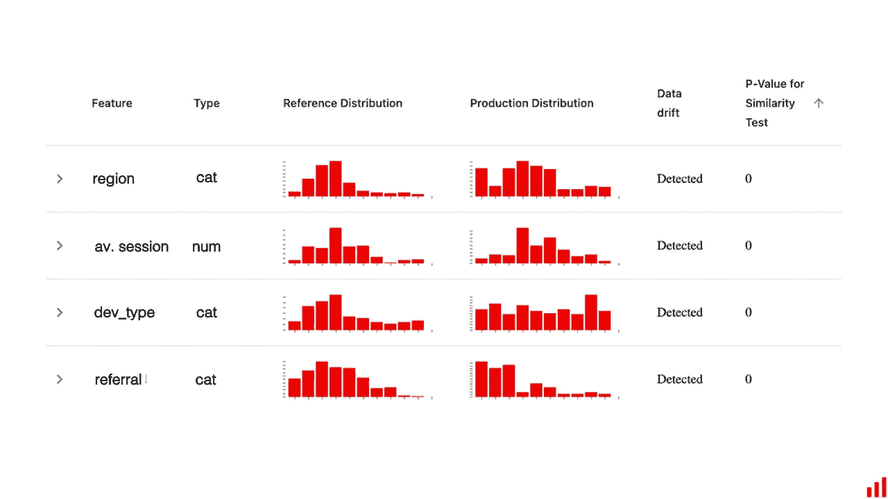

[中的样本数据漂移报告明显在](https://github.com/evidentlyai/evidently)界面。(图片由作者提供)。

目标是理解和解释变化。

让我们回到用户突然涌入的例子。这是新的营销活动的结果吗？我们是否在新的地点推出了一款应用？还是单纯的垃圾流量？

当然，这可能会变得棘手。

我们并不总是能够接触到现实世界转变的“源头”。我们所拥有的特征通常是它的不完整表现。

例如，竞争对手的活动可能会影响用户行为。但是模型特征可能不包含此信息。

与领域专家合作可能有助于找到可能的解释。

**个人特征也不总是能说明全部情况。例如，如果我们处理概念漂移，它们的分布可能保持相似。但是关系会发生变化:在特征之间，或者在特征和模型输出之间。**

可以目测一下。

**首先可以看输出分布形状本身。**如果你有实际数据，你可以看到事实是如何变化的。如果你只有模型预测，你可以看看。

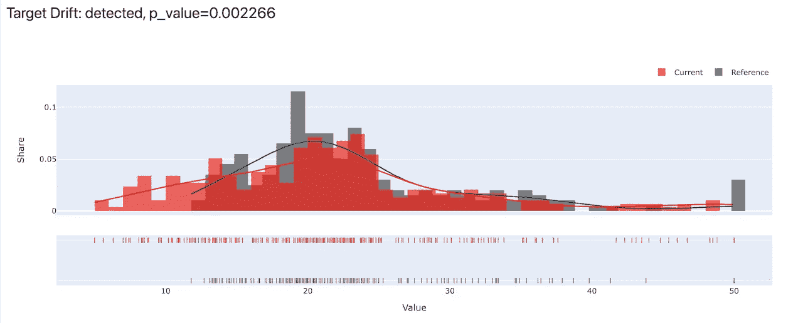

来自[的样品目标分布测试显然是](https://github.com/evidentlyai/evidently)目标漂移报告。(图片由作者提供)。

你可以看一下输入和输出分布，然后就此打住。

或者，你可以继续挖。

例如，绘制单个特征和模型预测之间的相关性[。我们并不总是期望线性关系，但这个简单的技巧往往可以提供有价值的见解。](https://docs.evidentlyai.com/reports/num-target-drift)

不幸的是，没有简单方便的方法来绘制复杂的多维交互。

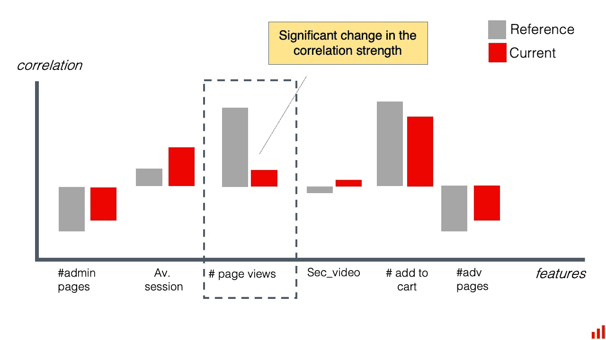

模型特征和目标值的相关图示例。(图片由作者提供)。

在上面的例子中，你可能会怀疑网页浏览量和转化率之间的突然变化是由垃圾邮件或低质量的流量引起的。

用例很重要吗？你或其他人能很好地解释这些数据吗？还有更多的东西可以看。

例如，您可以绘制成对特征相关性的变化。

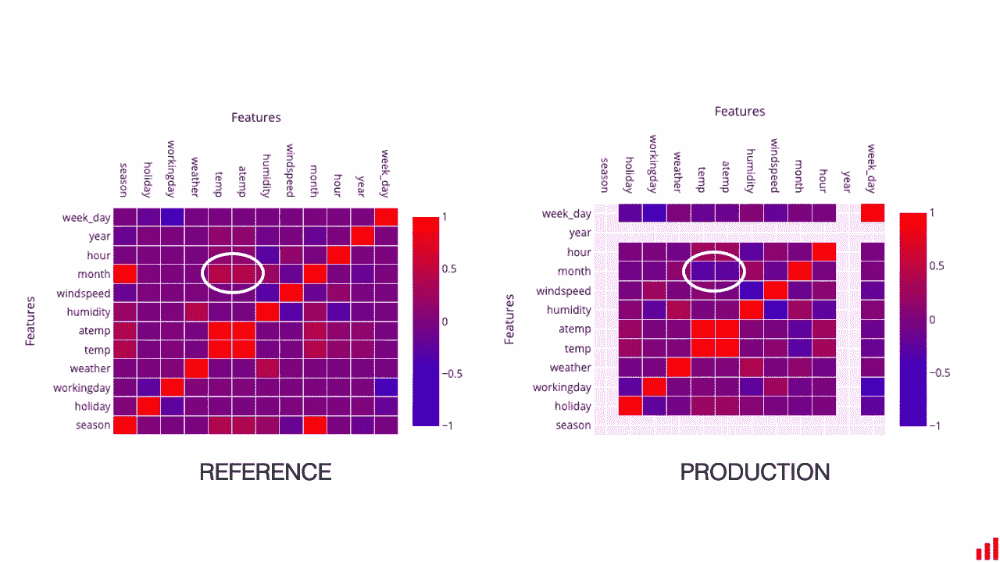

样本成对特征相关图。(图片由作者提供)。

领域专家甚至可以用肉眼发现变化。例如，制造工程师可能会注意到在物理意义上不存在的相关性。只有特定的设备故障模式才能解释这一点。

你的用例可能有一些类似的东西。

如果可以的话，理解这个语境有助于通知下一步。

# 3.什么也不做

图片作者。

你对漂移有想法。哪些特征在漂移，有多少，有多强？也许，你甚至抓住了背后的过程。

下一步是什么？

你需要决定观察到的漂移是否真的有意义。这是你应该做出反应的事情吗？

在理想情况下，我们设置漂移检测阈值时会考虑到这一点。我们选择要查看的关键特性，选择合理的统计测试，并调整置信水平。我们希望对重要的事情保持警惕。

实际上，设置漂移监控通常是通过反复试验来完成的。

如果您在生产中收到漂移警报，这通常是一个学习练习。需要反应吗，还是假阳性？

你可能会看到漂移的来源，并决定接受它。

这里没有捷径—您需要来自了解用例及数据的数据科学家的专家判断。

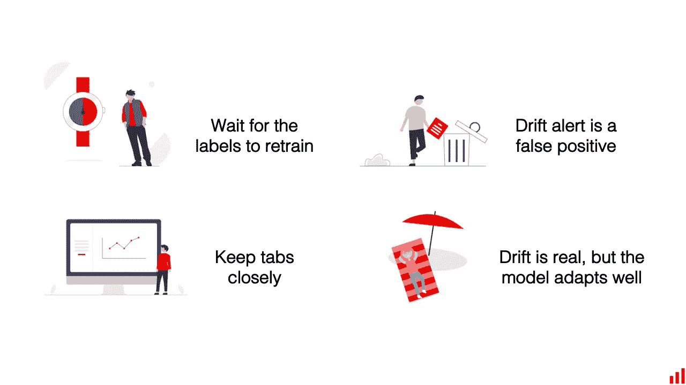

图片作者。

也许标签很快就会到了。让我们等一会儿。

在那之前，你可以简单地决定接受较低的模型性能。对于不太重要的模型，这可能是一个理性的决定。

**也许，胜负难料。让我们密切关注。**

您可以决定在接下来的模型运行中更仔细地查看数据。您可以计划一些附加报告或添加一个仪表板来跟踪特定功能。

也许，这是一个错误的警报。让我们来调整监控。

您可以放弃通知。例如，如果您不想在下一次发生同样的事情时被打扰，您可以更改漂移警报条件或使用的统计测试。

在其他情况下，您可能会对模型对漂移的反应感到满意。

假设您看到某个特定类别在模型预测中变得更加普遍。但这与观察到的特征漂移非常吻合。

例如，获批贷款申请的增加是随着高收入申请人的增加。它可能看起来像特征和预测漂移，但与您预期的行为一致。

当然，事情并不总是这样。

如果您认为需要采取行动，让我们来看看这些选项。

# 4.如果可以的话，重新训练它

图片作者。

一条简单的出路。

这仅适用于新标签存在的情况。但往往你有，或者能得到它们！

在某些情况下，我们出于方便监视数据漂移。我们在机器学习服务中直接拥有了我们所需要的一切:进入的特征和模型预测。

地面实况标注或实际值可能会延迟一段时间到达，或者驻留在与预测不同的数据库中。

**您可能需要一个单独的 ETL 作业来获取这些新数据。**

如果您检测到漂移，是时候触发这个半人工数据准备过程了。导出，执行连接，并为模型重新训练进行清理。

**在其他情况下，你可能需要先标记数据。**

贴标机专家可能就在公司内部。但是他们的时间很宝贵，你不能要求他们一直查看模型预测。你按要求触发它。

有时，您会聘请外部团队或服务提供商。漂移检测表明是时候标记新一批数据了。让模特学习变化的图案！

# 5.校准或重建模型

图片作者。

对于那些幸运拥有这些标签的人来说，这是另一种选择。

如果你面临重大改变，幼稚的再培训往往是不够的。我们已经在过去的博客中讨论过这种差异。

**通过再培训，您可以重复现有的模型培训渠道。**您保留特征工程步骤、模型类型、超参数等等。您只需更改培训数据。

您可以向现有数据集添加一组新数据，或者仅对新数据集重新运行管道。或者做一些组合，新旧混合。旁注:你可以[提前测试](https://evidentlyai.com/blog/retrain-or-not-retrain#old-or-new-data)来选择最适合你的用例。

说这就是我们所做的。我们“重放”了模型训练。但是更新后的模型在验证集上的表现并不理想。

**要重建或校准模型，您可以对培训管道进行更多更改。**

您可以从头开始重新运行模型实验，测试新的模型架构、参数或特征处理方法。

你也可以测试一些更具体的想法来对抗漂移:

*   **重新加权训练数据**中的样本，给予最近的样本更大的重要性。目标是让模型优先考虑更新的模式。
*   **确定模型失败的新细分市场**，并为其创建不同的模型。考虑对不同的数据段使用几个模型的集合。
*   **改变预测目标**。例如，从每周预测切换到每天预测，或者用从“高”到“低”的分类来替换回归模型
*   **选择不同的模型架构，以应对持续漂移**。您可以考虑增量学习或在线学习，其中模型不断适应新数据。
*   **应用领域适应策略**。有许多方法可以帮助模型更好地推广到新的目标领域。

和数据科学一样，没有任何保证。

有时主要的概念漂移会完全破坏模型。想象一下，你在生产线上从事质量预测工作，它刚刚进行了一次改造。这使得模型学习过时了。

您可能需要等待收集更多新数据，直到您可以恢复机器学习系统。

如果机器学习不起作用，你还有什么其他选择？

**可以考虑一个非 ML 的解决方案**。其他健壮的东西:基于对因果关系的理解、过程的物理或专家知识。

# 6.暂停模型并使用回退

图片作者。

让我们画一幅画。

我们知道存在模型漂移。分布发生了变化，或者预测太离谱，或者两者兼而有之。但是我们没有更新模型所需的标签！

也许，他们将在 30 天后到达。或者我们有标签，但是数据量不足以更新模型。如果模型错误有风险或代价高昂，我们不能听之任之，容忍不可靠的预测。

这是一个激进的选择。

**我们根本不用模型！**

我们可以简单地关掉它。例如，在应用程序中隐藏推荐块。

在许多情况下，您可以有替代的回退策略。例如，如果模型没有响应，可以求助于它。

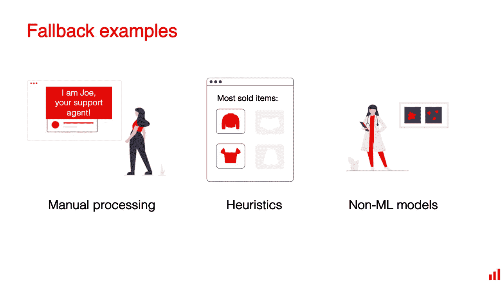

图片作者。

人类专家的决定就是其中之一。很有可能，一个 ML 模型被设计来帮助某人做可重复的决定。

但是如果模型没有帮助，你仍然可以依靠专家的判断。想象一下保险索赔处理、制造质量控制或销售线索评分。

你可以要求用户自己采取行动:就像 Twitter 在发现他们的图像裁剪算法可能有偏差时所做的那样。他们[将控制权交还给用户](https://blog.twitter.com/engineering/en_us/topics/insights/2021/sharing-learnings-about-our-image-cropping-algorithm)。

**启发式和规则是另一种。**你通常可以设计一套规则，虽然不太精确，但比流氓模型更健壮。

例如，您可以简单地向所有客户显示最受欢迎的商品，而不是随机和不匹配的推荐。

**在某些领域，你可以切换到另一种模式类型。**你可以使用金融领域的经典评分模型。你可以使用统计模型来进行医院的病人分类。您可以在制造过程控制中使用第一原理物理模型。

如果您正在处理一个高风险的领域，最好从一开始就设计这样的回退。

# 7.找到表现不佳的部分

图片作者。

对于某些模型预测，您可能只会点击“暂停”。

通常，这种变化并不普遍。它可能只影响一部分人。或者，一个新出现的细分市场本身就是变化。

如果你能定义低性能的部分，这给了你新的选择。您不会完全停止模型应用程序。但是，您可以对某些数据输入进行限制。

即使你没有地面真相标签，这也是可行的。

这里有一个例子。

**假设我们收到了营销个性化模型**的数据漂移警报。我们开始调查。我们看到模型预测和一些特征的转变。

我们最喜欢的“位置”类别又有了不同的分布。这为我们提供了一个假设来测试:所有的变化都可以归因于新的区域吗？

一些位置类别是新的。有些在训练中很少见，但变得越来越频繁。

我们过滤我们的数据，看得更远。

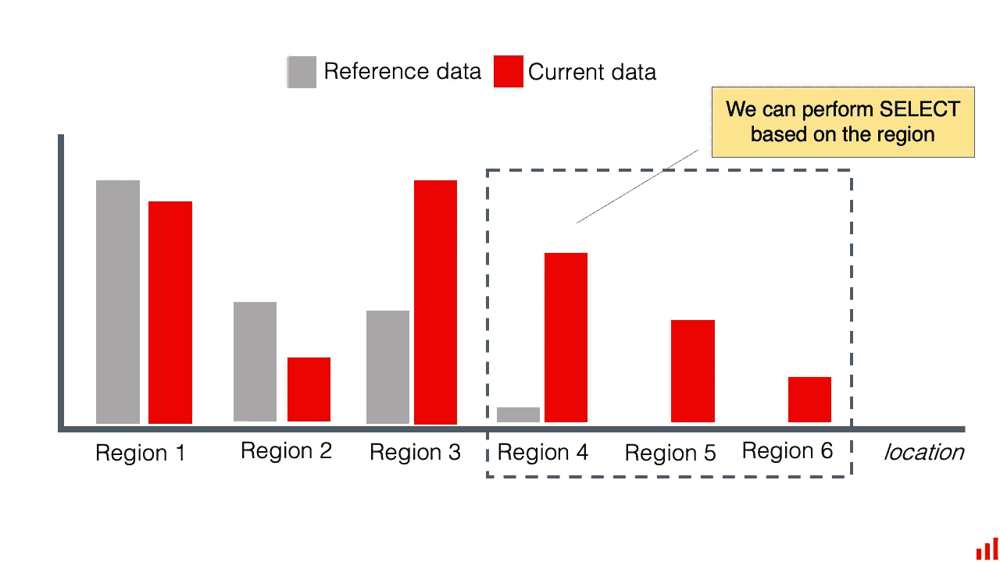

图片作者。

也许这意味着丢弃大约 40%的数据。现在让我们看看还剩下什么！

事实证明，其余的分布是稳定的，类似于训练。按位置过滤有助于我们隔离所有新奇的东西！

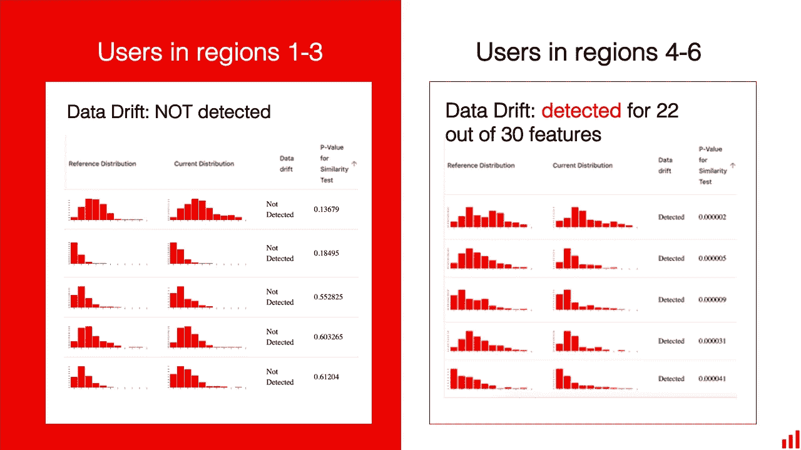

图片作者。

然后，我们可以决定预测路线。

对于频繁的、已知的用户位置，我们可以依赖该模型。对于其余的，我们可以设计一些启发。在一个个性化的例子中，营销团队可能会提出人工策划的推荐，或者我们可以求助于“最受欢迎的”列表。

**在制造过程控制示例**中，我们可能会发现漂移与新的原材料供应商有关。

当生产批次被使用时，我们可以挑选出来。对于这些更复杂的情况，我们可以依靠运营商的决定。一旦收集到足够多的新标记数据，我们将更新模型。

当然，如果您能够访问新的标签，并且能够评估实际的模型质量，那么查找和定义低性能的部分将会更加可靠。

例如，您可以直接按性能对有意义的部分进行排名，或者[探索具有最高模型误差](https://evidentlyai.com/blog/evidently-016-regression-model-performance)的区域。下面是我们如何对一个[员工流失模型](https://evidentlyai.com/blog/tutorial-2-model-evaluation-hr-attrition)进行分析的。

**如果这不起作用呢？你可以在上面试试别的东西。**

# 8.在模型之上应用业务逻辑

图片作者。

在这个选项中，您可以在模型预测的基础上进行调整，或者更改应用程序逻辑。

有不同的方法可以做到这一点。这种方法的缺点是很难推广。怀着最美好的愿望，我们可能最终只会让事情变得更糟。

由建模师和领域专家来决定。

这里有几个例子。

**输出的手动校正。这在需求预测中很常见。**

即使在一个“普通”的模型应用程序过程中，您也经常有一组针对特定项目、类别和区域的复杂业务规则。您可能习惯于调整模型预测来说明促销活动、营销活动和已知事件。

例如，DoorDash 依靠[结合专家判断和机器学习](https://doordash.engineering/2021/02/24/why-good-forecasts-treat-human-input-as-part-of-the-model/)进行需求预测。

鉴于数据或概念的漂移，您可以在模型输出的基础上应用新的修正。例如，对于给定的类别，您可以将模型输出更改 X%,或者设置最小或最大值，以确保业务流程不受影响。

慎用！

**为分类问题设置新的决策阈值是可能的。**

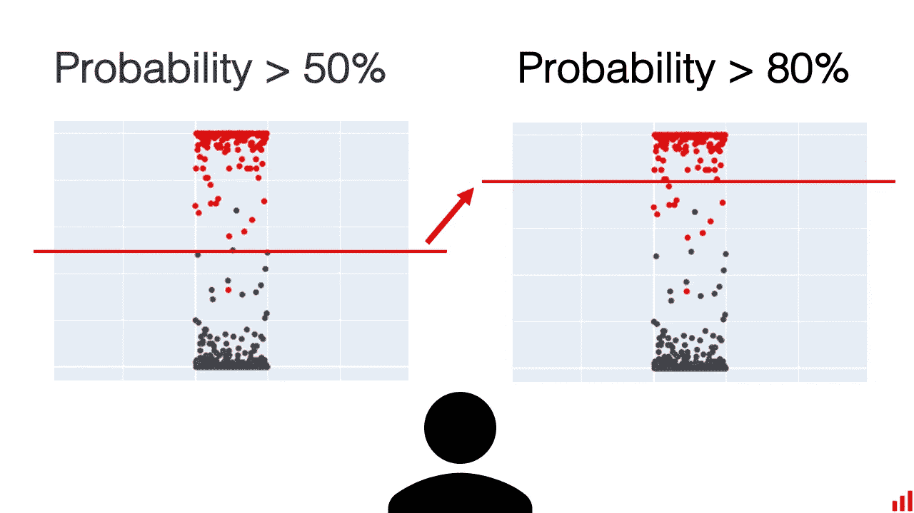

图片作者。

通常模型输出是一个概率。它说一个客户的流失率可能是 80%，另一个是 60%。

您可以在这里控制决策阈值。例如，只有当预测概率高于 50%、80%、甚至 95%时，您才可以决定分配标签“客户流失”。我们在[教程中探讨了员工流失的含义](https://evidentlyai.com/blog/tutorial-2-model-evaluation-hr-attrition)。

如果您的数据正在漂移，您可能会决定改变这一点。例如，将阈值设置得比以前高。

你可以在假设模型校准良好的情况下做到这一点，并且可以依赖更高的预测概率。或者你可以通过限制联系的客户数量来限制浪费保留预算可能造成的损失。

在单独的工作流程中处理异常值是限制错误的另一种方法。

我们最近讨论了[漂移和异常值检测](https://evidentlyai.com/blog/ml-monitoring-drift-detection-vs-outlier-detection)之间的区别。离群值侧重于检测单个“不同”的数据点。

如果您在不断变化的环境中操作，您可能会决定即使存在漂移也要保持模型运行。相反，添加一个单独的工作流来尝试“捕捉”模型可能无法处理的最奇怪的输入。

例如，您可以设置一个检测器来发现最不同或最新颖的输入。然后，您可以发送它们进行人工处理。或者，在这种情况下，您做出了根本不显示模型预测的设计决定。

## **这种手动调整很少是精确的。小心地根据可用的基线来权衡风险和不利因素。**

在我们总结这些选择之前，让我们走一个小弯路。

# 数据漂移:前传

图片作者。

我们以这个问题开始这个博客:当你注意到漂移时该怎么办？

在理想世界中，你最好反过来。先考虑可能的动作，再设计漂移检测框架。

没有一个单一的、普遍的“漂移”事件会发生在机器学习系统上，并促使你做出反应。模型创建者定义需要提醒的变化程度以及如何对其采取行动。

**首先，评估模型上下文。**数据背后的真实世界流程是怎样的？你到底期望它如何改变？

**接下来，决定模型有多重要。**你是在乎小波动还是只在乎大转变？什么是“重大”转变:一个模型失败会让你付出多少代价？

**然后，考虑选项。**你什么时候拿到新标签来更新型号？有没有可供选择的模型或系统可以让你做出决定？上面的想法适合维护工作流程吗？

之后，回过头来设计漂移检测工作流、指标和阈值。

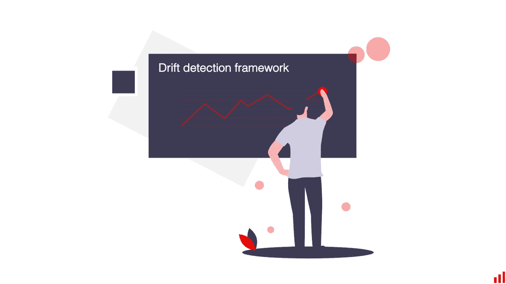

图片作者。

例如，您可能**根本不需要查看分布漂移**。如果你得到真实标签的速度足够快，你可以直接计算模型质量。如果您主要关心损坏的输入，您可以进行基于规则的数据验证检查。

另一方面，如果您有延迟的基本事实、关键用例以及您可以很好解释的特性，您可能有一个**详细的数据漂移检测**仪表板和一整套统计测试要运行。

这里有很多变化。

你可以设计一个由重要性加权的单个特征组成的自定义漂移函数。或者，简单地看看你最关心的前 5 个特性。

你可以**选择一个统计测试**来更好地适应特定的特征分布。或者监控某些特征之间的相关性，因为这对领域专家来说是有意义的。

你可能**不介意漂移的假阳性**警报，因为模型是至关重要的。或者，您只想在它完全损坏时得到通知。

以及两者之间的一切。

# 总结

漂移监控系统的设计至关重要。确保您设置警报的方式与可能的操作一致。

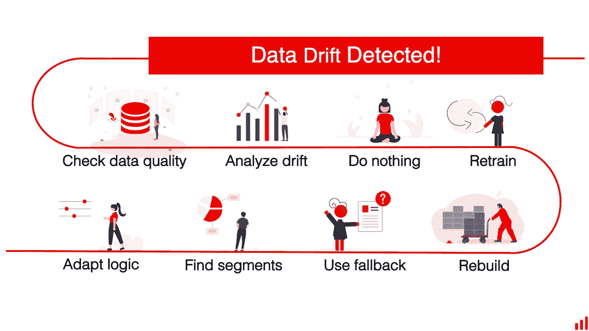

图片作者。

如果检测到漂移，您可以采取以下措施:

1.  **检查数据质量。确保漂移是真实的。**
2.  **调查。**探究数据变化，了解导致数据变化的原因。
3.  **什么都不做。**你可能会认为这是一个假警报，对模型处理漂移的方式感到满意，或者干脆决定等待。
4.  如果可以的话，再培训一下。获取新的标签和实际值，并根据最新数据重新拟合相同的模型。根据需要放弃旧的。
5.  如果需要的话，重建它。如果变化很大，您可能需要重建培训管道并测试新的模型架构。
6.  **使用回退策略。**不用机器学习做决定。
7.  **限制型号使用。**找出并排除表现不佳的细分市场。
8.  **添加自定义处理逻辑。**添加校正系数，更改决策阈值，审查异常值。请小心使用。

**有一个关于生产机器学习的问题？**加入我们的[不和谐社区](https://discord.com/invite/xZjKRaNp8b)，在 *#ds-ml-questions* 频道提问。

*本博客最初发表于*[*https://evidentlyai.com*](https://evidentlyai.com/blog/ml-monitoring-data-drift-how-to-handle)*。感谢我的联合创始人*[*Emeli Dral*](https://twitter.com/emelidral)*共同撰写了这篇文章。*

*在 appeally AI，我们创建了开源工具来分析和监控机器学习模型。在 GitHub* *上查看我们的* [*项目，喜欢就给它一颗星！*](https://github.com/evidentlyai/evidently)

想留在圈子里吗？

*   [*报名*](https://evidentlyai.com/blog/ml-monitoring-drift-detection-vs-outlier-detection#signup) *获取我们的快讯。*
*   *关注*[*Twitter*](https://twitter.com/EvidentlyAI)*和*[*Linkedin*](https://www.linkedin.com/company/evidently-ai/)*。*
*   *加入我们的* [*不和谐社区*](https://discord.gg/xZjKRaNp8b) *来聊天联系吧。*