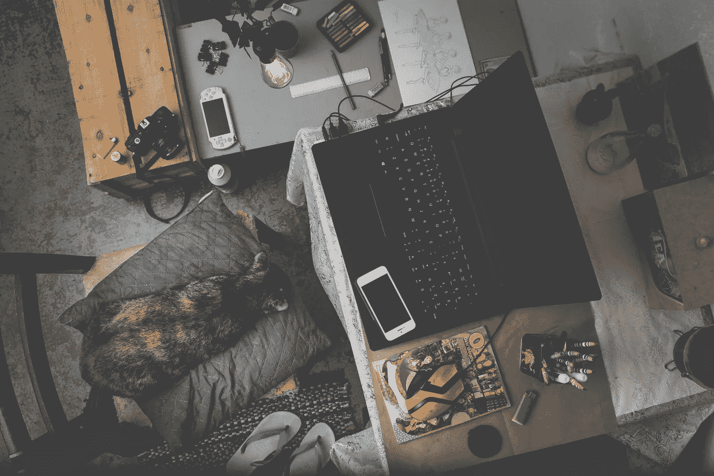
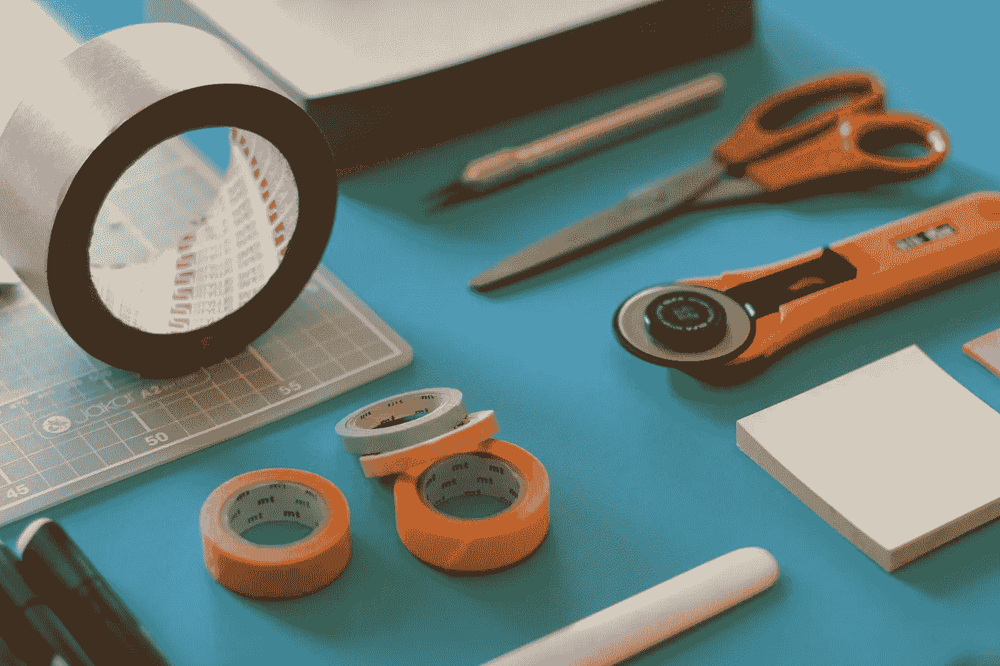

# 我的数据科学实习故事

> 原文：<https://towardsdatascience.com/my-data-science-internship-story-6ee0f10b5e0f?source=collection_archive---------41----------------------->

## 我在人工智能医疗创业公司工作 9 个月期间经历的事情

> 嗨，大家好！新年快乐。我想通过分享我最近在印度一家基于人工智能的医疗创业公司 Dozee 担任数据科学实习生的经历来开始这一年。我会试着涵盖一切，从我的日常安排到我的学习和整体经验。

赫梅尔森·科埃略在 Unsplash[拍摄的照片](https://unsplash.com/s/photos/animal-laptop?utm_source=unsplash&utm_medium=referral&utm_content=creditCopyText)

# 一些背景

大三快结束的时候，我被介绍到了深度学习和计算机视觉领域。最引起我注意的是它们在生物学和医学中的应用，以加速它们在过去几十年中相当饱和的增长。大二快结束的时候，我还挺服气的，去医学和 AI 的交汇点工作，进行最后一年的实习。我成功地在法国一家世界领先的医疗机器人研究所获得了一个职位，从事计算机视觉挑战方面的工作。但随后，COVID 击中了。旅行限制取消了我在这种环境下工作的目标。我感到崩溃，也有点焦虑，因为机会是完美的匹配。我不知道前方等待着我的是什么。

2020 年 4 月，我参加了 doze 的面试，一周后，我获得了作为数据科学实习生与他们的研究团队一起工作的机会。今天，我对自己的经历感到高兴，尤其是有可能体验到研究和生产两个方面。

> 如果你错过了一个你认为是宇宙所能提供的最完美匹配的机会，不要担心！角落里有一个同样好(如果不是更好)的机会在等着我们。你所要做的就是付出努力并发掘它。

# 每日最佳状态

首先，我想简单介绍一下我的日程安排。由于时间的灵活性，我每天上午 11 点左右开始工作，晚上 8 点结束。由于疫情限制我只能在家工作，我不必太担心午餐或晚餐的休息时间。

由[卢卡斯·布拉塞克](https://unsplash.com/@goumbik?utm_source=unsplash&utm_medium=referral&utm_content=creditCopyText)在 [Unsplash](https://unsplash.com/s/photos/work?utm_source=unsplash&utm_medium=referral&utm_content=creditCopyText) 上拍摄的照片

这一天通常以上午 10 点整的 scrum 电话会议开始。在此期间，团队讨论了各自垂直行业的近期发展以及当天的计划提案。通常持续 10 到 15 分钟，这通电话无疑为一天定下了基调。在一些日子里，有高优先级的任务，而在其他日子里，都是关于即将到来的会议和讨论。

我把我的会议分成三部分(*至少试图*)。从上午 11 点到下午 2 点，我试着完成不需要太多时间的小而分散的任务。例如，根据新需求更新功能，完成部署算法的日常测试，或者为一些快速自动化任务编写脚本。然后我暂停了大约 340 分钟，又回到了 slack 上。在去吃午饭之前，我通常会在我们的 GPU 上运行一些耗时的任务。从下午 2:30 到 5:30，我把时间花在了一天的中心任务上。这些包括通读文章和研究论文，制定解决方案，以及收集为该任务构建 MVP 所需的所有信息。这是一天中最有趣的部分，因为我在这里发现和探索的最多。我通常在下午 6:00 到 8:00 之间的时间里，将前一个会话中开发的逻辑和想法转换为代码。这在大部分时间里都很简单。我试图在收工前准备好工作代码，并在第二天早上优化它。在此期间，整天都有项目讨论和 bug 修复的电话。然而，每天的时间表并不是那么整齐划一；有时候，我一天中有三分之二的时间都花在了修复 bug 上。

除此之外，我们每周就团队中正在进行的项目进行研究和开发讨论。我爱他们！这是一次广泛的开放式讨论，我们都在讨论如何用不同的方法克服项目中的障碍。这是长达 2-3 个小时的健康讨论，从构思新项目到优化已经开发的战略。

> 我喜欢每周 R&D 讨论会的想法。这是一个让每个人都参与不同项目进展的好方法，也给了每个人合作和贡献的机会。事实上，在我们 R&D 的一次讨论中，我正在进行的项目的一个非常基础的部分的想法成形了。

在彻底研究一个想法后，我们习惯性地召开演示会议，在会上我们阐述这个想法，它的表现，并仔细检查整合的可能性。它整合了项目的所有考虑因素。

# 项目分解

谈到这个项目，我会把它分成三个主要阶段:构思、测试、生产，每个阶段都比其他阶段更重要。

Jo Szczepanska 在 [Unsplash](https://unsplash.com/s/photos/project?utm_source=unsplash&utm_medium=referral&utm_content=creditCopyText) 上拍摄的照片

## 思维能力

有些人可能会认为这是所有阶段中最重要的，因为想法将决定后面阶段的表现。作为一名新手实习生，这是我的第一个广泛的任务。我收到了问题陈述，我必须想办法解决它。刚开始还挺铺天盖地的！我记得花了几天时间阅读研究论文，试验现有的技术，以及围绕这个主题的其他先前的工作。有趣的是 Dozee 是基于心冲击描记术(BCG)，一种通过测量身体对心脏射血的反应来监测生命体征的方法。围绕这个话题做的工作不多，更不用说我具体的项目陈述了。我不得不从过去关于心电图和活动描记术的工作中获得许多想法。如果你想知道你的智能手表是如何测量你的心率的，那就是腕动描记术，这是医疗保健和机器学习的一个有趣的融合领域。想到我们的想法可能是同类中的第一个，我继续前进，并推动我进行更深入的探索。

我遇到了两种层次的想法拒绝。第一个很容易被拒绝。在简单地分析了一个想法或方法及其与我们产品的兼容性之后，我们可以很容易地放弃这个想法。也许我们没有所需的输入，或者也许不可能实时想象。第二种想法似乎是可信的，即*可以*实现的想法。找到的唯一方法是继续研究这个想法。这需要时间，不要把时间浪费在不合适的想法上。在三个月的时间里，我研究了四个有希望的想法和策略。前三次完全失败了。我们取得的成绩低于我们现有的基准。最终的方法是一个超越了我们所有基准的方法，事实上，用一个相似的问题陈述击败了 BCG 的所有工作。

值得一提的是，如果我没有尝试前三种方法，我很难得出我们目前成功的战略。对每个想法的研究帮助我从不同的角度看待问题，并共同形成了对失败原因的概念。这也有助于我深入研究，理解我们到底在试图解决什么，为什么它很重要，更不用说这个问题的生物学方面了。

## 测试

有四种方法可以迭代地进入测试阶段。通过*迭代，*我的意思是第二种方法是基于第一种方法的学习而构建的，或者最终的方法是基于前三种方法的学习。这是一个耗时的阶段。它涉及生成数据点，手工制作特征，以及一起训练深度学习模型几个小时或几天。必须建立一个管道，将我得到的原始信号转换成可以用作模型输入的形式。为第一种方法构建管道是最具挑战性的，因为对于其他三种方法，可以修改和使用相同的管道。在我们团队其他数据科学家的指导下，我遵循的一般程序是:

a)构建最基本的基准架构。

b)使用这种架构试验不同的特征空间。

c)继续用最有前途的特征空间设计更好的架构。

这真的帮助我以积极和有组织的方式评估和比较特性、模型架构。我的前两种方法是基于图像作为特征的，我记得我急切地等待可视化和评估模型性能不佳的原因。在某一点上，我构建了如此多的具有不同特征空间的模型，以至于它们看起来不再像*黑盒、*，就好像我知道它们为什么会失败，以及什么会修复它们(在 60%的情况下，:D】*都是如此)。*这一阶段是该方法证明其艺术性能的倒数第二个挑战。通常会有一个赢家，一直延续到最后的状态。然而，如果它不符合服务器和生产标准，它仍然可以在最后阶段被拒绝。

## 生产

*圣杯。*在构建了具有传奇分数的最佳模型后，是时候将它放入您产品的工作管道中了。现在，许多因素开始发挥作用，例如计算成本、实时可行性(取决于产品)、存储需求(和成本)、满足服务器配置(或构建新实例的需求)等等。评估这些因素中每一个因素的模型性能是至关重要的。其中一个方面的失败可能意味着你将开始一个新的想法或者使用其他方法进入测试阶段。一般来说，这些都是可以解决的。优化您的架构并使其轻量级是相当容易的。我们通常使用修剪和量化等技术来显著降低计算需求。可能需要中间管道来使模型与正在运行的管道兼容。记住服务器配置和其他在构思阶段不能改变的因素可以节省你大量的时间。

满足所有的需求并不意味着你的模型已经可以部署了。在使您的代码可以投入生产和实际部署到所有用户之间，会进行大量的 beta 测试。内部用户收到新模型的更新，并进行一两个月的测试，每天记录性能。用户还会被审查他们对模型性能的体验。经过一段时间稳定的性能，没有代码中断之后，这个模型就可以发布给每个使用这个产品的人了。我还记得 pull 请求被发送以将我们的项目与主分支合并的那一天。这是一种奇妙的感觉。让我的作品在数千台设备上运行的感觉真是太棒了。这项工作花了将近 7 个月的时间才投入生产，每一分钟都是值得的。

# 我的总体经验

今天，每天有成千上万的数据点通过我们建立的管道传递，这让我欣喜若狂。我喜欢我被给予试验不同技术的自由，并且想出一个满足我们所有需求的方法。我喜欢被包括在测试和生产阶段，只是建立模型。我喜欢为其他正在进行的研究项目做贡献的机会。最后，我喜欢成为所有研究讨论、scrum 电话、每月团队会议的一部分，这让我有了一种全职数据科学家的感觉。

> 如果你想成为一名数据科学家、人工智能/人工智能工程师，如果你的目标和兴趣一致，那么与一家初创公司合作是不会错的。

随着医疗保健越来越重要，今天，我们看到更多这样的创业公司出现。在 Dozee 工作当然让我更接近我对医学和人工智能交叉的兴趣，该领域未来的潜力真的让我兴奋。

有兴趣了解更多我们的发现吗？我们的预印本现已发布:

 [## 基于深度学习的心冲击图系统睡眠-觉醒状态分类

### 睡眠状态分类在管理和理解睡眠模式中是至关重要的，并且通常是睡眠研究的第一步

arxiv.org](https://arxiv.org/abs/2011.08977) 

非常感谢你的阅读。我希望你喜欢它。如果你觉得我错过了什么，或者如果你想知道更多，请在下面的评论中留下，如果 Dozee 团队有人正在阅读这篇文章；感谢给我这个机会！

在 AI 上看多了有交集？探索下面的文章。

 [## 基于人工智能的健身追踪器是如何工作的？制成 1D CNN

### 一篇关于基于人工智能的健身追踪器的算法如何进行活动识别的文章和一个简短的…

medium.com](https://medium.com/swlh/how-do-ai-based-fitness-trackers-work-ft-1d-cnns-e76f679bdee8)  [## 将 AI 推向边缘的热潮

### 为什么苹果、英特尔、谷歌等公司试图将人工智能从云端转移到边缘

towardsdatascience.com](/the-rush-to-push-ai-to-edge-2ac477be0e6b) 

作者图片(最近点击)