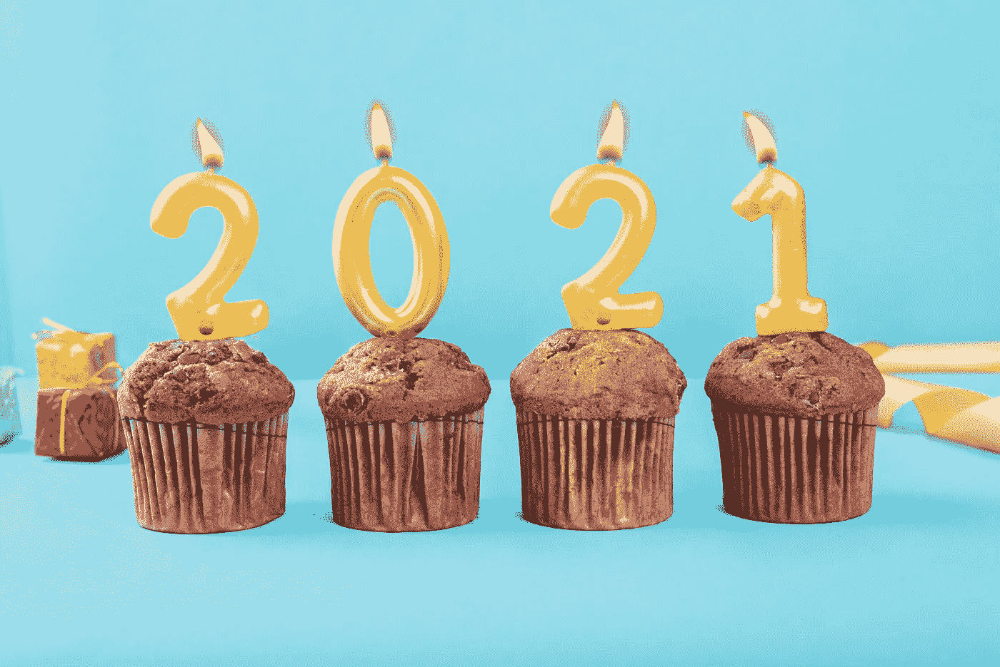
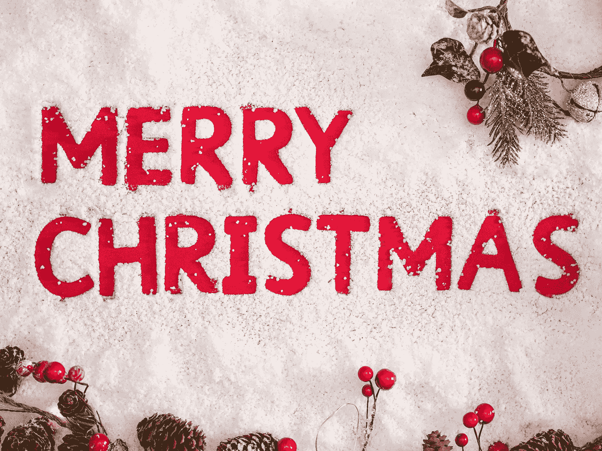

# 我 2021 年的数据科学之旅

> 原文：<https://towardsdatascience.com/my-data-science-journey-in-2021-5f95b93f98e2?source=collection_archive---------12----------------------->

## 2022 年将会发生什么

[GR Stocks](https://unsplash.com/@grstocks?utm_source=unsplash&utm_medium=referral&utm_content=creditCopyText) 在 [Unsplash](https://unsplash.com/s/photos/2021?utm_source=unsplash&utm_medium=referral&utm_content=creditCopyText) 上拍照

我简直无法想象又到了一年一度的时候，每个人都试图吹嘘他们一年来的成就，并为来年制定他们大多无法实现的一厢情愿的计划。

我不是伟大传统的例外。

2021 年是孤独、挣扎、沮丧和精疲力竭的一年。同时，这也是学习、成长和成就的一年。在全球疫情的背景下，我以一个在三个月内找到工作的雄心勃勃的目标开始了这一年，但却以几乎三倍的时间结束了。幸运的是，事情进展顺利，我在[沃尔玛全球科技](https://medium.com/walmartglobaltech)得到了一份数据科学(统计学家)的工作。

*数据科学就业市场现在很热，但竞争也很激烈。如果你正纠结于面试循环，请看看我的沃尔玛之旅:* [*我是如何在沃尔玛*](/how-i-land-a-data-science-job-at-walmart-b2d9bd1539be?sk=49603c28f068143d3e01a0deed99b627) *获得一份数据科学工作的。*

> 年度关键词是什么？
> 
> 面试！

没错。整个 2021 年都是围绕着准备技术面试和面试后做事。因此，我将这篇文章的剩余部分分成四个部分，详细阐述我在每个阶段的成就。最后，我会列出 2022 年的几个计划。

# 第一季度:准备面试

在和业内朋友完成了几轮模拟面试后，我很快意识到了学术研究和真实行业工作的差距。我确定了一些需要培养的关键技能。SQL 和 Python 站在列表的顶端。为了快速发展我的编码技术，我在第一季度写了 20 多篇冗长的技术博客。

作为一名教育工作者，我坚信通过写作教学是最好的学习方式。如果您能够将核心数据科学概念分解成更小的模块，您就真正理解了这些概念。

教学重塑了我对数据科学和其他技术学科的整体看法。当然，学习应该是反复的，以小剂量进行。

如果你是一名数据科学家或者想进入这个领域，请查看这篇关于如何更有效地学习的文章:

 [## 作为一名数据科学家，我如何成长

### 适合我的可能也适合你

towardsdatascience.com](/how-i-grow-as-a-data-scientist-62027b7cc069) 

在线写作的另一个好处是，它创造了一个奇妙的在线存在，并作为你的数据科学投资组合。在沃尔玛的现场面试中，所有的面试官都提到了我的技术博客文章。

写作时，我把质量放在首位。例如，我花了大约一年时间为下面这篇文章做研究，这篇文章记录了科技公司在实验策略中最常犯的错误:

 [## 运行 A/B 测试的 8 个常见陷阱

### 如何不让你的在线控制实验失败

towardsdatascience.com](/online-controlled-experiment-8-common-pitfalls-and-solutions-ea4488e5a82e) 

# 第二节:学会破解面试

在接下来的几个月里，我参加了多家科技公司的面试。刚开始并不顺利，因为各种原因炸了几个面试。首先，我将技术面试视为学术讨论，而不是评估候选人能力的结构化方式，这是一个新手的错误。幸运的是，我很快意识到了不同之处，并采用了更具互动性的采访方式。

第二，我当时视野狭窄，未能从每次面试中反思哪些地方可以改进。回顾过去，我会把每一次面试都视为一次学习的机会，并接受自己的弱点。

第三，将拒绝视为个人行为只会带来伤害。如果你在面试循环中，试着接受一个否定的回答，并从拒绝中学习。要有弹性，因为从拒绝中恢复的速度决定了你能走多远。

我应对拒绝的策略是保持一种成长的心态，更加肯定自己的成长。帮我完成一个简单的任务。

例如，编写有效的代码曾经是我最大的弱点，我遵循这些技巧来提高我的 SQL 和 Python 编程技能:

 [## 数据科学家如何提高他们的编码技能

### 可以帮助你轻松编程的 6 个技巧

towardsdatascience.com](/how-data-scientists-can-improve-their-coding-skills-b4f2924198ae) 

照片由[杰米街](https://unsplash.com/@jamie452?utm_source=unsplash&utm_medium=referral&utm_content=creditCopyText)在 [Unsplash](https://unsplash.com/s/photos/christmas?utm_source=unsplash&utm_medium=referral&utm_content=creditCopyText)

# 第三季度:广度>深度

7 月底，我收到了一份工作邀请，并与[沃尔玛全球技术](https://medium.com/walmartglobaltech)签订了合同。感到幸福和感激。这完全符合我在统计学、机器学习和实验&因果推理方面的学术背景。

> 签完合同后我做了什么？

我没有放松和无所事事，而是收集团队的反馈，并试图更好地了解他们的痛点。例如，他们会遇到哪些常见问题？他们从最终用户那里收到了哪些投诉和担忧？同样重要的是，他们想进入什么样的未来方向？他们希望关注哪些优先事项？

此外，我退出了其他科技公司的剩余面试(其中几家已经进入最后一轮)，并从任何面试准备中解脱出来。从时间管理的角度来看，这是一个明智的决定，因为我有更多的时间阅读和研究。

利用额外的时间，我深入研究了其他科技公司如何解决具体技术问题的文献，并了解了其中的细微差异。事实上，我每天花大约 8 个小时，每周花 6 天时间(大约 50 个小时/周)研究相关主题。因此，到本季度末，我对实验和数据科学的理解显著提高。

 [## 随机化、分块和重新随机化

### 在线实验的三个基本支柱

towardsdatascience.com](/randomization-blocking-and-re-randomization-f0e3ab4d79ca) 

# 上一季度:深度>广度

随着开学日期的迅速临近，我再次调整了阅读习惯。我没有广泛阅读各个领域的书籍，而是选择了几个主题，集中在精简的列表上。

到第三季度末，我已经很好地了解了其他科技公司是如何进行实验的，并确定了我下一步需要努力的关键领域。

深度和广度是不可能同时达到的。所以，最后一个季度我放弃广度换取深度。事实证明，专注服务于我的长期目标。

*Medium 最近进化出了自己的* [*作家伙伴计划*](https://blog.medium.com/evolving-the-partner-program-2613708f9f3c) *，支持像我这样的普通作家。如果你还不是订户，通过下面的链接注册，我会收到一部分会员费。*

 [## 阅读叶雷华博士研究员(以及其他成千上万的媒体作家)的每一个故事

### 作为一个媒体会员，你的会员费的一部分会给你阅读的作家，你可以完全接触到每一个故事…

leihua-ye.medium.com](https://leihua-ye.medium.com/membership) 

# 2020 新年决心

没有完成所有的目标是正常的，一个经验法则是实现 80%的目标:高于目标意味着你把标准定得太低，低于目标意味着你高估了自己的能力。

> 我一生的座右铭是通过对我所能达到的目标不设上限来获得自由。

我将与我的数据科学社区分享以下 2022 年的具体计划:

*   练习相邻学习，获得更多的数据工程技能。 **End** **结果:**能够执行基本和中等水平的工程任务。
*   探索新的交流渠道，邀请人们加入我的 YouTube 频道。**最终结果:**征求他们的职业建议，并与数据科学社区分享。
*   在[媒体](http://leihua-ye.medium.com)和 [LinkedIn](https://www.linkedin.com/in/leihuaye/) 上继续写。**最终结果:**建立更有意义的联系。
*   多运动，保持健康，多运动。**最终结果**:完成另一场马拉松，增肌更多。

# 外卖食品

以下是我从 2021 年最大的收获。

*   **学无止境**。与任何技术领域一样，数据科学正在快速变化和发展。最近的趋势是转向工程，数据科学家必须执行许多工程任务。没有适当的 SQL、Python 和大数据培训，我们做不了多少事情。令我惊讶的是，数据科学家需要对数据管道有如此高的理解，这促使我学习更多关于数据工程的知识。
*   **在学习中学会更好。我创造了“主动学习”这个术语，指的是通过理解基础知识来更有效地学习。我主动学习的秘密武器是通过反复阅读、写作和教学。**
*   **保持干劲**！我是一个高成就者。例如，我同时完成了两个研究生项目(政治学博士和统计学硕士)。嗯，明显的缺点是它很容易导致倦怠。以下是我的应对策略。首先，走出我的舒适区，探索未知的领域，这就是为什么我开办了一个 YouTube 频道。第二，成长的心态帮助我放松自己。第三，稍事休息，神清气爽地回来。第四，举重有帮助。

# 喜欢读这本书吗？

> 请在 LinkedIn 和 Youtube 上找到我。
> 
> 还有，看看我其他关于人工智能和机器学习的帖子。