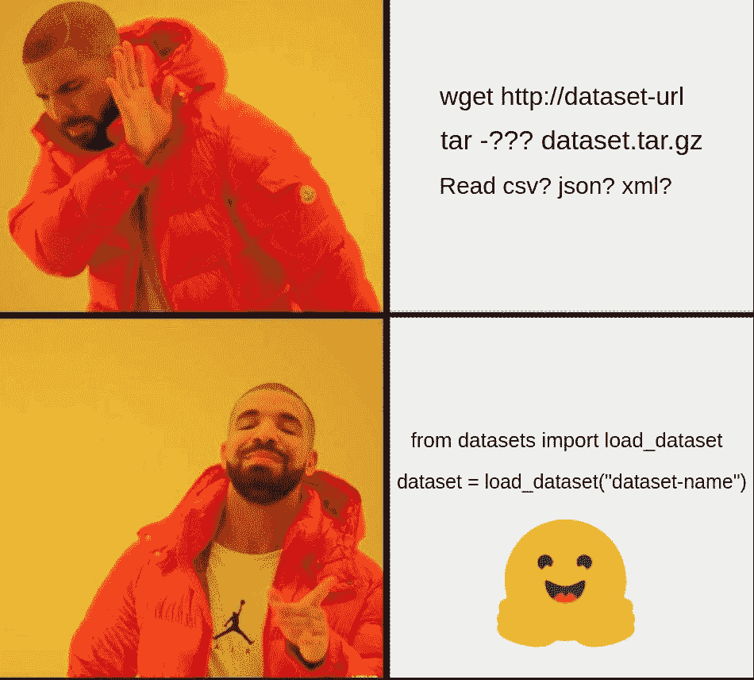
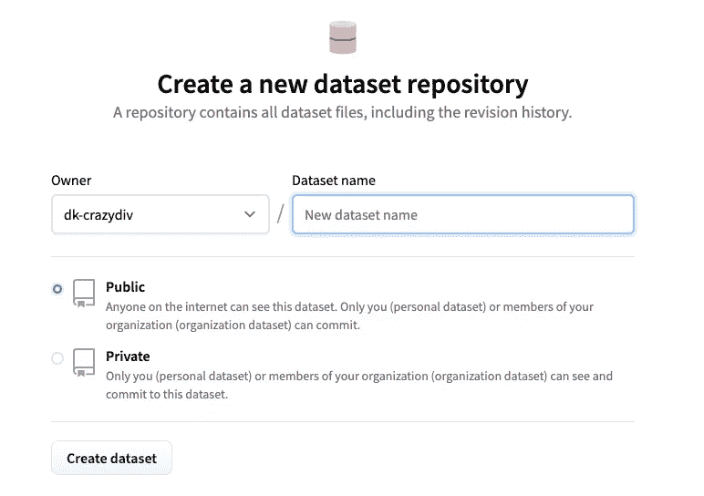

# 我在 HuggingFace 的 dataset-hub 上上传数据集的经验

> 原文：<https://towardsdatascience.com/my-experience-with-uploading-a-dataset-on-huggingfaces-dataset-hub-803051942c2d?source=collection_archive---------18----------------------->

HuggingFace 的[数据集](https://github.com/huggingface/datasets)库是一个单行 python 库，用于从 [HuggingFace 数据集中心](https://huggingface.co/datasets)下载和预处理数据集。截至目前，该图书馆包含约 1000 个公开可用的数据集。


(来源:self)

在这篇文章中，我将分享我在 dataset-hub 上上传和维护数据集的经验。以下 meme 总结了使用数据集库背后的意图:



上传数据集的灵感(作者:self)

## 获取数据:

在 HuggingFace 人员的帮助和指导下，我能够将[模型中心](https://huggingface.co/models)(类似于数据集，HuggingFace 托管 10，000 多个公开可用的模型)上可用信息的元数据下载到一个 csv 文件中。然后，我开始将它作为数据集上传到 dataset-hub。

## 安装数据集库:

```
$pip install datasets
```

## 添加数据集:

添加[公共数据集](https://huggingface.co/docs/datasets/share_dataset.html#sharing-your-dataset)有两种方式:

*   ***社区提供的*** :数据集托管在数据集中心。它**未经验证**并在名称空间或组织下被识别，就像 GitHub repo 一样。
*   ***规范*** :通过打开 **PR(Pull Request)** 到回购，数据集直接添加到 ***数据集*回购**。通常，数据是不托管的，必须经过 PR 合并过程。

因为我想托管数据，以及预处理脚本(被库称为“数据集加载脚本”)，所以我选择上传数据集作为*社区提供的数据集*。

将 csv、json、xml 或任何其他格式的现有数据集转换为数据集有两个主要要求:

*   数据集加载脚本
*   数据集元数据

## 数据集加载脚本:

创建这样一个脚本有很好的文档可用。然而，我更喜欢通过使用与我相似的预先存在的数据集的脚本进行复制粘贴，这些脚本存在于数据集库中[。例如:如果我的数据集是 csv 类型，我将从一个类似的 csv 类型脚本开始，并根据我的需要修改它。](https://github.com/huggingface/datasets/tree/master/datasets)

该脚本主要需要定义三个组件:

*   关于列和数据类型的信息(称为[特性](https://huggingface.co/docs/datasets/features.html)
*   从(或本地文件)下载数据并指定培训/测试/验证分割的 URL
*   利用分割和特征产生 1 行数据

**1。_ info:**CSV 字段的标题需要用它们的数据类型来定义。我最后用了`string`、`int32`和`large_string`。f [特性](https://huggingface.co/docs/datasets/features.html)中提供了受支持数据类型的描述。


数据类型很重要！(来源:self)

```
def _info(self):
        return datasets.DatasetInfo(
            description=_DESCRIPTION,
            features=datasets.Features(
                {
                    "modelId": datasets.Value("string"),
                    "lastModified": datasets.Value("string"),
                    "tags": datasets.features.Sequence(datasets.Value("string")),
                    "pipeline_tag": datasets.Value("string"),
                    "files": datasets.features.Sequence(datasets.Value("string")),
                    "publishedBy": datasets.Value("string"),
                    "downloads_last_month": datasets.Value("int32"),
                    "library": datasets.Value("string"),
                    "modelCard": datasets.Value("large_string"),
                }
            ),
            homepage=_HOMEPAGE,
            license=_LICENSE,
            citation=_CITATION,
        )
```

列“标签”和“文件”是数组，因为它们可以是多个，由库通过`dataset.features.Sequence.`支持

**2。URLs 本地文件:**

下一步是定义一个 URL，在我的例子中是一个本地文件。因为数据只是探索性的，没有任何目标标签(不是专门用于训练的)，所以不需要测试分割。因此，只有训练数据集分割会起作用。

```
_URL = "huggingface-modelhub.csv"
...
def _split_generators(self, dl_manager):
    """Returns SplitGenerators."""
    data_file = dl_manager.download_and_extract(_URL)
    return [
        datasets.SplitGenerator(
            name=datasets.Split.TRAIN,
            gen_kwargs={
                "filepath": data_file,
            },),]
```

**3。生成一行:**

下一步是生成单行数据。在运行时，适当的生成器(如上定义)将从 URL 或本地文件中选取数据源，并使用它来生成一行。这里，由于数据格式是`csv`，我们可以使用 python 内置的 csv 模块及其函数`csv.reader`从文件中读取数据。

```
def _generate_examples(self, filepath):
    """Yields examples."""
    with open(filepath, encoding="utf-8") as f:
        reader = csv.reader(f)
        for id_, row in enumerate(reader):
            if id_ == 0:
                continue
            yield id_, {
                "modelId": row[0],
                "lastModified": row[1],
                "tags": ast.literal_eval(row[2]),
                "pipeline_tag": row[3],
                "files": ast.literal_eval(row[4]),
                "publishedBy": row[5],
                "downloads_last_month": float(row[6]) if row[6] else 0,
                "library": row[7],
                "modelCard": row[8]
            }
```

`ast.literal_eval`是一个将字符串中的数组解析成实际数组(list)的便捷函数。

该脚本可以这样测试:

```
**>>>** from datasets import load_dataset
**>>>** dataset = load_dataset('PATH/TO/MY/SCRIPT.py')
>>> dataset["train"] # To access train generator
>>> dataset["train"][0] #Access elements in dataset
```

脚本就绪后，我们继续添加数据集元数据，并准备好发布数据集。

## 数据集元数据:

文档详细解释了如何为共享准备数据集。为了添加元数据，可以通过`datasets-cli`使用一个 helper 命令，它是在我们安装`datasets`库时安装的。

```
datasets-cli test datasets/<your-dataset-folder> --save_infos --all_configs
```

运行上面的命令会生成一个文件`dataset_infos.json`，其中包含数据集大小、校验和等元数据。

## 上传数据集:

Huggingface 在幕后使用 git 和 git-lfs 将数据集作为存储库进行管理。首先，我们需要创建一个[新存储库](https://huggingface.co/new-dataset)。



创建新的数据集 repo ( [来源](https://huggingface.co/new-dataset)

一旦存储库准备就绪，就可以应用标准的 git 实践了。即从您的项目目录运行:

```
$ git init .
$ git remote add origin https://huggingface.co/datasets/<user>/<repo>
$ git pull origin main
```

现在，我们已经将本地机器与存储库同步。下一步是添加以下文件并提交:

*   数据集文件(csv): **数据本身**
*   数据集加载脚本:**数据**的加载器
*   数据集元数据:**元数据，如大小、引用等**

**但是有一个条件！传统的 git 系统不适合处理大文件。这是通过 [git-lfs](https://git-lfs.github.com/) (大文件存储)来管理的。我们不需要深入了解它是如何工作的，我们只需运行以下命令就可以将大文件推送到 repo:**

```
$ git lfs install
$ git lfs track huggingface-modelhub.csv
$ git add dataset_infos.json huggingface-modelhub.csv huggingface-modelhub.py
$ git commit -m "Commit message"
$ git push origin main
```

[文档](https://huggingface.co/docs/datasets/share_dataset.html#uploading-your-files)也详细介绍了 lfs。因为这只是一个 git repo，所以也可以提交像 README 这样的任何其他文件。Dataset-hub UI 还提供了一种快速更新自述文件(称为 datasetCard)的方法

仅此而已。数据集应上传到数据集中心。要访问它，请运行:

```
>>> dataset = load_dataset("<user>/<repo>")
```

## 将更改推送到已发布的数据集:


维护数据集版本(来源:self)

由于数据集的 repo 可以使用 git 进行控制，我认为首先提交到一个`dev`分支，完整地测试它，然后执行到`main`的合并可能是一个好的实践。这将大大有助于“意外地”破坏一个已经存在且稳定的工作数据集。这非常类似于标准的基于 git 的软件发布哲学。

另一个优势是数据集版本也不一定需要连续(1、1.1、1.2 等)。不同的分支可以保存不同版本的数据集。

```
**>>>** dataset = load_dataset("<user>/<repo>",
**>>> **  script_version="dev")  *# tag name, branch name, or commit hash*
```

## 卡住时该怎么办:


HuggingFace 有一个自主持的讨论平台(来源:self)

拥抱脸论坛非常活跃，团队+社区非常有帮助和支持。我个人觉得比 stackoverflow 更主动，反应更快。你也可以直接在 github 上打开[问题](https://github.com/huggingface/datasets/issues)，但是我更喜欢论坛，因为它们有点不正式。

> 没有问题是愚蠢的问题！永远不要害怕问。

那都是乡亲们！

我希望你喜欢这篇文章，并发现数据集库是有用的。我用加载脚本[上传的数据集可以在这里](https://huggingface.co/datasets/dk-crazydiv/huggingface-modelhub)查看，并用作 csv 格式的参考。

请在评论中分享你的观点。我也准备在推特上进行讨论。

祝你愉快。:)