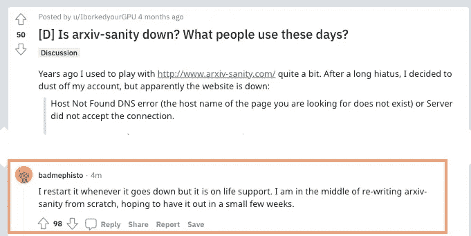
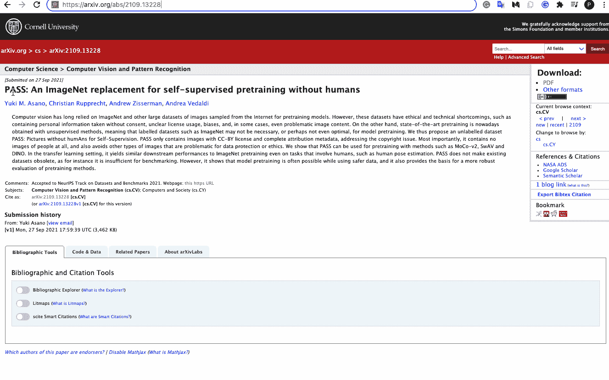
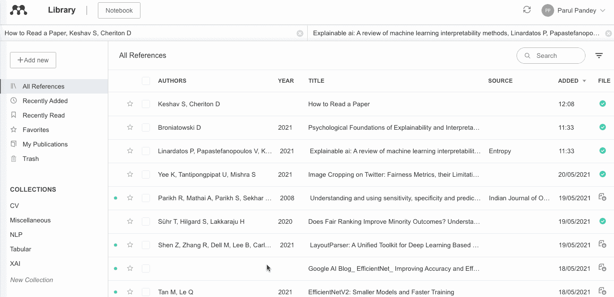
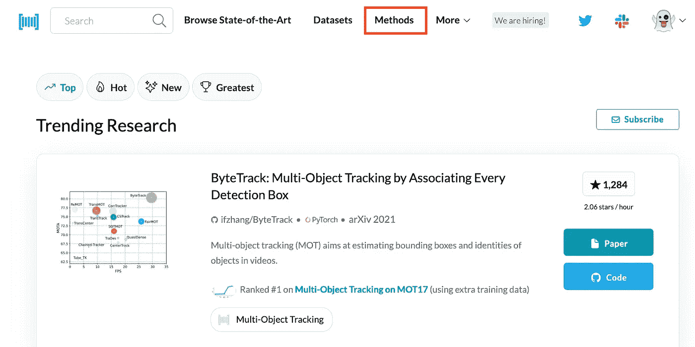
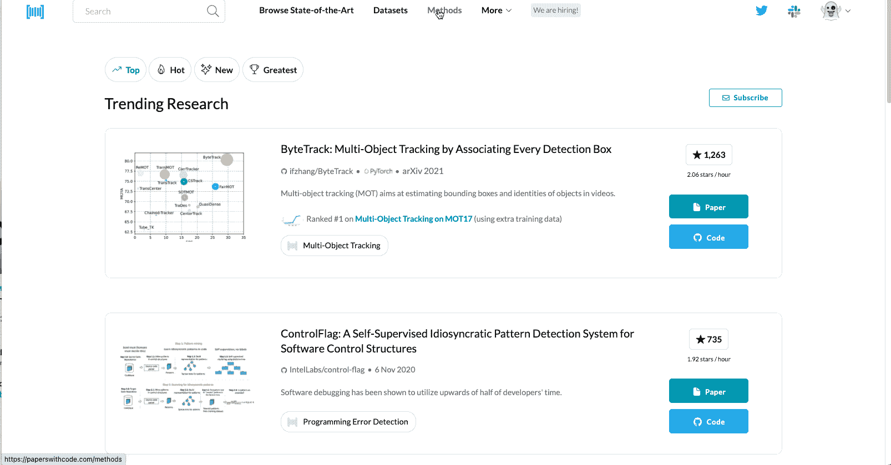

# 我最喜欢的管理、组织和阅读研究论文的工具

> 原文：<https://towardsdatascience.com/my-favorite-tools-for-managing-organizing-and-reading-research-papers-56525083b827?source=collection_archive---------1----------------------->

## 这样你就不会迷失在文件的海洋中。

在 [Unsplash](https://unsplash.com?utm_source=medium&utm_medium=referral) 上 [Mari Helin](https://unsplash.com/@mari?utm_source=medium&utm_medium=referral) 拍摄的照片

> 如果说我看得更远，那是因为我站在巨人的肩膀上*——艾萨克·牛顿。*

上面的引用首次出现在牛顿于 1675 年写给罗伯特·胡克的一封信中。从那时起，这句话就被用来象征科学的进步和发展。人们常说，了解机器学习领域最新动态的最佳方式之一是阅读研究论文。然而，这说起来容易做起来难。阅读研究论文并不是每个人都喜欢的。虽然许多人觉得它们令人生畏，但其他人觉得不可能跟上每天发表论文的剂量。 [Arxiv](https://arxiv.org/) —查找此类论文的必去网站之一，已提交超过[190 万篇论文](https://arxiv.org/stats/monthly_submissions)(截至 2021 年 10 月*)*并且每天都在增加。更糟糕的是，还有一个` ***怕漏了'*** 上的最新领域*。如果你属于这个群体，不要担心，你不是唯一的一个。许多人都在同一条船上航行，以至于有一个完整的吴恩达关于阅读研究论文的讲座。*

[吴恩达关于阅读斯坦福 CS230 课程研究论文的讲座](https://www.youtube.com/watch?v=733m6qBH-jI&t=2605s)

阅读研究论文确实是一门艺术，可以从一些方便的工具开始，随着时间的推移而发展。在这篇文章中，我想分享几个这样的工具，我用它们来组织我最喜欢的研究论文，并获得最新的信息。这不是一个详尽的列表，但对于那些研究和文献综述领域的新手来说，这是一个很好的起点。

# 1.ArXiv 理智保护者

在处理 ArXiv 的研究论文时，我使用 Arxiv 理智保护程序来保护我的理智。由 [Andrej Karpathy](https://twitter.com/karpathy) 创建的网站 Arxiv Sanity Preserves 是一个帮助你找到你最喜欢的论文和该领域趋势的网络界面。该网站为你提供了一个搜索引擎来查找任何主题的论文。然后，您可以将喜爱的论文保存在您的库中，以便以后访问。根据您在网站上的搜索，该网站还将提供建议，这些建议将随着时间的推移而改进。这是 Karpathy 的一个很棒的介绍视频，解释了如何浏览网站。

Andrej Karpathy 关于使用 arxiv-sanity 的视频

根据作者的说法，目前的网站正在维持生命，他正在开发第二版。

图片作者|来源: [Reddit](https://www.reddit.com/r/MachineLearning/comments/obne9p/d_is_arxivsanity_down_what_people_use_these_days/)

> 有趣的事实:以 CFOP Speedcubing 闻名于世的巴德梅菲斯托实际上是安德烈卡帕西😲

# 2.ArXiv 虚荣

[Arxiv Vanity](https://www.arxiv-vanity.com/) 是一个有用的网络界面，用于查看来自 [arXiv](https://arxiv.org/) 的研究论文。也就是说；它以更易读的格式呈现 arXiv 文件，令人赏心悦目。根据作者的说法:

> arXiv Vanity 将 arXiv[的学术论文呈现为响应性网页，这样你就不用眯着眼睛看 PDF 了。](https://arxiv.org/)

[Arxiv 虚空](https://www.arxiv-vanity.com/)截屏|作者图片

# 3.相关论文

一篇研究论文不是孤立产生的。相反，每篇论文都与其他几篇论文有联系。读者会对论文中提到的参考文献和引文感兴趣。 [Connected papers](https://www.connectedpapers.com/about) 是为解决这一特定问题而创建的可视化工具。它创建由与感兴趣的论文具有最强联系的论文组成的图。除此之外，它还展示了与论文相关的前期和衍生作品。

相关论文的截屏|作者图片

# 4.门德利咨询经理

我最初是在一个论坛上了解到 [Mendeley 推荐经理](https://www.mendeley.com/reference-management/reference-manager)的。Mendeley reference manager 是一款免费工具，可以帮助您在一个地方存储、组织和注释您的研究论文。笔记本设施使你能够在阅读时做笔记，也可以整理你在论文中的各种重点。下面的演示 gif 应该给你一个关于它的用法的好主意。

Mendeley Reference Manager 桌面应用的屏幕截图|作者图片

# 5.代码论文—方法语料库

我们都喜欢代码为的网站[论文——这是一个免费开放的资源，包含机器学习论文、代码、数据集、方法和评估表。然而，我想指出网站上的**方法**部分，我发现它特别有用。](https://paperswithcode.com/)

作者图片来自代码为的[论文网站](https://paperswithcode.com/)

这一部分包含了组织良好、分类有序的论文。每个类别还包括根据使用的方法类型分类的论文。例如，有一个**计算机视觉**类别，包含与计算机视觉技术相关的论文。然后，它被进一步分为 853 个子类别，每个子类别包含一个基于不同计算机视觉方法的论文集。

截屏来自代码为的[论文网站|图片由作者提供](https://paperswithcode.com/)

# 结论

我在上面文章中提到的工具和网站给了我很大的帮助。我现在在阅读论文时做笔记，然后用笔记来写文章和帖子。机器学习领域正在快速变化，每隔一天就会有新的研究和最先进的实现问世。然而，这种进步是由于前人不屈不挠的工作和知识。因此，阅读研究论文、理解、实施并以此为基础是研究和科学进步的真正本质，这让我们想起牛顿的名言——“如果我看得更远，那是因为我站在巨人的肩膀上”