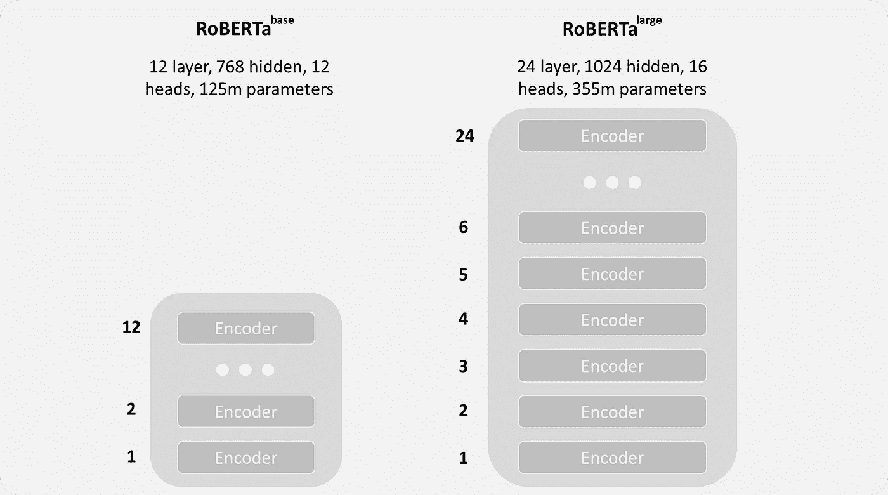
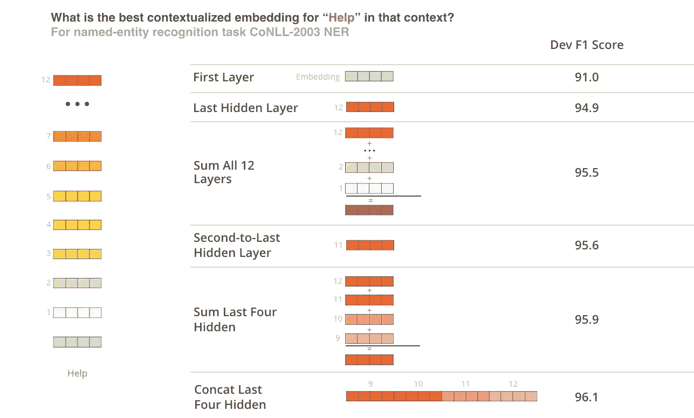

# 我在 Kaggle 的第一枚金牌:NLP 竞赛的技巧和诀窍

> 原文：<https://towardsdatascience.com/my-first-gold-in-kaggle-tips-and-tricks-for-an-nlp-competition-cec48dda5895?source=collection_archive---------25----------------------->

## 或者如何用拥抱脸模型解决回归问题

马克斯·哈林金在 [Unsplash](https://unsplash.com/photos/-pHHVcxNbq0) 上的照片

自然语言处理是深度学习中最令人兴奋的领域之一。在计算机视觉领域，我们使用迁移学习已经有几年了，并且有非常强大的预训练模型，如 VGG、Resnet 或 EfficientNet。随着著名的[注意就是你需要的全部](https://arxiv.org/pdf/1706.03762.pdf)论文的发表，自然语言处理领域也有了突破。Huggingface 上有数千个预先训练好的 NLP 任务模型，使我们能够用比以往更少的数据创建最先进的模型。

## 关于比赛

比赛的主持人是 [CommonLit](https://www.commonlit.org/) ，一个*非盈利教育科技组织*。他们提供免费的数字阅读和写作课程。在教育中，给学生适合他们阅读水平的课文是很重要的。老师不应该直接给一个 10 岁的孩子读歌德的《浮士德》,然而课文仍然应该具有挑战性。

这就是 CommonLit 经常要求教师和学者根据可读性对某些文本进行排名的原因:

> 目标值是布拉德利-特里(Bradley-Terry)对 111，000 多个摘录进行成对比较后得出的结果。3-12 年级的教师(大多数在 6-10 年级授课)是这些比较的评分者。—斯科特·克罗斯利，竞赛主持人之一

结果是从-4 到+2 的等级，数字越大表示可读性越好。每个节选一次由几个人评价。然后将平均值作为最终得分。在挑战中，有一个包含文本和相应分数的训练数据集。该模型应该学习分数，然后预测新文本的分数。

## 共同的方法

预先训练的拥抱脸模型已经变得非常流行，用于任何类型的 NLP 任务:分类、回归、摘要、文本生成等等。在竞争的早期就很明显，transformer 架构的性能明显优于传统的机器学习方法或 LSTM 架构。因此，很大一部分参与者关注于变压器的微调。由于生成带标签的训练数据的资源密集型过程，可用的示例相对较少，大约 2800 个示例。大多数人最初使用 Roberta-base，一个有 12 层、12 个头和 1.25 亿个参数的变压器，它已经给出了很好的结果，无需太多的微调。但是，我们确定了几个可以显著提高性能的字段，我将在后面简要说明:

*   大型模型架构
*   辨别学习率
*   定制头
*   装袋和堆放
*   伪标记
*   基础设施

## 大型模型架构

从其他比赛中得知，预训练模型的较大版本通常表现更好。某些架构通常有小型、基础和大型版本(例如 RoBERTa)。这些区别主要在于隐藏层的数量、隐藏状态的大小和头的数量。

罗伯塔基地对罗伯塔大

这种联系具有直观的意义:更多的参数允许更好的模式映射，即模型可以学习更多和更深。较大的型号在这次比赛中也表现得更好。然而，由于数据有限，或者他们只是在训练数据上过度拟合模型，许多团队未能使模型收敛。我们的突破是实施了区别学习率和自定义头。

## 辨别学习率

众所周知，在迁移学习中，以相同的学习速度训练所有层并不总是有意义的。有时所有嵌入层都被冻结，头部以较大的学习速率被训练，然后所有层以较低的学习速率被再次训练。

> 这个想法是神经网络的第一层学习一般概念，然后每层学习越来越多的特定任务信息。

由于这个原因，我们不得不调整第一层小于，例如，新的头部，它仍然包含初始化时完全随机化的权重。因此，我们实现了一个定制的优化器。我们对 RoBERTa 主干使用线性递增的学习速率，对头部使用 1e-3 或 2e-4 的固定学习速率(取决于预先训练的模型)。递增的学习速率从第一层的 1e-5 开始，到最后一个嵌入层的 5e-5 结束。

## 定制头

我个人一开始觉得这个话题有点混乱。当您微调预训练模型时，通常会删除神经网络的最后一层(例如分类头)并用新的神经网络替换它。变压器通常输出[最后隐藏状态](https://huggingface.co/transformers/main_classes/output.html)。这包含相应序列的所有标记的所有最后隐藏状态。在开始时，总是有特殊的 CLS 令牌，根据 BERT 论文的作者，该令牌可用于下游任务(并且在没有进一步微调的情况下也用于分类)。这个想法是，这个令牌已经是整个序列的表示。这个令牌在这场比赛中经常被用作回归头。另一种可能性是额外输出池状态。这包含 CLS 令牌的最后隐藏状态，由线性层和 Tanh 激活函数进一步处理。这些输出也可以用作回归头的输入。还有无数更多的可能性和一个非常全面的总结可以在[这里](https://www.kaggle.com/rhtsingh/utilizing-transformer-representations-efficiently)找到。
我们尝试了不同的表达方式。最后，我们还使用了 CLS 代币和一种注意力集中的形式。BERT 论文的作者在他们的一项测试中显示，连接多个层比只使用最后一层可以产生更好的结果。

Jay Alammar 在他的[博客](http://jalammar.github.io/illustrated-bert/)中写道:哪种载体作为情境化嵌入效果最好？

背后的想法是不同的层包含不同的信息。因此，我们已经连接了最后 4 层的 CLS 令牌。此外，我们为最后 4 层生成了注意力权重。然后我们连接结果，并通过最后一个线性层传递它们。下面是实现过程:

## 装袋和堆放

如前所述，我们在这场比赛中没有太多的训练数据。超过 2 个时代的训练导致排行榜和我们的交叉验证分数之间的过度拟合和巨大差距。我们使用 5 个折叠来训练数据，并为每个折叠创建一个模型。我们创建了一个评估调度程序，以便随着分数的提高(根据较低的 RMSE)更频繁地进行评估。在 2 个时期内具有最佳验证分数的模型被保存。我们设法得到了与排行榜的密切关联:我们的简历越低，我们的 lb 分数越好。这是每个挑战中最重要的事情之一:

> 如果可能的话，你应该努力缩小本地简历和排行榜之间的差距。否则，您无法以有意义的方式进行本地测试。

## 伪标记

如前所述，训练数据集非常小。我们使用新的、未标记的文本，如维基百科文章(可通过 api 免费获得)，并根据我们的训练示例的长度调整文本的长度。然后，我们使用现有的集成预测新数据的得分，并使用新数据和旧数据来重新训练模型。

> 一个重要的发现是，用更好的集合重新计算伪标签并没有提高多少分数。聚合更多的数据总是比提高伪标签的质量更重要。

## 基础设施

我们将 Kaggle 基础设施(内核、数据存储)和 Google drive 与 Google Colab 结合使用。我们更加灵活，因为我们可以在多个实例上进行训练，并且在 Colab 上每个帐户可以访问多达 3 个 GPU。一个结构良好的工作空间有助于组织和跟踪实验。通过使用 Kaggle api，可以非常容易地将数据从 Colab 推送到 Kaggle 或从 Kaggle 拉回来。我们还使用了一个 slack 频道来讨论我们的想法和跟踪我们的实验。

## 不可思议的队友

我的队友[尤金](https://www.linkedin.com/in/algernone/)与社区分享了令人难以置信的有用的笔记本，编写了自定义标题并创建了训练程序。他的方法被广泛使用，他还出版了第一本*真正有效的*RoBERTa——大型培训笔记本。祝贺他在第一场比赛中获得第一枚金牌。

## 结论

HuggingFace 是一个用于各种 NLP 任务的优秀平台，并提供了大量预训练模型的选择。然而，在这场竞赛中，如何进一步调整模型以获得更好的结果变得很清楚。如果没有预先训练的模型，结果会更糟，同时仍有优化的潜力。Kaggle 的参与者表明，从模型架构到优化器到训练程序，所有领域都有改进的空间。这些方法也可以转移到其他任务中。我希望 CommonLit 可以利用结果，使教师在未来更容易为学生提供正确的文本。

> 感谢您的阅读，祝您愉快！

## 进一步阅读

1.  培训用完整笔记本:[https://www . ka ggle . com/chame call/clrp-fine tune-Roberta-large](https://www.kaggle.com/chamecall/clrp-finetune-roberta-large)
2.  HuggingFace 上的预训练模型概述:[https://huggingface.co/transformers/pretrained_models.html](https://huggingface.co/transformers/pretrained_models.html)
3.  组装方法:[https://towards data science . com/ensemble-methods-bagging-boosting-and-stacking-c 9214 a10a 205](/ensemble-methods-bagging-boosting-and-stacking-c9214a10a205)
4.  伯特微调教程:[https://mccormickml.com/2019/07/22/BERT-fine-tuning/](https://mccormickml.com/2019/07/22/BERT-fine-tuning/)

[如果你对数据科学感兴趣并且还没有注册，请随时使用我的推荐链接加入这个社区。](https://medium.com/@droste.benedikt/membership)