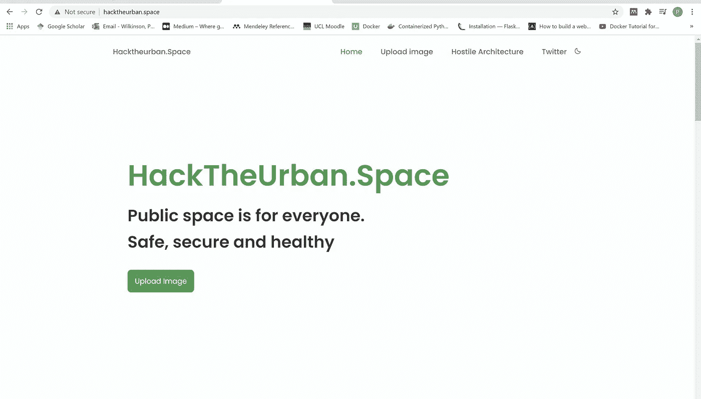
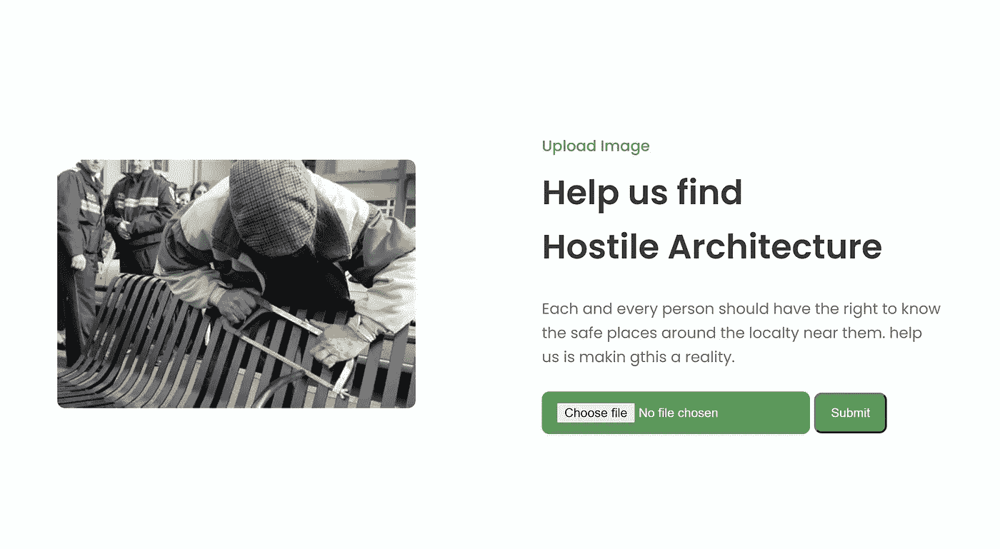
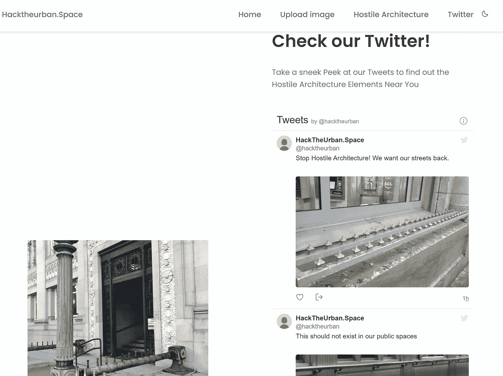
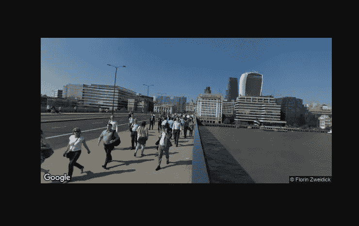

# 我的第一次黑客马拉松

> 原文：<https://towardsdatascience.com/my-first-hackathon-3f6d5fbf7d91?source=collection_archive---------18----------------------->

## 为什么你一定要参与其中，如果可以的话！

考尔·克里斯詹在 [Unsplash](https://unsplash.com?utm_source=medium&utm_medium=referral) 上拍摄的照片

这个周末，我参加了我的第一次黑客马拉松，Hex Cambridge。很久以来，我一直想参加一个，但是每当我感兴趣的一个出现时，我总是找到借口不参加，不可否认，主要是因为我害怕我不够好，或者我不喜欢它。公平地说，我应该更快地参与进来，我肯定会建议任何想做一个的人去做吧！

那么什么是黑客马拉松呢？简而言之，这本质上是一个短期的编码挑战，在 24/36 或 48 小时内，你就能想出一个技术解决方案或产品。在某些情况下，这些解决方案或产品必须解决一个明确定义的挑战，而在其他情况下，有一个总的主题，你可以自由地创造。它包括作为一个团队一起工作，通常与你以前没有见过的人一起工作，深夜编码和比萨饼/外卖食品，产生一个由你的同事和评判小组评判的工作成果。

这次黑客马拉松有几个挑战，包括来自贝莱德、华为和 Optiver 的挑战，都集中在一个特定的任务上。然而，我们决定把重点放在 Marshall Wace 整体挑战赛上，该挑战赛旨在开发一个社会公益应用程序，这给了我们很大的权限。

我们的想法是什么？鉴于当前疫情突出的无家可归问题，对无家可归者有害的做法是敌意建筑。这种做法在长凳上很明显，长凳上有明确的座位，这样某人就不能躺下，或者地板上有钉子，睡在上面不舒服，灯整夜亮着，甚至播放很大的声音。这些做法迫使无家可归者离开他们可以获得资源的市中心，并试图将他们藏起来，而没有实际解决问题或帮助那些有需要的人。因此，我们认为强调这种做法是很重要的，这样我们就可以让人们远离它，并希望尝试解决它所带来的一些问题。

为此，我们认为一个应用程序将允许外出或甚至在家的个人能够标记这种敌对的架构，并最终提醒公众和决策者这种做法的流行。有两种方法可以做到这一点，首先是那些在现实世界中四处走动的人，如果他们发现了敌对的建筑，他们可以拍一张照片并提交到网站上。这张照片将包含元数据，如拍摄时间和地点，然后可以通过这些提交的照片创建的活动 twitter feed 和网站上标识这些照片拍摄地点的交互式地图进行可视化。另一个选择是让用户利用谷歌街景，或者让我们自己建造一个机器人，从他们自己的家出发到世界各地去识别敌对的建筑，这也会出现在地图和 twitter 上。这当然都是通过图像分类算法来实现的，该算法能够识别提交的图片是否是恶意建筑。

就我们的技术栈而言，我们的计划是使用 cassandra 数据库来存储照片元数据，使用 google cloud bucket 来存储实际照片，使用 HTML、css 和 javascript 前端，使用 fast.ai 机器学习算法来对图像进行分类，使用 flask 后端将所有这些结合在一起，以便能够在 google cloud 上托管。

我是怎么适应这个的？鉴于这是我的第一次黑客马拉松，我真的不知道我到底能在哪里提供帮助，我有机会在机器学习方面或后端方面提供帮助。最后，我和另一个以前使用过 Flask 的团队成员合作，主要在后端工作。我的主要任务是让谷歌云架构正确运行应用程序，并帮助一些 Flask 基础设施。这当然是非常棘手的，因为我基本上是从零开始，但我设法快速刷起来，让网站工作。我在这么短的时间内学习了 google 云应用程序开发、flask 构建、cassandra 数据库集成和模型部署，尽管还有很多东西需要学习！

我们的结果是什么？嗯，我们设法在 hacktheurban.space 上建立了一个部分运行的网站，它设法满足了我们的一些目标，但不是全部。嗯，我们让 wesbite 自己在 hacktheurban.space 上启动并运行，托管在谷歌云平台上，如下图所示:

作者图片

作者图片

作者图片

在这个系统中，网站连接到数据库，因此任何图像都可以被上传、发送到数据库，并且元数据将被存储，包括位置和图片本身。嵌入的 twitter feed 也出现了，从最后的三张照片中可以看到。我们还可以实现街景步行，你可以输入不同的纬度和经度值来环游世界，就像在伦敦桥上看到的一样:

作者图片

然而，我们在开发地图方面有所欠缺，twitter 集成也没有用于谷歌云，图像分类的实际模型也无法嵌入(尽管后两者我们最终设法在完全集成的本地机器上工作)。

最终，我们获得了基于 cassandra 框架的 DataStax Astra 数据库最佳使用奖，当然，我们对此非常自豪(只是在最后 30 分钟内才设法让它工作)！虽然最终的应用程序现在由于缺乏功能而被删除，但如果你想四处看看，可以在[这里](https://github.com/clara-9/HackTheUrbanSpace)找到代码库！

那么，我学到了什么？：

1.  黑客马拉松对于快速学习新技术或者强化你已经掌握的技能来说是非常棒的。对我来说，这是学习如何使用 flask，以及如何将其与谷歌云平台集成。
2.  任何大型项目早期的技术集成都是关键。在这里，大多数问题都是关于将 Flask 后端集成到谷歌云平台上，因为我们最初努力连接数据库，加载模型和集成 twitter，只能在一个小时内克服数据库连接，其他两个问题在谷歌云平台上根本不存在。
3.  有时候，最好的办法就是卡住，看看什么管用，什么不管用。在如此短的时间内举办一次黑客马拉松，你通常不得不继续进行，而不是犹豫使用什么，尤其是如果你以前没有使用过的话。边做边学是关键，即使不总是成功，你最终还是会在过程中学习。

除此之外，这次黑客马拉松还有许多很棒的提交材料，可以在这里找到:【https://hex-cambridge.devpost.com/project-gallery[。其中包括一些令人惊叹的决赛选手，他们的工作主题包括在线教室中的情绪检测、手机在飞行模式下的信息传输以及计算机之间的安全数据传输。看到所有这些，并与从事这些工作的一些人交谈，真是太棒了。](https://hex-cambridge.devpost.com/project-gallery)

总的来说，这是一次很棒的经历。未来我会关注更多的黑客马拉松吗？是的，肯定的！我玩得很开心，和了不起的人一起工作，学到了很多东西。虽然我们的解决方案最终没有完全按照我们想要的方式工作，我们也没有赢得任何主要奖项，但我肯定可以带走很多东西，并希望将我的学习应用到下一个项目和我的博士学位中！现在，该睡觉了！

 [## 随机森林分类器简介

### 预测 NBA 球员的位置——我们正在看到一个真正的“无位置”联盟吗？

towardsdatascience.com](/introduction-to-random-forest-classifiers-9a3b8d8d3fa7)  [## scikit-learn 决策树分类器简介

towardsdatascience.com](/introduction-to-decision-tree-classifiers-from-scikit-learn-32cd5d23f4d)  [## 面向数据科学家的面向对象编程介绍

### 面向对象的基础知识，适合那些以前可能没有接触过这个概念或者想知道更多的人

towardsdatascience.com](/an-introduction-to-object-oriented-programming-for-data-scientists-879106d90d89)