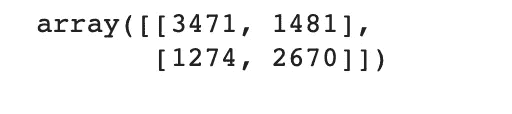

# 我的第一个 NLP 管道

> 原文：<https://towardsdatascience.com/my-first-nlp-pipeline-99d24aafb773?source=collection_archive---------12----------------------->

照片由[西格蒙德](https://unsplash.com/@sigmund?utm_source=medium&utm_medium=referral)在 [Unsplash](https://unsplash.com?utm_source=medium&utm_medium=referral) 上拍摄

## 为有监督的文本分类问题创建 NLP 管道

这篇文章基于由[阿迪·沙莱夫](https://www.linkedin.com/in/adi-shalev-4836875a/)和我为 2021[code fest](https://www.linkedin.com/posts/baot-il_codefest2021-activity-6808632014154027008-pFkM)创建的一个工作室。

在数据科学领域，特别是在 NLP 领域迈出第一步时，我们经常会遇到一组全新的术语和短语；*“契合”、“转换”、“推论”、“度量”*等等很多。虽然可用的信息源允许理解这些术语，但并不总是清楚这些不同的工具如何最终结合在一起，以形成我们能够用于新数据的基于生产机器学习的系统。

从标记数据集到创建可应用于新样本的分类器(也称为监督机器学习分类)应该经历的有序阶段集被称为 NLP 管道。

在本帖中，我们将为一个监督分类问题创建这样一个管道:根据电影的描述对电影是否是剧情电影进行分类。完整的代码可以在[这里](https://github.com/nitzgado/NLP-Pipeline/blob/main/CodeFest_nlp_pipeline_workshop_cheatsheet.ipynb)找到。

# **监督机器学习分类的 NLP 管道——到底是什么？**

我们从数据集开始我们的旅程，数据集是一个分类已知的文本记录表。我们的数据就像一股水流，我们想用它来创造我们的产品。为此，我们将创建一个管道:一个多级系统，其中每一级都从上一级获得输入，并将其输出作为输入转发给下一级。

我们的管道将由以下阶段组成:

作者图片

虽然我们构建每个阶段的方式会因问题而异，但是每个阶段在我们的最终产品中都有一个角色，一个闪亮的文本分类器！

**数据**

我们将使用的数据基于来自 Kaggle 的电影数据集。我们将使用这些数据来确定一部给定电影的类型是不是剧情片——是还是不是，这是一个二元分类问题。我们的数据是一个 pandas 数据帧，有 45466 条记录，删除空条目后有 44512 条。

# **1。探索数据**

每当我们开始处理一个新的数据集时，在我们继续进行设计决策和创建模型之前，我们必须了解我们的数据。让我们回答一些关于数据集的问题:

*   *概视图是什么样的？*

因为我们希望使用概述来确定电影是否是剧情电影，所以让我们来看一些概述。

*   *概观有多长？最长的概述？最简短的概述？*

*   *我们有多少戏剧电影？*

*   *概述中出现频率最高的词是什么？在特定类型的概述中？*

探索数据的阶段对于接下来的阶段很重要，因为它允许我们获得在接下来的步骤中做出决策所需的信息。

*   *任何有助于我们更好地了解数据集的信息！*

# **2。清洗&预处理数据**

现在我们对手中的数据有了更好的理解，我们可以继续清理数据了。这一阶段的目标是在使用数据创建模型之前，删除数据中不相关的部分。“不相关部分”的定义因问题和数据集而异，在现实世界中，可以对问题进行实验以找到最佳方式。

*   *删除短于 10 的条目*

在数据探索过程中，我们注意到我们的一些概述篇幅较短。因为我们希望使用描述来对流派进行分类，所以我们可以删除长度小于 15 的记录，因为包含如此少字符的概观可能不具信息性。

*   *删除标点符号*

因为我们想捕捉描述戏剧电影和描述其他电影的词语之间的区别，我们可以去掉标点符号。

*   *词汇化*

词汇化用于将一个单词的不同屈折形式组合在一起，这样它们就可以作为一个项目进行分析。让我们看一个例子:

我们现在可以对我们的数据应用术语化:

在清理和预处理之后，我们的文本就可以转换成特征了。

# 3.列车测试分离

在创建模型之前，我们应该将数据分为训练集和测试集。训练集将用于“教授”模型，测试集将由我们用来评估我们的模型有多好。在现实世界的场景中，我们也经常分割一个验证集，在其中我们可以使用 hyper 参数调整。

下面的代码会拆分。更多示例可在[这里](https://scikit-learn.org/stable/modules/generated/sklearn.model_selection.train_test_split.html https://scikit-learn.org/stable/modules/generated/sklearn.model_selection.train_test_split.html)找到。

# **4。特色工程**

在构建管道的这一点上，我们已经熟悉了我们的文本数据，它是“干净的”并经过预处理的。尽管如此，它仍然是文本。由于我们的最终目标是为我们的数据训练一个分类器，是时候将我们的文本转换为机器学习算法可以处理和学习的格式，这种格式也被称为*“vectors”*。

将文本数据编码成向量的方法有很多种:从基本的、直观的方法到基于神经网络的最新方法。让我们来看看其中的一些:

***计数向量***

将文本描述为一个向量，在这个向量中，我们保存了词汇表中每个单词的出现次数。我们可以选择向量的长度，这也是我们词汇量的大小。

你可以阅读更多关于计数向量和创建它们时使用的不同参数[这里](https://scikit-learn.org/stable/modules/generated/sklearn.feature_extraction.text.CountVectorizer.html)。

***TF-IDF 矢量***

使用 TF-IDF 向量，我们可以解决使用计数向量时遇到的一个问题:在文本数据中多次出现的无意义的单词。在创建 TFIDF 向量时，我们将词汇表中每个单词的出现次数乘以一个因子，该因子标记该单词在语料库中的其他文档中的出现频率。这样，出现在我们的语料库中的许多文档中的单词将在我们的特征向量中获得更小的值。

你可以在这里阅读更多关于 TF-IDF 矢量和创建它们时使用的不同参数[。](https://scikit-learn.org/stable/modules/generated/sklearn.feature_extraction.text.TfidfVectorizer.html)

**5。建模**

使用矢量器后，我们的电影概述不再用文本表示，而是用矢量表示，这允许我们使用我们的数据来训练模型。

我们现在可以使用我们的训练集来训练一个模型。这里我们训练[多项朴素贝叶斯](https://scikit-learn.org/stable/modules/generated/sklearn.naive_bayes.MultinomialNB.html)，但是 [Scikit-Learn](https://scikit-learn.org/stable/index.html) 中可用的许多其他算法可以类似地应用，并且当解决一个新问题时，我们通常会检查不止一个算法。

# 6。评估

在训练一个模型之后，我们想要评估它在新数据上的表现如何。为此，我们对数据进行了划分，并留出了一个测试集。我们现在将使用我们的模型为测试集做出的预测来评估我们的模型。

我们将根据正确答案和我们的模型所犯的错误创建一个[混淆矩阵](/understanding-confusion-matrix-a9ad42dcfd62)。

二元分类的混淆矩阵

我们现在可以使用混淆矩阵产生的值来计算一些其他指标:

通常，我们建立模型的第一次尝试不会有惊人的指标。这是一个很好的时间回到早期的阶段，尝试做一些不同的事情。

# **7。推论——对新样本使用我们的模型**

在使用我们的数据创建一个模型来解决我们根据电影的概述来分类电影是否是戏剧电影的问题并评估我们的模型之后，我们可以使用它来确定新的样本- *戏剧还是非戏剧？*

由于我们的原始概览在用于训练/评估我们的模型之前已经经历了一段旅程，我们需要以同样的方式处理新样本:

我们现在可以使用我们的模型来预测新样本的类型:

我们的预测是正确的！

# **总结**

在这篇文章中，我们为一个有监督的文本分类问题创建了一个管道。我们的管道由几个相互链接的部分组成(就像一个真实的管道！).我们希望这篇文章能帮助你理解这个过程的每一部分在创建最终产品——文本分类器中的作用。