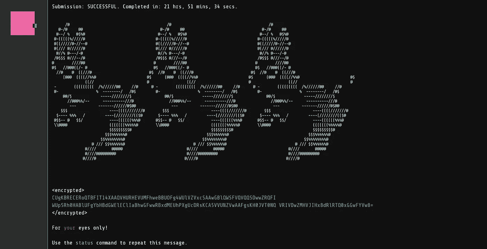

# 我的 Google Foobar 之旅

> 原文：<https://towardsdatascience.com/my-google-foobar-journey-2d02e8150158?source=collection_archive---------5----------------------->

## 走查

第 1 级—获得邀请。

FooBar 完成截图(图片作者: [Pratick Roy](https://medium.com/u/d0e73ebdbb0c?source=post_page-----2d02e8150158--------------------------------) )

# 索引

1.  我的 Google FooBar 之旅:第 1 级-获得邀请。(这个)
2.  [我的 Google FooBar 之旅:2.1 级——电梯维护](/my-google-foobar-journey-a6488df029cf)。
3.  [我的 Google FooBar 之旅:2.2 级— *整装待发*](https://pratickroy.medium.com/6e46034b835f) *。*

# 怎么开始的

时间是 2016 年至 2017 年左右。我是一名年轻的计算机科学大学生，非常想成为一名开发人员。我喜欢编码和构建东西，我同样讨厌做 mcq(选择题)。

***我对 MCQs 是恨之入骨，工程应该是*** 。要想在 MCQs 中取得好成绩，你必须记住一千个捷径公式，学会应用技巧而不是应用概念，并虔诚地避免试图回答难题，这一切都是为了在尽可能短的时间内回答尽可能多的简单问题。

现在我还在上学，但从逻辑上来说，

> 作为一名工程师，我的工作描述是拿一个足够大、困难和模糊的问题，学习、忘记和重新学习概念，以便将它分解成更小更简单的问题，随着时间的推移赋予它越来越多的形状，直到我对问题的核心概念及其周围的许多边缘情况有一个好的干净的解决方案。

事后回想起来，我认为年轻时的自己在这个分析上是正确的。

然而，所有的大学就业面试总是以 MCQ 回合开始，所以我想你可以很好地衡量我的偏执，不要带着工作机会走出大学。

然后有一天，当我正在摆弄一些代码块时，我可能出现了一些错误，或者需要查找一些语法，当我谷歌搜索时，浏览器扭曲显示了这条消息

FooBar 邀请(图片作者: [Pratick Roy](https://medium.com/u/d0e73ebdbb0c?source=post_page-----2d02e8150158--------------------------------) )

现在，作为一个为了乐趣而编码的人，我想玩，但是当屏幕动画出现时，我已经点击了第一个堆栈溢出链接。我热情地按下了后退键，但没有成功。

我心烦意乱。我意识到我刚刚犯的错误的严重性。我从之前的 reddit 帖子中了解到这个挑战是关于什么的。这是谷歌足球挑战赛。我刚刚收到一份邀请，我设法浪费了它。

现在，如果你不知道这个挑战是关于什么的，简单地说就是**谷歌只邀请秘密招聘程序**。一旦被邀请，你就可以解决编码挑战，如果你完成了，你就有机会直接面试谷歌。此外，可笑的严格时间限制和无法使用互联网的标准障碍，是大多数在线编码挑战和面试过程的专利，并不适用。你有大量的时间去阅读、理解、研究、修改和解决问题。

如果这还不明显的话，这正是我渴望的那种挑战。我错过了抓住它的唯一机会。然而，作为一个坚忍的人，我设法很快站起来，笑自己是多么笨拙。

就这样，生活照常进行，然后，在运气和努力的共同作用下，我设法获得了亚马逊的实习机会，给了我 6 个月的时间来证明我在现实世界软件开发环境中的勇气。又一次尝试玩我喜欢的游戏。

我知道这里说的可能有点生存偏见，但是塞内卡曾经说过，

> 运气是当准备遇到机会时发生的事情。[2]

而且这次我是有备而来，没有犯什么愚蠢的错误。从那以后，我就成了亚马逊人，并为此超级自豪，那场侥幸逃脱的挑战的记忆也开始慢慢从记忆中淡化。

# 它是如何结束的

大约几个月前，也就是那次致命的误点击发生近 4 年后，当我再次陷入一些代码中，并希望利用在我之前解决问题的开发人员的智慧时，我的浏览器再次扭曲，向我显示一条熟悉的消息。

FooBar 邀请(图片作者: [Pratick Roy](https://medium.com/u/d0e73ebdbb0c?source=post_page-----2d02e8150158--------------------------------) )

这一次，我没有重复失礼。这一次风险降低了，我不再需要工作面试，但我想要挑战。我说我想玩，我就加入了。

这就把我带到了上个周末，当时我提交了最后一个问题的代码。曾经逃脱的挑战终于完成了。

# 现在开始旅程

你有没有进行过一次你计划了很久的旅行，在你的脑海中建立了它，但当你最终到达那里时却感到失望。这是**而不是**的旅程之一。

我们是一种说书人，fooBar 让你成为渗透并摧毁 Lambda 指挥官的邪恶组织的故事中的主角，在那里你所拥有的只是你的智慧来拯救你的兔子同志。

在这个过程中，你会边走边学。从马尔可夫链到细胞自动机，这个挑战让我接触到了很多有趣的想法和概念。

如果你收到邀请，并且你喜欢编程和挑战，我强烈建议你接受 FooBar 的邀请。

需要注意的另一点是，如果你熟悉 python，那么使用它可能很有意义，因为标准库将为你提供许多有用的函数。我个人使用 Java，因为我对它更熟悉，坦率地说，我不是 Python 的忠实粉丝。也许有一天我会写一篇关于厌恶 python 的帖子。如果是的话，我会把它链接到这里。

这篇文章现在对我来说太大了，所以在接下来的几篇文章中，我将一个接一个地讨论这些挑战，强调我从这次挑战中获得的知识和见解。

但是在结束之前，让我们解决第 1 级的问题 1。

# 一级

## 问题 1:重新识别

> 奴才队伍中有一些不安定因素:ID 号码像“1”、“42”和其他“好”号码的奴才们一直对那些被更无聊的 ID 卡住的可怜奴才们颐指气使。为了平息骚乱，Lambda 指挥官让你根据一个完全万无一失的方案给每个人重新分配新的随机 id。
> 
> Lambda 指挥官将质数串联成一个长串:“2357111317192329……”。现在每个仆人必须从帽子里抽出一个号码。该数字是素数串中的起始索引，并且 minion 的新 ID 号将是该串中接下来的五个数字。所以如果一个奴才抽到了“3”，他们的身份证号就会是“71113”。
> 
> 通过编写一个函数 solution(n)来帮助指挥官分配这些 id，该函数接受 Lambda 的所有素数的字符串的起始索引 n，并返回该字符串中的下五位数字。Lambda 司令有很多爪牙，所以 n 的值永远在 0 到 10000 之间。
> 
> —测试用例—
> 输入:
> 解决方案.解决方案(0)
> 输出:
> 23571
> 
> 输入:
> 解决方案.解决方案(3)
> 输出:
> 71113

**其核心是，这里的挑战是计算一长串素数。每当你面对这个挑战，你的 goto 算法应该是厄拉多塞[3]** 的筛子。我很确定 Sieve 会成功，但是我已经忘记了它是如何工作的，所以我在 Youtube 上放了一个视频来复习。现在，让我们来构建解决方案。

重新识别解决方案

因此，一旦筛选功能就绪，我们需要做的就是

*   稍微修改一下 Sieve 函数，产生一个素数的串联列表。
*   计算这个列表中从 index 到 index + 5 的子串，因为本质上这将从 index 之后的素数串中给出接下来的 5 个数字。这正是 Lambda 指挥官想要的输出 ID。
*   此外，考虑到约束条件，该列表需要至少 10000 + 5 个数字长。因此，通过一点强力检查，找出 206412 之前的所有素数，对于我们的用例来说已经足够好了。

仅此而已。如果你对我如何解决其他挑战感兴趣，看看我的回购。

 [## GitHub - pratickRoy/foobar:我的 foobar 之旅

### 我的 Foobar 旅程。在 GitHub 上创建一个帐户，为 pratickRoy/foobar 开发做贡献。

github.com](https://github.com/pratickRoy/foobar) 

在以后的帖子中，我将回顾我解决的其他问题的解决方案的关键见解/经验。我在这里把它们联系起来。要获得相同的通知，请考虑在 medium 上关注我，订阅一封相同的电子邮件，直接发送到您的收件箱！😊

 [## 点击此处订阅:)

### 想在我写新东西时得到通知吗？每当我发布时收到电子邮件！

有两种作家，写得多的和写得少的。我是后者。我痴迷于创造价值，回避噪音。如果想看这样的内容，可以考虑订阅。](https://pratickroy.medium.com/subscribe) 

# 来源、脚注和进一步阅读链接

*   [1] [Google FooBar](https://foobar.withgoogle.com/) ，FooBar 主页
*   [2][Goodreads 说，运气就是当准备遇到机遇时所发生的事情](https://www.goodreads.com/quotes/17490-luck-is-what-happens-when-preparation-meets-opportunity)
*   [3] [筛厄拉多塞](https://www.geeksforgeeks.org/sieve-of-eratosthenes/) (2021)，极客为极客