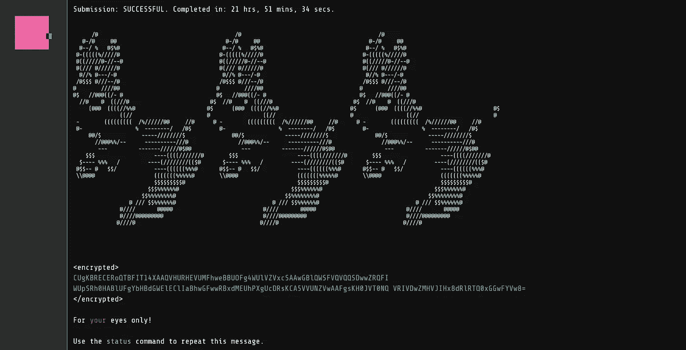

# 我的 Google Foobar 之旅

> 原文：<https://towardsdatascience.com/my-google-foobar-journey-a6488df029cf?source=collection_archive---------17----------------------->

## 走查

2.1 级—电梯维护



FooBar 完成截图(图片作者: [Pratick Roy](https://medium.com/u/d0e73ebdbb0c?source=post_page-----a6488df029cf--------------------------------) )

# 索引

1.  [我的 Google FooBar 之旅:第一关——获得邀请](/my-google-foobar-journey-2d02e8150158)。
2.  我的 Google FooBar 之旅:2.1 级——电梯维护。(这个)
3.  [我的 Google FooBar 之旅:2.2 级— *整装待发*](https://pratickroy.medium.com/6e46034b835f) *。*

# 故事到此为止

> 你在 Lambda 指挥官的组织里活了一个星期，你甚至设法让自己升职了。万岁！不过，你的党羽还是没有那种安全权限来拿下 Lambda 指挥官，所以你最好继续工作。快快快。

所以现在我有了 2 级权限，但是要打败 Lambda 指挥官还有很长的路要走。在我寻求释放我的兔子兄弟的过程中，我的下一个障碍，我前进的下一个关键，是一个相当有趣的挑战。

# 电梯维修

粗略地看，这确实是一个非常简单的问题；魔鬼藏在边缘的箱子里。我一开始用一种非常不干净的方法来强迫自己通过，并且在很大程度上成功了。然而，我就是无法破解一些测试用例，不管我引入了多少黑客。

所以我深吸一口气，睡了个好觉。第二天早上，我起床，喝了点咖啡，重构了代码。它一次性通过了所有的测试用例。

## 好代码的一个小切线

在我开始写代码之前，我想强调一点，**总是试图写干净的代码**。我知道这在一个竞争激烈的编码环境中并不真正必要，事实上，有时它会对事业不利。在未来的等级中，我已经采取了许多我在生产环境中永远不会写的捷径，并且永远不会让任何一个我正在审查其代码的人来写。它们让我的生活变得更容易，代码运行得更快，所以我跟着它，你也应该在你的 fooBar 之旅中这样做，但重要的一点是，你应该对这样做感到内疚。

> 如果你能写出工作正常但不干净的代码，而不用担心上面的伟人[1]，那么你可能是一个伟大的程序员，但你将是一个糟糕的开发者。

如果你不同意这一点，我强烈建议你读一读我不久前写的一篇文章，即使读完之后，如果你不同意，请随时给我留言/评论，我们可以进一步讨论这个问题。

</what-is-good-code-an-actionable-introduction-1cad30551ad4>  

## 现在回到手头的问题

> 你被分配了繁重的电梯维修任务——唉！除了所有的电梯文档已经在文件柜的底部杂乱无章的堆了好几年，而且你甚至不知道你将要工作的电梯版本号，这不会太糟糕。
> 
> 电梯版本由一系列数字表示，分为主要、次要和修订整数。电梯的新版本增加了主要编号，例如 1、2、3 等等。当新的特征被添加到电梯中而不是一个完整的新版本时，名为“次要”的第二个数字可以用于表示那些新添加的特征，例如 1.0、1.1、1.2 等。小的修复或维护工作可以用第三个数字“修订”来表示，例如 1.1.1、1.1.2、1.2.0 等等。数字 0 可用作
> 电梯预发布版本的主要版本，例如 0.1、0.5、0.9.2 等(Lambda 指挥官总是小心翼翼地测试她的新技术，以她的忠实追随者为对象！).
> 
> 给定一个以字符串表示的电梯版本列表，编写一个函数解(l ),返回按主版本号、次版本号和修订号升序排序的相同列表，以便您可以识别当前的电梯版本。列表 l 中的版本将总是包含主要版本号，但是次要版本号和修订版本号是可选的。如果版本包含修订号，那么它也将有一个次版本号。
> 
> 例如，给定列表 l 为["1.1.2 "，" 1.0 "，" 1.3.3 "，" 1.0.12 "，" 1.0.2"]，函数解(l)将返回列表["1.0 "，" 1.0.2 "，" 1.0.12 "，" 1.1.2 "，" 1.3.3"]。如果两个或多个版本相同，但其中一个版本包含的数字比其他版本多，则这些版本必须根据它们拥有的数字数量按
> 升序排序，例如[“1”、“1.0”、“1 . 0 . 0”]。列表 l 中的元素数量至少为 1，不会超过 100。
> 
> *—测试用例—*
> 输入:
> Solution.solution({"1.11 "，" 2.0.0 "，" 1.2 "，" 2 "，" 0.1 "，" 1.2.1 "，" 1.1.1 "，" 2.0"})
> 输出:
> 0.1，1.1.1，1.2，1.2.1，1.11，2，2.0，2.0
> 
> 输入:
> Solution.solution({"1.1.2 "，" 1.0 "，" 1.3.3 "，" 1.0.12 "，" 1.0.2"})
> 输出:
> 1.0，1.0.2，1.0.12，1.1.2，1.3.3

问题陈述相当直接。给定一个版本列表，按照优先顺序升序排序:主要>次要>修订。这很简单，让我们来看看边缘案例。

*   次要版本号和修订号是可选的
*   如果两个或两个以上的版本是相同的，但是其中一个版本包含的数字比其他版本多，那么这些版本必须根据它们包含的数字的多少按升序排序。

在解决这些问题之前，让我们先看看解决方案代码

电梯维护解决方案

在运行代码之前，让我们首先讨论一个常见的编码结构。

## 比较器[2]。

简单地说，比较器总是采用以下形式:

比较器框架

现在，如果你观察，这里我们没有使用任何 if 语句来进行比较，而是简单地减去两个散列码。

这种减法实际上是实现这一点的一种简单而常见的惯例。例如，考虑两个 int，a 和 b，那么

```
a — b < 0, if a is smaller
a — b == 0, if a and b is same
a — b > 0, if a is larger
```

这正是我们想要的输出。

这对于排序非常有用，因为 Java 标准库提供了排序函数，可以根据比较器对任何对象集合进行排序。在我们的代码中，我们将不止一次而是两次使用这个概念。

## 代码缩减

所以没有比较器。让我们精简代码，并涵盖上述边缘情况

*   首先，我们根据自定义的比较器对数组进行排序。
*   在我们的比较器中，我们首先将版本划分为主要、次要和修订类型。
*   同样，我们编写了另一个比较器(这次没有继承的华丽，但基本上它做同样的事情)，用于比较特定的版本类型。
*   我们按照主要版本>次要版本>修订版本的优先顺序来比较版本类型。如果在任何阶段，两者不相等，我们简单地返回内部比较器的输出。如果是，我们就进入下一种类型。如果最后没有区别(边缘情况 2)，我们基于版本子类型计数进行排序。
*   在我们的内部比较器中，我们首先检查特定版本子部分是否在任一版本中存在(边缘情况 1)。如果不是，我们默认它为 0，否则我们选择它，然后像在任何整数比较器中一样进行比较。

## 一个重要的外卖

在上面的部分中，我给出了代码的概要，以帮助初学者理解核心概念，但是对于那些已经花了相当长时间在 IDE 前涉猎的人来说，我需要这样做吗？

代码正在做的事情非常清楚，不需要任何文档。当然，它甚至可以更好，我们可以添加枚举来使版本类型更加清晰，并使用正确命名的私有方法来使边缘情况的处理更加直观。但是我们在这里应该理解的是，遵循干净的代码原则，边缘情况的处理不再是中断思想流动的丑陋的异常值，而是它的自然延伸。

现在我意识到我没有把它打扫得尽可能干净，这让我感到非常内疚。所以让我们忏悔吧。

清洁电梯维护解决方案

我不会在这里给出一个纲要，因为坦率地说，这是不必要的。此外，我鼓励你只看解决方法，看看你是否能理解流程，而不需要看版本和版本类型的实现，这就是为什么我把它们放在底部。**如果你只需要阅读 1/4 的代码就能理解代码在做什么，那么我的工作就完成了！**

在我的下一篇文章中，我将进入第二关的第二个挑战:*准备毁灭。*当我找到时，我会在这里链接它。要获得相同的通知，请考虑在 medium 上关注我，订阅一封相同的电子邮件，直接发送到您的收件箱！

  

# 来源、脚注和进一步阅读链接

*   [1] [罗伯特·c·马丁](https://en.wikipedia.org/wiki/Robert_C._Martin)，维基百科
*   [2] [比较器](https://docs.oracle.com/javase/8/docs/api/java/util/Comparator.html)，JavaDoc