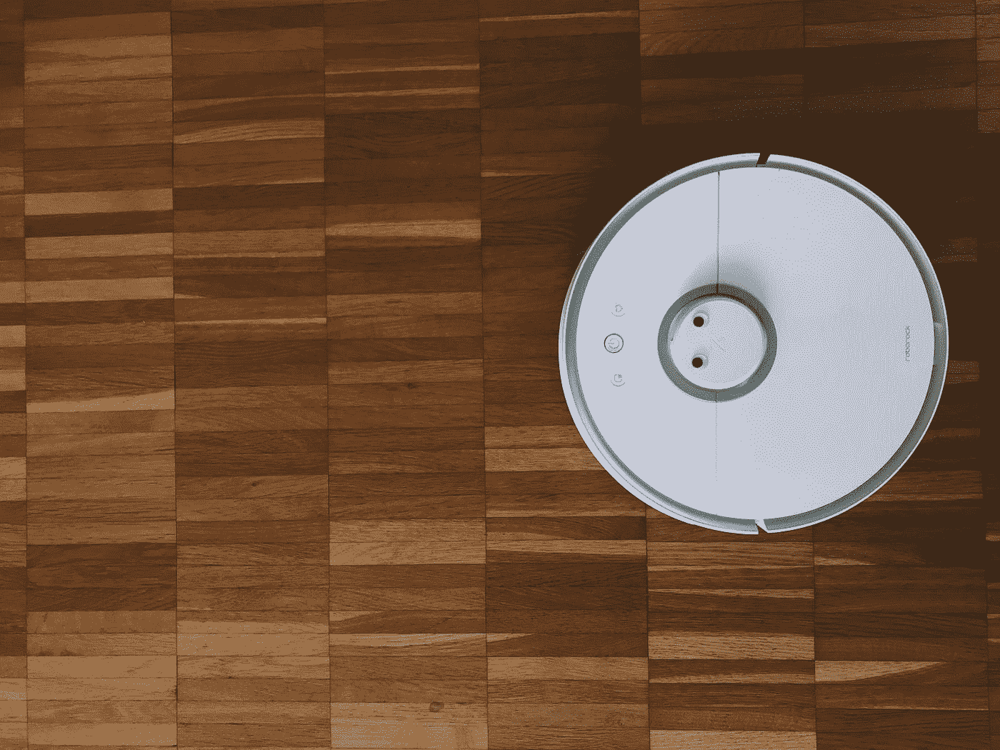
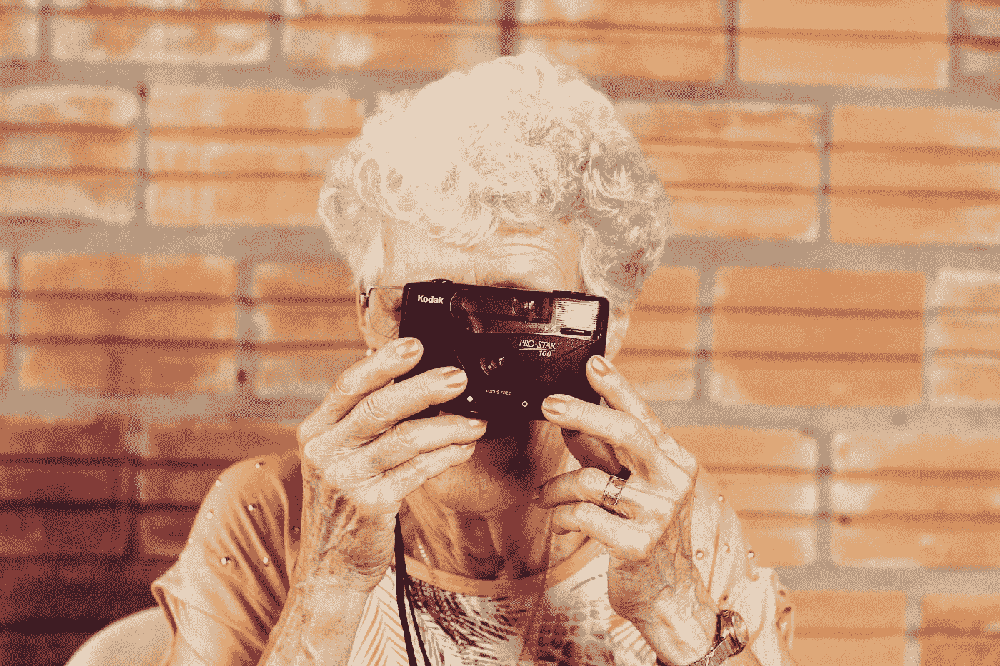

# 我奶奶的室友是个机器人

> 原文：<https://towardsdatascience.com/my-gradmas-flatmate-is-a-robot-f083ecb933a?source=collection_archive---------58----------------------->

## 人工智能如何帮助我们的老年人在自己的家中

[张家瑜](https://unsplash.com/@danielkcheung?utm_source=medium&utm_medium=referral)在 [Unsplash](https://unsplash.com?utm_source=medium&utm_medium=referral) 上拍照

众所周知，如今人们的寿命更长了，大多数政府都面临着提供更多机构护理的压力。但这种护理非常昂贵，而且在大多数情况下，需求远远高于供给，从而使弱势人群得不到充分的监督。许多人担心，因为他们的父母已经到了不能独立生活的阶段，但另一方面，没有可供他们负担得起的机构护理的空间。此外，我们都知道，人们更愿意继续生活在自己的社区，而不是被连根拔起，安置在一个陌生的环境中。他们需要亲人的安慰，需要邻居的闲聊，需要友好面孔的偶尔造访。有各种纵向研究表明，拥有令人满意的人际关系的人更快乐，健康问题更少，寿命更长。

但是一个人的家也可能包含死亡陷阱。老年人面临的一个重大风险是意外跌倒。研究估计，大约三分之一生活在社区中的老年人每年至少经历一次跌倒(因为意识丧失、癫痫发作、中风或其他情况)，其中 30%的 65 岁或以上的人每年经历一次跌倒。在有人注意到事故或恢复意识之前，无论一个人躺在哪里，跌倒之前或之后失去意识都会产生问题。如果相关人员受伤并且无法移动，这种情况可能会导致进一步的并发症。因此，呼救或试图站起来可能是至关重要的。

照片由[扬·安东宁·科拉尔](https://unsplash.com/@jankolar?utm_source=medium&utm_medium=referral)在 [Unsplash](https://unsplash.com?utm_source=medium&utm_medium=referral) 上拍摄

养老院中的环境辅助生活(AAL)服务可以解决这个问题。这些技术通过帮助清洁、提供支持和监控来帮助老年人独立生活。基于传感器、麦克风和视觉系统，已经设计和开发了几种设备，结果非常有希望。这些产品包括温度控制器、智能手表、机器人和许多其他产品。它们在安全的环境中为老年人或弱势群体提供更好的生活方式。

这些技术的奇妙之处在于，它们使用非侵入性的廉价传感器来监控人的运动和行为。由人工智能系统监控的标准摄像头能够跟踪一个人的整个家。他们可以执行骨骼检测(估计人的骨骼)，并通过它来推断这个人在做什么。因此，如果系统在夜间检测到有人躺在地板上，它将首先尝试通过语音与他进行互动。如果这个人不回答，它将向他的近亲或有关当局发出警报。整个过程由人工智能自动执行，没有人类参与，因此保护了个人的隐私。

蒂亚戈·穆拉罗在 [Unsplash](https://unsplash.com?utm_source=medium&utm_medium=referral) 上的照片

但是这样一个系统是如何运作的呢？首先，用户需要安装一些必要的传感器，如摄像头、麦克风和扬声器。一个人工智能系统连接到它们，管理不同的设备以及与用户的所有交互。让我们想象一下一个叫露西的老人的情况，她独立生活。

早上，人工智能会在所需的时间唤醒她，方法是拉起窗帘，打开有 wifi 功能的水壶。咖啡的香味轻轻地涌入她的鼻孔，她最喜欢的音乐开始在最近的扬声器上播放。当露西起床时，人工智能祝她早上好，并提醒她吃药。该系统还向她所爱的人发送短信，通知他们露西已经醒来，身体健康。随着时间的推移，人工智能为露西提供各种服务，如阅读最新新闻，提醒她可能有约会，将她与她的在线朋友联系起来，并建议一个可爱的食谱。有时露西会迷失方向，因为她有轻微的老年痴呆症症状，并试图在没有任何帮助的情况下走出家门。系统注意到这种尝试，试图通过呼叫她来吸引她的注意力，同时通知她所爱的人。幸运的是，露西冷静下来，回到了她的日常生活中。当她坐在沙发上看她最喜欢的电视节目时，系统会指示机器人清洁工开始打扫房间。然后，它注意到露西睡着了，并调整恒温器来保持这个地方温暖。当她睡了一个长时间的午觉醒来后，她需要使用浴室，但她绊了一下，摔倒在地板上。系统注意到这一点，并与她交谈。听到没有回应，它立即通知她的亲人，并要求救护车。幸运的是，露西没有受什么重伤，很快就回家了。

托尼·里德在 [Unsplash](https://unsplash.com?utm_source=medium&utm_medium=referral) 上的照片

正如我们刚刚看到的，AAL 系统有各种好处。它可以帮助弱势群体完成最平凡的任务和更严肃的事情。在某些情况下，它可以保护它们免受房子周围各种陷阱的伤害，从而成为救生员。入门的费用不高，而且大多数人都可以负担得起。此外，我们还必须考虑将这些人制度化所节省的成本，以及将他们从社区中剥离的情感代价。总的来说，AAL 显然是最实用的方法。通过在他们的私人家中安装这项技术，我们可以保证我们年迈的亲属有一个光明的未来，我们也可以保证我们的亲人在安全的数字手中度过一些宁静的夜晚。

*如果你喜欢这篇文章，并想与我联系，请这样做🐦* [*碎碎念*](https://twitter.com/alexieidingli) *，🔗*[*LinkedIn*](https://www.linkedin.com/in/alexieidingli/)*，📷*[*insta gram*](https://www.instagram.com/alexieidingli/)*或者😊* [*脸书*](https://www.facebook.com/alexieidingli/) *。*

 [## 超越残疾的界限

### 技术如何为残疾人打开一个全新的世界

towardsdatascience.com](/beyond-the-frontiers-of-disabilities-88b82631533d)  [## 几分钟内从巴黎到伦敦

### 交通创新如何重塑我们的未来

medium.com](https://medium.com/dataseries/from-paris-to-london-in-a-handful-of-minutes-7657d978152)  [## 一个全新的人工智能世界

### 疫情之后人工智能的兴起

towardsdatascience.com](/a-whole-new-ai-world-6a5e9e49aa12) 

[**阿列克谢·丁力教授**](http://www.dingli.org/) 是马耳他[大学](https://www.um.edu.mt/)的 AI 教授。二十多年来，他一直在人工智能领域进行研究和工作，协助不同的公司实施人工智能解决方案。他的工作被国际专家评为世界级，并赢得了几个当地和国际奖项(如欧洲航天局、世界知识产权组织和联合国等)。他已经出版了几本同行评审的出版物，并成为马耳他[的一员。由马耳他政府成立的人工智能特别工作组，旨在使马耳他成为世界上人工智能水平最高的国家之一。](https://malta.ai/)