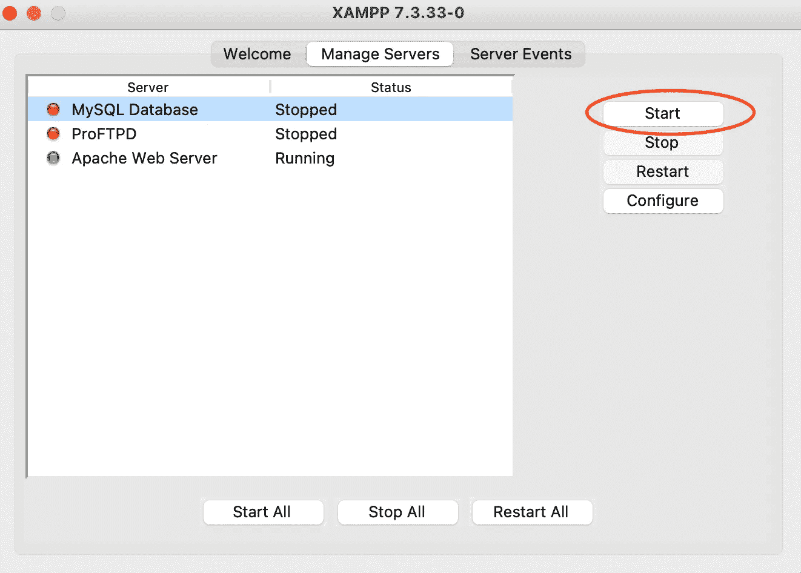
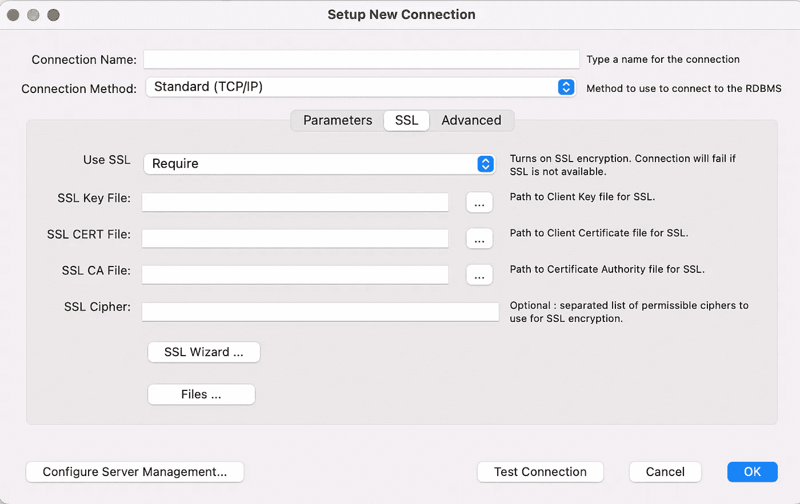
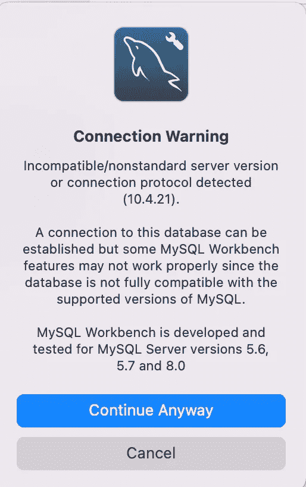
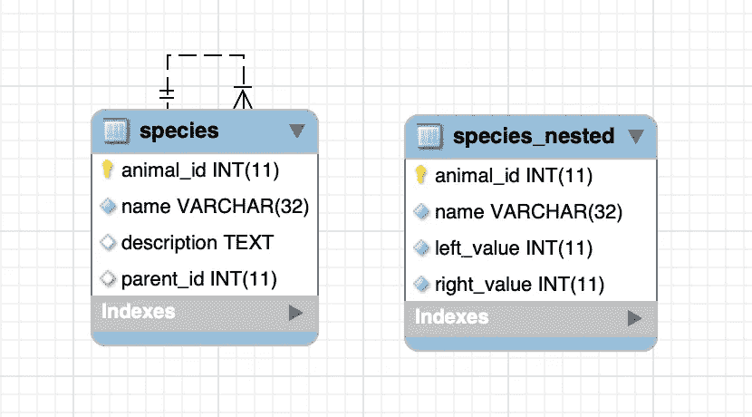

# 我将 MariaDB 连接到 MySQL Workbench 的旅程

> 原文：<https://towardsdatascience.com/my-journey-to-connect-mariadb-to-mysql-workbench-2d7e599a8a26?source=collection_archive---------8----------------------->

## 数据库ˌ资料库

## 我的老板向我要一个保存在 MariaDB 中的模式的 ER 图。


希尔德·德梅斯特在 [Unsplash](https://unsplash.com?utm_source=medium&utm_medium=referral) 上的照片

我碰巧必须从 SQL 模式中提取实体关系图。我通常使用 XAMPP 来处理 SQL，所以我告诉自己尝试使用 PhpMyAdmin 提供的**设计工具。事实上，结果并不好。我的数据库有超过 20 个表格，设计者显示它们一个接一个。**此外，PhpMyAdmin 设计器是一个非常基础的工具，它不允许您自动对齐表格以提高可读性。

然而，由于我的老板要求我制作这个受祝福的 er 图，并且不希望手动地在图中一个接一个地移动表格，**我考虑使用 MySQL Workbench** 。我记得在很久以前的回忆中，MySQL Workbench 为将 SQL 模式自动转换成 ER 图提供了一个非常强大的工具。这个工具叫做**逆向工程**。

问题就出现了。让 Maria db(XAMPP 新版本提供的数据库)与 MySQL Workbench 对话不是一个非常简单的操作。但我想最终成功。

我想告诉你我是如何成功的。

首先，我已经在我的电脑(Mac OS)上预装了 XAMPP 的最新版本(在我写这篇文章的时候是 7.3.33)，所以我不想像 StackOverflow 上的一些帖子所说的那样，降级到以前安装了 MySQL DB 的版本。

# 第一次尝试😱

我下载了最新版本的 [MySQL Workbench](https://dev.mysql.com/downloads/workbench/) (写这篇文章的时候是 8.0.27)并安装了它。

我的第一次尝试是让 MariaDB 直接与 MySQL Workbench 对话。我从 XAMPP 的控制面板启动了 MariaDB:



作者图片

当服务器处于活动状态时，其名称旁边的指示灯会变成绿色。然后我启动 MySQL Workbench 并点击+号来创建一个新的连接:


作者图片

我添加了连接参数，但是当我试图按下 Connect 按钮时，不幸的是连接失败了，因为这需要配置 SSL。

# 第二次尝试😢

所以我搜索了一下，找到了如何在 Maria DB 中配置 SSL。我发现本文中描述了一个相当复杂的过程。但是说实话，我有点害怕。所以我放弃了。

然而，在浏览 MySQL Workbench 的连接配置选项卡时，我发现存在一个向导(在 SSL 选项卡下),它允许您自动生成密钥和证书。



作者图片

通过遵循向导过程，可以生成各种证书。我已经在“使用默认参数”项中打上了勾号。

该过程完成后，您可以通过单击向导按钮正下方的“文件”按钮来访问文件。我将文件复制到我的本地文件夹，然后转移到 Maria DB 服务器配置。

从 XAMPP 菜单中，我选择了 MySQL 服务器，然后单击配置，然后单击打开配置文件，在底部，我粘贴了与证书一起生成的`my.conf.sample`文件中的文本。有问题的文本是这样的:

```
[client]
ssl-ca=<directory>/ca-cert.pem
ssl-cert=<directory>/client-cert.pem
ssl-key=<directory>/client-key.pem[mysqld]
ssl-ca=<directory>/ca-cert.pem
ssl-cert=<directory>/server-cert.pem
ssl-key=<directory>/server-key.pem
```

我用我的目录的路径替换了`<directory>`。我重启了 SQL server，它安静地启动了。

然后我回到 MySQL Workbench 并创建了一个新的连接。这一次，我已经在 SSL 选项卡中的适当位置配置了所有必需的 SSL 参数。



这一次我尝试连接 MySQL 工作台给了我一个警告(见侧面)。我还是点击了继续，一切似乎都很好。

看起来的确如此。

我可以看到存储在我的 SQL server 上的所有数据库，但是当我试图访问单个表时，它告诉我无法加载它们:

**无法获取表—加载模式内容时出错**

唉，连第二次尝试，都不幸悲惨失败…

# 第三次尝试😌

但是我不灰心。我再次尝试谷歌。这次我发现另一个 [StackOverflow](https://stackoverflow.com/questions/56564410/tables-could-not-be-fetched-error-loading-schema-content) 线程奇怪地说 MySQL 需要更新。

没有什么可失去的，并且总是想着我的老板不惜一切代价想要那个 ER 图，我打开一个终端并运行这个命令，希望它不会破坏一切:

```
sudo /Applications/XAMPP/bin/mysql_upgrade
```

有东西在动。看起来像是在安装什么东西。好了，完成了。我重启了 SQL 服务器，一切正常。然后，我回到 MySQL 工作台，重新连接到 SQL server，现在，我终于可以看到这些表了！**哇！我很开心！**

我只要启动逆向工程就行了！
但是不行，系统崩溃了。

不要。它看起来像一个古老的奥德赛。但是我不放弃，我能做到。我不得不做。

我总是在想我必须带给我老板的那个 ER 图。
事实上，我有点泄气了……也许，我对自己说，我可以重用 PhpMyAdmin 设计器。

然后，然而，我想象自己用手移动所有的桌子…不-不。我试着再找一遍。

# 第四次尝试😄

我不停地在谷歌上搜索，直到我看到这篇 StackOverflow 文章，文章中说**逆向工程崩溃问题是最新版本 MySQL Workbench** 在 Mac OS 上的一个已知错误。所以如果你安装一个老版本，最晚 8.0.21，问题应该就解决了。

那我试试。卸载最新版本，下载 8.0.21，安装。我尝试逆向工程，一切正常！这些桌子都完美地排列在一起，不需要任何手工操作😎

那都是乡亲们！

声明一下，这里制作的 ER 图我不能放截图，出于隐私考虑。相反，我放了一个简单的 ER 图的截图，它产生了我的逆向工程:



作者图片

# 摘要

在本文中，我描述了我尝试将 Maria DB 与 MySQL Workbench 连接起来的经历，以利用 MySQL Workbench 提供的逆向工程工具。

这是一个漫长的过程，但我最终设法产生我的 ER 图。但是这个问题仍然存在:

> 花时间让自动工具工作是否值得，还是进行手动操作更好？

老实说，我几乎总是喜欢花一些时间让自动程序工作。你看呢?如果你愿意，请随意发表评论。

如果你已经走了这么远来阅读，对我来说今天已经很多了。谢谢！你可以在[这篇文章](https://alod83.medium.com/which-topics-would-you-like-to-read-c68314dc6813)中读到更多关于我的信息。

# 相关文章

<https://alod83.medium.com/how-to-import-and-export-a-dataset-in-phpmyadmin-b108288a3ca3>  <https://alod83.medium.com/how-to-install-xampp-bcb43fb11912>  </dataset-manipulation-with-open-refine-a5043b7294a7> 