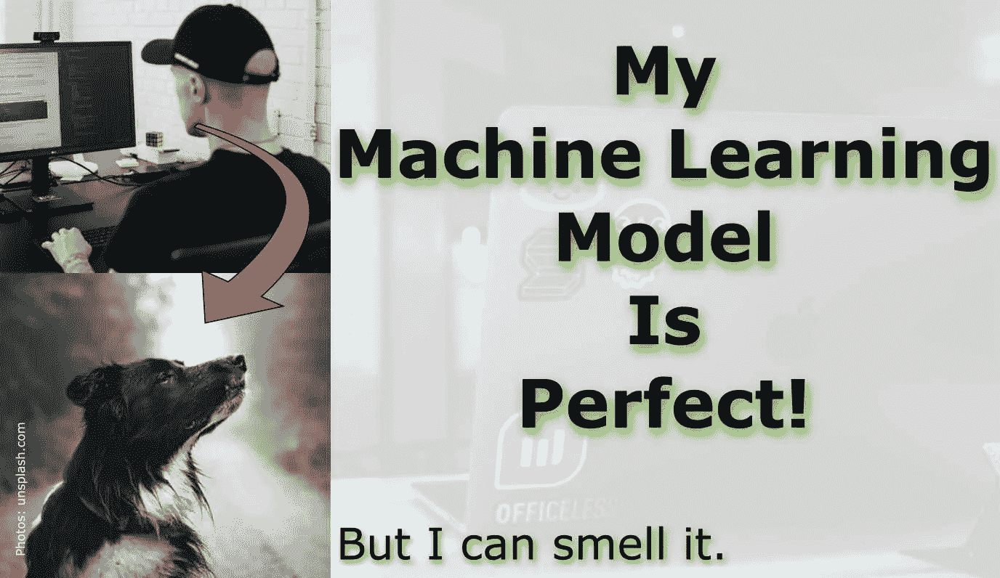

# 我的机器学习模型是完美的

> 原文：<https://towardsdatascience.com/my-machine-learning-model-is-perfect-9a7928e0f604?source=collection_archive---------34----------------------->

## 但我能闻到。

Unsplash 上[@ youxventures](https://unsplash.com/@youxventures)[@ tade KL](https://unsplash.com/@tadekl)[@ Mario Gogh](https://unsplash.com/@mariogogh)的照片

# 需要重构的代码

奇怪和难以阅读的代码是引发重构(重写)的常见原因。想象一下没有大量文档的非结构化意大利面条式代码——或者相反——文档太多，你再也看不到森林了。这种代码问题被称为“代码味道”。这个术语在 1999 年马丁·福勒的书[“重构:改进现有代码的设计”](https://martinfowler.com/books/refactoring.html)出版后被广泛采用。其本质，重构是应用一系列小的行为保持转换，其累积效果是“降低引入错误的风险”。

有些气味很容易被发现，有些气味比其他气味更微妙、更阴险。虽然这些问题和迹象本身可能并不有害，但它们值得仔细观察。你可能以前见过其中一些:

*   不必要的复杂性(也就是炫耀)。
*   带有太多参数的函数，表明“上帝函数”没有划分成辅助函数。
*   屏幕上的函数长度失控，难以阅读。
*   过多的注释使得很难区分代码和非代码。
*   重复代码——这就是“不要重复自己”原则的来源。

看看代码气味的完整列表及其在维基百科上的描述，以及 Anupam Chugh 在他的 TowardsDataScience 帖子中讨论的内容。

## 突围:谁有最臭的代码？

在写这篇文章的时候，华盛顿州的谷歌搜索用户对代码气味最感兴趣，或者至少排名很高。[立即查看谷歌趋势](https://trends.google.com/trends/explore?date=all&geo=US&q=%2Fm%2F01h_xq)。他们的代码是所有代码中最臭的吗？兴趣可能与一个状态中的编码者的数量相关，并且不可避免地会有有问题的代码被发现。

[粘土银行](https://unsplash.com/@claybanks?utm_source=medium&utm_medium=referral)在 [Unsplash](https://unsplash.com?utm_source=medium&utm_medium=referral) 拍摄的照片

# 机器学习闻起来是什么味道？

几乎所有的机器学习都需要有人编写代码。这意味着已知的问题或气味可能来自代码库——不管是我们写的还是其他人放入黑盒中让我们调用的。机器学习模型是传统的函数，但在数学上遵循不同的范式:一个将样本值 X 与某个目标值 y 相关联的函数。虽然 PyTorch、TensorFlow 和 Scikit-learn 等全面的 ML/DL 库的所有函数都有望得到优化，并且没有代码味道，但一个项目涉及的不仅仅是在单个函数中调用的单个算法。根据我们项目的需求调用函数库功能的工作流是一个[“元模型”](https://en.wikipedia.org/wiki/Metamodeling)，有其自身的设计复杂性。

那么，在我们的预测工具中，哪些“ML 气味”可能会提醒我们更深层次的问题呢？

【Matt Hall 博士于 2020 年 10 月在 Twitter 和地质机器学习社区 [Software Underground](https://softwareunderground.org/) 中提出了以下问题:

> *🐽ML 气味很可能不是一个东西，但也许应该是。一个*[*# machine learning*](https://twitter.com/hashtag/machinelearning?src=hash&ref_src=twsrc%5Etfw)*项目中潜在更深层次问题的表面迹象是什么？——马特·霍尔(@ kwinkunks)*[*2020 年 10 月 7 日*](https://twitter.com/kwinkunks/status/1313841986886152194?ref_src=twsrc%5Etfw)

Matt 众包了一些优秀的回答:

*   像 AutoML 这样的暗箱服务。
*   **违反直觉的模型权重** - >已知影响具有低特征重要性。(里斯·霍普金斯，安克雷奇)
*   **不可复制、不确定的代码** - >不设置随机种子。(里斯·霍普金斯，安克雷奇)
*   **无列车价值测试分割描述/理由**。训练数据和盲数据之间的泄漏很容易随着空间相关数据中的随机分裂而引入。(贾斯汀·戈斯，休斯顿)
*   **无评估指标讨论** - >如何选择或设计(Dan Buscombe，Flagstaff)
*   **无事实根据的讨论**以及目标标签如何与之相关。(贾斯汀·戈斯，休斯顿)
*   **过高的超参数精度** - >可能意味着过度调整。(克里斯丁宁，珀斯)
*   **未考虑精度-召回权衡** - >，尤其是在二分类任务中。(丹·巴斯科姆，弗拉格斯塔夫)
*   **强烈的阶级不平衡**并且没有明确提到如何处理。(丹·巴斯科姆，弗拉格斯塔夫)
*   **一个或两个特征的偏斜特征重要性**可能暗示特征泄漏。(约翰·拉米，奥斯汀)
*   **找借口** - >“我们需要更多数据”“标签不好”等。(哈尔格里姆·拉德维森，斯塔万格)
*   **花在清理数据上的时间太少** - >不到准备数据工作的 80–90%。(迈克尔·皮尔茨，奥斯汀)
*   **非常高的精度**，例如，对于新任务上的复杂模型为 0.99。(Ari Hartikainen，赫尔辛基 Lukas Mosser，雅典)。在大多数真实世界的场景中，接近 0.7 的精确度是非常好的，任何 0.8 的精确度都表明发生了一些不寻常的事情。

这是一个很长的列表，但还有更多。

最有可能的是，我们有自己的偏见和倾向来产生一些气味，因为我们没有意识到，没有更好的了解，或者没有其他选择。在这种情况下，同行评审提供了第二(或第三、或第四……)双眼睛，这是至关重要的，所有的气味都被清除了。

你怎么想呢?

你的 ML 代码有多完美？你看到了什么样的表面现象可能表明 ML 项目中更深层次的问题？

也许是时候有人正式创造一个新的术语叫做“ML 气味”了…..

感谢马特·霍尔，他的问题激发了我写这篇文章的灵感！

# 关于

Christian 拥有`Marine Science`的博士学位，`Geoscience`的理学硕士学位，有很强的计算机编程背景。他精通我们这个时代最热门的课题之一:`Data Science`，并开发`Machine Learning`模型。[查看更多...](https://www.christianhaller.me/about/)

*原载于 2021 年 1 月 16 日*[*https://www . Christian Haller . me*](https://www.christianhaller.me/blog/projectblog/2021-01-16-ML_Perfect/)*。*