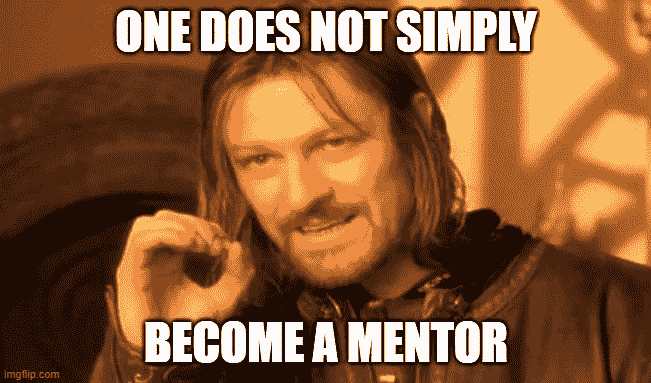
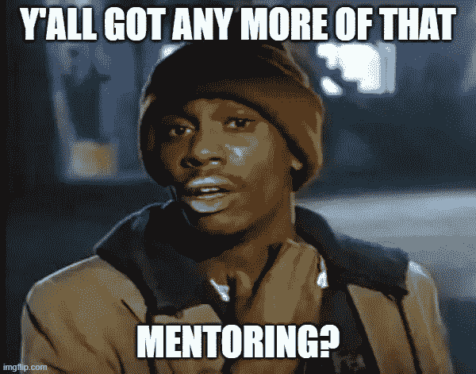
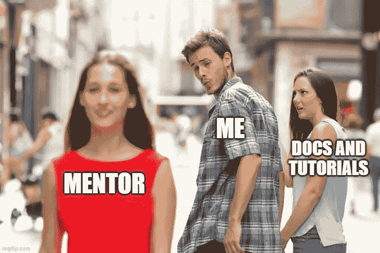

# 我在数据科学领域的指导经验:经验和教训

> 原文：<https://towardsdatascience.com/my-mentoring-experience-in-data-science-lessons-taught-and-learned-e7df0317f44c?source=collection_archive---------18----------------------->

## 我对工作内外的人进行正式和非正式指导的经历

乔恩·泰森在 [Unsplash](https://unsplash.com?utm_source=medium&utm_medium=referral) 上的照片

什么是师徒制？怎么才能找到导师？像这样的问题经常在论坛、社交媒体和社区中被问到。当一个有经验的人分享见解并无偿指导学员走向成功时，师徒关系应该是一个令人兴奋的局面。有人建议在工作中找一个导师；还有人说，你可以在任何地方找到潜在的导师。

但是从导师的角度来看事情是如何进行的呢？也许有一天，一个人只是决定是时候指导别人了，并开始帮助别人？就我而言，它是逐渐开始的。

很长一段时间，我认为我只是在帮助人们向我伸出援手。但是后来，在一份工作中，我开始正式指导人们。项目结束后，我回头看，意识到我已经指导了很多人。以前我认为师徒关系是一个重要而正式的承诺，但现在我知道这并不总是正确的，师徒关系可以是完全非正式和有趣的。

2020 年，我获得了 ods.ai 颁发的导师奖，现在我认为是时候谈谈导师了。

在这篇博文中，我想分享我的指导经验，我对它的想法，对导师的好处，以及潜在的困难。

# 什么是指导

指导有许多定义，侧重于不同的方面。[维基百科](https://en.wikipedia.org/wiki/Mentorship)提供了以下一条:

> 辅导是一个非正式传递知识、社会资本和接受者认为与工作、职业或专业发展相关的心理社会支持的过程；指导需要非正式的沟通，通常是面对面的，持续一段时间，在被认为拥有更多相关知识、智慧或经验的人(导师)和被认为拥有较少相关知识、智慧或经验的人(被保护人)之间进行。

我基本同意，并想强调最重要的几点:

*   导师在学员感兴趣的领域更有经验。这是不言自明的，但也意味着学员在其他领域可能更有经验。例如，学员正在转行或学习新的兴趣领域；
*   学员有一个具体的目标(例如，获得一份更好的工作)。如果被辅导者不知道他们想要什么，导师将无法提供帮助；
*   通常，指导是在两个人之间进行的，而不是在小组中进行。唯一的例外是，导师同时帮助几个学员处理类似的话题，例如，指导新同事。但是尽管如此，这些小组会议应该比更多的个人指导更少；
*   与其他形式的知识共享相比，指导更个性化，更不正式。例如，教练仅限于商业话题，在教学的情况下，学生通常没有太多的选择自由，教师也不太容易分享个人想法；
*   指导的开始通常不是正式的。其实给我写信“成为我的导师”的只有几个人，我一般都是拒绝的(我在这篇博文的最后说说我的理由)；
*   导师交流可以面对面进行，但我更喜欢短信或电话。
*   指导可以偶尔进行，但必须至少进行几次。一次性建议不是完全的指导，尽管它仍然是有益的；

导师本身有多种形式:导师可能会给出模糊的建议或帮助解决技术问题，提供一个新的视角，激励，支持和激励，并以许多其他方式提供帮助。导师风格取决于导师的偏好、学员的目标和背景(例如，是否在工作)。

# 我的指导经历

我生成的模因

首先，我想分享一下我在开始 DS 职业生涯时的经历:大学毕业后，我作为 ERP 系统实施领域的分析师/顾问工作了大约 4 年。在那段时间里，我在精益六适马获得了绿带。

由于从事咨询工作，我学到了很多东西，特别是与客户交谈，讨论他们的需求并将其形式化，向程序员解释任务，测试结果，组织项目和许多其他技能。

然后就离开了这个职业，经过 8 个月的自学，开始了大三 DS 是银行的工作。在那里工作期间，我已经完成了两门课程，并做了一个自己喜欢的项目。这个热门项目包括收集数据、训练模型、部署模型，以及制作一个与模型交互的 web 界面。还有就是我在 ods.ai 社区里问答。

结果，尽管我是一个大三的 DS，但我成功地将我的职业生涯转向了数据科学，拥有了各种技能和知识，以及一个已完成项目的经验(尽管是在工作之外)。这意味着我已经可以帮助别人了，事实上，我在做 DS 的第一份工作时就已经开始指导了。

# 非正式指导

我将把正式的(工作中的)和非正式的(工作之外的)指导分开，因为它们非常不同:它们有不同的承诺水平、不同的参与者动机、不同的期望等。详细描述我所有的指导经历太长了，所以我想只描述我正式的指导经历。对于非正式的指导，我将介绍更高层次的信息。

## 第一次指导经历

我产生的迷因

正如我已经提到的，我在从事我的第一份 DS 工作时就开始了指导。ods.ai 社区的一名成员向我提出了关于转行的问题，我分享了我的经验并给出了建议。

然后我们继续交流，我帮助他解决技术和理论问题，对各种项目提出建议。其中一个是关于制作网站和部署模型的，这和我上面提到的宠物项目很相似。

在帮助寻找这些问题的答案的同时，我自己也学到了很多有用的信息。

我们的交流持续了 6-12 个月。

## 卡格尔

如你所知，我是 Kaggle 竞赛大师和笔记本电脑大师(我甚至保持了 1 年的排名第一)。

我在 Kaggle 上活跃的时候(目前不太活跃)，经常在 Kaggle 论坛上回答问题。许多人写信给我，通过社交媒体、电子邮件和其他媒介提出问题。在某些情况下，我们的交流持续了很长时间。最显著的例子是两个人成为 Kaggle 笔记本电脑大师；这是其中之一:

我分享了我写和推广笔记本的经验，对他们的工作提供了反馈，给出了想法和建议——而且效果很好！

## 短期和长期指导

我不仅在 Kaggle 上很活跃——我在几个社区回答问题，发表演讲，并参加许多其他活动。结果，很多人向我求助。

他们中的一些人就某个特定的主题提出了问题，或者在解决某个技术问题时需要帮助(例如，询问客户流失预测的方法或者解决某个特定的医疗 CV 任务)。其他人想要关于职业的建议或一般指导。通常，它是通过文本，有时使用语音。

在大多数情况下，一次会议就足够了，所以我不愿意称之为“指导”，但无论如何我可以帮助这些人，这很好。

但在某些情况下，我们的交流持续了很长时间。有时我们经常互相发信息，有时我们可以几个月没有任何联系。

# 正式辅导

我在一份工作中是正式的导师。指导是我职责的一部分，但当你是一名技术主管时，有时很难将指导与其他工作活动区分开来。因此，以下几点纯粹是关于指导的；其他的将是关于管理团队或其他工作的事情。

该项目是关于使用深度学习模型开发一种产品。这项工作在我加入公司之前很久就开始了，但公司的一些变化让我成为了这个项目 NLP 部分的技术主管。

在我开始领导技术的时候，我的团队只有一个人，但是我很快就雇佣了 3 个人。因此，我必须指导有经验和没有经验的同事。还有一个额外的问题——这正好与新冠肺炎疫情和锁定的开始相吻合，所以一切都很遥远，这带来了不同的挑战，因为我不习惯。

## 入职

我生成的模因

入职培训是一种特殊类型的指导——它帮助新人成为项目、团队和公司的一部分。

它主要是关于日常的事情——帮助更多地了解队友，描述过程和非正式的规则。

在理想世界中，没有必要教授任何特定于项目的技术内容——它们在文档和内部 wiki 中有描述，但这在现实中很少。最好的情况——有一些有用的文档，但是它们有点过时了。

在我的案例中，我认为现有的文档是不够的，所以我和每个新人打了 2-3 个小时的电话。我从高层次和低层次的细节讲述了这个项目，展示了代码，演示了它是如何工作的，解释了我们的开发实践，等等。然后，我们更新了文档并试图维护它。

## 初始教学

我的团队中有些人有着不同的经历，他们中的一些人比其他人需要学习的东西更多。

从一开始，我就声明任何问题都是受欢迎的。如果有人在一个纯粹的技术问题上花了一个多小时——寻求帮助比在这上面花太多时间要好。所以我们经常在一周内互相发信息或打电话。

有时我组织现场编码会议，在那里我展示了我将如何解决一个特殊的问题。

顺便说一句，我认为指导最有价值的好处之一是看到导师的思维过程。发送解决方案/文章/课程的链接就可以了；给予暗示也是好的。但是当你展示你的思考过程时，这对学员来说真的很有价值。

## 培养主人翁精神

由于项目的结构，将功能的不同部分交给不同的人是可能的。它的代码大部分已经写好了，但是还有很多尝试新事物的机会。我设置了一些必要的任务，当然，也鼓励人们尝试他们的想法。有些想法失败了，有些超出了我的预期。

当然，这并不总是容易的。例如，有时人们追求先进的方法而没有尝试更简单的方法，这损害了项目的进展。解决办法是设定具体的最小的事情，应该尝试，然后任何人都可以做任何事情。

## 一对一

我产生的迷因

我不会说这是我的失败，但事后看来，我本可以做得更好。

我是如何做到的:每个月初，我都会给我团队中的人写信(当然是单独的),询问反馈、问题、担忧以及其他他们想告诉我的事情。然后，我们讨论它们，如果出现问题，我会尽力解决。

我应该怎么做:我认为视频通话(或者至少是音频)会更好——看到或听到另一个人比短信提供更多的信息和线索。此外，我应该从我的角度给出更多的反馈(我给出了反馈，但并不总是这样)。

## 每周电话

在团队成立和最初的问题得到解决后，我意识到我需要两样东西:

*   某种定期的非正式会议。敏捷/scrum 会议不算数——它们主要是关于工作的，而且还有太多其他人。但有机会互相交谈是至关重要的，特别是考虑到我们完全处于偏远地区，彼此之间的联系比在办公室里更少。
*   向整个团队而不是单独向每个人教授同样的东西。

我的解决方案是每周打电话(通常是音频，但有时也有视频)，持续 1-2 小时，由两部分组成:

*   起初，有人(通常是我，但过了一段时间也有人)就某个话题做了一次演讲/研讨会。通常，它是一些实际的东西:可以是分享功能的进展，一些一般性的问题，或者一个特定技术问题的解决方案
*   关于工作、生活和其他任何事情的非正式谈话

我认为效果非常好。

*   我们从介绍性的话题开始，逐渐转向更高级的概念；一些问题是:从头开始用 Pytorch 编写训练神经网络的代码，NER 建模，使用通气管、Docker、ONNX
*   我鼓励我的团队成员在这些每周电话会议上至少做一次演讲。这有助于他们发展或提高公开演讲技巧；
*   我们能够更好地了解彼此，即使在项目结束后也能保持沟通；

## 领导团队的一般原则

艾萨克·史密斯在 [Unsplash](https://unsplash.com?utm_source=medium&utm_medium=referral) 上拍摄的照片

很难描述我所做的一切，但我想说出主要的想法和原则:

*   试图在团队中培养良好的环境/文化，旨在互相帮助和提高技能；
*   正如我前面说过的，我鼓励人们提问，尤其是当他们被卡住的时候。我试图帮助解决理论和技术问题；
*   不仅提供单独完成任务的机会，还提供结对完成任务的机会；
*   我教授了编写好代码的实践:设置预提交挂钩、使用 ci/cd 进行风格检查、代码审查和其他事情；
*   帮助提高软技能，给出前进的一般建议；
*   推动改进我们的技术解决方案——改进小事情，尽可能自动化，使用更好的现代方法；
*   尝试给予很多积极的反馈，因为以前我经历过很多我完成的事情没有得到表扬/认可的情况；
*   还有一点——我很幸运，其中一位同事也想指导我，他从我这里接过了一部分责任，并帮助了经验较少的队友；

# 导师的观点

现在我已经详细描述了指导，让我们来谈谈指导的更高层次。

# 指导对导师的益处

我产生的迷因

既然我已经描述了我的指导经历，你可能会问——为什么导师还要这么做？我的时间和努力换来的是什么？嗯，有些指导纯粹是像志愿者一样完成的，但也有很多好处，导师可以得到。这是合理的——因为导师在他们的学员身上花费了大量的时间和精力。有段时间，我每周花大约 5 个小时进行辅导。我将从指导的更理想化的理由开始，逐渐转向更实际的理由。

*   指导是回报社区的方式之一。我在 ods.ai、kaggle 论坛和其他地方得到了很多帮助，我想回报这些帮助
*   我在以前的工作中没有得到足够的指导，所以当我在工作中有这样的机会时，我想把事情做得“正确”
*   通常，这是毫不费力的，尤其是在短期或不经常辅导的情况下。你可以直接回答或者改变方向。这花费了导师几分钟的时间，但可以为学员节省几个小时
*   此外，看到你的学员如何进步并取得成功也是令人满意的
*   我认为最常见的动机之一就是渴望分享经验。人们写博客，发表演讲，制作视频来分享他们的知识，以帮助人们避免错误。当然，告诉人们他们有多棒，但这不太适用于指导
*   人们常说，理解某事的最好方法是把它教给别人。指导给了我们一个绝佳的机会。它有助于构建和系统化知识，提高和完善基本技能。如果很多人问类似的问题，你可以在以后与公众分享这些专业知识
*   指导和任何讨论一样，允许从不同的角度看待一些问题。通常一个新的观点会带来新的更好的解决方案，你可以在未来使用
*   指导也帮助我学到了很多新东西。有时人们会问我一些超出我专业范围的问题。但是由于我的知识和经验，我可以很快学会这些东西并帮助解决问题。还有，有时候我有想法但是没有时间或者机会去尝试；我可以向学员提供这些想法，并看到结果
*   指导还能提高沟通和其他软技能
*   指导增加了你的社交网络。你永远不知道你的学员会取得什么成就。他们很可能会在未来帮助你
*   最后，你可以写一篇关于你的经历的博文😉

## 当导师不指导时

有必要再次重申，不同的导师有不同的风格、技能和偏好。这意味着有时导师可以拒绝指导请求，因为他们不能或不想满足学员的期望。

我已经提到我过去拒绝成为一名导师。我想分享我做出这些决定的一些理由。

*   我害怕承诺。是的，就这么简单。我害怕成为一名完全的导师，让我未来的学员失望，所以我拒绝了。
*   我不想教基础的东西(在工作中教是个例外)。如果有人要求解释逻辑回归是如何工作的，我会给出好文章的链接，就这样。原因之一是这些话题已经有足够多的优质资源。另一方面，很有可能我多年没有刷过这些话题，所以可能要花很多时间才能记住。
*   我们并不总是有足够的空闲时间。有许多 DS 活动、爱好和生活本身——有时你没有足够的时间教其他人。
*   有些人想被填鸭式喂养。他们不想接受暗示或建议——他们期待直接的答案和现成的解决方案。有些人希望我能解决他们的问题，并把完整的工作代码发给他们，而他们自己却什么也没做。
*   他们想在我不感兴趣的话题上得到指导。

## 你需要指导吗？

我产生的迷因

这是一个好问题。

我想说，指导的主要优势是比没有它更快地得到结果。

想象一下当你需要完成一项你并不完全熟悉的任务时的情况。你可以在论坛、社交媒体、社区上寻求建议。你可以搜索论文、博客文章、视频和课程。在这之后，你会得到一堆材料，许多建议(其中一些可能是相互矛盾的)，以及许多可以尝试的东西。当然，你可以自己完成所有的工作，或者使用最新和最流行的资源推荐。但是导师可以帮助你避免典型的错误，并指出哪些在实践中有效，这将节省你很多时间。更重要的是，导师可以分享一些基于经验的想法，这是你想都没想过的。

另一方面，如果你现在没有导师，找到他们可能需要更长的时间，所以自己解决问题可能会更快。

## 我想有导师吗？

这可能很讽刺，但我很少有机会有导师。

我从论坛、社区、会议和工作中学到了很多东西。有些人，我可以称之为导师，但通常是短期的。过去有(现在仍然有)我们与之交谈并分享经验的人。但是我想我从来没有请过任何人做我的导师。

一部分是因为缺乏自信和自我怀疑，一部分是因为我习惯了自学，一部分是因为我对很多事情感兴趣，参加了很多活动，因此不知道半年后我会做什么。

我想有一个导师吗？当然了。但首先，我需要找到这个问题的答案，“我想被教导什么，我想实现什么”。

## 如何获得导师

我生成的模因

让我们回到这篇博文提出的第一个问题。寻找导师很有挑战性；通常，人们不知道从导师那里能期待什么，不知道他们能提供什么作为交换，也没有目标。我将分享几个想法:

*   最重要的是——学员和导师应该和谐相处。他们可能有不同的心态，不同的表达方式，其他更喜欢的教学/学习方法——有时指导不起作用；
*   你需要有一个具体的要求，而不是泛泛而谈。如果你写“帮助我成为 DS”，你很可能会收到一个普通的回复或者一篇博客的链接；
*   如果你没有尝试自己做任何事情，不要指望导师会为一个技术问题写出完整的解决方案；
*   一些导师要求潜在的学员通过特定的测试，因为他们不想从头开始教授一切；
*   也有导师在社交媒体上发布他们正在接受学员的情况——这可能是找到导师的理想选择；
*   多了解导师，问相关的事情。如果指导者从未接触过音频，不要要求音频处理方面的指导；
*   如果你想有更高的成功几率，那就试着在初次接触时参考导师活动中的一些东西。例如，说你对他们的一次谈话感兴趣，并询问更多细节；
*   这取决于导师的性格，但有些导师愿意接受指导请求；有些人喜欢简单地回答问题。对不同的人尝试不同的方法；
*   如果可能的话——提供一些东西作为指导的交换。例如，如果你想让一位导师帮助你参加 ML 竞赛，给他们在团队中提供一个位置以换取指导(尽管你没有提交任何参赛作品，但这种方法可能会失败)。只有当导师以提供有偿指导而闻名时，才提供金钱补偿；否则，它可能会导致拒绝；
*   如果你的公司提供导师项目，这可能是最好的选择；

**结论**

这就是我的指导经验和我的想法。我希望我的博客文章能更清楚地说明从导师的角度来看，指导是怎样的，以及它的困难和优势。不是每个人都需要一个导师，尤其是如果有可能从在线社区获得支持的话，但是获得一个好的导师可能会给你的技能和职业生涯带来巨大的推动。

页（page 的缩写）这篇博文最初发表于[这里](https://andlukyane.com/blog/mentoring-experience)。