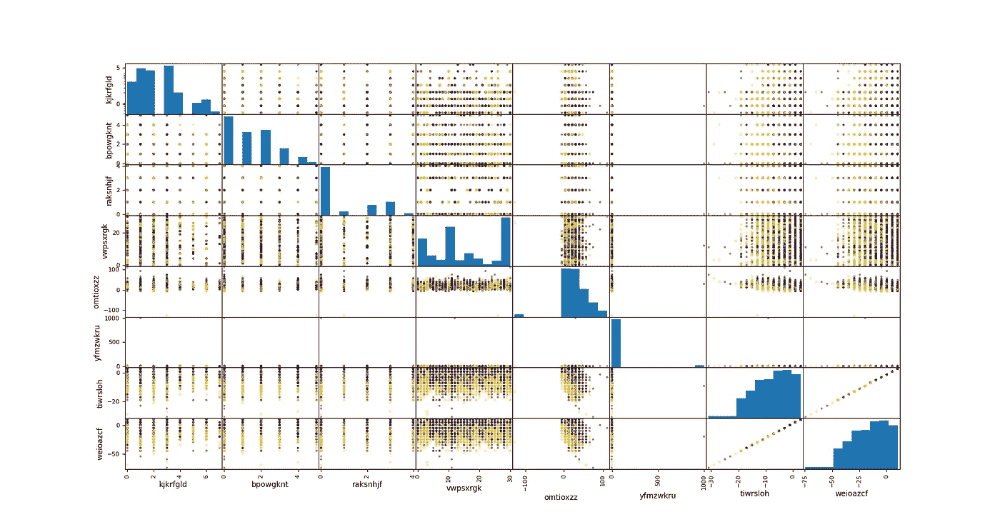
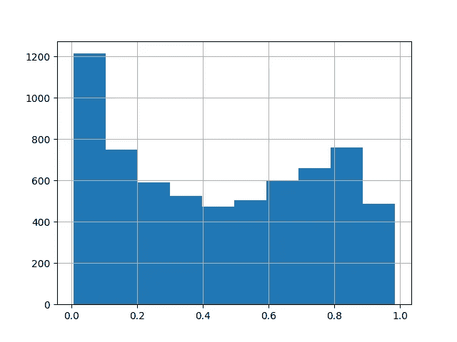
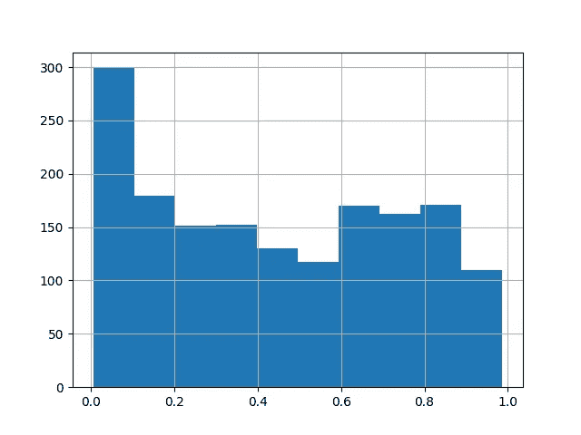
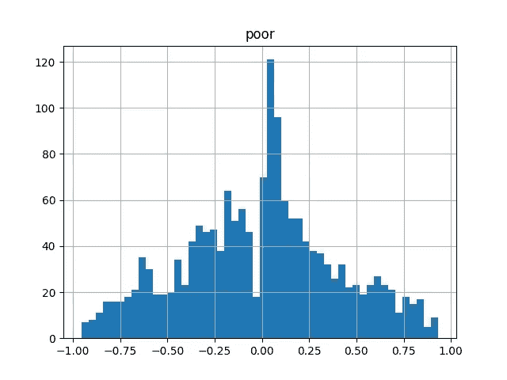
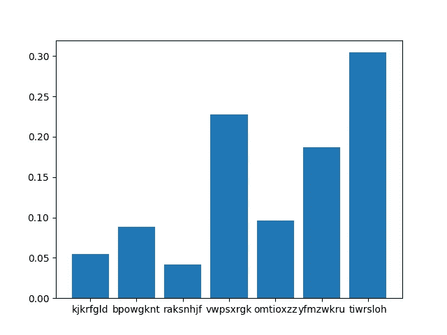
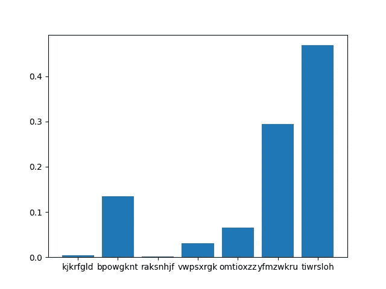
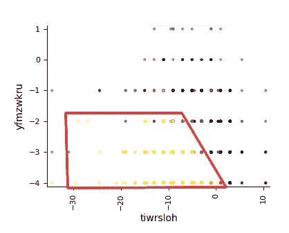

# 我的 ML 模型失败了。为什么？是数据吗？

> 原文：<https://towardsdatascience.com/my-ml-model-fails-why-is-it-the-data-d8fbfc50c254?source=collection_archive---------23----------------------->

## 了解模型表现不佳是因为错误的模型选择，还是因为训练数据中的噪声，并提供一个真实的示例。


图片:[拉斐尔 1509 年创作的《雅典学院》](https://commons.wikimedia.org/wiki/File:%22The_School_of_Athens%22_by_Raffaello_Sanzio_da_Urbino.jpg)

# 介绍

当你建立和训练一个模型并检查其准确性时，机器学习中最常见的问题之一是"**我能从数据中获得的准确性最好吗**或者 a 能找到更好的模型吗？"。

此外，一旦您的模型被部署，下一个常见的问题是“**为什么模型失败了**”。有时这两个问题都无法回答，但有时我们可以通过研究模型误差的统计分布来发现预处理误差、模型偏差以及数据泄漏。

在本教程中，我们将解释和演示如何对模型结果进行统计研究，以**在示例**中发现错误**的原因。**

# 商业案例

在本例中，我们将使用来自[驱动的数据竞赛](https://www.drivendata.org/competitions/50/worldbank-poverty-prediction/)的数据，从一组社会经济变量中预测一个人是否生活在贫困状态。

该商业案例的价值不仅在于能够利用机器学习模型**预测贫困状况**，还在于了解衡量贫困的社会经济变量的预测性，并从特征上分析其原因。

# 模特培训

数据由一组九个描述性变量组成，其中四个是分类变量，另外五个是数字变量(但是其中一个似乎是 id，所以我们将丢弃它)。

```
import pandas as pd

pd.set_option('display.max_columns', None)
train = pd.read_csv('train.csv', index_col='id')
print(train)
```

它返回

```
 Unnamed: 0 kjkrfgld bpowgknt raksnhjf vwpsxrgk  omtioxzz  yfmzwkru
id                                                                          
29252  2225    KfoTG    zPfZR    DtMvg      NaN      12.0      -3.0   
98286  1598    ljBjd    THHLT    DtMvg    esAQH      21.0      -2.0   
49040  7896    Lsuai    zPfZR    zeYAm    ZCIYy      12.0      -3.0   
35261  1458    KfoTG    mDadf    zeYAm    ZCIYy      12.0      -1.0   
98833  1817    KfoTG    THHLT    DtMvg    ARuYG      21.0      -4.0   

       tiwrsloh  weioazcf   poor  
id                                
29252      -1.0       0.5  False  
98286      -5.0      -9.5   True  
49040      -5.0      -9.5   True  
35261      -5.0      -9.5  False  
98833      -5.0      -9.5   True 
```

这里可以看到数据分布



按作者分类的图像:数据集中用目标着色的所有要素的成对绘图。黄色表示差=假，紫色表示差=真。

在一些预处理(NaN 值插补、缩放、分类编码等)之后，我们将训练一个 SVM 模型(它通常在来自一键编码的高维数据中工作良好)

## 支持向量机

```
from sklearn.pipeline import Pipeline
from sklearn.preprocessing import RobustScaler
from sklearn.neighbors import KNeighborsClassifier

model = Pipeline(steps=preprocess+[
                 ('scaler', RobustScaler()),
                 ('estimator', KNeighborsClassifier(n_neighbors=5))])

model.fit(X_train, y_train)
y_pred = model.predict(X_test)
print(classification_report(y_test,y_pred))
```

它返回

```
precision    recall  f1-score   support

       False       0.73      0.77      0.75       891
        True       0.70      0.66      0.68       750

    accuracy                           0.72      1641
   macro avg       0.72      0.71      0.71      1641
weighted avg       0.72      0.72      0.72      1641
```

从二进制分类问题来看，0.72 的精度不是非常好的精度。相比之下，查全率和查准率似乎是平衡的，这使我们认为该模型不是偏向于任何一个类别。

# 测试其他模型

尝试改进模型的下一步是尝试其他 ML 模型和超参数，看看我们是否找到任何提高性能的配置(或者甚至只是检查性能是否在平稳状态下保持不变)。

我们将使用来自不同系列函数的两个**其他模型。KNN 模型是学习局部模式影响的一个很好的选择，梯度增强树也是具有最高能力的 ML 模型之一**

**K-最近邻**

```
from sklearn.pipeline import Pipeline
from sklearn.preprocessing import RobustScaler
from sklearn.neighbors import KNeighborsClassifier

model = Pipeline(steps=preprocess+[
                 ('scaler', RobustScaler()),
                 ('estimator', KNeighborsClassifier(n_neighbors=5))])

model.fit(X_train, y_train)
y_pred = model.predict(X_test)
print(classification_report(y_test,y_pred))
```

它返回

```
precision    recall  f1-score   support

       False       0.71      0.74      0.72       891
        True       0.67      0.63      0.65       750

    accuracy                           0.69      1641
   macro avg       0.69      0.69      0.69      1641
weighted avg       0.69      0.69      0.69      1641
```

## 梯度推进

```
from sklearn.pipeline import Pipeline
from sklearn.ensemble import GradientBoostingClassifier

model = Pipeline(steps=preprocess+[
                 ('estimator', 
                  GradientBoostingClassifier(max_depth=5,
                                             n_estimators=100))])

model.fit(X_train, y_train)
y_pred = model.predict(X_test)
print(classification_report(y_test,y_pred))
```

它返回

```
precision    recall  f1-score   support

       False       0.76      0.78      0.77       891
        True       0.73      0.70      0.72       750

    accuracy                           0.74      1641
   macro avg       0.74      0.74      0.74      1641
weighted avg       0.74      0.74      0.74      1641
```

我们可以看到，其他两个模型的表现似乎非常相似。这提出了以下问题:

> 这是我们用 ML 模型所能预测的最好结果吗？

# 模型预测分布

除了检查性能的一般指标之外，分析模型输出分布也很重要。我们不仅要检查测试数据集中的分布，还要检查训练数据集中的分布。原因是因为我们不想看到我们的模型表现如何，而是**是否也学会了如何分割训练数据**。

```
import matplotlib.pyplot as pltpd.DataFrame(model.predict_proba(X_train))[1].hist()
plt.show()
```



按作者排序的图片:在训练集上评估的模型输出分布

```
pd.DataFrame(model.predict_proba(X_test))[1].hist()
plt.show()
```



作者图片:测试集上评估的模型输出分布

我们可以看到，在 0 的预测数量中有一个**高峰，这表明有一个数据子集，该模型非常确定其标签为 0。除此之外，分布似乎相当均匀。**

如果模型已经知道肯定区分两个标签，则分布将具有两个峰值，一个在 0 附近，另一个在 1 附近。因此，我们可以看到我们的模型没有正确地学习模式来区分数据。

# 偏差分布

我们已经看到，该模型还没有学会清楚地区分这两个类别，但我们还没有看到它是否即使不自信也能猜出预测，或者它只是一直失败。

此外，检查模型是否更偏向于某一类别也很重要。为了检查这两个方面，我们可以画出预测值与目标值的偏差分布图

```
train_proba = model.predict_proba(X_train)[:,1]
pd.DataFrame(train_proba-y_train.astype(int)).hist(bins=50)
plt.show()
```


作者图片:模型置信度输出与在训练集上评估的基础真实值的偏差

```
test_proba = model.predict_proba(X_test)[:,1]
pd.DataFrame(test_proba-y_test.astype(int)).hist(bins=50)
plt.show()
```



作者图片:模型置信度输出与测试集上评估的基础事实的偏差

从这两幅图中我们可以看到，偏差分布似乎是**对称的，以零**为中心。差距正好为零，因为模型从不返回 0 和 1 的精确值，我们不必担心这一点。

如果模型误差来自训练数据的统计/测量噪声误差，而不是偏差误差，我们预计偏差分布遵循高斯分布**。**

我们的分布类似于在 0 中具有更高峰值的**高斯分布**，但是该峰值可能是由于模型预测的更大数目的 0(即，模型已经学习了一种模式来区分 0 的子集和 1 的类别)。

# 正规性检验

由于训练数据中的统计噪声，在考虑模型预测偏差是否合理之前，我们必须确保它们遵循高斯分布。

```
import scipy

scipy.stats.normaltest(train_proba-y_train.astype(int))
```

带退货

```
NormaltestResult(statistic=15.602215177113427, pvalue=0.00040928141243470884)
```

在 p 值=0.0004 的情况下，我们可以假设预测与目标的偏差遵循高斯分布，这使得模型**误差来自训练数据**中的噪声的理论看似合理。

# 模型可解释性

正如我们之前提到的，这个商业案例的目标不仅仅是一个可以预测为什么会发生以及与之相关的社会经济变量的模型。

可解释模型不仅能对未知数据进行预测，还能提供特征如何影响模型的信息(全局可解释性)，以及为什么某个预测是这样的(局部可解释性)。

然而，一个模型的可解释性越少，也就越有助于理解它为什么能做出预测以及为什么会失败。从梯度推进模型中，我们可以如下提取全局可解释性:

```
cols = X_train.columns
vals= dict(model.steps)['estimator'].feature_importances_

plt.figure()
plt.bar(cols, vals)
plt.show()
```



作者图片:梯度增强特征重要性

现在，我们将进行相同的特征重要性分析，但只是在数据子集内进行训练。具体来说，我们将只使用零类别的明显为零的数据(之前模型明确预测为零的数据)来训练模型。

```
zero_mask = model.predict_proba(X_train)[:,1]<=0.1
one_mask = y_train==1
mask = np.logical_or(zero_mask,one_mask)
X_train = X_train.loc[mask,:]
y_train = y_train.loc[mask]
model.fit(X_train,y_train)
```

现在特征的重要性是



作者图片:在模型表现最佳的训练集的子样本上训练的梯度增强要素重要性

我们可以看到，现在， *tiwrsloh，*和 *yfmzwkru* 的重要性增加了，而 *vwpsxrgk* 的值减少了。这意味着人口中有一个**子集明显不属于贫困人口**(0 类),可以用贫困变量中的这两个变量来表征，并且 *vwpsxrgk* 在许多情况下可能很重要，但并不具有决定性

如果我们绘制这两个特征的过滤值，我们会看到:



按作者分类的图像:分割并描述模型明确检测到非贫困的特征区域。

对于这两个特征，模型已经学会区分两个类别，同时对于这些变量的其他值，对于整个数据集，零类别和一类别是混合的，因此不能清楚地区分。

我们也可以从前面的图表中将**非贫困人口的一个明确子集描述为那些具有 *tiwrsloh* < 0 和 *yfmzwkru* < -2** 的人。

# 结论

*   我们分析了在给定数据集中检测贫困的问题，并分析了给定社会经济数据的贫困原因，发现贫困不容易预测，但是，我们可以定义一些明确确定人们贫困状况的区域:*tiwrsloh*0 和 *yfmzwkru* < -2。
*   我们已经尝试了许多不同的型号和配置，性能稳定在 0.75。根据这一点以及模型预测和误差偏差分布的统计性质，我们可以得出结论，问题在于缺乏从训练数据预测目标的预测能力。所以不可能建立一个更好的模型。
*   数据预测性不足的原因可能是因为噪音，但也因为除了我们的数据集中的社会经济特征之外，缺乏一些预测贫困的预测特征。

# 我们学到了什么？

我们已经用一个真实的例子解决了模型没有得到足够好的结果的问题。这种情况下的目标是试图理解模型未能理解的地方，如果问题是在数据或模型中。

回答这个问题的过程是:

1 —尝试不同的系列函数模型和超参数，并确认所有的性能都处于平稳状态。

2-对于可解释的最好的一个，计算目标的模型输出分布和偏差分布。如果数据有问题，输出必须一致，偏差必须遵循高斯分布

3-尽管数据是问题所在，但尝试从模型输出和偏差分布中找出模型表现良好的区域。尝试分割和描述这个区域，例如，用这个子集重新训练模型，并提取它的可解释性。

4 —此外，在描述某些子集的特征时，我们可以尝试从业务知识的角度考虑问题是来自数据的统计/测量噪声，还是缺少预测因变量所需的某些特征值。