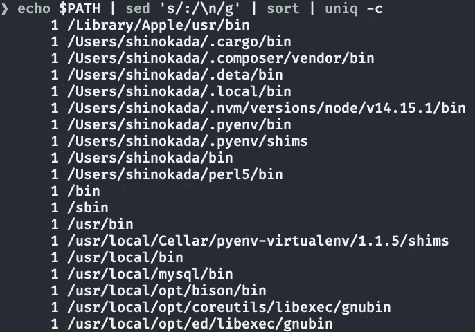
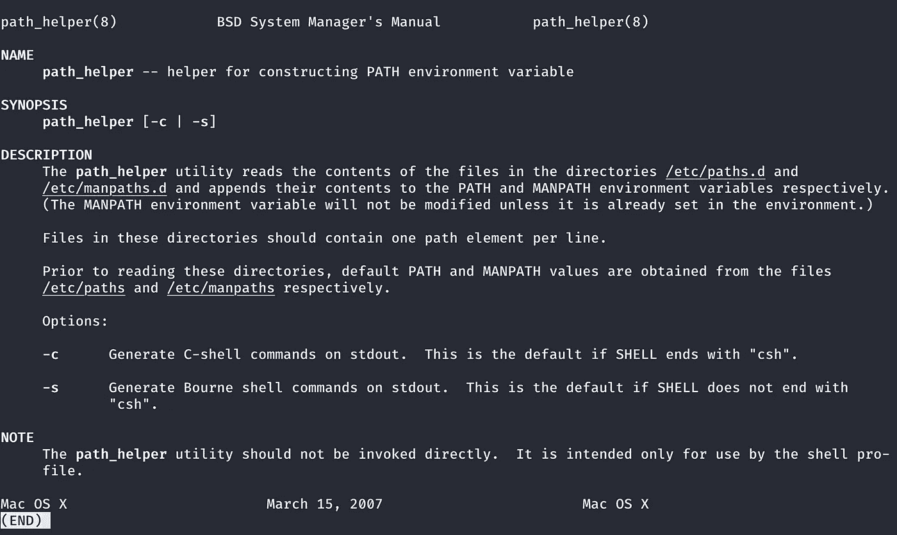
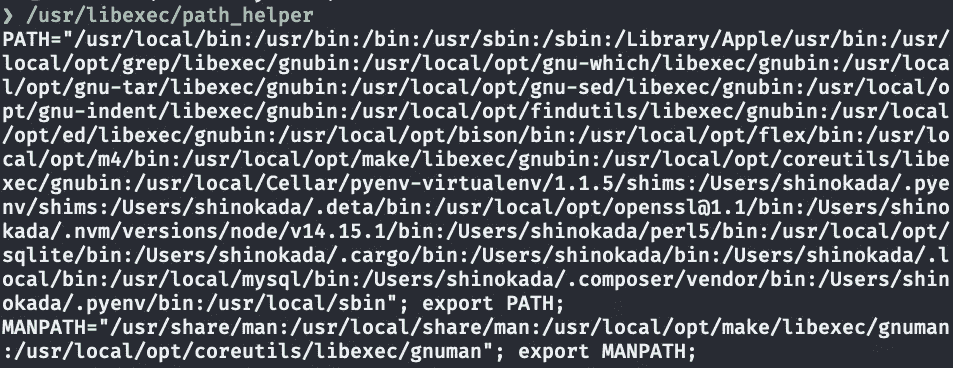
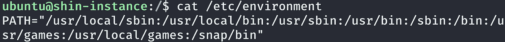
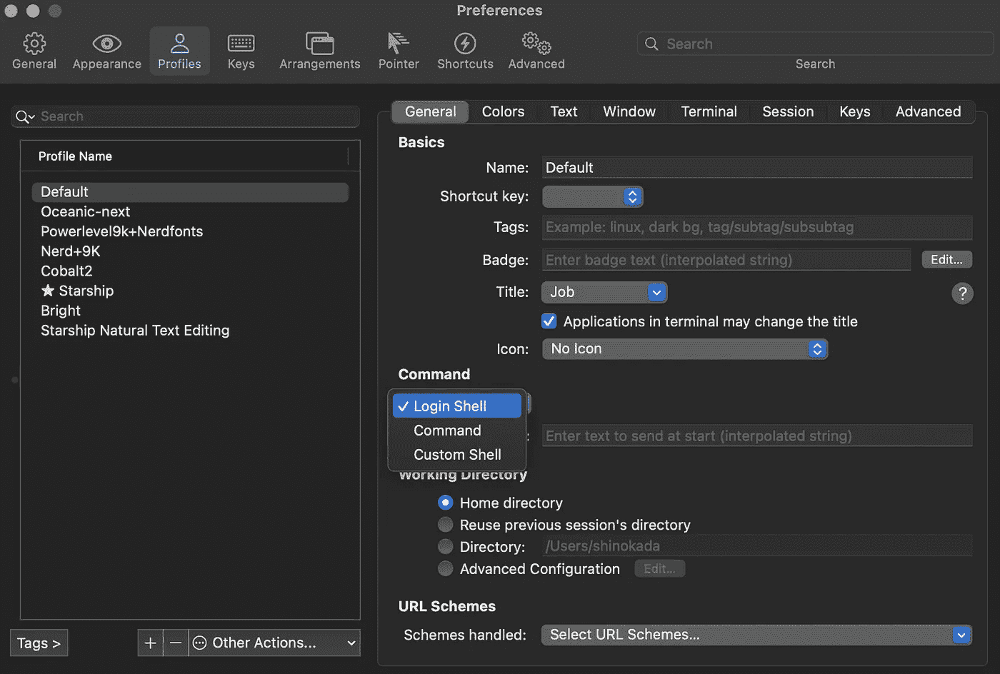

# 我的路径变量一团糟

> 原文：<https://towardsdatascience.com/my-path-variable-is-a-mess-e52f22bfa520?source=collection_archive---------12----------------------->

## 如何清理你在 macOS/Linux 中的路径


[莉莉·波普](https://unsplash.com/@lili_popper?utm_source=medium&utm_medium=referral)在 [Unsplash](https://unsplash.com?utm_source=medium&utm_medium=referral) 上拍摄的照片

# 介绍

当你安装一个程序时，它经常要求你添加一个路径到你的 shell 配置文件。我盲目地想，“这个工具很酷。我现在就想用！”过了一段时间后，你发现你的路径变量一团糟。许多重复或三重的路径。是时候清理了。

# 检查你的路径

以下命令用新行替换冒号，排序，计算唯一路径出现的次数，并显示:

```
$ echo $PATH | sed 's/:/\n/g' | sort | uniq -c
```



我从 echo $PATH | sed 的/:/\ n/g ' | sort | uniq-c . Image by Author 输出的部分。

你有不止一次的经历吗？如果是这样，请继续阅读！

# macOS 用户

macOS 有`path_helper`命令。`path_helper`是构造 PATH 环境变量的助手。

跑`man path_helper`:



man path_helper 的输出。图片作者。

默认路径和 MANPATH 值在`/etc/paths`和`/etc/manpaths`中。并且`path-helper` 还读取`etc/paths.d`和`/etc/manpaths.d`目录中的文件。

让我们检查一下`/etc/paths`的内容:

```
$ cat /etc/paths
/usr/local/bin
/usr/bin
/bin
/usr/sbin
/sbin
```

这些是 macOS 上的默认路径。如果您的 shell 配置文件中有这些，它将在路径输出中重复它们。

现在让我们检查一下`/etc/manpaths`的内容:

```
$ cat /etc/manpaths
/usr/share/man
/usr/local/share/man
```

当您使用`man`命令时，它将在上述路径中搜索手册页。

您可以输出 PATH 和 MANPATH 变量:

```
$ /usr/libexec/path_helper
```



/usr/libexec/path_helper 的我的输出。注意第一行的/Library/Apple/usr/bin。图片作者。

您可以查看`etc/paths.d`和`/etc/manpaths.d`中有哪些文件。

```
$ ls /etc/paths.d
100-rvictl$ cat /etc/paths.d/100-rvictl
/Library/Apple/usr/bin$ ls /Library/Apple/usr/bin
rvictl
```

它加载了`100-rvictl`并具有`/Library/Apple/urs/bin`。我的`/usr/libexec/path_helper`第一行有`/Library/Apple/usr/bin`。

# Ubuntu 用户

Ubuntu 使用`/etc/environment`进行系统范围的配置，您可以在这个文件中找到默认路径。

```
ubuntu@shin-instance:/$ cat /etc/environment
PATH="/usr/local/sbin:/usr/local/bin:/usr/sbin:/usr/bin:/sbin:/bin:/usr/games:/usr/local/games:/snap/bin"
```



/etc/environment 中的 Ubuntu 输出。图片作者。

# ZSH 用户

如果您是 ZSH 用户，并且在您的`~/.zshrc`文件中有太多的路径，您可以在您的`~/.zshrc`的末尾添加以下内容:

```
# .zshrc
typeset -U PATH
```

这可以防止路径变量重复。

# 添加路径和路径顺序

在 UNIX 上，您可以使用冒号添加多个路径:

```
PATH="/path1/to/file:/path2/to/file:/path3/to/file:$PATH"
```

如果您想要**在**前添加一个路径(在默认路径之前),请使用:

```
PATH="/path/to/file:$PATH"
```

如果你想**追加**一个路径(在默认路径之后)使用:

```
PATH="$PATH:/path/to/file"
```

例如，如果要添加`/usr/local/sbin`路径:

```
export PATH="/usr/local/sbin:$PATH"
```

如果您的 Bash 脚本在`~/bin`目录中，并且您想将它放在前面:

```
export PATH="$HOME/bin:$PATH"
```

不要在要添加的路径前后添加`$PATH`。

# 如何在中共享路径。zshrc，。bashrc，。bash_profile

您可能希望在 ZSH 和 Bash shell 中共享相同的路径。一种方法是在您的`~/.zshrc`文件中获取`~/.bashrc`。

```
# In the ~/.zshrc, sourcing ~/.bashrc 
. ~/.bashrc
```

如果您使用 [iTerm2](/the-ultimate-guide-to-your-terminal-makeover-e11f9b87ac99) ，iTerm2 在 Preference>Profiles>General>命令下有“登录 Shell”。它会在`~/.bashrc`之前寻找`~/.bash_profile`。



iTerm2 使用登录 Shell。图片作者。

这意味着您需要在`~/bash_profile`中获取`~/.bashrc`:

```
# In ~/.bash_profile
. ~/.bashrc
```

然后在`~/.bashrc`中，添加您想要在 ZSH 和 Bash shell 中使用的路径。添加路径或包含路径的源文件。

```
# I have all the GNU/Linux PATH in [~/.macgnu](https://github.com/shinokada/macgnu/blob/main/.macgnu) file
. ~/.macgnu
export PATH="/path/to/file1:$PATH"# Terminal color
export PS1="\[\033[01;32m\]\w:$ \[\033[00m\]"# not display errors when using apropos and whatis
alias apropos="apropos 2>/dev/null"
alias whatis="whatis 2>/dev/null"
...
```

如果您正在寻找其他路径文件，这可能会导致路径重复。您需要仔细检查您是否正在寻找相同的路径。注意不要在不同的 shell 配置文件中添加相同的路径。

# 结论

如果你声明了一个没有附加或前置的路径变量，你没有从`/etc/paths`加载路径。从长远来看，这将是问题的一个原因。你总是在你的配置文件中为`$PATH`变量添加新的路径，比如`~/.zshrc`、`~/bashrc`等等。我建议偶尔进行路径检查，以获得健康的外壳寿命。在`~/.bashrc`中编写公共因子并在`~/.zshrc`中获取是个好主意，但是要小心路径的重复。如果使用 ZSH，添加`typeset -U PATH`可以防止路径变量重复。

**通过** [**成为**](https://blog.codewithshin.com/membership) **会员，可以完全访问媒体上的每一个故事。**


[https://blog.codewithshin.com/subscribe](https://blog.codewithshin.com/subscribe)