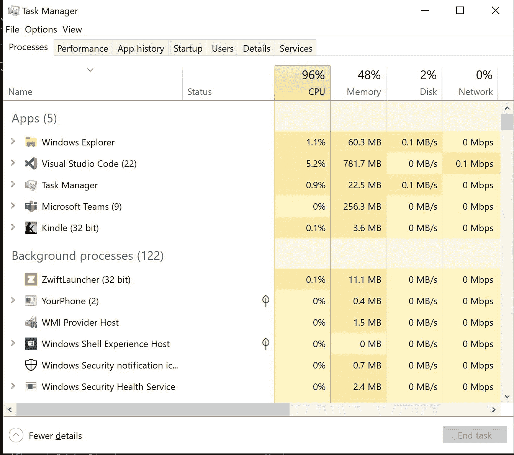
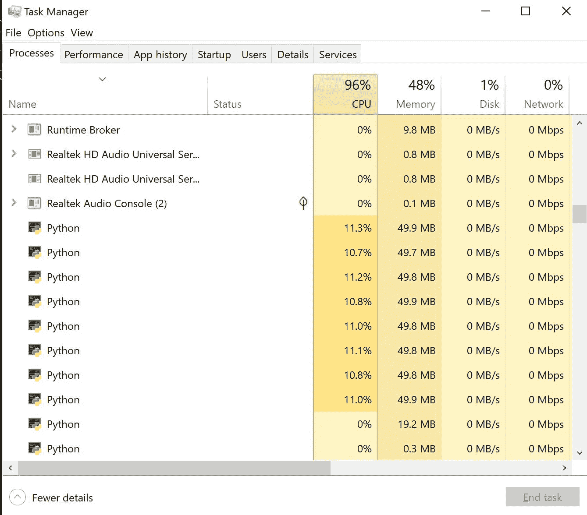
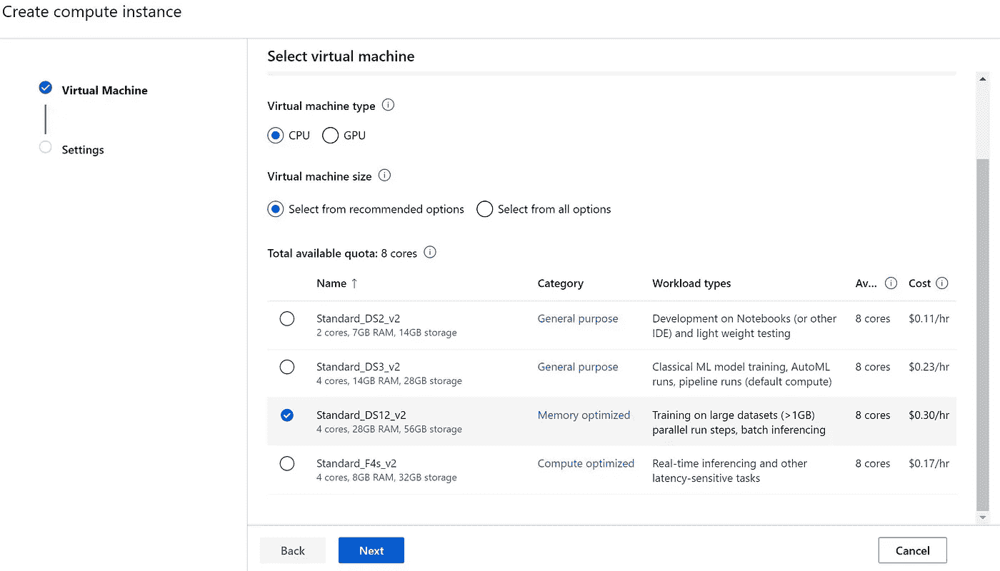

# 我的电脑与 Azure ML 计算—开始！

> 原文：<https://towardsdatascience.com/my-pc-vs-azure-ml-compute-go-98a6e33e816c?source=collection_archive---------44----------------------->

## ML Studio 计算速度更快吗？

照片由[蒂姆·高](https://unsplash.com/@punttim?utm_source=medium&utm_medium=referral)在 [Unsplash](https://unsplash.com?utm_source=medium&utm_medium=referral) 拍摄

几周前，我在 YouTube 上制作了一个视频，内容是将微软 Visual Studio 代码连接到运行在 Azure 计算资源上的 Jupyter 笔记本(通过 Azure ML Studio)。当我制作视频时，我一直在想那个远程服务器到底有多快。

所以我决定测试一下。

这是 Jupyter 设置的视频:

作者提供的视频

## 设置

我不会让您费力地完成我的探索性数据分析，甚至加载我的数据。这与我的目的没有密切关系，我的目的只是向您展示在我的个人电脑上运行一段重要代码与在 Azure 上进行比较之间的区别。

正如我在 Jupyter 视频中所说的，如果你想跟进，你还需要一个 Azure 帐户，并创建一个 Azure ML Studio 资源。这里有一段视频向你展示如何做到这一切。

作者提供的视频

## 代码

代码运行的是 GridSearchCV，它不仅运行交叉验证，还进行一些相对重要的超参数调优。我选择这个场景是因为它需要一些时间在我的电脑上运行，并且代表了远程计算的常见情况。

你可以看到代码通过 5 个交叉折叠经历了许多`KNeighborsRegressor`选项。最后总共是 360 度。根据您的需要，为任何估计器/调整/ CV 选项修改这段代码并不困难。

我还添加了自己的计时器，只是为了获得整个代码的完整运行时间。

## 我的电脑结果

我的电脑是微软 Surface，配有 i7–8650 u CPU 和 16 GB 内存。我运行的是 Windows 10。即使没有 GPU，它通常也很快。

为了运行所有 360 fits，我的电脑总共用了 4287 秒，即 71.4 分钟或 1 小时 11 分钟 27 秒左右。不可怕，但更能说明问题的是在这段时间里我的电脑发生了什么。

作者图片

我的 CPU 完全被运行的代码消耗了。我认为这是占用所有 CPU 的工作室代码，但它(逻辑上)实际上是 Python:

作者图片

看看所有这些 Python 进程！整个 1:11.27 的 CPU 利用率超过 90%。虽然在我的电脑上做其他事情在技术上是可能的，但实际上是不可能的。一个多小时了。在一个简单的模型上。做一件事。

## Azure 计算结果

在 Azure 中，我创建了一个很好的 CPU(对于一个免费帐户来说，这是我能做到的最好的了)——它不是 GPU。标准 DS12 V2 计算机拥有 4 个内核和 28 GB 内存。默认情况下，Azure ML Studio Compute 运行在 Linux 上。

它肯定比我的电脑更强大。而且是 *30 美分一小时*。

作者图片

在连接到 Azure 的 Jupyter 笔记本上运行完全相同的代码需要 1621.6 秒，也就是 27 分钟零 2 秒(27.02)。云计算运行速度提高了 62%。但更重要的结果是:

作者图片

Python 是空闲的，我的 CPU 利用率下降到了 12% ( < 3% was Studio Code). This mean while those 360 fits were running, I can do anything I want on my PC!

Not bad for a free account and about 30 minutes of setup (total). Imagine what that could be with a GPU or better yet, a GPU cluster (I can’t create either of those with the free account or I would have).

## Some Conclusions and Wild Financial Speculation

I’m not going to try and convince anyone about the value of cloud. But there are some facts worth noting:

*   I can get the latest and greatest CPU/GPU (if I have a real subscription) with almost no effort
*   I need to do *很少管理那个服务器*
*   当我不用它的时候，我不付钱(**只要我用完它的时候记得关机**
*   我没有在上面安装任何软件(正如我在 Azure 安装视频中演示的那样，添加 Python 包超级容易)
*   在代码运行时，让我的计算机可用对我来说是无价的；我不需要等待，可以同时处理很多这样的情况

我决定模拟(胡乱猜测)这在财务上可能是什么样子。我的电脑买的时候大约是 1800 美元。如果我是一家公司，有一个 3 年的折旧计划，那么每年就是 600 美元。

假设我运行了 1000 次像我的例子一样的代码。也就是 1000 * 71 分钟，也就是 71000 分钟，也就是 1183 个小时。我的电脑每小时的费用大约是 600 美元(每年的成本)除以 1，800(我每年工作的小时数……是的，没错)。这大约是每小时 33 美分(比我预期的更接近 Azure)。这相当于每年 394 美元。

在 Azure 上运行这个工作负载是 1000 * 27 分钟或 27000 分钟(450 小时，快 62%)。450 * .30 = $135.少了 259 美元，或者说**比**便宜 66%。更不用说，当代码在 Azure 中运行时，我可以在我的电脑上做任何其他事情，而当我在电脑上运行工作负载时就不是这样了。

我知道，这是一个非常粗略的财务草图(充其量)，但当数字改变时，价值不会改变(只是或多或少)。

在我看来，Azure 在各方面都赢了。虽然自从我有了 Surface，微软输了吗？(因为我买了 Surface，而且我也在写关于 Azure 的东西，所以我猜不会。)

云计算快乐！