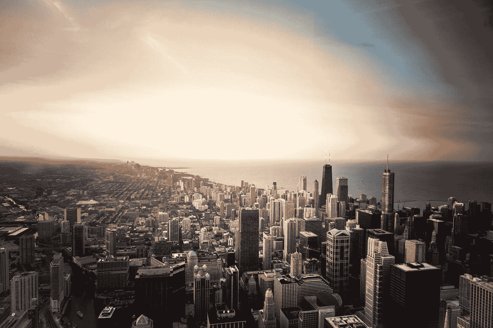
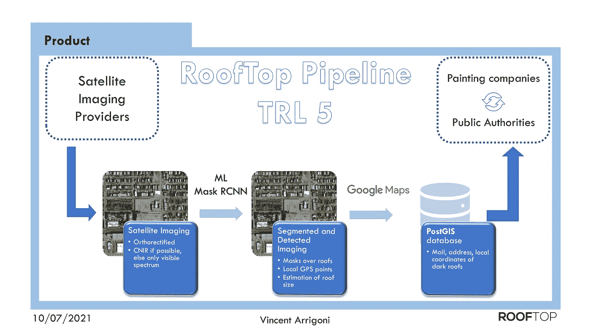

# 我的屋顶项目——卫星图像和计算机视觉的例子

> 原文：<https://towardsdatascience.com/my-rooftop-project-a-satellite-imagery-computer-vision-example-e45a296129a0?source=collection_archive---------11----------------------->

## 让深度技术和遥感为对抗全球变暖服务

凯文·杨在 [Unsplash](https://unsplash.com?utm_source=medium&utm_medium=referral) 上的照片

我们都越来越关注全球变暖。随着时间的推移，世界上又一场自然灾害发生了。如果你在这个线程上，你可能想做点什么。如果你能用你所有的知识，你所有的背景来建立一个系统来对抗它，让我们的生活更可持续会怎么样？作为一名机械和航空航天工程的双学位毕业生，我发现热岛的一个方面可以通过计算机视觉技术和数据挖掘来有效地解决。在这篇文章中，我将向您介绍一个简单而全面的解决方案，这是我在参加欧空局举办的哥白尼大师赛 2021 期间开发的。这次黑客马拉松通过征集对抗气候变化的概念来促进卫星图像的利用。在影像上使用著名的 Mask-RCNN 时，该解决方案可以定位助长热岛现象的深色屋顶建筑物。

# 1.热问题:黑暗是热的

未来几年城市地区的主要问题之一将是热岛现象。城市中心通常使用的建筑材料，如混凝土、柏油路面和钢铁，限制和储存入射的太阳能，使大白天的温度大幅上升至 40°c。另一方面，众所周知，在没有这些材料的地方，如农田或农村，即使在热浪期间，温度也不会上升太多。显然，解决办法是消除这些材料和太阳能之间的相互作用，但是说起来容易做起来难！在这种情况下，空调通常用于将热量从建筑中带走，但它只是将热量转移，而不是将热量带出城市(热量最终会重新进入被冷却的建筑，参见[傅立叶定律](https://en.wikipedia.org/wiki/Thermal_conduction#Fourier%27s_law))。所以问题依然存在。

城市热岛示意图(资料来源:莫里斯和西蒙兹，2000 年)

我对建造屋顶感兴趣，因为它们是问题的核心。它们直接面对太阳，因此它们直接接收入射的太阳能并与之相互作用。当屋顶隔热层用深色涂层制成时，它会明显地储存太阳能，因为众所周知深色会积聚热量。这导致车内温度大幅上升，因此将使用更多的空调。它会使电费更加膨胀。它还会导致周围的大气通过对流变热，然后出现热岛现象。但是你能做什么呢？希腊长期以来所做的是用一种非常反光的白色油漆来粉刷建筑物的侧面。这种颜色会大大增加反射太阳能的部分，因此屋顶吸收的太阳能部分会大大减少。热量不太可能进入建筑物，室内温度不太可能升高，因此空调消耗较少。此外，随着更多的太阳能直接返回太空，周围的大气不太可能变热，热岛现象大大减弱。

图片来自作者

正如你在非常迷人的希腊城市圣托里尼所看到的，白色绘画已经进行了几个世纪，但这一过程在西方国家仍处于萌芽状态。这个项目的目标是使人们能够方便地进入受益于屋顶白色油漆的建筑位置。当地的决策者、政府甚至公司将很容易找到联系人来推动当地的进程。让我向您介绍一个我认为可以完成这项工作的管道概念。

# 2.管道:计算机视觉和大数据

该管道由 3 个不同的系统组成，这些系统放在一起可以形成一个地址、建筑业主联系方式和屋顶表面的数据库。管道最终对它所处理的任务来说“相当”简单。你可以在下面的幻灯片中看到我在 2021 年夏季哥白尼大师赛上展示的管道。

图片来自作者

*   空间供应商提供的非常高分辨率的卫星图像随时可用，即每一个大气校正都已经应用。在培训期间，我主要使用美国地质调查局通过国家地图服务公开发布的美国城市图像(芝加哥、奥斯汀、旧金山)。美国地质调查局、国家地理空间计划提供的地图服务和数据。这项服务是[开源的](https://www.usgs.gov/faqs/what-are-terms-uselicensing-map-services-and-data-national-map?qt-news_science_products=0#qt-news_science_products)，所以你可以对数据做任何你想做的事情！😉
*   然后对图像进行预处理和格式化，以便正确地输入掩模 RCNN 算法。更具体地说，图像分辨率降低到 0.6 地面米/像素，并被削减到只有 1024 像素边的正方形图像。每一步都使用 GDAL 库来保存嵌入在数据集*中的地理空间元数据。tiff* 文件。

*   预处理和分割成训练/val/测试子集的数据然后被馈送到[掩模 RCNN Matterport 算法](https://github.com/matterport/Mask_RCNN)。我选择它是因为，目前，它是对象检测/实例分割领域中最有效的算法之一。这种计算机视觉算法能够检测(单独识别)图片的特定元素，并将它们所属的像素与这些元素相关联。使用图像地理空间信息，可以计算每个屋顶的全球 GPS 坐标，并用经度和纬度来标识。稍后，它将能够估计屋顶表面被刷成白色。
*   每一对*(经度，纬度)*被发送到 Google Maps API，使用反向地理编码功能转换成地址。API 发回的信息随后被处理并存储在一个基本的 csv 数据库中(我正在处理 PostGIS 数据库，以获得一个健壮而灵活的工具)。其他 API 功能可用于获取更多关于建筑物的详细信息，如联系信息。

使用 12GB GPU 在 Google Colab 会话上执行训练。迄今为止，我已经能够在一些看不见的图像上测试管道，第一批结果相当令人鼓舞。即使在 0.37 公里的瓦片上仍然没有检测到一些建筑物，主要的建筑物屋顶也能被人工智能正确识别，并被谷歌地图 API 精确定位。与黑客马拉松幻灯片相反，TRL 目前是 6 比 5，因为所有渠道开始表现良好。对于你们当中的数据科学家，我将继续通过改进 mAP 和 mAR 来注释 tiles 以提高管道性能。你可以在我的 [Github repo](https://github.com/vintel38/RoofTop-Project) 中找到与这个项目相关的代码。

# 结论

这个管道项目表明，对抗气候变化的伟大系统可以用每个人都可以获得的技术来建造。如果每一块砖都包含一种专门的技术，那么将它们组合在一起就会形成一条强大的管道。

让我们在我的 LinkedIn 和 T2 Github 上保持联系，了解更多的深度技术项目😉。在 [UpWork](https://www.upwork.com/o/profiles/users/~01a4ac604eff45e6ae/) 上为你的计算机视觉自由工作找到我。#爱芝加哥