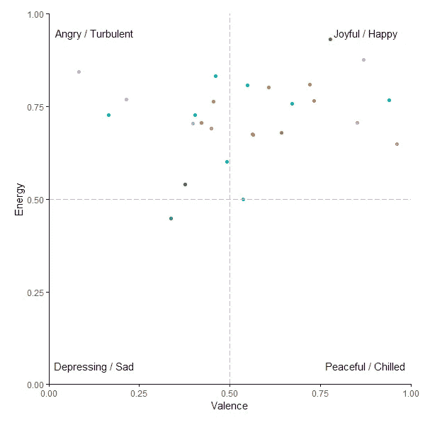
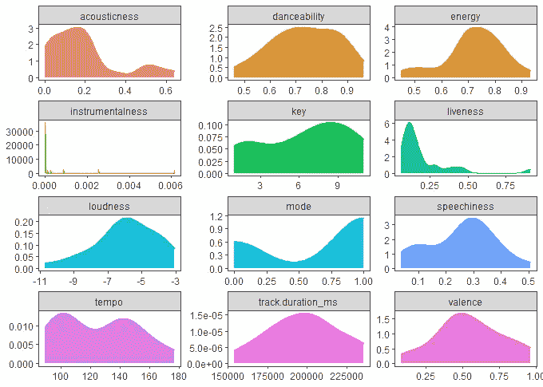
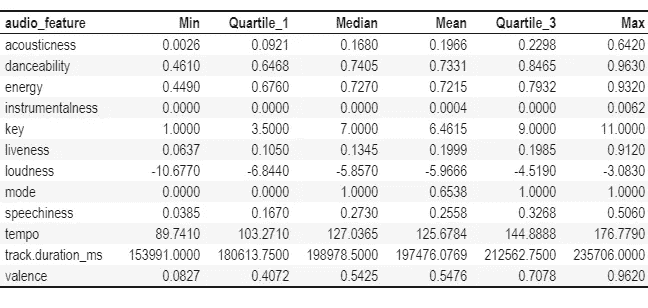
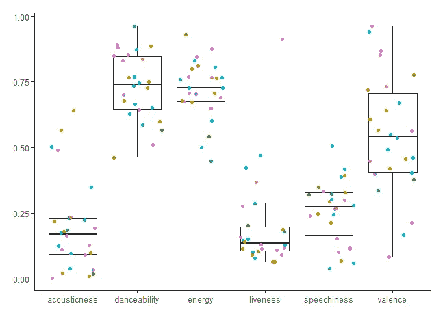
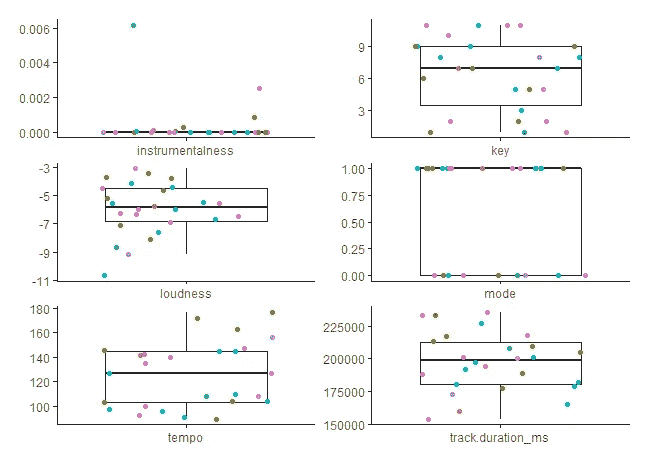
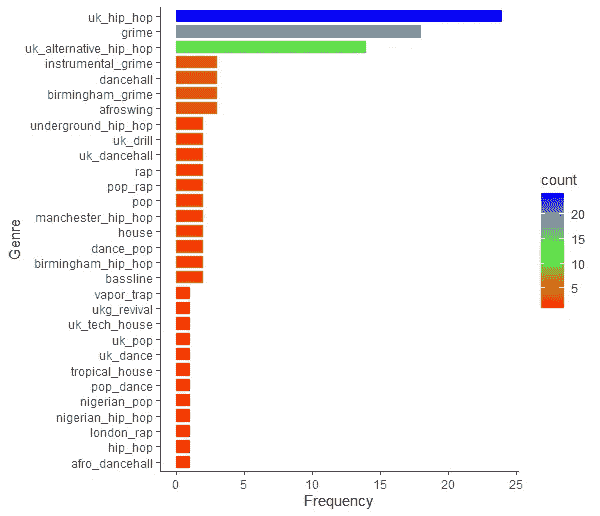
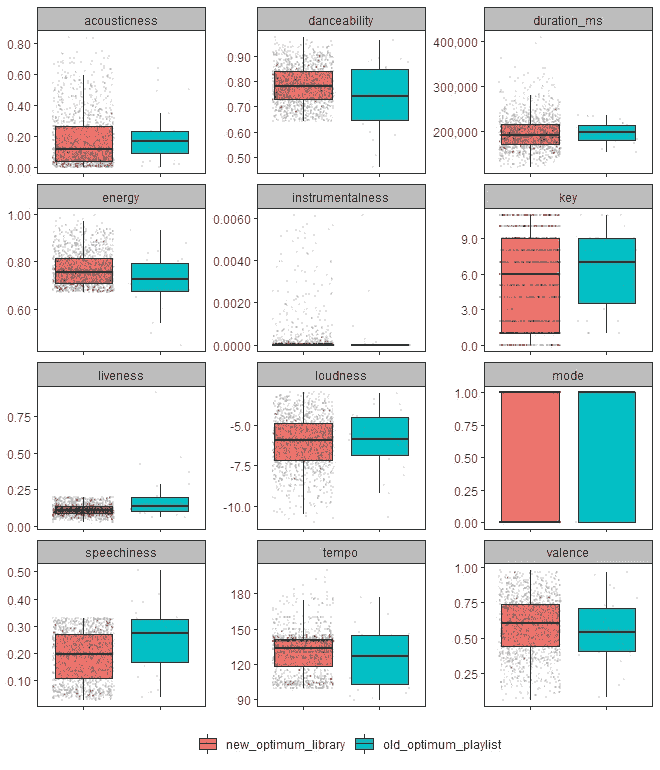
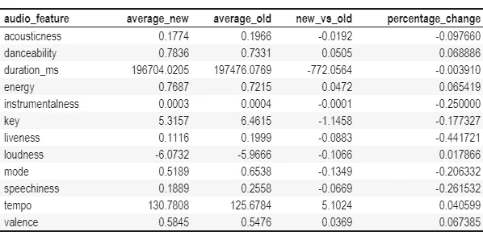
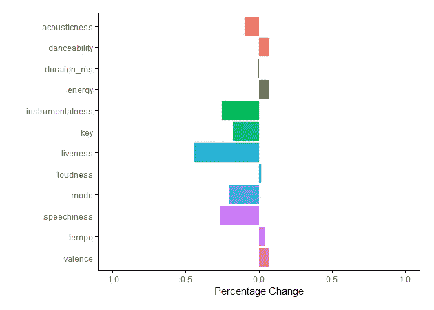

# 我在寻找更好的 Spotify 播放列表，以便在锻炼中使用

> 原文：<https://towardsdatascience.com/my-search-for-a-better-spotify-playlist-to-use-for-workouts-ed8d4a191074?source=collection_archive---------39----------------------->

## *我如何使用“spotifyr”创建新的健身播放列表，该列表基于我当前健身播放列表中确定的特定音频功能*

# 介绍


照片由[德鲁·格拉汉姆](https://unsplash.com/@dizzyd718?utm_source=medium&utm_medium=referral)在 [Unsplash](https://unsplash.com?utm_source=medium&utm_medium=referral) 拍摄

如果你像我一样，那么你对健身和锻炼的享受将与你对音乐的热爱紧密相连。我相信孔子曾经说过*“音乐产生一种人类自然不能没有的快乐”*，鉴于我在激烈运动时经常经历的真正的不适，我经常需要音乐的独特快乐来淹没消极的精神沉思，这种沉思反复鼓励我放弃运动，过一种更安静和闲散的生活。

不要误解我，我确实喜欢锻炼和训练(尤其是在最后)，然而，我有时会想，如果我听不到我的音乐，感受不到令人愉快的旋律或引人入胜的低音线带来的温暖保证，我是否会同样喜欢我的锻炼。我不会考虑不带耳机和一个足够有条理的播放列表去跑步，我也不会考虑在没有响亮的音乐和访问我的 Spotify 帐户的情况下锻炼。音乐是我锻炼的阳之于阴。

现在你明白了我的锻炼强度和动机是如何与我听的音乐紧密相关的，你可能会更好地理解我这个项目的动机；因为，尽管 Spotify 在应用程序和网络播放器中提供了合理的搜索功能，但我目前不知道有什么功能可以让我根据特定的音频特征(如速度和能量)精确地过滤歌曲。

我知道 Spotify(和其他公司)为锻炼和其他情况提供特色播放列表，但是，因为我没有读过任何关于用于确定这些播放列表中有哪些曲目的具体标准的文档，所以我想我会通过分析我当前锻炼播放列表的音频功能来定义我自己的新锻炼播放列表的标准，来尝试一下。

在这篇文章中，我描述了我如何通过遵循数据驱动的方法和使用 Charlie Thompson 的神奇的`spotifyr`包来创建一个特定的声音播放列表库。该软件包允许您深入研究您的 Spotify 收听习惯，并提供与您最喜爱的歌曲和艺术家相关的详细信息。我发表这篇文章，希望我分享的任何信息都可能对那些新手、`spotifyr`的其他用户以及英国音乐的支持者有所帮助。

这篇文章的结构如下:

1.  在 R/RStudio 中设置`spotifyr`包；
2.  我如何分析我当前的健身程序播放列表，以确定我理想的健身程序播放列表所需的曲目数据和音频特征；
3.  使用`spotifyr`在 Spotify 中搜索并过滤音频特征符合我所选锻炼标准的歌曲；
4.  我是如何创建多个锻炼播放列表并上传到我的 Spotify 库中的；和
5.  我对新锻炼播放列表的最初感受和反应。

# 初始设置


亚历克斯·格鲁伯在 [Unsplash](https://unsplash.com?utm_source=medium&utm_medium=referral) 上的照片

为了避免网上重复的内容，我将避免简单地重复设置和初始化`spotifyr`的最基本方面的操作方法。对于如何安装和设置`spotifyr`的概述，Charlie Thompson(软件包的开发者)有一个特定的网页，详细说明了安装和认证软件包所需的步骤，位于[这里](https://www.rcharlie.com/spotifyr/)。

除了查理的`spotifyr`网页，我还发现以下网站有助于设置和初始灵感:

*   [用 R 和“spotifyr”探索你在 Spotify 上的活动:如何分析和可视化你的流媒体历史和音乐品味](/explore-your-activity-on-spotify-with-r-and-spotifyr-how-to-analyze-and-visualize-your-stream-dee41cb63526)；
*   [用数据找最愤怒的死缠烂打宋:一个暗号](/angriest-death-grips-data-song-anger-code-through-r-ded3aa2fe844)；和
*   [用 R 探索 Spotify API:初学者教程，作者:初学者](https://msmith7161.github.io/what-is-speechiness/)

在开始这个项目之前，我用下面的代码初始化了需要的 R 包:

```
library(spotifyr)
library(tidyverse)
library(scales)
```

# 分析我当前的最佳锻炼播放列表


诺贝特·布杜茨基在 [Unsplash](https://unsplash.com?utm_source=medium&utm_medium=referral) 上的照片

我首先需要了解 Spotify 音频功能，这些功能定义了我目前认为的剧烈或高强度锻炼的最佳聆听体验。幸运的是，我有一个代表性的播放列表来分析(“我的最佳播放列表”)，由 26 首曲目组成，当我需要一致的高节奏节奏和响亮的低音时，我会默认使用它们。

## 查找我的最佳播放列表的 Spotify ID

我使用函数`get_my_playlists(limit = 50)`来检索我的库中的前 50 个播放列表。从产生的数据帧中，我能够定位我的最佳播放列表的`id`，我将其命名为`my_optimum_gym_playlist_id`。如果您的媒体库包含超过 50 个播放列表，您还需要包含`offset = 50`来检索您的媒体库中的下 50 个播放列表。

## 了解我的最佳音频特性

现在我有了最佳播放列表的相关 Spotify ID，我使用函数`get_playlist_audio_features()`来检索播放列表中每个曲目的流行度和音频特征的数据帧。对于我的初步分析，我只是想了解播放列表中的每个曲目在典型的价/能量情绪象限模型中的排名，其中:

*   低能/低价歌曲被认为是“悲伤的”或“压抑的”；
*   低价/高能歌曲被认为是“愤怒的”或“动荡的”；
*   高价/低能歌曲被认为是“平和的”或“冷的”；和
*   高价/高能歌曲被认为是“快乐的”或“欢乐的”。

使用上面的代码，我能够直观地看到我的最佳播放列表中的每首歌曲在情感上的排名:



正如我们从上面的散点图中看到的，我的最佳播放列表不包含令人沮丧或冰冷的歌曲，所有歌曲(除了一首)的“能量”值都在 0.50 以上。正如我所料，我的最佳播放列表包含高能轨道。Spotify 表示“*充满活力的歌曲感觉起来很快、很响、很吵”，*这是一种解脱，因为这个特定的播放列表应该代表我在高节奏和高强度训练中选择的歌曲。

在使用情绪象限模型对我的最佳播放列表中的每个曲目进行可视化后，我想了解该播放列表是否有其他突出的特征，可以用作基准来创建我的理想锻炼播放列表库。

通过使用上面的代码，我能够将原始的`my_optimum_gym_playlist_audio_features`数据帧转换成长格式，然后我可以用它来创建密度图和总结音频特征数据的表格。



在查看了图表和汇总表后，我注意到了我的最佳播放列表中的以下特征:

*   音轨的速度在 89 bpm 以上；
*   响度低于-3 分贝；
*   仪器化程度小于 0.0062；
*   Key 是一个从 1 到 11 的整数值；
*   轨道模式为 1 或 0；
*   音轨的声音、舞蹈性、能量、活性、语速和效价范围从 0 到 1；和
*   26 首曲目中有 2 首是 2018 年之前发布的。

虽然密度图提供了数值分布的良好视觉效果，但我也为每个音频特性创建了一个箱线图，这样我就可以更好地显示与我的最佳播放列表中每个音轨相关的数值。给定不同音频特征的值的变化和范围，为了显示我的初始箱线图可视化，我排除了“速度”、“音量”、“键”、“模式”、“乐器性”和“音轨持续时间 _ 毫秒”。

我使用上面的代码创建了以下六个选定音频特征的箱线图:



*有关每个音频功能代表什么的更多信息，请访问 Spotify 开发者页面* [*此处*](https://developer.spotify.com/documentation/web-api/reference/#object-audiofeaturesobject) *。*

然后，上面的代码用于创建其他六个音频特征的第二个箱线图可视化:



## 我更喜欢哪种类型？

既然我已经分析了我的最佳播放列表的 Spotify 音频特性，我还需要了解分配给播放列表中每个艺术家的流派。

使用上面的代码，我能够总结并创建一个条形图，显示我的最佳播放列表中分配给每个艺术家的流派:



看着上面的图表，任何认识我的人都不会对这个结果感到惊讶，因为尽管我喜欢美国嘻哈音乐，但我目前更喜欢高强度锻炼时英国嘻哈音乐和 grime 音乐的声音。套用伟大的鲍勃·马利的话，当音乐击中我时，我感觉不到痛苦！只是有一些关于英国曲调和他们的节拍。

## 通过分析我当前的 Spotify 锻炼播放列表获得的初步见解

现在我已经分析了我的最佳播放列表的音频特征，这个过程的下一部分是决定适当的阈值(最小/最大)。

在查看了各种图表、表格和数据框后，我决定为新的锻炼轨迹选择以下最佳标准:

*   能量> 0.67；
*   可跳舞性> 0.64；
*   节奏> 100 bpm
*   曲目发布日期> 2017–12–31；
*   仪器性< 0.0062；
*   活性< 0.20；
*   语速< 0.33；
*   120000 毫秒
*   -11 分贝

我已经分析了我的代表性锻炼播放列表，并定义了 Spotify 音频功能，以将哪种类型的歌曲包含在我的新锻炼播放列表中，现在我必须在 Spotify 中搜索并过滤符合我的最佳标准的英国嘻哈、grime 和英国备选嘻哈歌曲。

# 在 Spotify 中搜索新的训练曲目


由[内森·杜姆劳](https://unsplash.com/@nate_dumlao?utm_source=medium&utm_medium=referral)在 [Unsplash](https://unsplash.com?utm_source=medium&utm_medium=referral) 拍摄的照片

在开始这个潜在的耗时的 Spotify 兔子洞之旅之前，我在网上搜索了旨在解决这个 Spotify 过滤难题的相关网站、内容或应用程序。我偶然发现了 [Nelson](https://nelson.glitch.me/) ，一个网站/应用程序，被 [Engadget](https://www.engadget.com/2018-02-05-spotify-recommendation-tech-nelson-custom-playlists.html?guccounter=1&guce_referrer=aHR0cHM6Ly93d3cuZ29vZ2xlLmNvbS8&guce_referrer_sig=AQAAAHPUHHAaE4XcwlMVxQEl0tBjVCMkKkLWz4pqNsTLlHdrSzU9HMkdUSaAZtIpisaKFyQ8HN4C288gAJdldZo-U6axEUouximD6jZBpiSdgoa0jlUJrhefZtEtfsjU9cLQcN5ocqAzJMKqP1ovxVXP1sa9cJao4di1zA43_-v_UQEp) 描述为*“一个内部项目，感觉更像是一个玩具，而不是一个确切的工具或适当的功能”，*在测试了几次应用程序后，我不得不同意 Engadget 的观点，尽管这个网站很有趣“*瞎玩……有时结果有点令人困惑。”*此外，流派过滤器排除了英国 hip hop、grime 和英国另类 hip hop，这进一步证实了我将不得不潜入 Spotify 的庞大图书馆寻找我想要的歌曲。

## 检索艺术家信息和曲目数据

使用上面的代码，我能够检索 Spotify 的“uk_hip_hop”流派中所有艺术家的数据。在执行代码时，我收到了以下警告消息(这似乎不会妨碍我的分析):

```
In stri_detect_regex(string, pattern, negate = negate, opts_regex = opts(pattern)): argument is not an atomic vector; coercing
```

您会注意到，在我的代码末尾，我包含了以下内容:

```
dplyr::filter(!str_detect(genres, "ukrainian"))
```

我包含了过滤器，因为我注意到最初的数据帧以`c("ukrainian hip hop", "ukrainian pop")`等“流派”为特色。Spotify 似乎也认为“uk_hip_hop”是“ukrainian_hip_hop”的简称？！

在收集了英国嘻哈艺术家的 Spotify 信息后，我接着对“grime”和“uk_alternative_hip_hop”艺术家进行了类似的练习。

按照上面的代码，我添加了另一个过滤器，以排除属于不想要的流派的艺术家，如“grime brasileiro”、“funk ostentacao”和“fluxwork”(我认为这是 grime 音乐的南美衍生物)。

我使用上面的代码组合了三个数据框，创建了一个包含来自三个流派的 771 位相关艺术家的数据框。

下一步是询问 Spotify 与数据帧中每个艺术家的每个曲目(专辑或单曲)相关的音频特征数据。

使用上面的代码，我可以下载 771 位艺术家的所有专辑和单曲数据。我必须包含`insistently(artist_tracks, my_rate)`和`possibly(artist_tracks_insistently, otherwsie = NA)`以允许对 Spotify API 的重复调用，并确保错误将默认为 NA。关于`insistently()`的更多信息，请访问[这里](https://purrr.tidyverse.org/reference/insistently.html)，关于`possibly()`请访问[这里](https://purrr.tidyverse.org/reference/safely.html)。

您应该注意到，下载数据确实需要一些时间，所以如果您计划复制这个项目，您可能需要在这个过程的这一部分找到一些事情来占用您的时间。

## 过滤符合我的最佳锻炼标准的轨迹

现在，我已经从 Spotify 获得了 49，309 首英国 hip hop、grime 和英国 alternative hip hop 曲目的相关曲目信息和音频特征数据，我只需要过滤数据帧中符合最佳标准的曲目。

使用上述代码过滤原始数据帧将磁道数量减少了 96%以上，从 49，309 减少到 1，734。

然后，我使用上面的代码过滤重复的曲目，这样我只保留了每个重复曲目的“explicit”和“album”版本。此外，我还只过滤了英国市场上的歌曲。

在筛选出想要的曲目后，我现在有了一个包含 1，270 首曲目的代表性健身程序库，这些曲目符合我的最佳标准。我将使用这个新的库来创建我的新的最佳锻炼播放列表。

## 音频功能对比(新旧对比)

使用上面的代码，我能够比较我的新的最佳播放列表库和我的初始 26 轨最佳播放列表的音频特性箱线图。



除了箱线图，我还计算了音频特征平均值的差异和百分比变化。

我使用上面的代码创建了一个汇总表和柱状图，显示了每个音频特性平均值的变化和百分比变化。



虽然该图表似乎描述了我的新的最佳播放列表库的平均乐器性、音调、活跃度、模式和语音的相对较大的变化，但是快速回顾我的原始最佳播放列表表明，平均乐器性、活跃度和语音的相对较大的百分比变化是由这些音频特征的低初始值引起的。此外，key 和 mode 的变化是由它们的深奥性质引起的:key 是从 0 到 11 的整数值，而 mode 只有两个值(0 或 1)。

现在，我已经根据我选择的标准创建了一个最佳锻炼库，我需要将我的 1270 首曲目库分成更小、更易于管理的播放列表，上传到我的 Spotify 帐户。

# 向我的 Spotify 资料库添加新的体育锻炼播放列表


照片由 [Erin Song](https://unsplash.com/@erindesong?utm_source=medium&utm_medium=referral) 在 [Unsplash](https://unsplash.com?utm_source=medium&utm_medium=referral) 拍摄

此过程的最后一步是将较大的最佳播放列表库分割成较小的、更易于管理的健身程序播放列表。

我使用上面的代码创建了 26 个随机播放列表，每个列表包含大约 49 首歌曲，都是从我的 1，270 首歌曲的最佳锻炼库中采样的。然后，我可以使用功能`add_tracks_to_playlist()`将新的播放列表上传到我的 Spotify 账户。

我实现了我的目标！根据对当前锻炼播放列表的音频特征的分析，我创建了 26 个新的锻炼播放列表。

# 结论


凯文·麦卡琴在 [Unsplash](https://unsplash.com?utm_source=medium&utm_medium=referral) 上的照片

在将这 26 个新的锻炼播放列表上传到我的 Spotify 图书馆后，我显然想知道这些播放列表是否不错，或者我是否设法上传了只包含古典音乐曲目和摇滚民谣的播放列表。

在我第一次播放“新最佳播放列表 1”时，我感到惊喜！新的播放列表主要由我没有听说过的歌曲组成，在我最初听的 43 首歌曲中，只有 3 首歌曲似乎没有达到我一直在寻找的锻炼强度或“声音”。从那以后，我又听了另外 40 多首来自其他新的锻炼播放列表的歌曲，我很高兴地告诉大家，大多数歌曲都有我一直在寻找的能量和声音。

这让我开始思考。尽管我已经花了时间来分析和定义我的最佳音频功能的标准，但我仍然在某种程度上受 Spotify 内部测量和分类系统的支配。如果 Spotify 对一系列歌曲进行了错误的测量或错误的分类会怎么样？例如，虽然 Spotify 将可跳舞性描述为基于*“音乐元素的组合，包括速度、节奏稳定性、节拍强度和整体规律性”，*但我不清楚 Spotify 如何从其描述中详细描述的属性中具体计算可跳舞性。此外，仅仅因为我喜欢锻炼中的某些音频功能，这并不一定意味着我会喜欢符合这些音频功能的每一首歌曲。

唉，就像生活中的大多数事情一样，没有什么是完美的；然而，如果我偶然发现一首不吸引人的歌曲，我可以简单地把它从播放列表中删除。在接下来的几个月里，我将一边锻炼一边使用我的 26 个新的播放列表；希望我不会花太多时间删除歌曲，而不是健身？！

> 沉默之后，最接近表达不可表达的东西是音乐。

## 结束

感谢您通读。我希望你喜欢我的分析和写作。如果您有任何问题或意见，请联系我们。谁知道呢…如果有足够多的人感兴趣，我甚至会公开一些播放列表…或者创建一个网站，这样其他人也可以做类似的事情？！