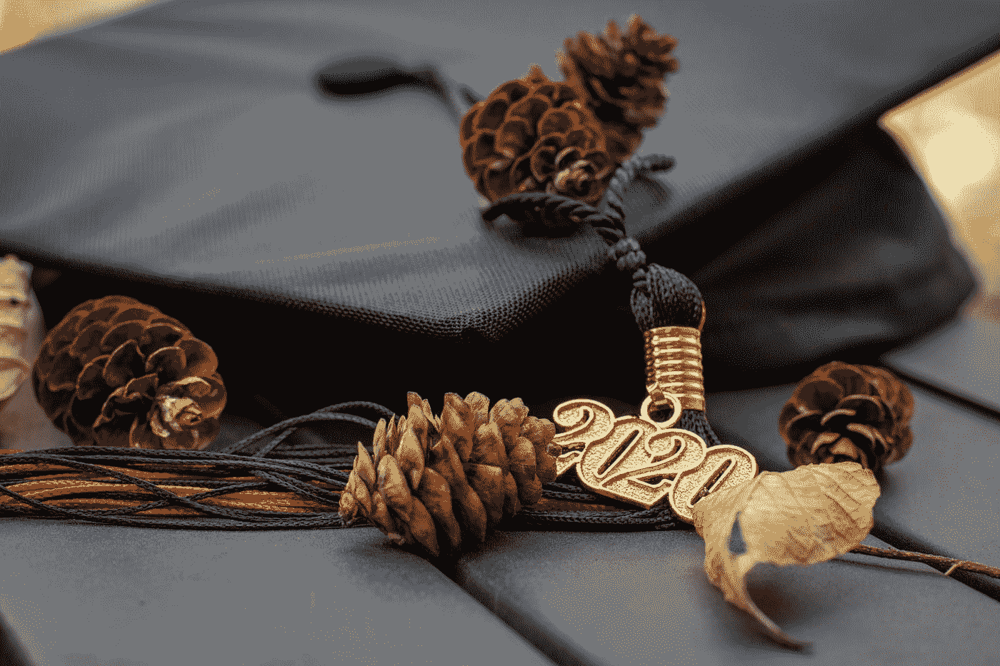
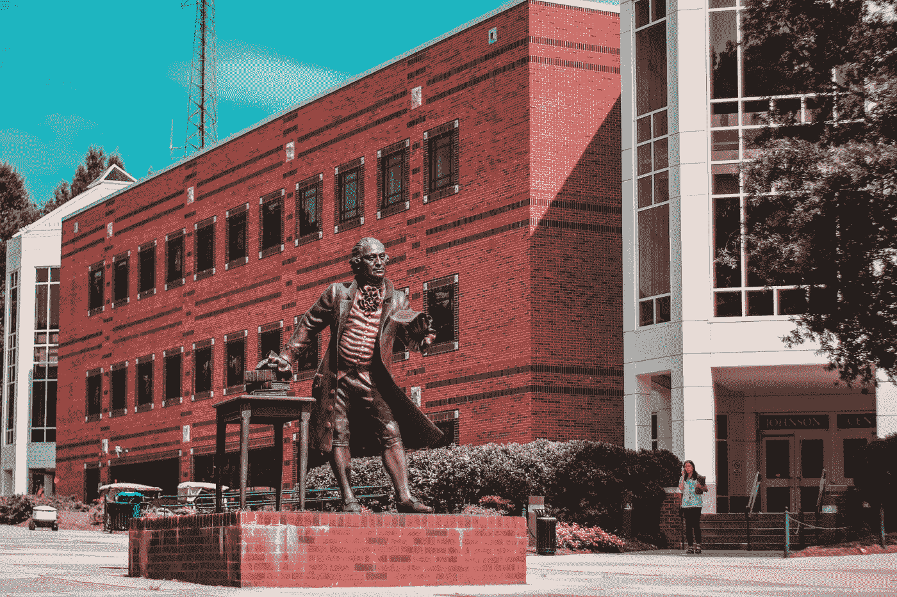

# 我开始接触数据科学

> 原文：<https://towardsdatascience.com/my-start-to-data-science-9ff46431996?source=collection_archive---------37----------------------->

## 我的数据科学本科学位之旅

詹姆斯·彭纳在 [Unsplash](https://unsplash.com?utm_source=medium&utm_medium=referral) 上的照片

2020 年 5 月 23 日是我完成数据科学本科学位的日子。

在过去的四年里，我挣扎了很多，但是我得到了将会伴随我一生的朋友和知识。尽管我还是觉得很奇怪。感觉就像是昨天我拥抱着我的父母告别，开始了我大一的第一天。然而，回忆我的过去不会成为一篇非常引人注目的文章，所以我想带你踏上我在数据科学中寻找激情的旅程。

我想和你谈谈我的一些数据科学课程，以及它是否对我未来的数据科学有所帮助。我也想和你分享一些我帮助其他学生的方法和有效的学习方法。

我还想指出，大学并不便宜。网上有丰富的信息，所以无论是金钱、家庭还是距离，四年制课程并不是每个人的最佳选择。然而，与其他有抱负的数据科学家一起学习和成长的经历对我来说是无价的。

# 我的大学之旅

由 [Avinash Murugappan](https://unsplash.com/@avinash27?utm_source=medium&utm_medium=referral) 在 [Unsplash](https://unsplash.com?utm_source=medium&utm_medium=referral) 拍摄

和一些人一样，我实际上并不是从数据科学家开始的。我进入大学的第一个学期实际上是作为一个计算机工程专业(CPE)。我一直以为我会被一家大公司雇用，成为一名承包商。然而，我正在做的工作让我感到不满足。

2017 年春天，在与一位朋友交谈后，他告诉我大学里一个更新的项目，名为计算数据科学(CDS)。这听起来很有趣，我联系了本科生导师以获得更多信息。他是一位年长的绅士，年轻时在地里干活。他给我看了一些数据科学研究生正在做的研究项目，从那以后，我知道我迷上了数据。

> “数据科学家有点像新文艺复兴时期的人，因为数据科学本质上是多学科的。”
> 
> *―*[*J*](https://www.linkedin.com/in/johnwforeman/)*ohn 领班*

2017 年秋天，我正式从 CPE 转到 CDS。我在该专业的前几堂课涉及计算思维和 Python 及 r 编程。渐渐地，我开始接触班上的其他学生并与之互动。起初，我们只是谈论一般的课程，但最终我们会一起吃午饭，分享不同的项目，在线课程和资源。这是一个很好的环境，帮助我专注于我的学习。所以我强烈建议，尤其是如果你是这个领域的新手，在课堂之外与你的同龄人互动。

到 2018 年秋天，我已经完成了 CDS 课程的一半，并认识了许多新同事。我当时的课程主要集中在数据可视化、数据库和数据挖掘技术上。我也努力在我的系里保持形象，和教授们谈论他们在这个领域的经历。最终，我和其他学生想出了创办一个数据科学俱乐部来推广该领域的想法，到下学期，我们已经完全投入使用了。在我们在一起的时候，我们互相帮助提出关于个人项目的想法，将在线资源正规化，并组成了一个紧密团结的团队。

> “你可以有没有信息的数据，但你不能有没有数据的信息”——丹尼尔·凯斯·莫兰

到 2019 年秋季，我的大多数课程都专注于高级数据建模、机器学习、处理非结构化数据和模拟。通过一名前俱乐部成员，我得以获得一个为学校做一些数据科学工作的机会。这个角色教会了我很多如何成为一名成功的数据科学家，但那是以后的事了。当我设法在当地一家公司找到实习机会时，情况开始好转，我真的很想拿到学位毕业。

2020 年春季将会是一个非常难忘的学期。我不知道我们都将经历一场全球性的疫情，在我知道之前，每个人都不得不呆在家里。像许多其他人一样，没有人知道会发生什么，不幸的是，我曾经的实习被取消了。尽管压力很大，但在几个月内，我完成了本科的一天。

# 数据科学课程

耶稣·希拉里奥·h .在 [Unsplash](https://unsplash.com?utm_source=medium&utm_medium=referral) 上的照片

以下是我对数据科学项目的一些想法

*   建模与仿真 I:这门课主要教授 Python 的基础知识和算法思维技能的发展。它介绍了基本的软件概念，如测试、调试和数据类型。
*   建模与仿真 II:在对各种科学应用建模的同时，更加关注 Python 中的高级技术。这个课程确实帮助我熟悉了非结构化数据类型(图像、声音、文本)。
*   基于代理的建模和仿真简介:本课程主要提供基于代理的建模的背景知识。学习了很多不同的模型，教授也很棒，但是在我的数据工作中不要真的使用 Netlogo。
*   计算和数据科学介绍:这门课主要关注用 r 进行数据分析。我对使用 RMarkdown 非常熟悉，我们对 Rshiny 也有一个简短的介绍。了解一些数据科学的历史背景也很不错。
*   数据可视化:本课程主要关注数据可视化的最佳实践。我们讨论了诸如配色方案、完形原理、用户控制等主题。我们可以自由选择任何我们认为效果最好的可视化软件，但课程主要集中在 Tableau 上。
*   数据库:我们学习了 SQL 的基础知识，同时学习了数据库系统的基础知识。我们主要练习开发复杂的查询和建立数据库。
*   科学数据挖掘/机器学习:这实际上是两个课程。我把他们分在了一起，因为他们是由同一个教授教授的，基本上是按系列教授的。这堂课真的很酷，因为我们深入探讨了让我对数据科学感到兴奋的话题。这些包括监督学习，非监督学习，强化学习，推荐系统，神经网络，并谈到了很多历史。这位教授刚从视频游戏行业的数据科学领域出来，所以他给课堂带来了很多有趣的话题。
*   数学和统计:最后，程序调用了单变量和多变量统计以及 Calc (I，II，III)和线性代数。主要用作职业生涯的基础课。

# 结论

这就是我四年的大学生活，总结成一篇文章！当然，除了无数个小时的在线学习、工作和学习新资源之外，这只是一个简短的概要。所以我就回到之前的问题，“拿个数据科学的本科学位值得吗？”我的答案是，老实说，这取决于你如何学习，以及一个项目提供了哪些资源来满足你的具体目标。

如果你的项目需要你参与很多实践项目，并且是一个既定的项目，那么我会说去做吧。除了得到一张证明你合格的纸之外，我看到的最大好处是在一个以数据为导向的环境中与有相似目标的人在一起。这帮助我发展了更多的软技能，并获得了分享不同想法和在该领域发挥创造力的信心。

总的来说，我对本科阶段所教的课程感到满意。我目前正在研究生院读第一年，我一定会让每个人都知道将来会发生什么！

**特别感谢我的同学 Jordan，他让我进入了数据科学领域，感谢我的室友和女朋友，感谢他们不断的鼓励，最后感谢我的导师 Joe，他让我走过了我的旅程！**

# 感谢您的阅读！

[库珀·巴雷特生存指南毕业 GIF](https://giphy.com/gifs/guide-to-real-life-fox-congratulations-cooper-barrett-3oEdv3jDLP7XcpL2Wk)