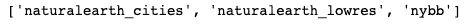
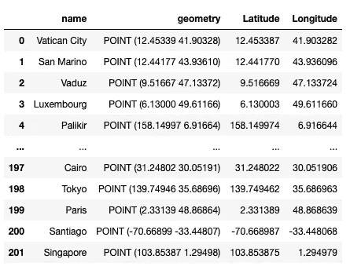
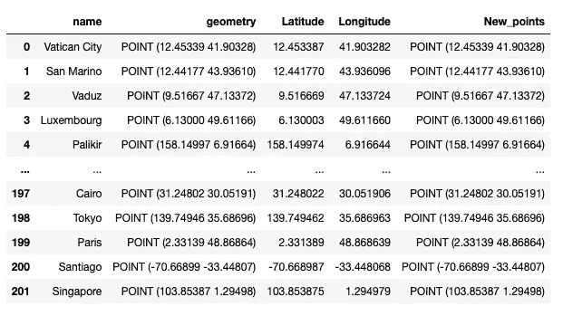
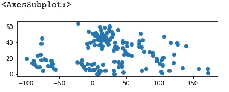
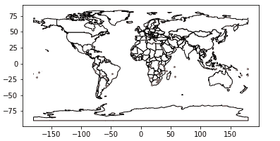
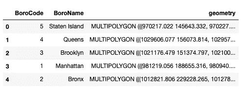
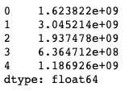

# 我的四大 GeoPandas 功能:一个实用的故事

> 原文：<https://towardsdatascience.com/my-top-4-geopandas-functions-a-practical-story-ed375b76c686?source=collection_archive---------21----------------------->

六月在 [Unsplash](https://unsplash.com?utm_source=medium&utm_medium=referral) 拍摄的

在过去的几个月里，我一直在研究 GeoPandas，它很快成为我最喜欢的 Python 包之一。就个人而言，我对数据科学如何应用于城市规划、地理空间信息和技术等领域很感兴趣。对于这些，GeoPandas 特别有用，因为它允许用户操作地理数据并从中提取有价值的信息。在这个故事中，我将根据我的学习经验，用一个实际的例子向您展示我在 GeoPandas 中的 4 个顶级函数。

## 1.获取可用数据集

首先，如果您刚刚开始使用 GeoPandas，您将需要一些易于访问的数据集。这可以通过使用“.“可用”功能如下:

这会产生以下结果，每个结果都是一个数据集:

## 2.来自 xy 的点

如果您发现自己正在处理地理空间数据，它可能并不总是适合您立即开始处理的格式。一个这样的例子是当您的数据包含在纬度和经度列中，并且您需要它们在点几何中。幸运的是，GeoPandas 提供了一个函数来快速将这些数据转换为点格式。这个函数叫做“points_from_xy”。让我们来看看它的实际应用:

使用城市的数据集，让我们分解 x 和 y 坐标中的点几何列，然后将它们作为列添加到数据框中:

这是新的数据框架:

现在，我们可以使用“points_from_xy”函数将纬度和经度转换回点几何:

结果如下:

## 3.制作地图

使用地理空间数据的很大一部分是能够在地图中有效地可视化它们。GeoPandas 允许对用户表示地图数据的方式进行大量细化，包括添加不同的地图图层和处理缺失数据。在这一部分，我们来看看如何制作一个多层地图。首先，我们需要创建一个基础层。假设我们将着眼于仅位于南半球的城市。让我们过滤掉这些数据，然后使用 geopandas.plot 绘制它:

现在，让我们用一张世界地图覆盖这些城市，该地图在 GeoPandas 可用数据集中提供。我们将调整国家边界的颜色，这些国家的填充，以及城市点的颜色和大小:

现在，我们有了一张分层地图，可以看到世界南部的一些城市和国家的边界。

## 4.计算面积

对于第四个也是最后一个函数，我选择了“area”函数。这个函数顾名思义就是计算多边形和多重多边形等形状的面积。这在处理几何数据时非常有用，我们将在下面看到。

对于这个例子，让我们使用“nybb”数据集，它包含关于纽约行政区的信息。如下图所示，数据框包括代表纽约每个区域形状的多重多边形:

从这里开始，计算每个多边形的面积非常简单:

以下是输出:

让我们使用此结果，并使用 GeoPandas 绘图功能绘制行政区，使用图例按区域对其进行着色:

现在，我们已经完成了 4 个函数，我希望您也受到启发，开始使用 GeoPandas 并进一步探索它。感谢您的阅读，如有任何问题，请联系我！