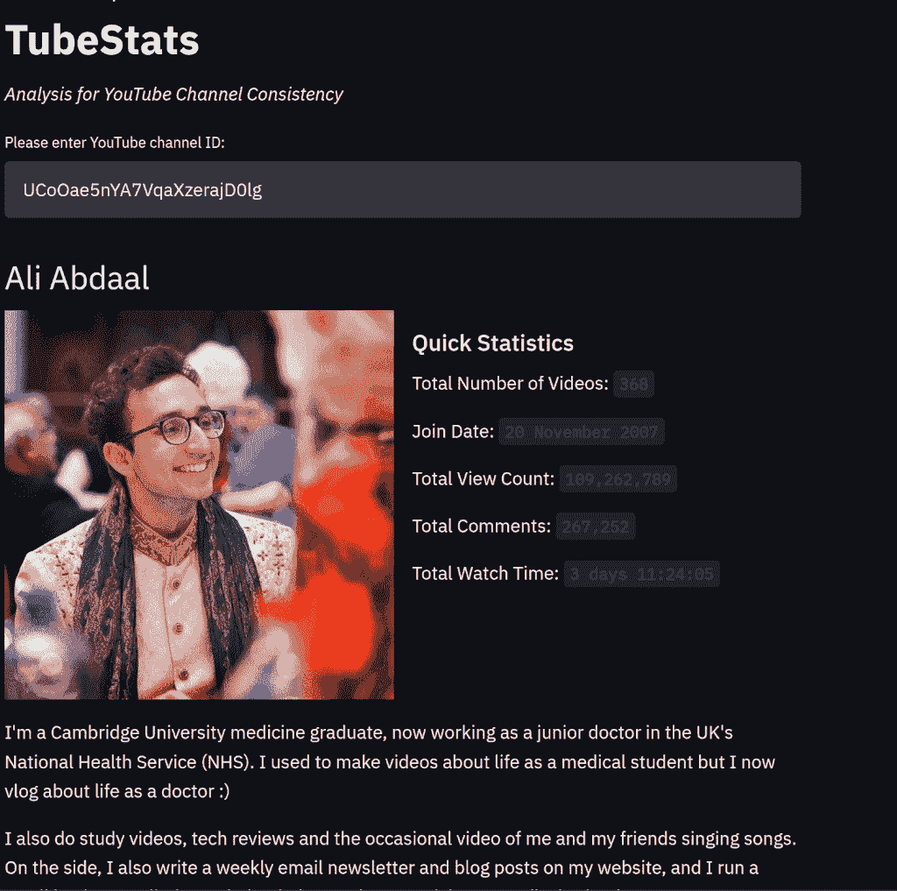
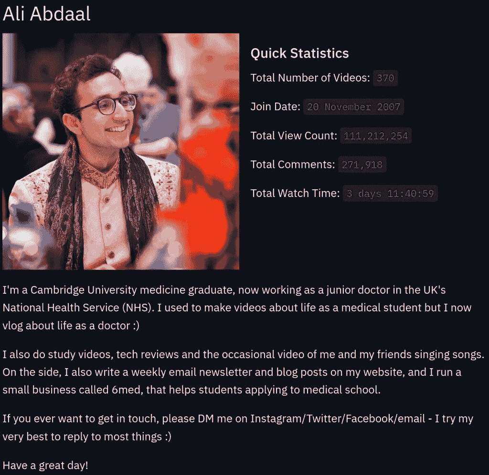
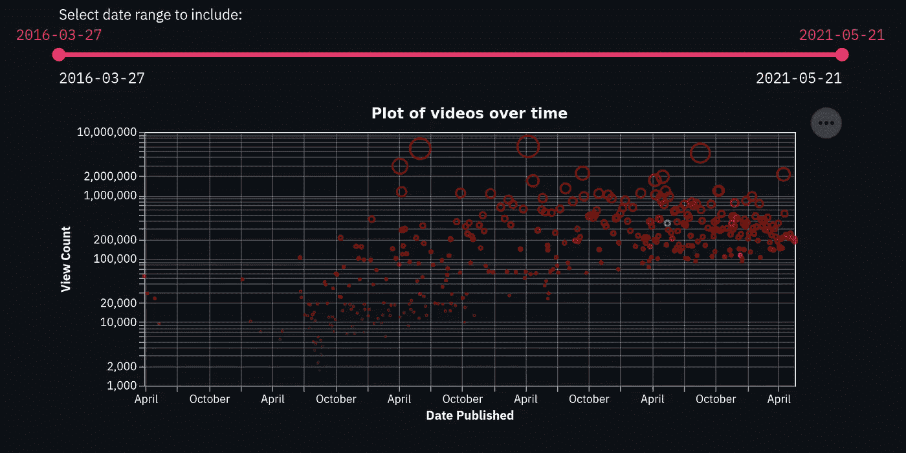
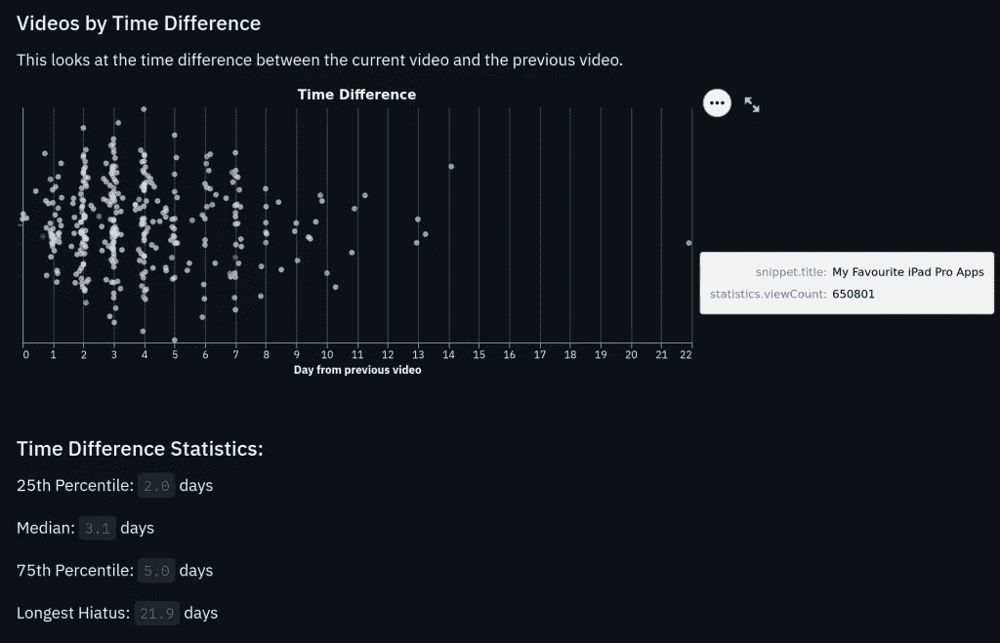
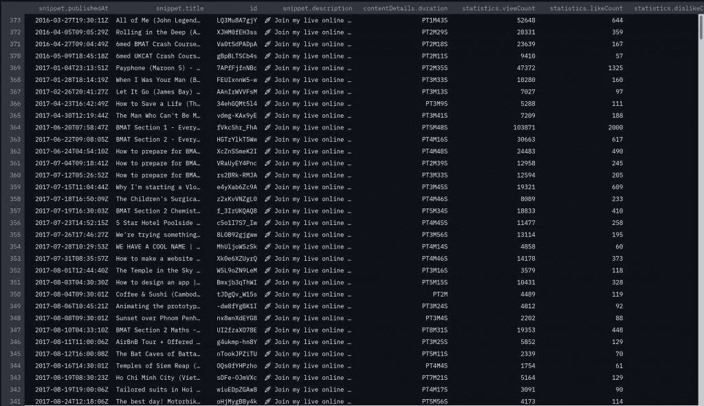
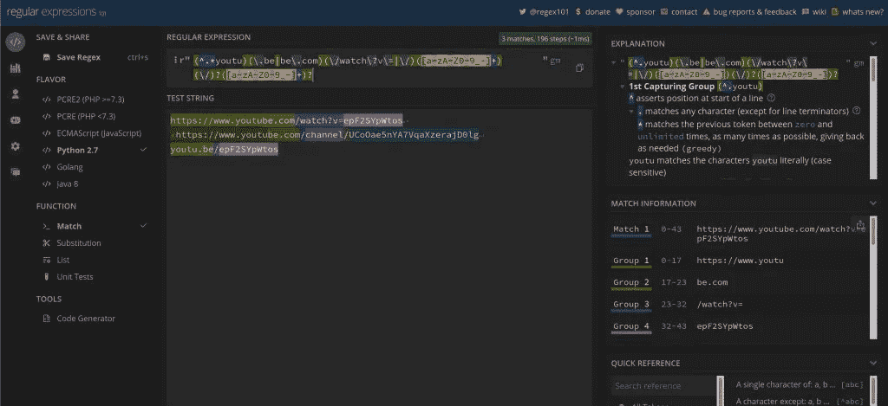

# 我的 TubeStats 应用程序(英尺。阿里·阿卜杜勒)

> 原文：<https://towardsdatascience.com/my-tubestats-app-ft-ali-abdaal-48dfc982c7ed?source=collection_archive---------44----------------------->

## 在 YouTube 频道中寻找一致性


照片由[绍博·维克多](https://unsplash.com/@vmxhu?utm_source=medium&utm_medium=referral)在 [Unsplash](https://unsplash.com?utm_source=medium&utm_medium=referral) 上拍摄

拥有超过 1 亿的浏览量和 100 万的订阅者，Ali Abdaal 绝对是一个建议建立一个成功的 YouTube 频道的人。除了给有抱负的 YouTuber 今天就开始的建议之外，他还鼓吹一致性。

这就是这个应用程序的动机所在。问题是:阿里·阿布达尔的 YouTube 频道有多稳定？那其他 YouTube 频道呢？

我们将看到使用 TubeStats 来回答这个问题。我们还将介绍它是如何工作的。我还会提供我的个人倾向以及我未来的计划。

app 链接:[https://www . tubestats . app](https://www.tubestats.app)

github:[https://www.github.com/shivans93/tubestats](https://www.github.com/shivans93/tubestats)



作者的动画 gif

# TubeStats 做什么？

该应用程序接受用户输入。这可以是:

*   频道 ID(例如`UCoOae5nYA7VqaXzerajD0lg`)，
*   链接到通道(如`[https://www.youtube.com/channel/UCoOae5nYA7VqaXzerajD0lg](https://www.youtube.com/channel/UCoOae5nYA7VqaXzerajD0lg,)`、[、](https://www.youtube.com/channel/UCoOae5nYA7VqaXzerajD0lg,)
*   链接到感兴趣频道的视频(如`https://www.youtube.com/watch?v=epF2SYpWtos`，或
*   视频 ID(例如`epF2SYpWtos`)。

几分钟后，它将生成该频道的汇总统计数据。示例包括总视频计数和总观看时间，如下所示。



作者图片

这里，我们还有渠道头像图像以及渠道上提供的描述。

接下来，我们有一个图表，总结了频道中的所有视频。



作者图片

该图涉及发布时间对查看次数的自然对数。y 轴有对数刻度，因为数据偏向尾部。这是由于视频的“病毒”性质。如果我们使用线性访问，那么大多数视频将在底部附近，只有少数在顶部附近。

圆圈的颜色代表视频的喜欢-不喜欢比率。圆圈的大小与其绝对视图数有关。

日期范围可以更改。在这个例子中，我改变了日期范围，因为 Ali Abdaal 在 2017 年 7 月开始更加认真地对待他的渠道。

另一个图表显示了视频之间的天数。例如，在上面选择的日期中，“我最喜欢的 iPad Pro 应用程序”视频的最长不活动时间不到 22 天。从视频的日期来看，这是在节日期间。



作者图片

平均来说，Ali Abdaal 能够每 3 天发布一个视频，其中大多数(75%)在 5 天内发布。

最后，TubeStats 提供了一个在频道中观看次数最多的视频列表，以及喜欢/不喜欢比率最低的视频列表。

# TubeStats 是如何工作的？

主要工作部件:

1.  YouTube 数据 API
2.  `pandas`
3.  `streamlit`
4.  赫罗库

我还把这分成了几个障碍，并提供了克服它们的解决方案。

## 障碍#1:我如何设置我的开发环境？

我用的是 Linux。建立我们的开发环境对于我们编码的生产力是必不可少的。

我们从创建目录开始。接下来，我们创建一个虚拟环境来管理我们的包，而不会干扰其他项目。最后，我们初始化 git 来跟踪变化，并允许与世界共享我们的代码。

```
$ mkdir tubestats
$ cd tubestats$ python3 -m venv venv
$ source venv/bin/activate
$ (venv)$ git init
```

## 障碍 2:我们如何访问视频信息？

我们可以为了观看次数、评论次数等而放弃每一个视频。这需要很长时间。幸运的是，我们可以使用 [YouTube 数据 API](https://developers.google.com/youtube/v3/) 。这提供了对 YouTube 视频和频道的统计数据的简单访问。要访问这个，我们必须设置我们的[谷歌云控制台平台](https://console.cloud.google.com/apis/dashboard)。

由此，我们创建了一个“新项目”。我们激活 YouTube 数据 API v3 应用程序。最后，我们创建凭证([单击此处了解更多信息](https://shivansivakumaran.com/data-science/my-first-data-project-exploring-daniel-bourkes-youtube-channel-part-1/#YouTube_Data_API))。这些步骤将提供访问 YouTube 数据 API 的关键。

## 障碍 3:我们如何存储密码和 API 密匙？

我们想分享我们的代码，但不是我们的密码和 API 密匙。我们如何做到这一点？

我们可以用一个[第三方包:](https://pypi.org/project/python-dotenv/) `[python-dotenv](https://pypi.org/project/python-dotenv/)`。

这很重要，这样我们就可以在本地访问数据。我们将会看到，当我们使用 Heroku 推进网络服务时，我们必须使用不同的方法。

我们可以将密钥存储在一个`.env`文件中，并且我们可以将这个文件添加到`.gitignore`中，这样它就不会被共享。

```
.env file
 APIKey=xxxAPIKEYherexxx
```

我们安装了允许访问 YouTube API 的模块。我们在激活虚拟环境的同时，使用 pip 来实现这一点。

```
$ (venv) pip install google-api-python-client
```

## 障碍 4:我们如何获得视频统计数据？

如果我们有一个频道 ID，我们可以用它来获得一个播放列表，其中包含从该频道上传的所有视频的 ID。然后我们可以调用视频 ID，然后获得我们感兴趣的统计数据。

```
def get_video_data(self) -> pd.core.frame.DataFrame: ... while True:                     
            # obtaining video ID + titles                       
            playlist_request = self.youtube.playlistItems().list(                    
                    part='snippet,contentDetails',                 
                    maxResults=50, # API Limit is 50                  
                    pageToken=next_page_token,                    
                    playlistId=upload_playlist_ID,                
                    )                 
            playlist_response = playlist_request.
            # isolating video ID
            vid_subset = [ vid_ID['contentDetails']['videoId'] for vid_ID in playlist_response['items']
            # retrieving video ID
            vid_info_subset_request = self.youtube.videos().
                part='snippet,contentDetails,
                id=vid_subset
                )       

            vid_info_subset_response = vid_info_subset_request.    
            video_response.append(    
            # obtaining page     
            next_page_token = playlist_response.get('nextPageToken') 
            # get method used because token may not exist
            if next_page_token is 
                break
        df = pd.json_normalize(video_response, 'items')       
        return df
```

这里我们调用 API，但是一次只能获得 50 个视频 id。这要归功于分页。每次调用时，如果超过 50 个视频，则提供一个页面令牌。页面标记指向下一页。如果页面令牌是返回`None`，这意味着所有的 id 已经用尽。我们使用 while 循环来获取视频 id。一旦我们不再有页面标记，while 循环就会停止。

我们将这个输出附加到一个 python 列表中，这是一个 JSON 格式的字符串列表。我们将这些信息存储在一个`pandas` `DataFrame`中。我们能够做到这一点要感谢一个内置函数`json_normalize()`。由此，我们有了数据框架。



## 障碍 5:如何组织代码？

既然我们的代码已经开始腾飞，将所有这些代码放入一个文件变得越来越困难。这是我们为组织使用不同文件和目录的地方。

```
├── data
 │   ├── channel_data.pkl
 │   └── video_data.pkl
 ├── LICENSE
 ├── Procfile
 ├── README.MD
 ├── requirements.txt
 ├── setup.sh
 ├── tests
 │   ├── **__init__**.py
 │   ├── test_settings.py
 │   ├── test_youtube_api.py
 │   ├── test_youtube_data.py
 │   └── test_youtube_parser.py
 ├── tubestats
 │   ├── __init__.py
 │   ├── youtube_api.py
 │   ├── youtube_data.py
 │   └── youtube_parser.py
 └── youtube_presenter.py
```

需要注意的主要子目录是`tubestats`,它包含访问 API 的 python 源代码，处理数据，并生成底层图形来呈现数据。`tests`包含用于测试`tubestats`模块的测试代码。

最后，`youtube_presenter.py`是呈现代码的东西。我们看到了一些其他的文件，我们将在后面处理。

## 障碍 6:如何测试代码？

确保我们的代码工作是很重要的。在这种情况下，我使用`pytest`。下面是测试上述`get_video_data()`功能的一个例子。

```
from tubestats.youtube_api import create_api, YouTubeAPI
 from tests.test_settings import set_channel_ID_test_case from pathlib import Path import pytest import googleapiclient
 import pandas def test_create_api():
     youtube = create_api()
     assert isinstance(youtube, googleapiclient.discovery.Resource) @pytest.fixture()
 def youtubeapi():
     channel_ID = set_channel_ID_test_case()
     yt = YouTubeAPI(channel_ID)
     return yt def test_get_video_data(youtubeapi):
     df = youtubeapi.get_video_data()
     assert isinstance(df, pandas.core.frame.DataFrame)

     # saving video data to save API calls for later test 
     BASE_DIR = Path(**file**).parent.parent
     df.to_pickle(BASE_DIR / 'data' / 'video_data.pkl')
```

在这种情况下，我们导入源代码，以及相关的模块。我们使用`pytest.fixture()`装饰器。这允许我们重用我们在测试用例中提取的数据的结果。我们“腌制”数据，这样我们就可以使用它，而不是为其他测试进行更多的 API 调用。

我可能比`isinstance`做得更好，但这也是必须的。

如果我们在终端中运行`pytest`，这将测试我们代码的功能。

## 障碍#7:如何显示这些数据以供他人交互？

这是通过`altair`的组合来完成的，它为我们提供了交互式的图形。此外，我们使用`streamlit`来显示这些图形并允许交互。

以下代码创建了一个图表，显示一段时间内的所有视频。

```
import altair as alt
 def scatter_all_videos(self, df: pd.core.frame.DataFrame) -> alt.vegalite.v4.Chart:
df_views = df
         c = alt.Chart(df_views, title='Plot of videos over time').mark_point().encode(
                 x=alt.X('snippet.publishedAt_REFORMATED:T', axis=alt.Axis(title='Date Published')),
                 y=alt.Y('statistics.viewCount_NLOG:Q', axis=alt.Axis(title='Natural Log of Views')),
                 color=alt.Color('statistics.like-dislike-ratio:Q', scale=alt.Scale(scheme='turbo'), legend=None),
                 tooltip=['snippet.title:N', 'statistics.viewCount:Q', 'statistics.like-dislike-ratio:Q'],
                 size=alt.Size('statistics.viewCount:Q', legend=None)
         )
         return c
```

接下来，我们可以显示这个图表，并能够编辑日期。

```
import streamlit as st def date_slider(date_end=datetime.today()):
         date_start, date_end = st.slider(
                 'Select date range to include:',
                 min_value=first_video_date, # first video
                 max_value=last_video_date, #value for date_end
                 value=(first_video_date , last_video_date), #same as min value
                 step=timedelta(days=2),
                 format='YYYY-MM-DD',
                 key=999)
         return date_start, date_end date_start, date_end = date_slider()
     transformed_df = youtuber_data.transform_dataframe(date_start=date_start, date_end=date_end) 
     c = youtuber_data.scatter_all_videos(transformed_df)
     st.altair_chart(c, use_container_width=True)
```

这是我们在本地运行程序时看到的，`streamlit run youtube_presenter.py`:


## 障碍 7:我如何炫耀？

坐在我们的电脑上没有任何意义。我们需要与世界分享这一点。Github 可以用来共享代码，但是我们当中的非技术人员呢？

解决办法是用 [Heroku 来主持](https://www.heroku.com/)。

首先，我们要做的是在 Heroku 上创建一个帐户。一个免费账户就够了。

我们已经确保代码工作，我们可以把它推到 GitHub 上。接下来，我们创建一个`requirements.txt`、`setup.sh`和`Procfile`。

`requirements.txt`文件将包含外部库。我们可以使用命令:

```
$ (venv) pip freeze > requirements.txt
```

创建了`setup.sh`文件:

```
mkdir -p ~/.streamlit/echo "\\
[server]\\n\\
headless = true\\n\\
port = $PORT\\n\\
enableCORS = false\\n\\
\\n\\
" > ~/.streamlit/config.toml
```

然后`Procfile`告诉 Heroku 这是一个 web 应用程序。它还指示`setup.py`运行文件以及使用`streamlit`运行我们的代码。

```
web: sh setup.sh && streamlit run app.py
```

接下来，我们安装 Heroku 命令行接口。

然后，我们可以将代码推送到 Heroku，就像我们对 GitHub 库所做的那样。

```
$ heroku login
$ heroku create tubestats$ git push heroku main
```

这就是我们的最终产品。

我们还可以[附加一个域](https://devcenter.heroku.com/articles/custom-domains)来定制应用程序。

## 障碍 8:如果输入了一个视频 ID 怎么办？

到目前为止，这仅适用于通道 ID 输入。视频 ID 呢？一个网址？这是我们需要解析输入的地方。

我们结合使用正则表达式和检查长度。

例如，频道 ID 正好是 24 个字符长，视频 ID 是 11 个字符长。

如果提供了链接，我们可以使用正则表达式(regex，使用`re`模块)来提取视频 ID 或频道 ID。有很多网站可以帮助使用 regex。这里有一个。



下面是一个应用正则表达式的例子。

```
import reLINK_MATCH = r'(^.*youtu)(\\.be|be\\.com)(\\/watch\\?v\\=|\\/)([a-zA-Z0-9_-]+)(\\/)?([a-zA-Z0-9_-]+)?'
m = re.search(LINK_MATCH, for_parse)
video_id = m.group(4) # video ID
if video_id == 'channel':
    return m.group(6) # Channel ID
elif video_id == 'user':
    channel_username = m.group(6) # Channel Username
```

# 我从 TubeStats 中学到了什么？

从这个项目中可以学到很多东西。

项目可以帮助学习，让你保持兴趣。没有什么比提出问题并回答它更有帮助的了。这意味着你所有的研究和你学到的东西都是相关的，并且可能会坚持下去。

此外，达到“最低可行产品”也很重要。如果一个项目是压倒性的，把它分解成一个简单的层次，得到一些刚刚工作。然后，专注于使代码有性能，干净等等。

# 我将来能做什么？

错误。没有办法捕捉错误。将打印的是代码本身提供的错误。

更好的性能。可能有很多地方可以让代码运行得更好。不过，我可以稍后再谈这个。

# 结论

发布视频的一致性是 YouTube 频道成功的一个重要因素。这个应用程序就是这样测量的。或者至少尝试过。

该项目实现了 YouTube 数据 API 以及`pandas`、`streamlit`，并推送到 Heroku 进行托管。一个重要的教训是建立一个项目到一个最低限度可行的阶段。以后集中精力完善它。

我从这个项目中学到了很多，也有更多我可以做的。

# 参考

1.  一个阿卜达尔，[阿里阿卜达尔](https://aliabdaal.com) (2021)，[https://aliabdaal.com/](https://aliabdaal.com/)
2.  谷歌， [Youtube 数据 API](https://developers.google.com/youtube/v3/) (2021)，[https://developers.google.com/youtube/v3/](https://developers.google.com/youtube/v3/)
3.  熊猫开发团队，[熊猫文档](https://pandas.pydata.org/) (2021)，[https://pandas.pydata.org/](https://pandas.pydata.org/)
4.  H Krekel，pytest-dev 团队， [pytest:帮助您编写更好的程序— pytest 文档](https://docs.pytest.org/en/6.2.x/) (2021)，[https://docs.pytest.org/en/6.2.x/](https://docs.pytest.org/en/6.2.x/)
5.  牛郎星开发者，[牛郎星:Python 中的声明式可视化——牛郎星 4.10 文档](https://altair-viz.github.io/) (2021)，[https://altair-viz.github.io/](https://altair-viz.github.io/)
6.  细流公司，[细流公司](https://streamlit.io/) (2021)，[https://streamlit.io/](https://streamlit.io/)
7.  赫罗库，[赫罗库](https://www.heroku.com) (2021)，【https://www.heroku.com】T2
8.  名词（noun 的缩写）Mashinchi，[一个关于如何将你的 Streamlit 应用程序部署到 Heroku 的快速教程。](/a-quick-tutorial-on-how-to-deploy-your-streamlit-app-to-heroku-874e1250dadd) (2017)，走向数据科学